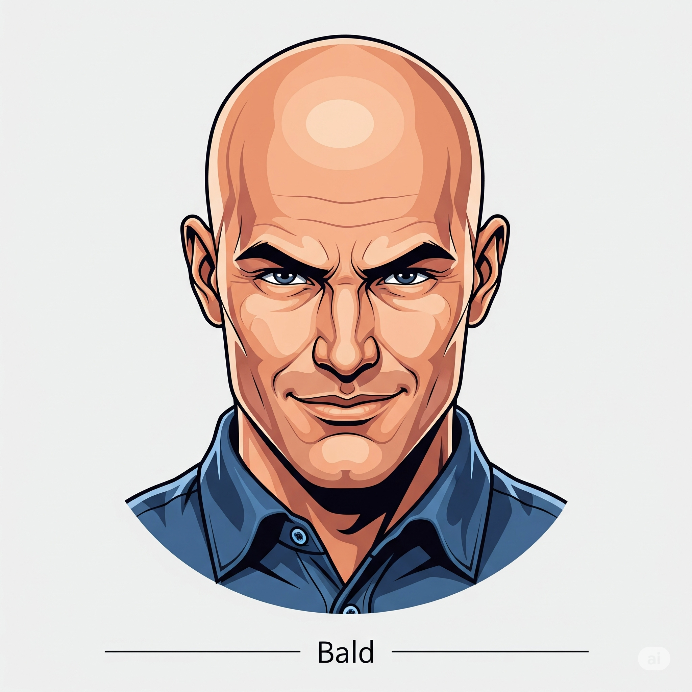

# Essential English Word 3
## Unit 10

---

### 1. absence n
định nghĩa: Not being in a place.

- She is often late due to her absence.
- He is noticing her absence today.
- They have noted his absence from the meeting.
- She has been feeling the absence of her friend.
- His absence caused some problems yesterday.
- While I was working, I felt the absence of quiet.
- Before the party, I had not expected his absence.
- She had been worrying about his absence for hours.
- Her absence will be a problem tomorrow.
- They will be discussing his absence at the next meeting.
- By next week, she will have accepted his absence.
- By noon, he will have been feeling her absence for half the day.

---

### 2. aloud adv
định nghĩa: Speaking so others can hear.

- Please read the story aloud.
- She is reading the book aloud now.
- He has read the letter aloud to everyone.
- They have been reading aloud for an hour.
- He read the poem aloud yesterday.
- While I was writing, she was reading aloud.
- Before he left, he had read the note aloud.
- She had been reading aloud before you arrived.
- I will read the instructions aloud.
- We will be reading aloud during the class.
- By the end of the lesson, she will have read the whole text aloud.
- By dinner time, they will have been reading aloud for two hours.

---

### 3. bald adj
định nghĩa: Having no hair on the head.

- My uncle is bald.
- He is becoming bald very quickly.
- He has become bald over the years.
- He has been becoming bald since his 30s.
- My grandfather became bald when he was young.
- While I was looking, I saw a bald man.
- Before I met him, I had heard he was bald.
- He had been bald for ten years before he grew hair again.
- He will be bald one day.
- He will be looking bald in that photo.
- By next year, he will have become completely bald.
- By his birthday, he will have been bald for a year.

---

### 4. blanket n
định nghĩa: A warm cover for a bed.

- I use a warm blanket in winter.
- She is folding the blanket now.
- They have bought a new blanket.
- We have been using this blanket for years.
- I put the blanket on the bed.
- While I was sleeping, the blanket kept me warm.
- Before I went to bed, I had found a soft blanket.
- She had been looking for a blanket all morning.
- I will need a blanket tonight.
- We will be using this blanket on our trip.
- By morning, the baby will have kicked off the blanket.
- By bedtime, she will have been knitting the blanket for a week.

---

### 5. creep v
định nghĩa: To move slowly and quietly.

- The cat creeps towards the mouse.
- He is creeping into the room.
- The ivy has crept up the wall.
- Time has been creeping by slowly.
- The spider crept across the floor.
- While I was watching, the snake was creeping through the grass.
- Before I saw it, the fog had crept in.
- The child had been creeping towards the toys.
- The shadows will creep across the garden.
- The fog will be creeping in later.
- By midnight, the moon will have crept higher in the sky.
- By dawn, the sun will have been creeping up for hours.

---

### 6. divorce n
định nghĩa: The legal end of a marriage.

- Divorce is sometimes difficult.
- They are discussing their divorce.
- They have decided to get a divorce.
- They have been talking about divorce for months.
- My friends got a divorce last year.
- While I was away, they were going through a divorce.
- Before they moved, they had finalized their divorce.
- She had been thinking about divorce for a long time.
- They will get a divorce soon.
- They will be going through a divorce next year.
- By next month, their divorce will have been completed.
- By their anniversary, they will have been planning the divorce for a year.

---

### 7. imitate v
định nghĩa: To copy someone or something.

- Children often imitate their parents.
- He is imitating the teacher.
- She has imitated his style perfectly.
- The parrot has been imitating sounds all day.
- He imitated his brother's voice.
- While I was singing, she was imitating me.
- Before the show, he had imitated the famous actor.
- The monkey had been imitating people at the zoo.
- He will imitate the bird's call.
- They will be imitating animal sounds in class.
- By the end of the game, he will have imitated everyone.
- By lunchtime, the baby will have been imitating sounds for an hour.

---

### 8. infant n
định nghĩa: A very young baby.

- An infant needs a lot of sleep.
- She is holding the infant carefully.
- They have welcomed a new infant into their home.
- The infant has been sleeping peacefully.
- The infant cried loudly last night.
- While I was visiting, the infant was sleeping.
- Before they left the hospital, the infant had been checked by a doctor.
- The infant had been crying before its mother fed it.
- The infant will grow quickly.
- The infant will be sleeping when you arrive.
- By next month, the infant will have gained weight.
- By morning, the infant will have been sleeping for ten hours.

---

### 9. kidnap v
định nghĩa: To take a person away by force.

- The story is about someone who tries to kidnap a child.
- The police are looking for the person who is kidnapping people.
- They have kidnapped the rich man's son.
- The criminals have been kidnapping people for money.
- They kidnapped the king's daughter.
- While the guards were sleeping, the enemy was kidnapping the princess.
- Before the police arrived, they had kidnapped the witness.
- The gang had been kidnapping people for years.
- They will try to kidnap him again.
- The police will be watching for anyone trying to kidnap the child.
- By tomorrow, the police will have caught the people who kidnapped him.
- By midnight, the criminals will have been kidnapping the person for 24 hours.

---

### 10. nap n
định nghĩa: A short sleep, usually during the day.

- I like to take a nap after lunch.
- The baby is taking a nap now.
- He has just had a nap.
- She has been taking naps every day.
- I took a nap this afternoon.
- While I was reading, he was taking a nap.
- Before we went out, I had taken a nap.
- She had been taking a nap before the phone rang.
- I will take a nap later.
- He will be taking a nap when you call.
- By 3 o'clock, I will have taken my nap.
- By the time you get home, the baby will have been taking a nap for two hours.

---

### 11. nowhere adv
định nghĩa: Not in or at any place.

- The keys are nowhere to be found.
- He is going nowhere fast with this plan.
- They have gone nowhere since they started.
- We have been going nowhere with this project.
- I looked everywhere, but the dog was nowhere.
- While I was searching, the answer was nowhere in sight.
- Before I gave up, I had looked nowhere else.
- She had been searching nowhere important.
- We will go nowhere today.
- They will be going nowhere if they don't hurry.
- By evening, the lost item will have appeared nowhere.
- By tomorrow, he will have been looking nowhere for days.

---

### 12. pat v
định nghĩa: To touch gently with a flat hand.

- She pats the dog on the head.
- He is patting the baby's back.
- I have patted the cat.
- The dog has been patting the ground with its paw.
- He patted my shoulder.
- While I was talking, she was patting the dog.
- Before I left, I had patted his hand.
- The mother had been patting the child's head.
- I will pat the horse.
- They will be patting the animals at the farm.
- By the time we leave, I will have patted all the puppies.
- By the end of the visit, she will have been patting the cat for an hour.

---

### 13. relief n
định nghĩa: A feeling of happiness because something bad has stopped.

- I felt great relief when the test was over.
- She is feeling relief now that it's finished.
- He has felt relief after hearing the good news.
- They have been feeling relief since the danger passed.
- I felt relief when I found my keys.
- While I was waiting, I was hoping for relief.
- Before the rain stopped, we had wished for relief from the heat.
- She had been waiting for relief from the pain.
- You will feel relief when it's done.
- We will be feeling relief when the project is finished.
- By tomorrow, the patient will have felt some relief.
- By the end of the day, he will have been feeling relief for hours.

---

### 14. reproduce v
định nghĩa: To make a copy of something, or for animals/plants to have babies.

- Rabbits reproduce quickly.
- The printer is reproducing the document.
- This machine has reproduced many copies.
- These plants have been reproducing rapidly.
- The artist reproduced the famous painting.
- While I was watching, the cells were reproducing.
- Before the book was published, they had reproduced the images.
- The animals had been reproducing in the wild.
- This plant will reproduce easily.
- The copier will be reproducing the papers all morning.
- By next spring, the flowers will have reproduced.
- By summer, the insects will have been reproducing for months.

---

### 15. rhyme n
định nghĩa: Words that end with the same sound.

- Cat and hat are a rhyme.
- She is writing a rhyme for the song.
- He has found a perfect rhyme.
- They have been creating rhymes for the poem.
- I wrote a simple rhyme.
- While I was listening, I heard a nice rhyme.
- Before the song was finished, he had added a rhyme.
- The children had been learning rhymes at school.
- This word will make a good rhyme.
- We will be finding rhymes for the words.
- By the end of the lesson, they will have learned many rhymes.
- By bedtime, she will have been practicing rhymes for an hour.

---

### 16. suck v
định nghĩa: To pull liquid into your mouth using your lips.

- Babies suck milk.
- He is sucking on a sweet.
- She has sucked the juice through a straw.
- The child has been sucking his thumb.
- I sucked the lemonade through a straw.
- While I was thirsty, I was sucking on an ice cube.
- Before I ate, I had sucked the candy.
- The baby had been sucking on the bottle.
- He will suck the drink quickly.
- They will be sucking on lollipops.
- By the end of the movie, he will have sucked all the candy.
- By lunchtime, the baby will have been sucking its dummy for an hour.

---

### 17. urgent adj
định nghĩa: Needing immediate action or attention.

- This is an urgent message.
- He is dealing with an urgent matter.
- They have received an urgent request.
- She has been handling urgent calls all day.
- I had an urgent phone call.
- While I was working, an urgent email arrived.
- Before I left, I had finished the urgent tasks.
- He had been waiting for an urgent reply.
- I will send an urgent email.
- We will be discussing the urgent issue.
- By noon, the urgent problem will have been solved.
- By the end of the shift, she will have been dealing with urgent cases for hours.

---

### 18. vanish v
định nghĩa: To disappear suddenly.

- The magician makes the rabbit vanish.
- The fog is vanishing quickly.
- The money has vanished from the table.
- The strange lights have been vanishing and reappearing.
- The ghost vanished into the wall.
- While I was watching, the bird was vanishing into the trees.
- Before I could catch it, the mouse had vanished.
- The treasure had been vanishing over time.
- The problem will vanish soon.
- The clouds will be vanishing by morning.
- By sunset, the sun will have vanished below the horizon.
- By the time we arrive, the crowd will have been vanishing for an hour.

---

### 19. wagon n
định nghĩa: A vehicle with four wheels, often pulled by animals or used by children.

- The farmer used a wagon to carry hay.
- The child is pulling a toy wagon.
- They have bought a new red wagon.
- We have been using this wagon for years.
- I pulled the wagon up the hill.
- While I was walking, he was pulling the wagon.
- Before the trip, they had packed the wagon.
- The children had been playing with the wagon all morning.
- We will use the wagon for the picnic.
- They will be pulling the wagon to the park.
- By the end of the day, the wagon will have carried many things.
- By lunchtime, the kids will have been pulling the wagon for an hour.

---

### 20. wrinkle n
định nghĩa: A line or fold in cloth or skin.

- This shirt has a wrinkle.
- She is ironing out the wrinkle.
- He has developed a new wrinkle on his face.
- The fabric has been getting wrinkles easily.
- I smoothed out the wrinkle in the paper.
- While I was folding, I was creating a wrinkle.
- Before I wore the dress, I had removed the wrinkles.
- Her face had been showing wrinkles for years.
- This cream will reduce wrinkles.
- The clothes will be getting wrinkles if you don't hang them.
- By morning, the shirt will have a wrinkle.
- By the end of the day, the paper will have been getting wrinkles from being handled.

### Anna the Babysitter

Since her parents got a divorce, Anna has had to help her mother. In her mother’s absence, Anna takes care of Grace, the baby. At first, Anna thought it was an easy job.

One afternoon, Anna played with Grace. She meowed like a cat and Grace imitated her. In fact, Grace reproduced every sound that Anna made. She took her sister outside. She put Grace in the wagon, but there was nowhere for them to go. So they went back inside.

Anna put the infant on the floor and went into her room. But when she came back, Grace had vanished! Anna looked everywhere, but she could not find her sister. Maybe the baby had been kidnapped! “ Where are you?” Anna called aloud.

The situation was becoming urgent. She wanted to call her mom, but she didn’t want her to think Anna couldn’t do the job. Anna sat down. What was she going to do?

But then, Anna heard something. It was coming from her room. “ Grace?” She got down on her knees and looked under the bed. She could see Grace’s bald head. Grace had followed Anna into her room and crept under the bed.

“ What a relief!” Anna cried.

She picked up her sister and patted her on the head. Her head was soft and had no wrinkles. Grace was sucking on her thumb and looked tired. So, Anna wrapped her in a blanket and sang rhymes for her. Then she put Grace in bed for a nap.

After that afternoon, Anna knew that taking care of Grace was not an easy job. It takes a lot of work to take care of a baby!