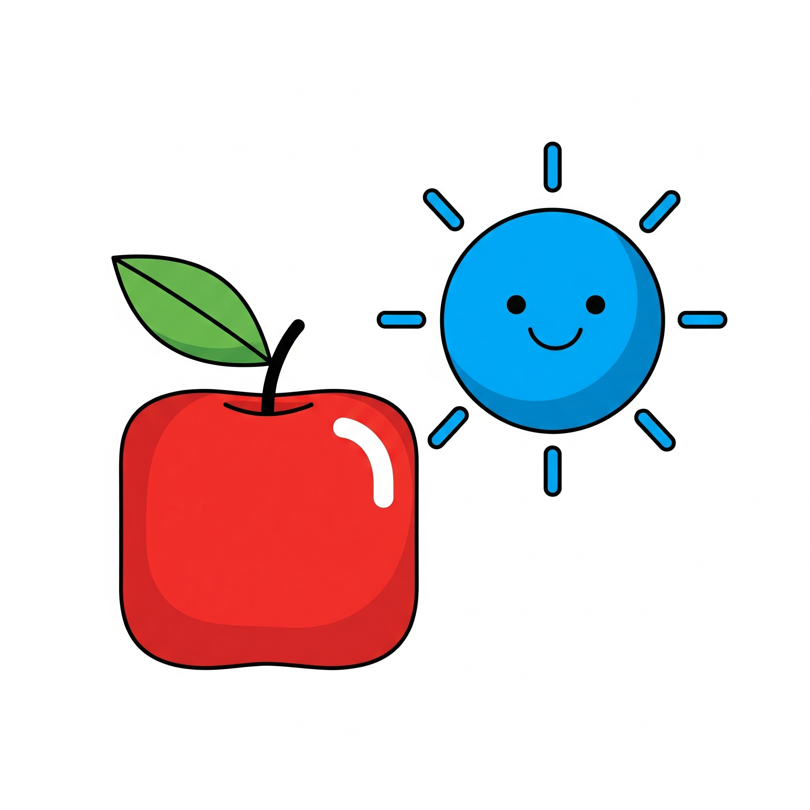
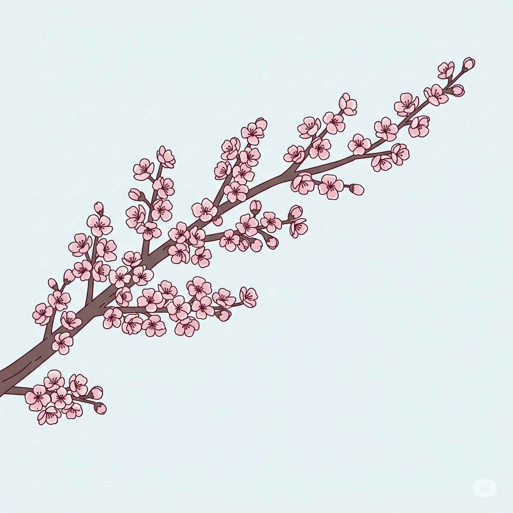
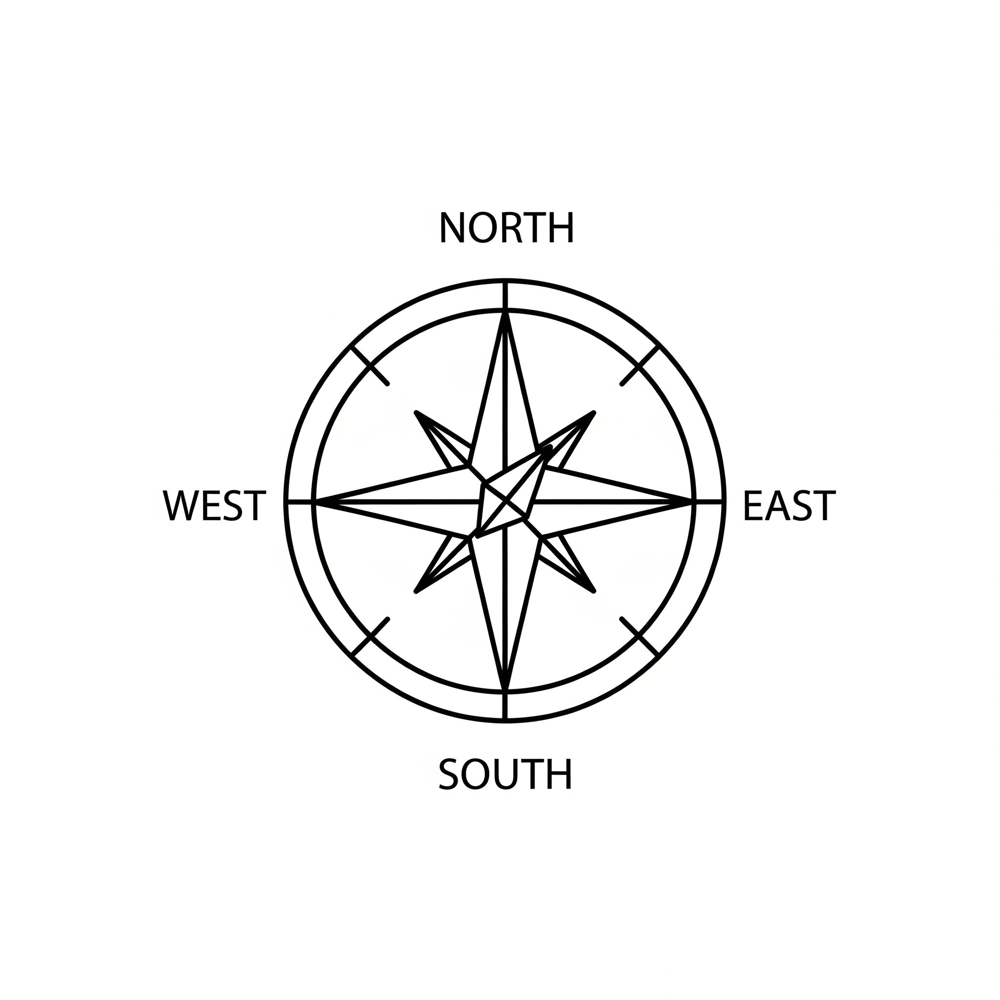
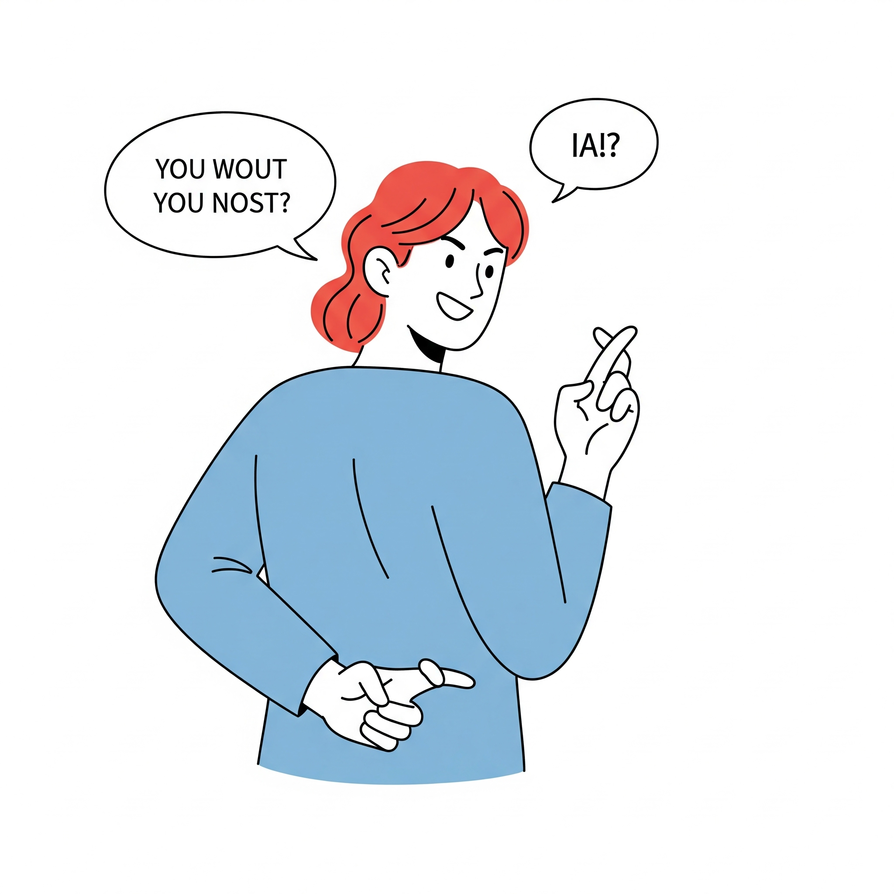
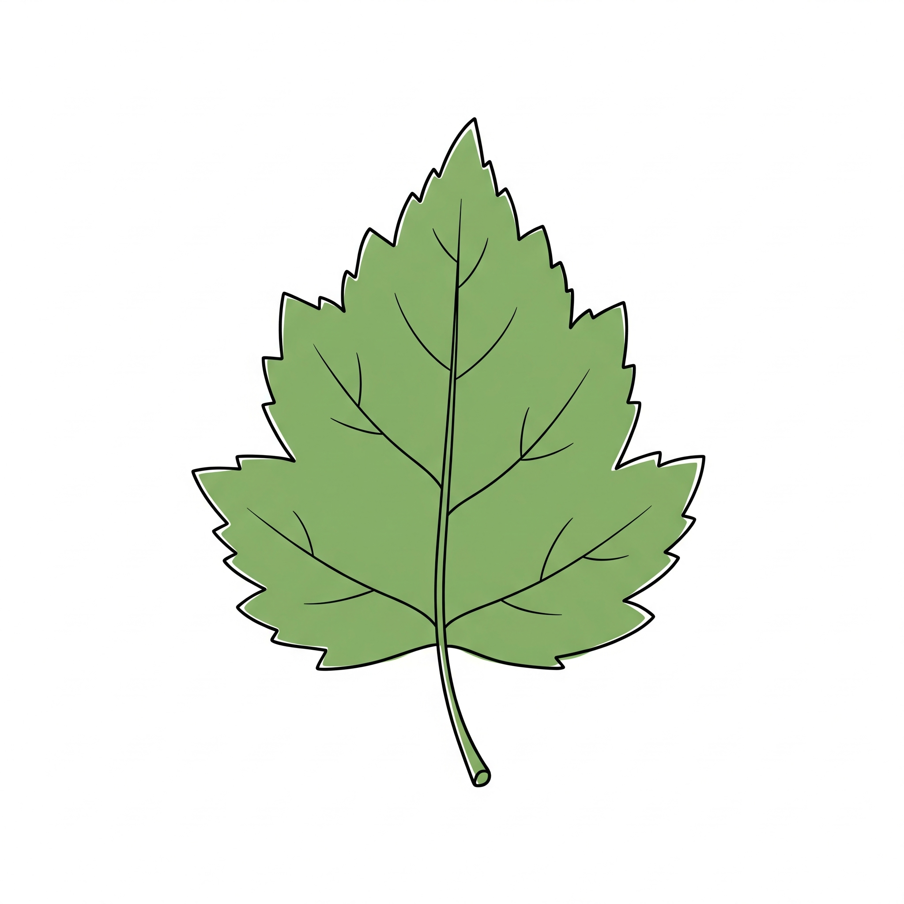
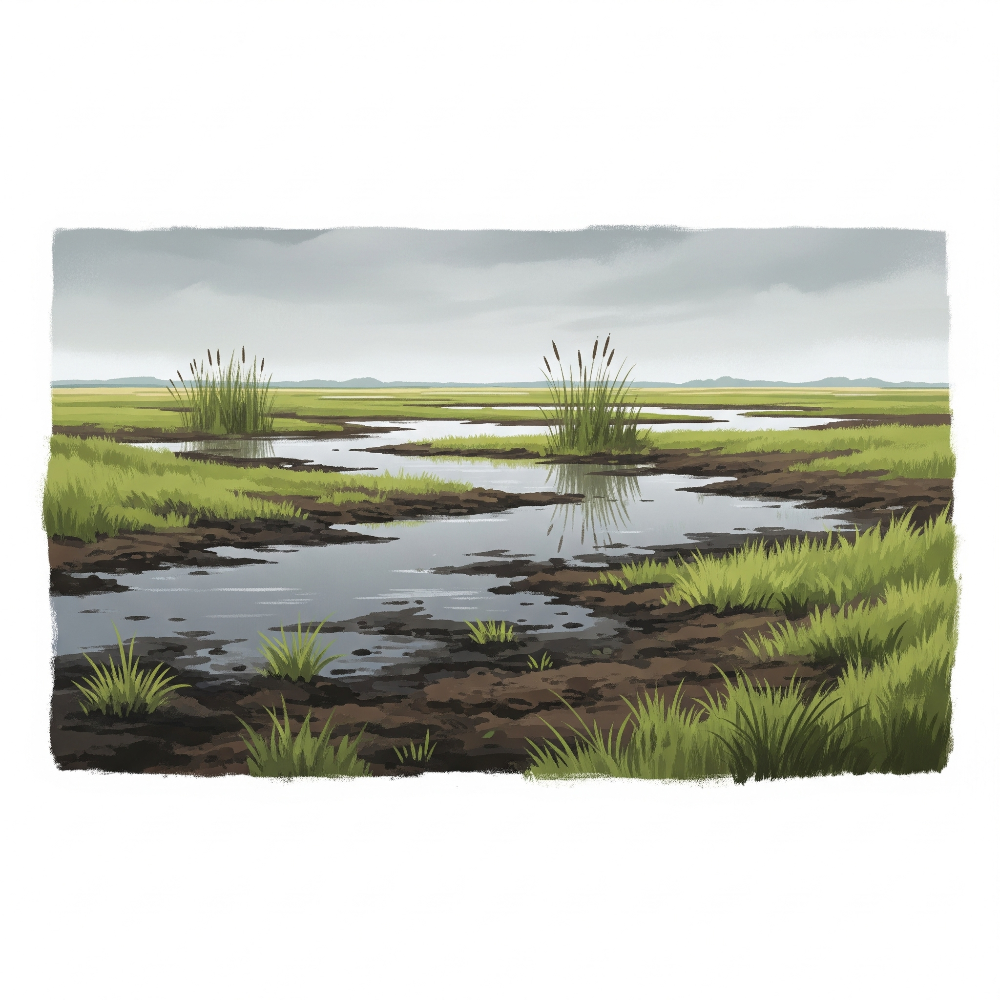

# Essential English Word 3
## Unit 11

---

### 1. abnormal adj
định nghĩa: Not normal or usual.

- This weather is abnormal for June.
- The doctor is checking for anything abnormal.
- He has found an abnormal result.
- The machine has been showing abnormal readings.
- We saw an abnormal light in the sky.
- While I was sleeping, I heard an abnormal noise.
- Before the test, they had noticed abnormal behavior.
- She had been feeling abnormal all day.
- The temperature will be abnormal tomorrow.
- They will be looking for abnormal signs.
- By morning, the situation will have become abnormal.
- By noon, the patient will have been showing abnormal symptoms for hours.

---

### 2. bamboo n
định nghĩa: A tall plant with hard, hollow stems.

- Pandas eat bamboo.
- He is cutting the bamboo.
- They have planted bamboo in their garden.
- The bamboo has been growing very fast.
- We used bamboo to build a fence.
- While I was walking, I saw a lot of bamboo.
- Before they built the house, they had cleared the bamboo.
- The forest had been full of bamboo.
- We will buy some bamboo sticks.
- They will be planting bamboo next week.
- By next year, the bamboo will have grown tall.
- By summer, the bamboo will have been growing for months.

---

### 3. blossom n
định nghĩa: A flower on a tree or plant, especially fruit trees.

- The apple trees have beautiful blossom.
- The cherry trees are showing blossom now.
- The pear tree has produced a lot of blossom.
- The flowers have been showing blossom since spring.
- The plum trees had blossom last month.
- While I was walking, the trees were covered in blossom.
- Before the fruit grew, the trees had had blossom.
- The garden had been full of blossom.
- The peach trees will have blossom soon.
- The trees will be showing blossom in April.
- By May, all the trees will have had blossom.
- By the end of the week, the flowers will have been showing blossom for days.

---

### 4. compass n
định nghĩa: A tool that shows directions (North, South, East, West).

- I use a compass to find my way.
- He is using a compass to check the direction.
- She has bought a new compass.
- They have been using this compass for years.
- We used a compass on our hike.
- While I was lost, the compass was not working.
- Before the trip, I had checked the compass.
- He had been relying on the compass to navigate.
- I will bring my compass on the trip.
- They will be using a compass during the training.
- By the end of the day, the compass will have helped us find the way.
- By noon, he will have been using the compass for hours.

---

### 5. dialect n
định nghĩa: A form of a language spoken in a specific area.

- People in that region speak a different dialect.
- She is studying a local dialect.
- He has learned a new dialect.
- They have been speaking this dialect their whole lives.
- I heard a strange dialect yesterday.
- While I was traveling, I was hearing different dialects.
- Before I moved here, I had never heard this dialect.
- The old people had been speaking that dialect for centuries.
- You will hear many dialects in that country.
- We will be studying different dialects in class.
- By the end of the course, she will have learned several dialects.
- By next year, he will have been studying the dialect for a year.

---

### 6. dishonest adj
định nghĩa: Not telling the truth; not honest.

- It is dishonest to cheat.
- He is being dishonest about what happened.
- She has been dishonest with her friends.
- They have been acting dishonestly for a long time.
- I thought his answer was dishonest.
- While I was listening, I felt he was being dishonest.
- Before I found out, I had not known he was dishonest.
- He had been dishonest about his past.
- It will be dishonest to hide the truth.
- They will be acting dishonestly if they lie.
- By tomorrow, the truth about his dishonest actions will have come out.
- By the end of the week, she will have been feeling guilty about being dishonest for days.

---

### 7. dwarf n
định nghĩa: A person who is much smaller than average.

- The story is about a princess and seven dwarfs.
- He is playing the role of a dwarf in the play.
- They have met a friendly dwarf.
- The group of dwarfs has been traveling together.
- I saw a dwarf at the circus.
- While I was reading, I was imagining the dwarf characters.
- Before the movie started, I had read about the dwarf.
- The dwarf had been living in the mountains.
- You will see a dwarf in the show.
- They will be dressed as dwarfs for the party.
- By the end of the story, the dwarf will have helped the hero.
- By midnight, the dwarf will have been dancing for hours.

---

### 8. ecosystem n
định nghĩa: All the living things and their environment in an area.

- A forest is a complex ecosystem.
- Scientists are studying the local ecosystem.
- Pollution has damaged the ecosystem.
- The coral reef ecosystem has been changing.
- We learned about the desert ecosystem.
- While I was hiking, I was observing the ecosystem.
- Before the factory was built, the ecosystem had been healthy.
- The lake ecosystem had been thriving.
- The new park will protect the ecosystem.
- They will be monitoring the ecosystem closely.
- By next year, the conservation efforts will have improved the ecosystem.
- By summer, the researchers will have been studying the ecosystem for months.

---

### 9. fatal adj
định nghĩa: Causing death.

- This disease is fatal.
- He is recovering from a potentially fatal injury.
- The accident has caused fatal damage.
- The illness has been proving fatal in many cases.
- They made a fatal mistake.
- While I was driving, I saw a fatal crash.
- Before the cure was found, the virus had been fatal.
- The poison had been fatal if not treated quickly.
- The wound will be fatal without help.
- They will be investigating the fatal incident.
- By morning, the doctors will have tried everything to prevent a fatal outcome.
- By the time help arrived, the injury will have been fatal for an hour.

---

### 10. impatient adj
định nghĩa: Not able to wait calmly.

- He is impatient when he has to wait.
- She is being impatient with the slow service.
- I have become impatient with the delays.
- They have been feeling impatient for the results.
- He was impatient to leave.
- While I was waiting, I was feeling impatient.
- Before the train arrived, I had been impatient.
- She had been impatient for the news.
- You will feel impatient if you wait too long.
- We will be getting impatient if they don't arrive soon.
- By the time the movie starts, he will have become very impatient.
- By noon, she will have been impatient for hours.

---

### 11. leaf n
định nghĩa: A flat, green part of a plant or tree.

- A tree has many leaves.
- She is drawing a leaf.
- The wind has blown the leaves away.
- The plant has been growing new leaves.
- I picked up a fallen leaf.
- While I was walking, the leaves were falling.
- Before winter, the trees had lost their leaves.
- The ground had been covered in leaves.
- The trees will grow new leaves in spring.
- They will be collecting leaves in the park.
- By autumn, the leaves will have changed color.
- By the end of the day, the wind will have been blowing leaves around for hours.

---

### 12. manuscript n
định nghĩa: An original copy of a book or document before it is printed.

- The author finished the manuscript.
- She is typing the manuscript.
- He has sent the manuscript to the publisher.
- They have been working on the manuscript for a year.
- I read the old manuscript.
- While I was researching, I was looking at ancient manuscripts.
- Before the book was published, the editor had read the manuscript.
- The library had been preserving the manuscript for centuries.
- The publisher will review the manuscript.
- They will be editing the manuscript next week.
- By next month, the manuscript will have been approved.
- By the deadline, she will have been writing the manuscript for six months.

---

### 13. marsh n
định nghĩa: An area of soft, wet land; a swamp.

- Birds live in the marsh.
- He is exploring the marsh.
- They have built a house near the marsh.
- The marsh has been shrinking due to drought.
- We walked through the marsh carefully.
- While I was hiking, I was avoiding the marshy areas.
- Before the road was built, the marsh had been much larger.
- The animals had been living in the marsh.
- We will visit the marsh tomorrow.
- They will be studying the plants in the marsh.
- By next year, the conservation project will have protected the marsh.
- By evening, the birds will have been feeding in the marsh for hours.

---

### 14. patience n
định nghĩa: The ability to wait or stay calm without getting annoyed.

- Learning a language requires patience.
- She is showing great patience with the children.
- He has lost his patience.
- They have been needing a lot of patience for this task.
- I needed patience to finish the puzzle.
- While I was waiting, I was trying to have patience.
- Before I understood, I had not had much patience.
- She had been known for her patience.
- You will need patience for this job.
- We will be practicing patience during the exercise.
- By the end of the day, he will have run out of patience.
- By the time the project is finished, she will have been showing patience for months.

---

### 15. perfume n
định nghĩa: A liquid with a pleasant smell, used on the body.

- She wears nice perfume.
- He is spraying perfume.
- I have bought a new perfume.
- This perfume has been smelling wonderful all day.
- She put on some perfume before leaving.
- While I was getting ready, I was choosing a perfume.
- Before the party, she had applied perfume.
- The room had been smelling of perfume.
- I will buy you some perfume.
- They will be selling perfume at the store.
- By her birthday, she will have received a bottle of perfume.
- By evening, the scent of the perfume will have been filling the room for hours.

---

### 16. pond n
định nghĩa: A small area of still water.

- There are fish in the pond.
- He is sitting by the pond.
- They have built a small pond in their garden.
- The frogs have been living in the pond.
- We swam in the pond last summer.
- While I was walking, I was looking at the pond.
- Before the winter, the pond had frozen over.
- The ducks had been swimming in the pond.
- We will go fishing in the pond.
- They will be cleaning the pond next week.
- By summer, the plants in the pond will have grown.
- By noon, the ducks will have been swimming in the pond for hours.

---

### 17. proverb n
định nghĩa: A short, well-known saying that gives advice.

- "Actions speak louder than words" is a proverb.
- She is learning a new proverb.
- He has used a relevant proverb.
- They have been discussing old proverbs.
- I heard an interesting proverb yesterday.
- While I was reading, I was finding many proverbs.
- Before the speech, he had thought of a good proverb.
- The wise man had been quoting proverbs.
- I will remember that proverb.
- They will be teaching proverbs in class.
- By the end of the lesson, the students will have learned several proverbs.
- By the end of the book, she will have been collecting proverbs for months.

---

### 18. pursuit n
định nghĩa: The act of chasing or following someone or something.

- The police are in pursuit of the car.
- He is in pursuit of his dreams.
- They have given up the pursuit.
- The dogs have been in pursuit of the rabbit.
- The chase was a long pursuit.
- While I was watching, the police were in pursuit.
- Before they caught him, the pursuit had lasted for hours.
- The hunters had been in pursuit of the animal.
- The police will continue the pursuit.
- They will be in pursuit of the suspect.
- By morning, the pursuit will have ended.
- By midnight, the police will have been in pursuit for hours.

---

### 19. recite v
định nghĩa: To say a poem, story, or list from memory.

- She can recite the alphabet.
- He is reciting a poem.
- They have recited their lines perfectly.
- The students have been reciting the rules.
- I recited the pledge.
- While I was listening, she was reciting a story.
- Before the performance, he had recited his speech many times.
- The children had been reciting rhymes.
- I will recite the poem for you.
- They will be reciting their speeches tomorrow.
- By the end of the class, everyone will have recited a verse.
- By the time the show starts, she will have been reciting her lines for hours.

---

### 20. wilderness n
định nghĩa: A large area of wild land that is not used by people.

- We went hiking in the wilderness.
- He is exploring the wilderness.
- They have survived in the wilderness.
- The animals have been living in the wilderness.
- I got lost in the wilderness.
- While I was camping, I was enjoying the wilderness.
- Before the park was created, the area had been pure wilderness.
- The explorers had been traveling through the wilderness.
- We will camp in the wilderness.
- They will be exploring the wilderness next month.
- By next week, they will have returned from the wilderness.
- By sunset, he will have been hiking in the wilderness for the whole day.

### Peter and the Dwarf

Peter was a hunter. One day, he was in pursuit of a deer and became lost. He usually carried a compass with him when he went into the wilderness, but that day he left it at home.

As he walked, the forest began to look different. He didn’t see any bamboo. Instead, there were bushes with long leaves. The ecosystem was now very abnormal. Peter knew he was in the Magic Marsh.

Now he was tired and thirsty. He was afraid. Being lost in the marsh could be fatal. When people entered it, they never came out.

At last, he found a pond. Flowers grew around it. The blossoms smelled like the best perfume. He felt relaxed so he drank some water and fell asleep. When he awoke, he saw an evil dwarf staring at him.

“ What are you doing here?” it asked. The dwarf spoke in a strange dialect.

“ I’m lost,” said Peter. “ Can you help me?”

“Yes,” it said, but Peter didn’t know it was dishonest.

The dwarf took an old manuscript from his pocket. It was a magic map. “ Just recite the words at the bottom,” the dwarf explained. “ It will show you how to get home.”

“ Good,” Peter said. He was impatient and quickly grabbed the map.

He recited the magic words, and a line appeared on the map. He walked for many days but never left the marsh. Finally, the map led him back to the pond. He walked in a circle!

The dwarf was still there. “ Here’s a proverb for you to think about,” it said, “ When patience is lost, the so are you.”
