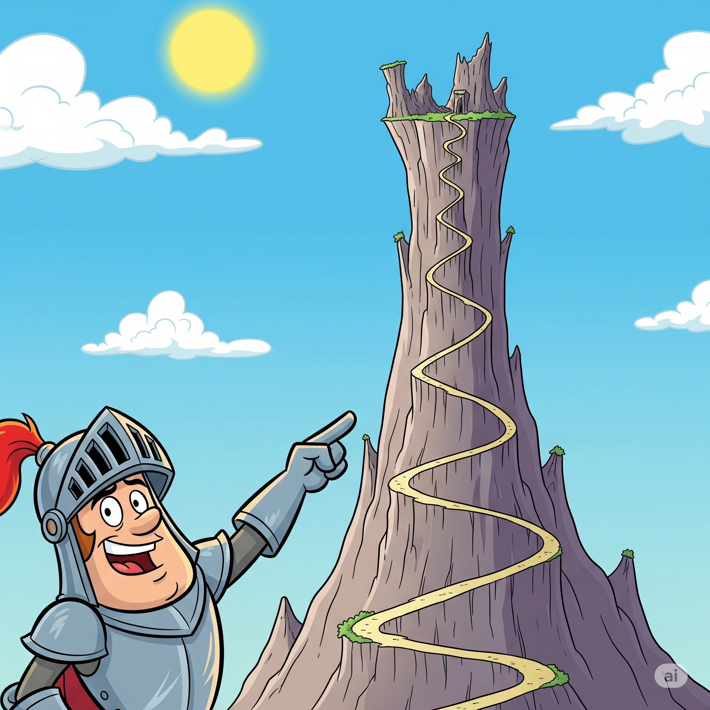
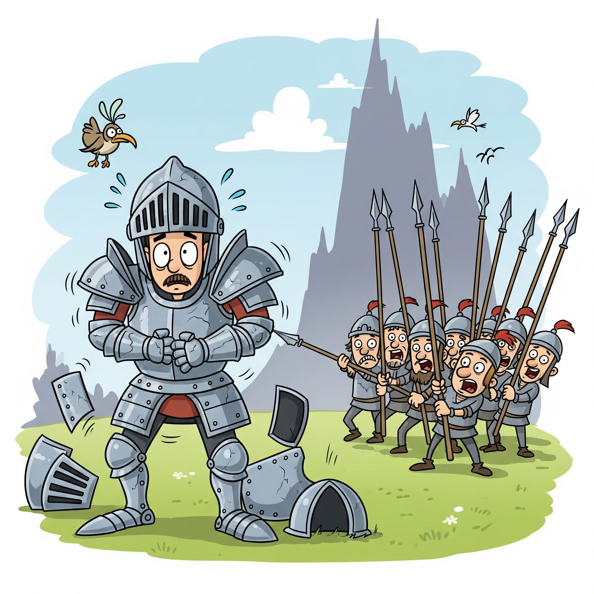

# Essential English Word 3
# Unit 18
## 1. armor n
### định nghĩa
Special clothes made of metal or leather worn by soldiers in the past to protect their bodies.

- The knight wears armor.
- He was polishing his armor.
- The soldier will put on his armor.
- They are going to wear armor in the battle.
- He has worn this armor many times.
- They had prepared their armor.
- The warriors will be wearing armor.
- By morning, all the armor will have been ready.
- If you were a knight, you would wear armor.
- Clean your armor.
- Armor protects soldiers.
- He wore heavy armor.

## 2. blaze v
### định nghĩa
To burn brightly and strongly.

- The fire blazes.
- The wood was blazing.
- The fire will blaze all night.
- The campfire is going to blaze brightly.
- The fire has blazed for hours.
- It had blazed fiercely.
- The logs will be blazing in the fireplace.
- By morning, the fire will have blazed out.
- If you add wood, the fire would blaze.
- Let the fire blaze.
- Dry wood blazes easily.
- The fire blazed high.

## 3. boom v
### định nghĩa
To make a deep, loud sound.

- The thunder booms.
- The cannon was booming.
- The speakers will boom loudly.
- The music is going to boom.
- The economy has boomed.
- The crowd had boomed with cheers.
- The drums will be booming.
- By the end of the concert, the bass will have boomed all night.
- If it was loud, it would boom.
- Listen to the thunder boom.
- Thunder often booms during a storm.
- The door boomed shut.

## 4. cliff n
### định nghĩa
A high area of rock with a very steep side, often at the edge of the sea.

- The cliff is high.
- They were standing on the cliff.
- We will climb the cliff.
- He is going to jump from the cliff.
- She has seen the cliff before.
- They had reached the top of the cliff.
- He will be climbing the cliff face.
- By sunset, they will have reached the top of the cliff.
- If it was safe, I would stand near the cliff.
- Be careful near the cliff.
- Cliffs can be dangerous.
- We saw the cliff from the beach.

## 5. flame n
### định nghĩa
The hot, bright part of a fire.

- The flame is hot.
- The candle flame was flickering.
- The fire will have a big flame.
- The match is going to make a flame.
- The fire has a strong flame.
- The flame had gone out.
- The torch will be showing a bright flame.
- By morning, the flame will have died down.
- If there was wind, the flame would move.
- Watch the flame.
- Flames are part of a fire.
- The flame was blue.

## 6. independence n
### định nghĩa
Freedom from being controlled by another country or person.

- Independence is important.
- They were fighting for independence.
- The country will gain independence.
- We are going to celebrate independence day.
- The nation has achieved independence.
- They had dreamed of independence.
- People will be working towards independence.
- By next year, the region will have declared independence.
- If they were free, they would have independence.
- Fight for independence.
- Independence means freedom.
- The country gained independence in 1950.

## 7. invasion n
### định nghĩa
When an army enters another country by force.

- The invasion is planned.
- The army was preparing for the invasion.
- There will be an invasion.
- They are going to stop the invasion.
- The country has suffered an invasion.
- They had feared an invasion.
- The troops will be resisting the invasion.
- By morning, the invasion will have begun.
- If the borders were open, there would be no invasion.
- Prepare for the invasion.
- Invasions can cause war.
- The invasion started suddenly.

## 8. knight n
### định nghĩa
A soldier in the past who wore armor and rode a horse.

- The knight is brave.
- The knight was riding his horse.
- He will become a knight.
- She is going to marry a knight.
- He has been a knight for years.
- The knight had fought many battles.
- The knights will be defending the castle.
- By evening, the knights will have returned.
- If you were brave, you would be a knight.
- Be a good knight.
- Knights wore armor.
- He was a famous knight.

## 9. lightning n
### định nghĩa
A sudden bright flash of light in the sky during a storm.

- Lightning is dangerous.
- Lightning was flashing.
- There will be lightning.
- It is going to lightning soon.
- Lightning has struck the tree.
- They had seen the lightning.
- Lightning will be flashing during the storm.
- By the end of the storm, lightning will have struck many times.
- If there was a storm, there would be lightning.
- Be careful of lightning.
- Lightning happens in storms.
- We saw lightning last night.

## 10. rebel n
### định nghĩa
A person who fights against the government or people in power.

- He is a rebel.
- The rebels were fighting.
- A new rebel group will form.
- They are going to join the rebels.
- The rebels have taken control.
- They had been rebels for years.
- The rebels will be planning their next move.
- By morning, the rebels will have attacked.
- If you disagreed, you would be a rebel.
- Don't be a rebel without a cause.
- Rebels fight against authority.
- He was a young rebel.

## 11. retreat v
### định nghĩa
To move back from an enemy.

- The army retreats.
- They were retreating from the battle.
- The soldiers will retreat.
- We are going to retreat.
- The enemy has retreated.
- They had already retreated.
- The troops will be retreating slowly.
- By evening, the army will have retreated.
- If they were losing, they would retreat.
- Retreat now!
- Armies sometimes retreat.
- They retreated to the mountains.

## 12. revolution n
### định nghĩa
A time of great change in a country, often by force.

- The revolution is coming.
- People were talking about revolution.
- There will be a revolution.
- They are going to start a revolution.
- The country has had a revolution.
- They had hoped for a revolution.
- People will be fighting in the revolution.
- By next year, the revolution will have changed everything.
- If people were unhappy, there would be a revolution.
- Join the revolution.
- Revolutions bring change.
- The revolution happened quickly.

## 13. spear n
### định nghĩa
A weapon with a long wooden stick and a sharp point at one end.

- He holds a spear.
- The warrior was carrying a spear.
- He will use a spear.
- They are going to throw a spear.
- He has used this spear before.
- They had sharpened their spears.
- The hunters will be using spears.
- By morning, the spears will have been prepared.
- If you needed a weapon, you would use a spear.
- Hold your spear ready.
- Spears were used in ancient times.
- He threw the spear.

## 14. steep adj
### định nghĩa
Rising or falling sharply; not gradual.

- The hill is steep.
- They were climbing a steep path.
- The road will be steep here.
- We are going to go down the steep slope.
- The mountain has a steep side.
- They had climbed a steep cliff.
- He will be walking up the steep hill.
- By the top, they will have climbed a steep climb.
- If it was steep, it would be hard to climb.
- Be careful on the steep path.
- Mountains can be steep.
- The stairs were steep.

## 15. summit n
### định nghĩa
The highest point of a mountain.

- The summit is cold.
- They were climbing towards the summit.
- We will reach the summit.
- He is going to try to reach the summit.
- She has reached the summit.
- They had seen the summit from below.
- They will be resting at the summit.
- By noon, they will have reached the summit.
- If you climbed high enough, you would reach the summit.
- Reach the summit.
- The summit is the top of a mountain.
- We stood on the summit.

## 16. thunder n
### định nghĩa
The loud noise that you hear after a flash of lightning.

- I hear thunder.
- Thunder was booming.
- There will be thunder.
- It is going to thunder.
- Thunder has scared the dog.
- They had heard the thunder.
- Thunder will be rumbling during the storm.
- By the end of the storm, the thunder will have stopped.
- If there was lightning, there would be thunder.
- Listen to the thunder.
- Thunder follows lightning.
- We heard thunder last night.

## 17. troops n
### định nghĩa
Soldiers in a large group.

- The troops are ready.
- The troops were marching.
- More troops will arrive.
- They are going to send in the troops.
- The troops have moved forward.
- They had gathered the troops.
- The troops will be fighting.
- By morning, the troops will have advanced.
- If there was a war, there would be troops.
- Send the troops.
- Troops are soldiers.
- The troops arrived yesterday.

## 18. warrior n
### định nghĩa
A person who fights in battles or wars.

- He is a warrior.
- The warrior was fighting bravely.
- She will become a warrior.
- They are going to train as warriors.
- He has been a great warrior.
- They had been warriors for years.
- The warriors will be defending their land.
- By the end of the battle, the warriors will have fought hard.
- If you were strong, you would be a warrior.
- Be a brave warrior.
- Warriors fight in battles.
- He was a skilled warrior.

## 19. withdraw v
### định nghĩa
To take something back or pull back.

- He withdraws his offer.
- The army was withdrawing.
- She will withdraw her money.
- They are going to withdraw from the competition.
- He has withdrawn his statement.
- The troops had withdrawn.
- She will be withdrawing funds from the bank.
- By tomorrow, the army will have withdrawn.
- If you changed your mind, you would withdraw.
- Withdraw your hand.
- Banks allow you to withdraw money.
- He withdrew his name from the list.

## 20. yield v
### định nghĩa
To give up or surrender; to produce or provide something.

- The tree yields fruit.
- The soldiers were yielding.
- The land will yield a good harvest.
- They are going to yield to the enemy.
- The effort has yielded results.
- They had yielded their position.
- The negotiations will be yielding progress.
- By the end of the year, the farm will have yielded a lot of food.
- If you were tired, you would yield.
- Do not yield to fear.
- Plants yield fruit.
- He yielded to their demands.

## The Knight's Plan

A town was fighting for their **independence** from another country. Several **rebels** started a **revolution**. However, they were afraid of an **invasion** from a lot of **troops**. They didn’t have enough **warriors** to stop them, so they asked a **knight** for help.

The **knight** made a plan. A tall mountain was outside the town. The road near the top was very narrow. **Cliffs** rose on both sides of it.

“ We must trick the enemy. They have to follow us up the mountain,” the **knight** explained. “ On the narrow path, only a few can attack us at one time.”

The people agreed with the **knight**’s plan.

The **knight** put on his **armor**, and the **warriors** got their **spears**. When the enemy attacked, the **knight** and **warriors** acted as if they were afraid. They quickly **withdrew** toward the mountain.

The enemy **troops** followed them up the **steep** path. Soon, the enemy became tired.

At the **summit**, the **knight** and his **troops** stopped. The enemy was close behind them. But now they were tired. Also, only a few could attack because the path was narrow. The **knight** and the **warriors** fought the enemy. But there were too many **troops**.

The **knight** was afraid. If the **warriors** **yielded** the path to the enemy, the town would be lost.

A storm suddenly came over the mountain. There was strong wind and rain. **Thunder** **boomed**. **Lightning** struck some trees near the enemy. The trees **blazed**. The **flames** scared the enemy and they **retreated**. They ran down the mountain, out of the town, and never returned.

The **knight** explained, “ With a little luck, a good plan beats even a big army.”

----------------------

A town was fighting for their **independence** from another country. Several **rebels** started a **revolution**. However, they were afraid of an **invasion** from a lot of **troops**. They didn’t have enough **warriors** to stop them, so they asked a **knight** for help.

The **knight** made a plan. A tall mountain was outside the town. The road near the top was very narrow. **Cliffs** rose on both sides of it.

“ We must trick the enemy. They have to follow us up the mountain,” the **knight** explained. “ On the narrow path, only a few can attack us at one time.”

The people agreed with the **knight**’s plan.

The **knight** put on his **armor**, and the **warriors** got their **spears**. When the enemy attacked, the **knight** and **warriors** acted as if they were afraid. They quickly **withdrew** toward the mountain.

The enemy **troops** followed them up the **steep** path. Soon, the enemy became tired.

At the **summit**, the **knight** and his **troops** stopped. The enemy was close behind them. But now they were tired. Also, only a few could attack because the path was narrow. The **knight** and the **warriors** fought the enemy. But there were too many **troops**.

The **knight** was afraid. If the **warriors** **yielded** the path to the enemy, the town would be lost.

A storm suddenly came over the mountain. There was strong wind and rain. **Thunder** **boomed**. **Lightning** struck some trees near the enemy. The trees **blazed**. The **flames** scared the enemy and they **retreated**. They ran down the mountain, out of the town, and never returned.

The **knight** explained, “ With a little luck, a good plan beats even a big army.”