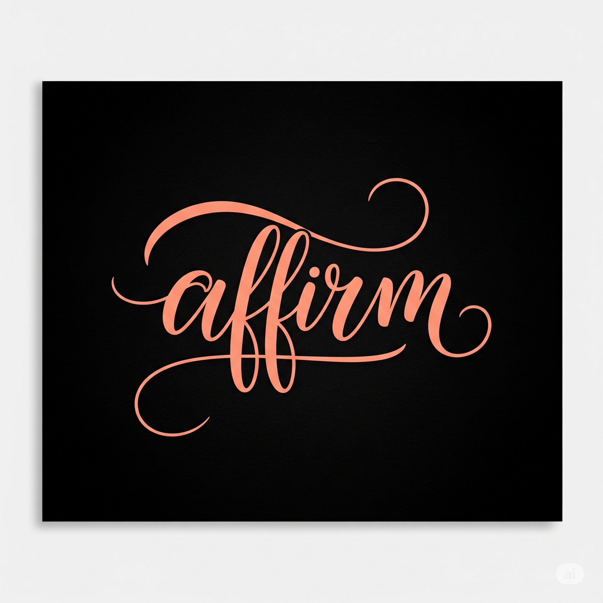
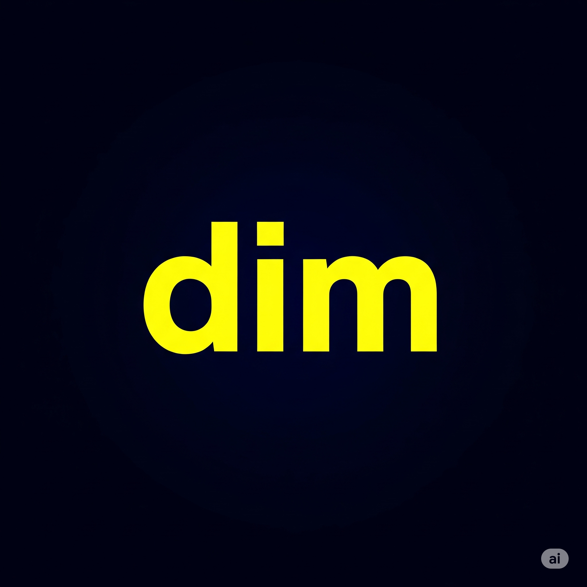
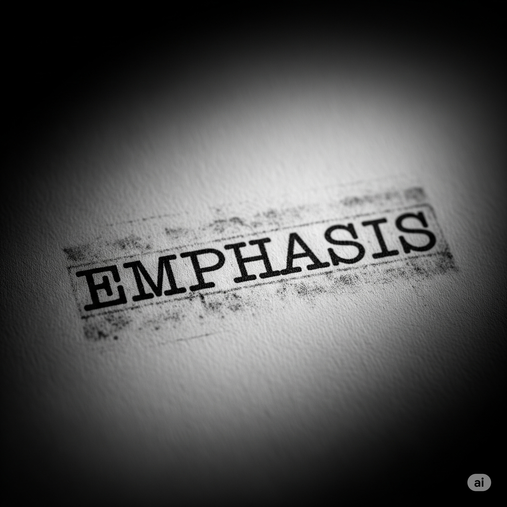
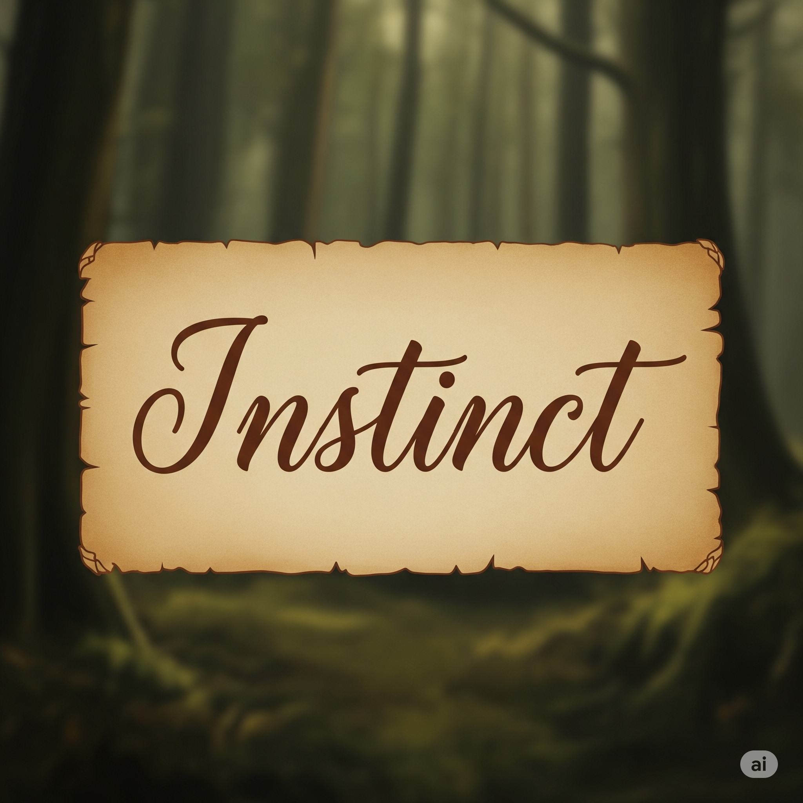
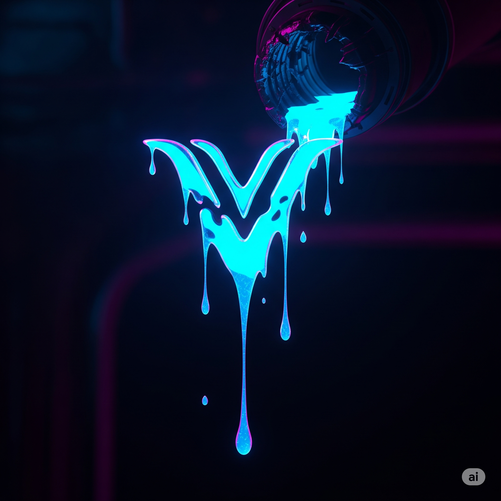
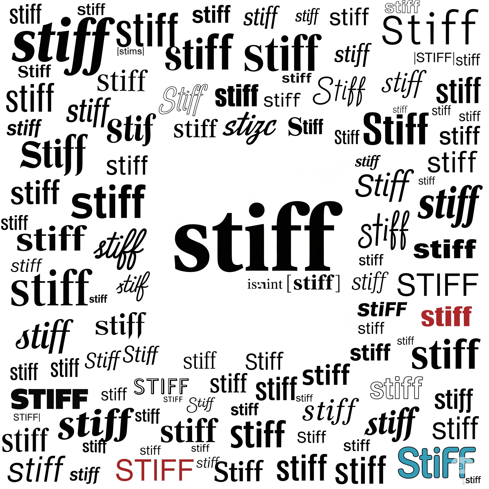
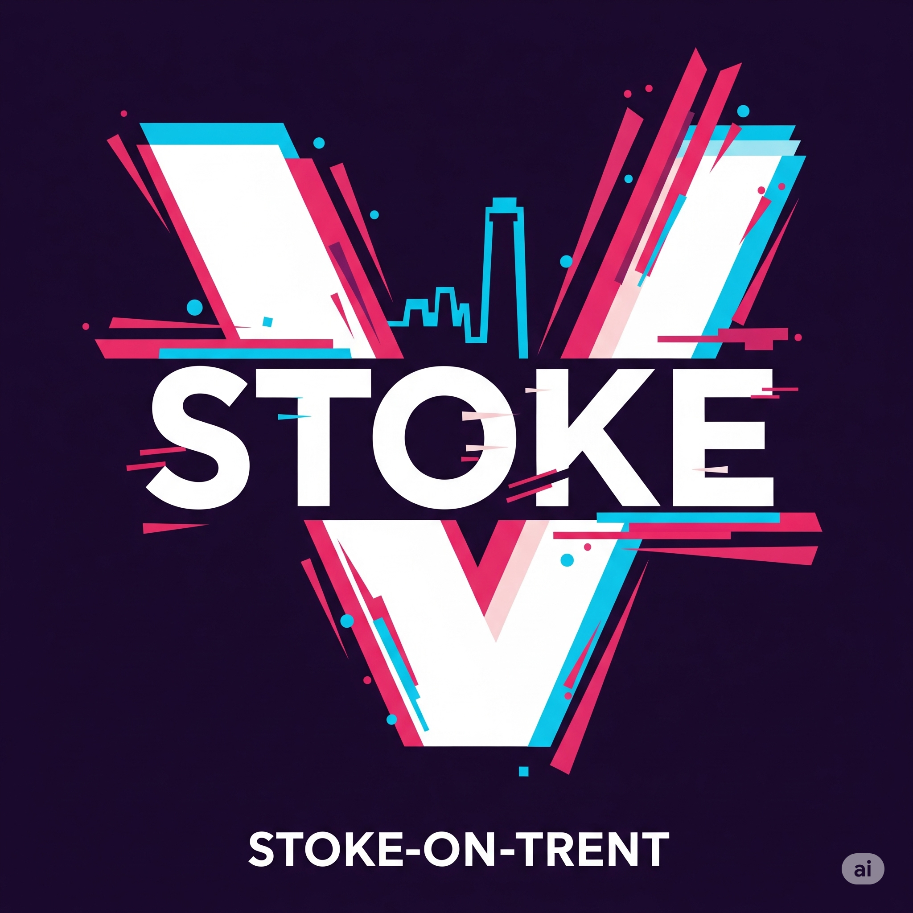

# Essential English Word 3
# Unit 21
## 1. accustomed adj
### định nghĩa
quen với điều gì đó, cảm thấy bình thường về điều gì đó.

I am accustomed to this.

She is getting accustomed to the cold.

They have become accustomed to the food.

He became accustomed to the dark.

We were becoming accustomed to the quiet.

Before, I had not been accustomed to it.

You will become accustomed to the work.

I am going to get accustomed to the new schedule.

I can get accustomed to this.

You should get accustomed to the rules.

I would be accustomed to it by now.

Get accustomed to the change.

## 2. affirm v
### định nghĩa
nói có, nói điều gì đó là đúng.

I affirm that this is true.

She is affirming her decision.

They have affirmed their support.

He affirmed his belief yesterday.

We were affirming the plan.

Before, I had affirmed my promise.

You will affirm the result.

I am going to affirm my choice.

I can affirm this fact.

You should affirm your position.

I would affirm it if I knew.

Please affirm your name.

## 3. astonished adj
### định nghĩa
rất ngạc nhiên.

I am astonished by the news.

She is looking astonished.

They have been astonished by the view.

He was astonished to see me.

We were feeling astonished.

Before, I had not been astonished like that.

You will be astonished by the gift.

I am going to be astonished.

I can be astonished easily.

You should not be astonished.

I would be astonished if it happened.

Look astonished!

## 4. bang v
### định nghĩa
đánh mạnh, tạo ra tiếng ồn lớn.

He bangs the door.

She is banging on the table.

They have banged the drum.

He banged his hand.

We were banging pots and pans.

Before, I had never banged it.

You will bang the hammer.

I am going to bang the door shut.

I can bang it hard.

You should not bang things.

I would bang it if I could.

Don't bang the door!

## 5. clan n
### định nghĩa
một nhóm người lớn có quan hệ gia đình.

Our clan is big.

The clan is gathering now.

They have formed a new clan.

The clan met last year.

We were talking about the clan.

Before, I had not known this clan.

You will visit the clan.

I am going to join the clan.

A clan can be strong.

You should respect your clan.

I would like to meet the clan.

This is our clan.

## 6. dim adj
### định nghĩa
không sáng lắm, hơi tối.

The light is dim.

The room is getting dim.

It has become dim outside.

The lights were dim.

We were walking in the dim light.

Before, it had been very dim.

It will be dim soon.

It is going to be dim tonight.

It can be dim here.

You should use a light if it's dim.

I would feel better if it wasn't dim.

The light is dim.

## 7. emphasis n
### định nghĩa
sự quan trọng đặc biệt được đặt vào điều gì đó.

He puts emphasis on reading.

She is giving emphasis to the point.

They have placed emphasis on safety.

He gave emphasis to his words.

We were discussing the emphasis.

Before, I had not understood the emphasis.

You will see the emphasis.

I am going to put emphasis on this.

You can add emphasis.

You should put emphasis on learning.

I would add emphasis here.

Put emphasis on this word.

## 8. fable n
### định nghĩa
một câu chuyện ngắn, thường có động vật nói chuyện, dạy một bài học.

This is a famous fable.

She is reading a fable.

They have written a fable.

He told a fable.

We were listening to a fable.

Before, I had never heard this fable.

You will read a fable.

I am going to write a fable.

A fable can teach us.

You should read fables.

I would like to write a fable.

Read this fable.

## 9. feast n
### định nghĩa
một bữa ăn lớn cho nhiều người, thường trong một dịp đặc biệt.

We are having a feast.

They are preparing the feast.

We have had a feast.

We had a feast last week.

They were enjoying the feast.

Before, I had never attended such a feast.

You will enjoy the feast.

We are going to have a feast.

A feast can be fun.

You should come to the feast.

I would love to have a feast.

Let's have a feast!

## 10. glow v
### định nghĩa
tỏa ra ánh sáng hoặc nhiệt nhẹ.

The fire glows.

The stars are glowing.

It has glowed all night.

The lamp glowed softly.

We were watching the embers glowing.

Before, it had not glowed so brightly.

It will glow in the dark.

It is going to glow.

It can glow red.

You should see it glow.

I would watch it glow.

See it glow.

## 11. hollow adj
### định nghĩa
có một khoảng trống bên trong, không đặc.

The tree is hollow.

She is tapping a hollow log.

They have found a hollow space.

He found a hollow rock.

We were looking at the hollow ground.

Before, I had not seen a hollow bone.

It will be hollow inside.

It is going to be hollow.

It can be hollow.

You should check if it's hollow.

I would guess it is hollow.

Is it hollow?

## 12. instinct n
### định nghĩa
một cảm giác hoặc hành động tự nhiên, không cần suy nghĩ.

Birds fly by instinct.

She is following her instinct.

They have trusted their instinct.

He followed his instinct.

We were acting on instinct.

Before, I had not relied on instinct.

You will know by instinct.

I am going to trust my instinct.

Instinct can be helpful.

You should listen to your instinct.

I would follow my instinct.

Trust your instinct.

## 13. joint n
### định nghĩa
nơi hai xương gặp nhau trong cơ thể; hoặc một nơi hai thứ được nối với nhau.

My knee joint hurts.

She is bending her joint.

They have injured a joint.

He hurt his joint yesterday.

We were examining the joint.

Before, I had not had a problem with this joint.

Your joint will feel better.

I am going to rest my joint.

A joint can be flexible.

You should protect your joints.

I would move the joint carefully.

Move your joint.

## 14. leak v
### định nghĩa
để chất lỏng hoặc khí thoát ra qua một lỗ nhỏ.

The pipe leaks.

Water is leaking from the roof.

It has leaked all night.

The roof leaked last year.

We were fixing the leaking pipe.

Before, it had not leaked.

It will leak if you don't fix it.

It is going to leak soon.

It can leak slowly.

You should fix the leak.

I would fix it before it leaks more.

The pipe is leaking.

## 15. physician n
### định nghĩa
một bác sĩ, đặc biệt là người chữa bệnh bằng thuốc chứ không phải phẫu thuật.

He is a good physician.

She is seeing a physician.

They have consulted a physician.

He visited a physician last week.

We were waiting for the physician.

Before, I had not needed a physician.

You will see a physician.

I am going to become a physician.

A physician can help you.

You should ask the physician.

I would ask a physician about this.

Call a physician.

## 16. sacrifice v
### định nghĩa
từ bỏ điều gì đó quý giá để đạt được điều gì đó quan trọng hơn.

He sacrifices his time.

She is sacrificing her sleep.

They have sacrificed a lot.

He sacrificed his comfort.

We were sacrificing our fun.

Before, I had not sacrificed anything.

You will sacrifice something.

I am going to sacrifice this.

You can sacrifice for others.

You should sacrifice for your goal.

I would sacrifice for my family.

Sacrifice for your dream.

## 17. stiff adj
### định nghĩa
không dễ uốn cong hoặc di chuyển.

My neck is stiff.

She is feeling stiff.

It has become stiff.

My back was stiff this morning.

We were feeling stiff after the exercise.

Before, it had not been stiff.

It will be stiff tomorrow.

It is going to be stiff.

It can be stiff.

You should stretch if you feel stiff.

I would feel stiff if I sat too long.

My muscles are stiff.

## 18. stoke v
### định nghĩa
thêm nhiên liệu vào lửa để làm cho nó cháy mạnh hơn.

He stokes the fire.

She is stoking the fire.

They have stoked the fire.

He stoked the fire last night.

We were stoking the fire.

Before, I had not stoked a fire.

You will stoke the fire.

I am going to stoke the fire.

You can stoke the fire.

You should stoke the fire.

I would stoke the fire if it was cold.

Stoke the fire.

## 19. tragic adj
### định nghĩa
rất buồn hoặc gây ra nỗi buồn lớn, thường liên quan đến cái chết hoặc sự mất mát.

It was a tragic event.

She is telling a tragic story.

They have heard a tragic tale.

He saw a tragic accident.

We were discussing the tragic news.

Before, I had not known such a tragic story.

It will be a tragic day.

It is going to be tragic.

Life can be tragic sometimes.

You should be careful to avoid tragic results.

I would feel sad about the tragic end.

It is a tragic loss.

## 20. tune n
### định nghĩa
một bài hát hoặc giai điệu.

I like this tune.

She is humming a tune.

They have played a tune.

He played a tune on the piano.

We were listening to a tune.

Before, I had not heard this tune.

You will hear a nice tune.

I am going to play a tune.

A tune can be catchy.

You should learn this tune.

I would sing this tune.

Sing this tune.

## THE OLD MAN WITH A BUMP

An old man had a large bump on his face. He went to the best **physician** in town. He gave the old man **tragic** news: “ I can’t do anything. You’ll have to get **accustomed** to it.”

One day, the old man went into the forest. Suddenly, the light became **dim**. It was going to rain. So he found a **hollow** tree to sit under. It **leaked** a little, but there was no other place he could wait.

When the rain stopped, his **joints** felt **stiff** from sitting. Suddenly, he heard a **tune** coming from far away. Many **fables** said monsters lived in the forest. No one could **affirm** that the stories were true, though. Still, his **instincts** told him that there was something out there. He walked farther into the forest. Then he saw a fire **glowing**. He was **astonished** to see a **clan** of monsters. They were having a great **feast** and **banging** on drums.

He stood behind a tree, spying on them. Then the leader asked, “ Who’s the best dancer here?”

“ Me!” the man yelled, coming from behind the tree. He started to dance. When he was finished, the leader said, “ I want you to dance every night. In order to make sure you return, I’m going to keep something you love.”

“ Please don’t take my bump,” he begged. “ I can’t **sacrifice** it. It’s good luck!” He exclaimed, pointing at it for **emphasis**.

The monsters agreed that they had to take his bump. After they did, the man **stroked** his face to make sure it was gone. He had tricked them! He never went back, and he never had to worry about his bump again.