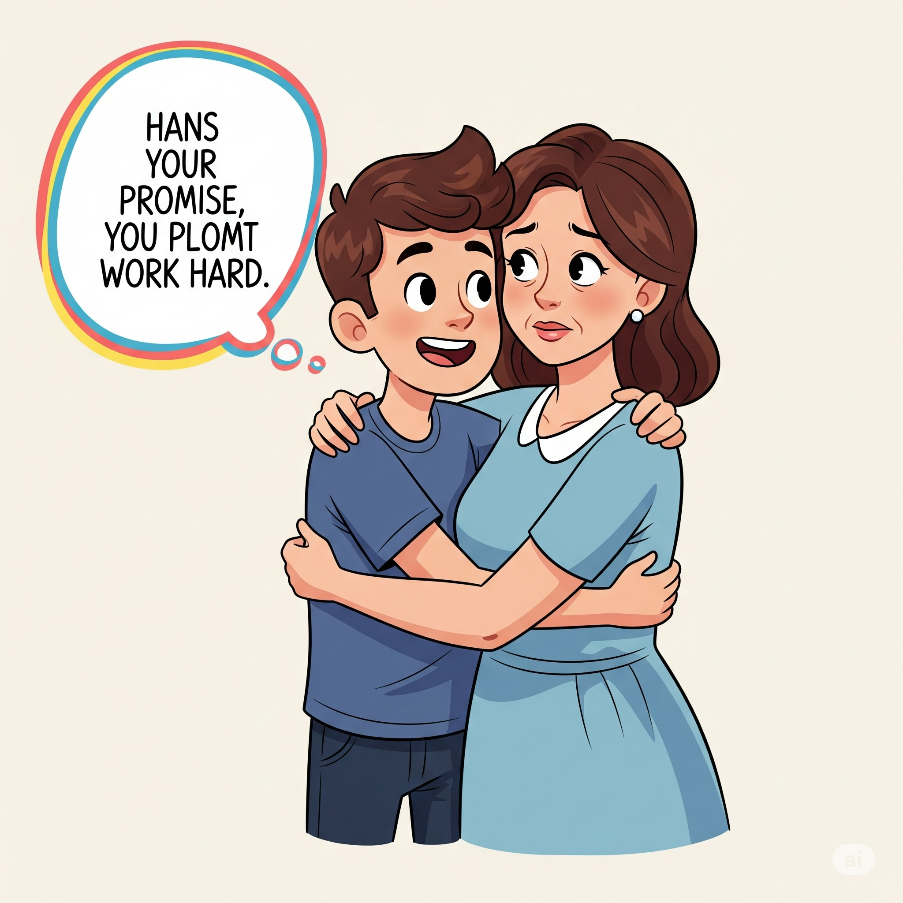

# Essential English Word 3
# Unit 23
## 1. aborigine n
### định nghĩa
người dân bản địa của một vùng đất, đặc biệt là Úc.

He is an aborigine.

They are studying aborigines.

We have met some aborigines.

He talked to an aborigine yesterday.

They were living with aborigines.

Before, I had not learned about aborigines.

You will meet aborigines there.

I am going to visit aborigines.

Aborigines have a rich culture.

You should respect aborigines.

I would like to learn from aborigines.

Learn about aborigines.

## 2. ban v
### định nghĩa
cấm chính thức điều gì đó.

They ban smoking here.

The school is banning phones.

The government has banned the product.

They banned the book last year.

We were banning loud music.

Before, they had not banned it.

They will ban it soon.

The city is going to ban cars.

They can ban certain things.

You should ban that behavior.

I would ban it if I could.

Ban that noise!

## 3. cautious adj
### định nghĩa
cẩn thận để tránh nguy hiểm hoặc sai lầm.

He is cautious.

She is being cautious.

They have been cautious.

He was cautious when crossing the road.

We were being cautious.

Before, I had not been cautious enough.

You will be cautious.

I am going to be cautious.

You can be cautious.

You should be cautious.

I would be cautious in that situation.

Be cautious!

## 4. confess v
### định nghĩa
thừa nhận rằng bạn đã làm điều gì đó sai hoặc xấu.

He confesses his mistake.

She is confessing the truth.

They have confessed their crime.

He confessed yesterday.

We were confessing our fears.

Before, I had not confessed it.

You will confess later.

I am going to confess everything.

You can confess now.

You should confess what you did.

I would confess if I felt guilty.

Confess your feelings.

## 5. cottage n
### định nghĩa
một ngôi nhà nhỏ, thường ở nông thôn.

They live in a cottage.

She is painting the cottage.

We have bought a cottage.

He stayed in a cottage last summer.

They were building a cottage.

Before, I had not seen such a small cottage.

You will visit the cottage.

I am going to rent a cottage.

A cottage can be cozy.

You should see their cottage.

I would love to live in a cottage.

Look at that cottage.

## 6. daytime n
### định nghĩa
khoảng thời gian từ sáng đến tối.

It is light during the daytime.

They are working in the daytime.

We have finished the work in the daytime.

He slept during the daytime yesterday.

They were traveling in the daytime.

Before, I had not worked in the daytime.

It will be warm in the daytime.

We are going to rest in the daytime.

You can see clearly in the daytime.

You should do this in the daytime.

I would prefer to travel in the daytime.

Work in the daytime.

## 7. desperate adj
### định nghĩa
cảm thấy rất cần hoặc muốn điều gì đó; rất tồi tệ hoặc nghiêm trọng.

He is desperate for help.

She is feeling desperate.

They have become desperate.

He was desperate to find water.

We were in a desperate situation.

Before, I had not felt so desperate.

You will be desperate if you don't hurry.

I am going to be desperate soon.

It can be a desperate attempt.

You should not be desperate.

I would feel desperate in that case.

Don't be desperate.

## 8. fade v
### định nghĩa
mất màu sắc, sức mạnh hoặc biến mất dần.

The color fades.

The light is fading.

It has faded over time.

The sound faded away.

The memories were fading.

Before, it had not faded so quickly.

The sun will fade soon.

The picture is going to fade.

Colors can fade in the sun.

You should keep it out of the sun so it doesn't fade.

I would be sad if it faded.

Watch it fade.

## 9. fierce adj
### định nghĩa
hung dữ, mạnh mẽ hoặc dữ dội.

The dog is fierce.

The wind is blowing fiercely.

They have faced fierce competition.

He saw a fierce animal.

We were fighting a fierce battle.

Before, I had not seen such a fierce storm.

The storm will be fierce.

It is going to be fierce.

Animals can be fierce.

You should be careful with fierce animals.

I would avoid anything fierce.

Be careful, it's fierce!

## 10. gamble v
### định nghĩa
chơi trò chơi may rủi để thắng tiền; mạo hiểm.

He gambles on horses.

She is gambling her money.

They have gambled everything.

He gambled in the casino last night.

We were gambling at the table.

Before, I had not gambled.

You will gamble again.

I am going to gamble.

You can gamble responsibly.

You should not gamble too much.

I would gamble if I thought I could win.

Don't gamble your future.

## 11. lawn n
### định nghĩa
khu vực có cỏ được cắt tỉa cẩn thận, thường ở trước nhà.

The lawn is green.

He is mowing the lawn.

They have a beautiful lawn.

He cut the lawn yesterday.

We were sitting on the lawn.

Before, I had not seen such a perfect lawn.

The lawn will need water.

I am going to plant grass on the lawn.

A lawn can be soft.

You should take care of your lawn.

I would like a big lawn.

Water the lawn.

## 12. mow v
### định nghĩa
cắt cỏ bằng máy hoặc công cụ.

He mows the lawn.

She is mowing the grass.

They have mowed the field.

He mowed the lawn this morning.

We were mowing the park.

Before, I had not mowed before.

You will mow the lawn tomorrow.

I am going to mow the grass.

You can mow it quickly.

You should mow the lawn regularly.

I would mow it if I had time.

Mow the lawn.

## 13. outlaw n
### định nghĩa
người đã làm điều gì đó bất hợp pháp và đang lẩn trốn pháp luật.

He is an outlaw.

They are hunting the outlaw.

The police have caught the outlaw.

He became an outlaw after the crime.

They were hiding from the outlaw.

Before, I had not heard of this outlaw.

The outlaw will be found.

They are going to catch the outlaw.

An outlaw can be dangerous.

You should report an outlaw.

I would be scared of an outlaw.

Beware of the outlaw.

## 14. prospect n
### định nghĩa
khả năng điều gì đó sẽ xảy ra trong tương lai; viễn cảnh.

The prospect is good.

They are discussing the prospect.

We have considered the prospect.

He liked the prospect of a new job.

They were looking at the prospect of success.

Before, I had not thought about that prospect.

The prospect will improve.

I am going to consider the prospect.

The prospect can be exciting.

You should think about the prospect.

I would welcome that prospect.

Consider the prospect.

## 15. purse n
### định nghĩa
một chiếc túi nhỏ mà phụ nữ dùng để đựng tiền và đồ vật cá nhân; ví tiền.

She lost her purse.

He is looking for her purse.

She has found her purse.

She bought a new purse yesterday.

We were searching for the purse.

Before, I had not used a purse.

You will need a purse.

I am going to buy a purse.

A purse can be stylish.

You should keep your money in your purse.

I would carry a small purse.

Where is your purse?

## 16. rod n
### định nghĩa
một thanh dài, mỏng bằng gỗ hoặc kim loại.

He holds a rod.

She is bending the rod.

They have used a metal rod.

He found a rod in the garden.

We were using a fishing rod.

Before, I had not seen such a long rod.

You will need a rod.

I am going to use this rod.

A rod can be strong.

You should use a straight rod.

I would use a wooden rod.

Hold the rod firmly.

## 17. seldom adv
### định nghĩa
hiếm khi, không thường xuyên.

He seldom visits.

She is seldom late.

They have seldom traveled.

He seldom ate meat when he was young.

We were seldom going out.

Before, I had seldom seen him.

You will seldom see that.

I am seldom going to be there.

It seldom happens.

You should seldom eat fast food.

I would seldom complain.

He seldom smiles.

## 18. shave v
### định nghĩa
cắt bỏ lông trên da bằng dao cạo.

He shaves his face.

She is shaving her legs.

He has shaved his beard.

He shaved this morning.

They were shaving their heads.

Before, I had not shaved.

You will shave tomorrow.

I am going to shave.

You can shave carefully.

You should shave every day.

I would shave if I had a beard.

Shave your face.

## 19. terrified adj
### định nghĩa
cảm thấy rất sợ hãi.

She is terrified.

He is looking terrified.

They have been terrified.

He was terrified of the dark.

We were feeling terrified.

Before, I had not been so terrified.

You will be terrified.

I am going to be terrified.

You can be terrified.

You should not be terrified.

I would be terrified in that situation.

Don't be terrified.

## 20. wizard n
### định nghĩa
người đàn ông được cho là có sức mạnh ma thuật.

He is a powerful wizard.

She is talking to the wizard.

They have met a wizard.

He saw a wizard in the story.

We were reading about a wizard.

Before, I had not believed in wizards.

You will meet a wizard in the game.

I am going to dress as a wizard.

A wizard can do magic.

You should ask the wizard for help.

I would like to be a wizard.

He is a wizard.

## LAZY HANS

Hans was lazy. He **_seldom_** helped his mother with anything. He didn’t cook and he never **_mowed_** the **_lawn_**. He didn’t even **_shave_**! He spent the **_daytime_** **_gambling_** with his mother’s money. One day, his mother realized that her money was gone from her **_purse_**. “You’re **_banned_** from my house!” she shouted. “ Don’t come back until you’ve learned your lesson!”

Hans went to live in the forest like an **_outlaw_**. But it was cold, and Hans couldn’t find food. He went to a **_cottage_** to ask for a meal.

An **_Aborigine_** answered the door. “ Can I stay here please?” Hans asked.

“You can stay if you work,” the man replied.

Hans liked the **_prospect_** of food and warmth, so he agreed.

The man pointed to a field. “ Take this **_rod_** and plant it over there. I am a **_wizard_**, and this magic **_rod_** will bring us food.”

The field was far away. Hans knew it would be hard to walk there. So he just threw the **_rod_** behind the **_cottage_** and sat by the river. When daylight **_faded_**, he returned to the **_cottage_** and went to sleep.

The next morning, the old man looked very **_fierce_**. “ You didn’t take the **_rod_** to the field!” he shouted.

“ No,” **_confessed_** Hans, “ it was too far!”

“ Because of you we have nothing to eat!” replied the man.

Hans was **_terrified_** that the man would punish him. So he ran home. “ Mama!” he cried, “ I’m **_desperate_** to come back!” His mother was **_cautious_**.

“ Do you promise to work?” she asked.

“ Yes!” said Hans, “ I’ll never be lazy again!”

------------

Hans was lazy. He seldom helped his mother with anything. He didn’t cook and he never mowed the lawn. He didn’t even shave! He spent the daytime gambling with his mother’s money. One day, his mother realized that her money was gone from her purse. “You’re banned from my house!” she shouted. “ Don’t come back until you’ve learned your lesson!”

Hans went to live in the forest like an outlaw. But it was cold, and Hans couldn’t find food. He went to a cottage to ask for a meal.

An Aborigine answered the door. “ Can I stay here please?” Hans asked.

“You can stay if you work,” the man replied.

Hans liked the prospect of food and warmth, so he agreed.

The man pointed to a field. “ Take this rod and plant it over there. I am a wizard, and this magic rod will bring us food.”

The field was far away. Hans knew it would be hard to walk there. So he just threw the rod behind the cottage and sat by the river. When daylight faded, he returned to the cottage and went to sleep.

The next morning, the old man looked very fierce. “ You didn’t take the rod to the field!” he shouted.

“ No,” confessed Hans, “ it was too far!”

“ Because of you we have nothing to eat!” replied the man.

Hans was terrified that the man would punish him. So he ran home. “ Mama!” he cried, “ I’m desperate to come back!” His mother was cautious.

“ Do you promise to work?” she asked.

“ Yes!” said Hans, “ I’ll never be lazy again!”