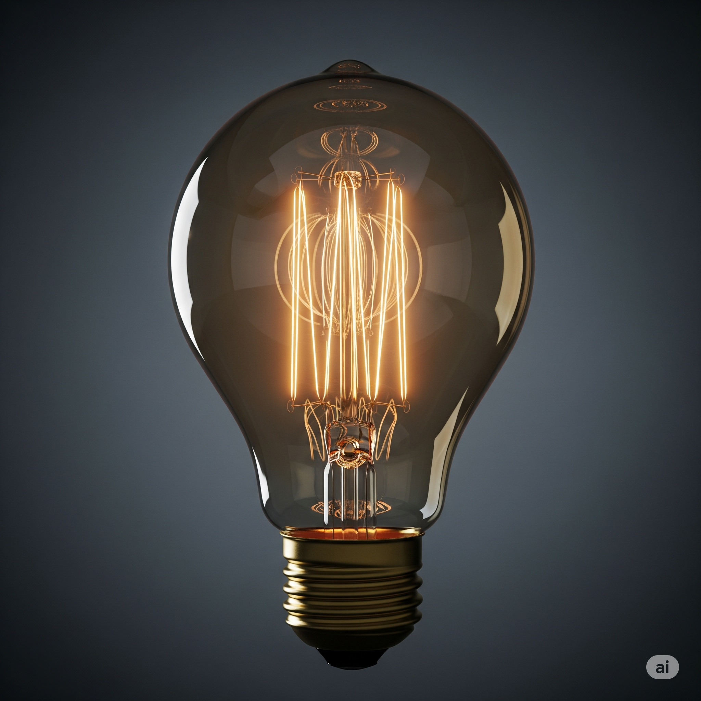

# Essential English Word 3
# Unit 24
## 1. baggage n
### định nghĩa
hành lý (túi xách, vali khi đi du lịch).

I have my baggage ready.

She is checking her baggage.

They have lost their baggage.

He brought his baggage yesterday.

We were carrying our baggage.

Before, I had not packed my baggage.

You will need your baggage.

I am going to pick up my baggage.

You can leave your baggage here.

You should label your baggage.

I would take less baggage next time.

Handle the baggage carefully.

## 2. bulb n
### định nghĩa
bóng đèn (phần tròn tạo ra ánh sáng).

The light bulb is broken.

He is changing the bulb.

They have replaced the bulb.

She bought a new bulb yesterday.

We were looking for a bulb.

Before, I had not needed a new bulb.

You will need a brighter bulb.

I am going to buy a bulb.

This bulb can last a long time.

You should use an LED bulb.

I would change the bulb if I knew how.

Change the bulb.

## 3. bundle n
### định nghĩa
bó, gói (một nhóm đồ vật buộc lại với nhau).

He carries a bundle.

She is tying a bundle.

They have made a bundle of sticks.

He found a bundle of letters.

We were carrying a bundle of clothes.

Before, I had not seen such a large bundle.

You will see a bundle there.

I am going to make a bundle.

This bundle can be heavy.

You should tie the bundle tightly.

I would open the bundle carefully.

Tie the bundle.

## 4. cattle n
### định nghĩa
gia súc (bò, trâu được nuôi ở trang trại).

The cattle are in the field.

They are moving the cattle.

We have counted the cattle.

He bought some cattle last month.

They were feeding the cattle.

Before, I had not worked with cattle.

The cattle will graze here.

They are going to sell the cattle.

Cattle can be noisy.

You should watch the cattle.

I would like to raise cattle.

Look at the cattle.

## 5. flee v
### định nghĩa
chạy trốn (chạy đi khỏi nơi nguy hiểm).

They flee the country.

He is fleeing from the police.

Many people have fled the area.

They fled the city last night.

We were fleeing the danger.

Before, I had not had to flee.

They will flee if necessary.

He is going to flee.

You can flee if you are in danger.

You should flee immediately.

I would flee if I felt unsafe.

Flee quickly!

## 6. graze v
### định nghĩa
gặm cỏ (động vật ăn cỏ ở đồng cỏ).

The sheep graze in the field.

The cows are grazing.

They have grazed all morning.

The horses grazed peacefully yesterday.

The cattle were grazing near the river.

Before, they had not grazed in this area.

The animals will graze here tomorrow.

They are going to graze in the pasture.

Animals can graze for hours.

You should let them graze freely.

I would watch them graze.

Let the sheep graze.

## 7. greed n
### định nghĩa
sự tham lam (muốn có nhiều hơn những gì cần).

Greed is a bad thing.

He is showing greed.

Greed has caused many problems.

His greed led to his downfall.

They were motivated by greed.

Before, I had not understood his greed.

Greed will not help you.

He is going to act out of greed.

Greed can be destructive.

You should avoid greed.

I would not let greed control me.

Don't show greed.

## 8. herd n
### định nghĩa
bầy, đàn (một nhóm động vật cùng loại).

A herd of elephants is coming.

They are watching the herd.

We have seen a large herd.

He saw a herd of deer yesterday.

They were following the herd.

Before, I had not seen such a big herd.

The herd will move soon.

They are going to join the herd.

A herd can be noisy.

You should not disturb the herd.

I would like to see a herd of wild horses.

Look at the herd.

## 9. initiate v
### định nghĩa
bắt đầu, khởi xướng (làm cho điều gì đó bắt đầu).

He initiates the project.

She is initiating the process.

They have initiated a new plan.

He initiated the discussion yesterday.

We were initiating the changes.

Before, I had not initiated anything like this.

You will initiate the next step.

I am going to initiate the meeting.

You can initiate the action.

You should initiate the conversation.

I would initiate it if I were ready.

Initiate the game.

## 10. lane n
### định nghĩa
làn đường (một phần của con đường cho xe đi).

Stay in your lane.

He is changing lanes.

They have closed one lane.

She drove in this lane yesterday.

We were driving in the slow lane.

Before, I had not used this lane.

The left lane will be faster.

They are going to add a new lane.

This lane can be busy.

You should stay in your lane.

I would use the right lane.

Change lanes carefully.

## 11. nerve n
### định nghĩa
sự can đảm (dũng cảm làm điều gì đó khó).

He has a lot of nerve.

She is losing her nerve.

They have shown great nerve.

He lost his nerve at the last moment.

We were testing our nerve.

Before, I had not had the nerve to do it.

You will need nerve for this.

I am going to need some nerve.

It takes nerve to do that.

You should have the nerve to try.

I would not have the nerve.

Have the nerve to speak up.

## 12. optimist n
### định nghĩa
người lạc quan (người luôn nghĩ điều tốt sẽ xảy ra).

He is an optimist.

She is being an optimist.

They have always been optimists.

He was an optimist even then.

We were talking to the optimist.

Before, I had not met such an optimist.

You will become an optimist.

I am going to try to be an optimist.

An optimist sees the good.

You should be an optimist.

I would rather be an optimist than a pessimist.

Be an optimist.

## 13. parade n
### định nghĩa
cuộc diễu hành (một nhóm người đi bộ hoặc đi xe qua đường phố để kỷ niệm).

The parade is starting.

They are watching the parade.

We have seen the parade before.

He saw the parade last year.

They were marching in the parade.

Before, I had not been to a parade.

You will enjoy the parade.

We are going to the parade tomorrow.

A parade can be colorful.

You should watch the parade.

I would like to be in the parade.

Watch the parade!

## 14. pave v
### định nghĩa
lát đường (phủ bề mặt đường bằng vật liệu như nhựa đường hoặc gạch).

They pave the road.

Workers are paving the street.

They have paved the driveway.

He paved the path last week.

We were paving the area.

Before, they had not paved this road.

They will pave the road next month.

They are going to pave the area.

They can pave it quickly.

You should pave the walkway.

I would pave it with stones.

Pave the road.

## 15. phantom n
### định nghĩa
bóng ma, ảo ảnh (hình ảnh không có thật).

He saw a phantom.

She is afraid of phantoms.

They have reported seeing a phantom.

He saw a phantom in the old house.

We were talking about phantoms.

Before, I had not believed in phantoms.

You will not see a phantom.

I am going to look for a phantom.

A phantom can be scary.

You should not chase phantoms.

I would be scared if I saw a phantom.

Beware of the phantom.

## 16. portable adj
### định nghĩa
có thể mang theo (nhỏ và nhẹ, dễ dàng di chuyển).

This is a portable speaker.

She is using a portable device.

They have bought a portable charger.

He used a portable radio yesterday.

We were carrying a portable table.

Before, I had not owned anything portable.

You will need a portable fan.

I am going to buy a portable computer.

It can be portable.

You should get a portable light.

I would prefer a portable version.

Get a portable battery.

## 17. poster n
### định nghĩa
áp phích (một bức tranh hoặc thông báo lớn dán trên tường).

He put up a poster.

She is designing a poster.

They have printed many posters.

He saw the poster yesterday.

We were looking at the posters.

Before, I had not made a poster.

You will see the poster.

I am going to hang a poster.

A poster can be informative.

You should make a poster for the event.

I would put a poster on my wall.

Look at the poster.

## 18. scratch v/n
### định nghĩa
làm xước (làm một vết nhỏ trên bề mặt).

The cat scratches the door.

She is scratching her arm.

He has scratched the car.

He scratched his knee when he fell.

We were scratching the surface.

Before, I had not scratched it.

You will scratch it if you are not careful.

I am going to scratch the paint.

It can scratch easily.

You should not scratch the furniture.

I would be careful not to scratch it.

Don't scratch the glass.

## 19. symphony n
### định nghĩa
một tác phẩm âm nhạc dài cho dàn nhạc lớn.

He wrote a symphony.

She is listening to a symphony.

They have performed the symphony.

He heard the symphony last night.

We were practicing the symphony.

Before, I had not heard this symphony.

You will hear a beautiful symphony.

I am going to attend a symphony concert.

A symphony can be complex.

You should listen to this symphony.

I would like to compose a symphony.

Listen to the symphony.

## 20. widow n
### định nghĩa
người phụ nữ có chồng đã mất.

She is a widow.

He is helping the widow.

They have supported the widow.

She became a widow last year.

We were talking to the widow.

Before, I had not met the widow.

The widow will attend the event.

I am going to visit the widow.

A widow may need support.

You should be kind to the widow.

I would offer help to the widow.

Help the widow.

## THE BREMEN TOWN MUSICIANS

Larry the cow, Harry the rooster and Lester the duck lived on a **widow’s** farm. They dreamed of playing music in a **parade**.

One day, the **widow** went to the lawn where her **herd** of **cattle** was **grazing**. “ I’ll eat him tomorrow,” she said, pointing to Larry.

Larry wanted to **flee**, but he didn’t have the **nerve** to go by himself. Then his friends Lester and Harry showed him a **poster**.

“ It’s for a **parade** in Bremen. We’ll go with you, and we can perform our **symphony** there,” Lester said.

The animals put together a small **bundle** that held a drum, a flute and a **portable** microphone. Then they took their **baggage** and **initiated** their long journey.

They walked down a **paved** **lane** all day. That night, they looked in the window of a house. They saw a group of thieves. They were eating a large dinner and telling stories about their **greed** and the people they stole from.

Lester was an **optimist**. He said, “ I think we can scare them away!”

Soon, the animals came up with a plan. Harry flew inside and knocked over the lamp. “ What was that?” screamed a thief as the **bulb** broke. They could barely see now.

Then Larry stood on two feet, and Lester flew to the top of his head. They looked very big. All three of the animals made scary noises. The thieves tried to hit the animals. But Harry flew over them and **scratched** them.

“ It’s a **phantom**!” yelled one thief.

The thieves ran away. The animals ate and rested. The next morning, Larry said, “Why go to Bremen? We can stay here and make music!” And so they remained there and were quite happy.

