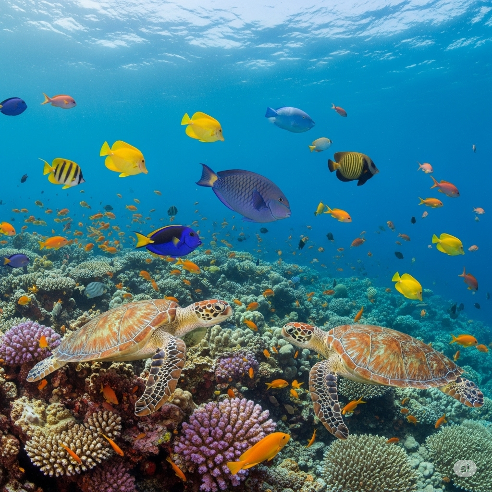
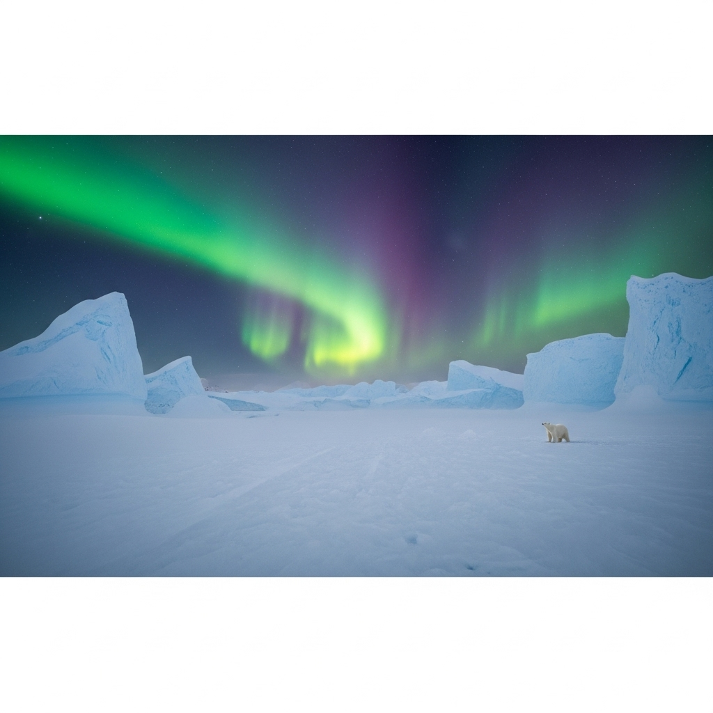
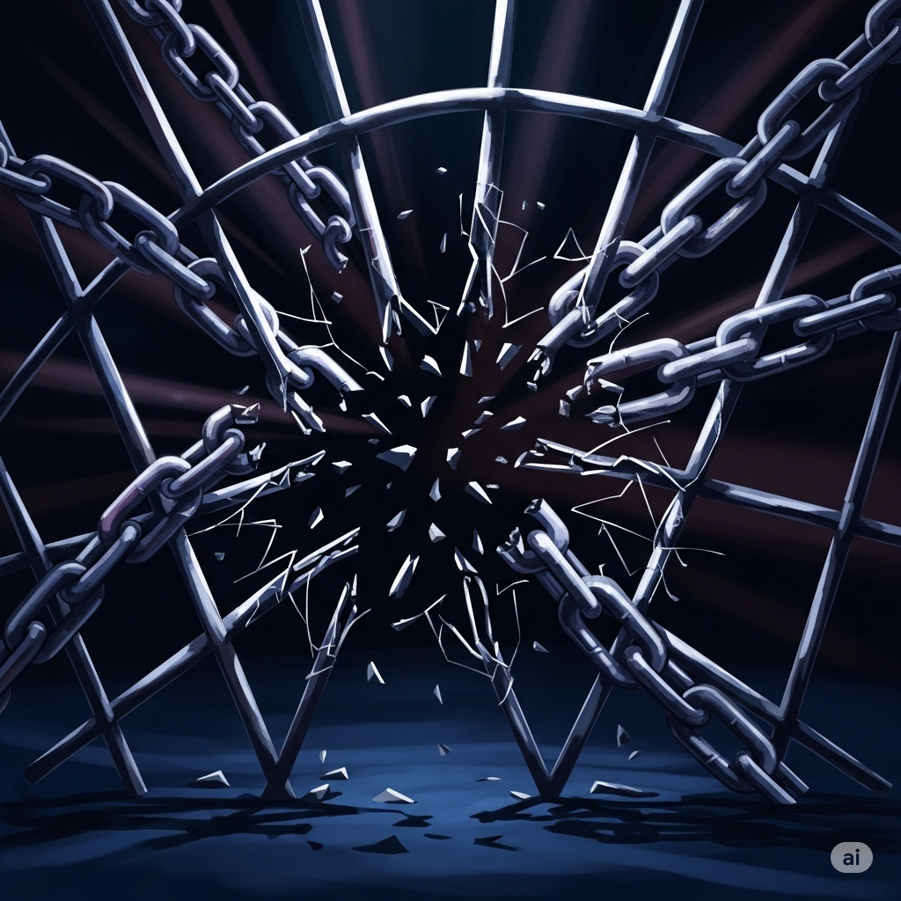
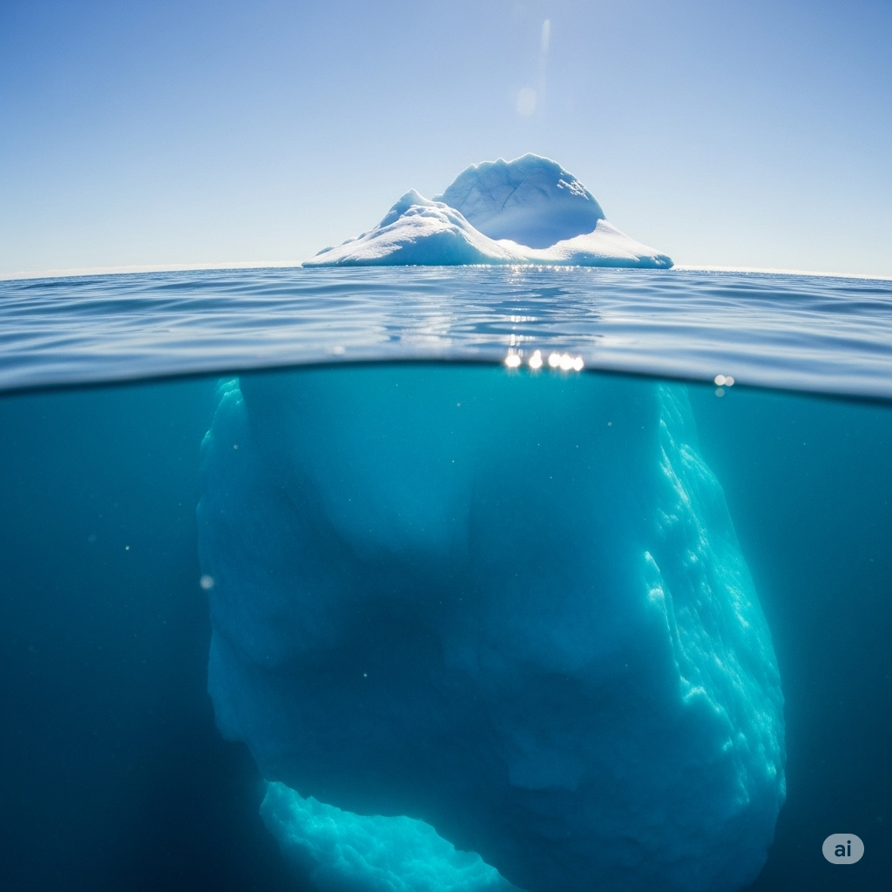
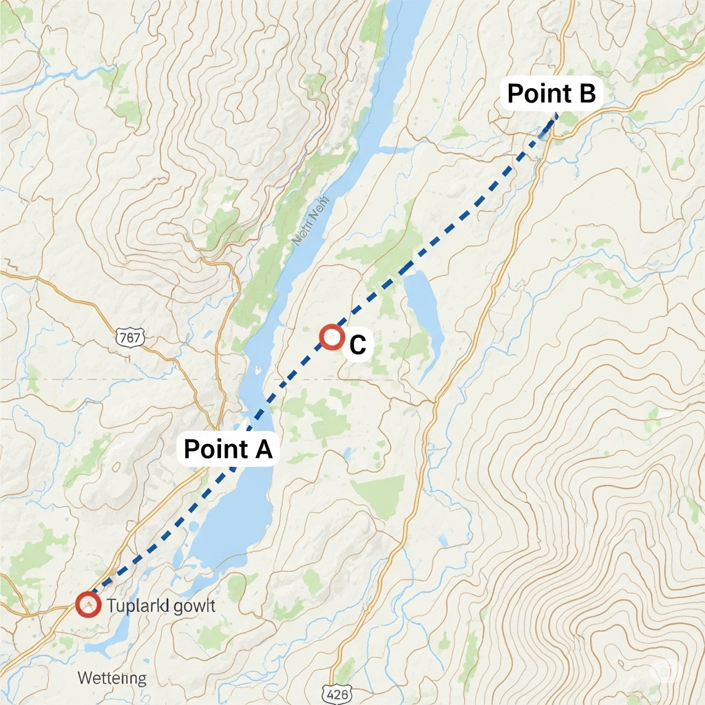
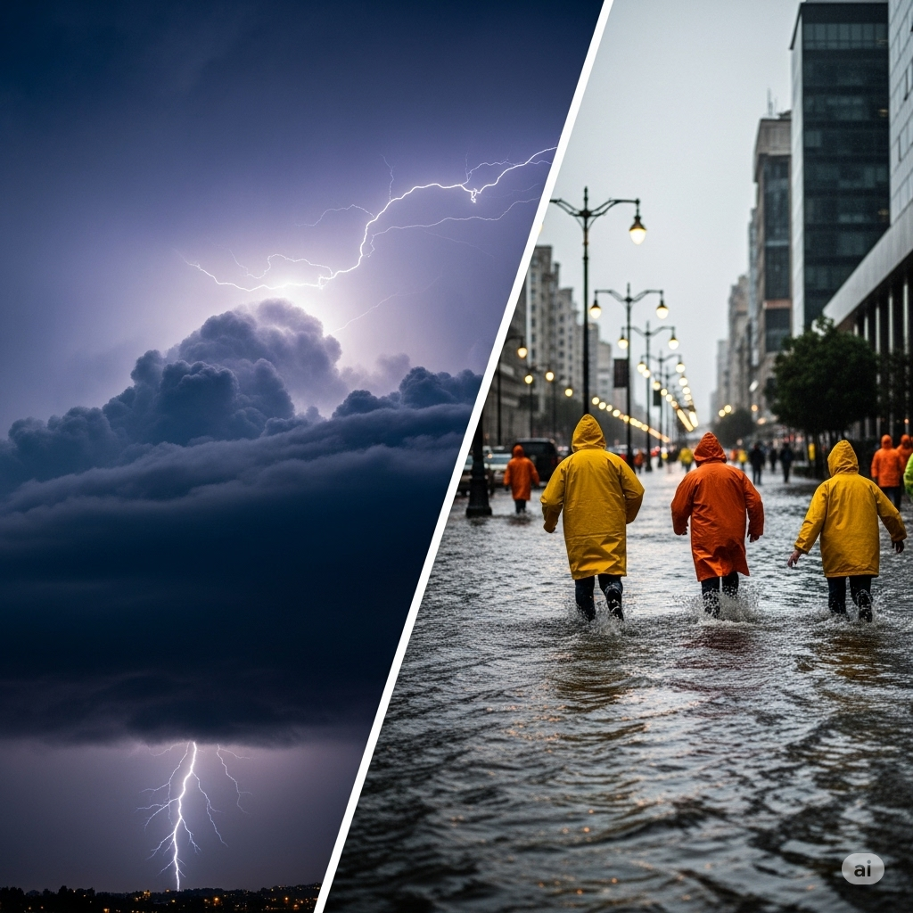
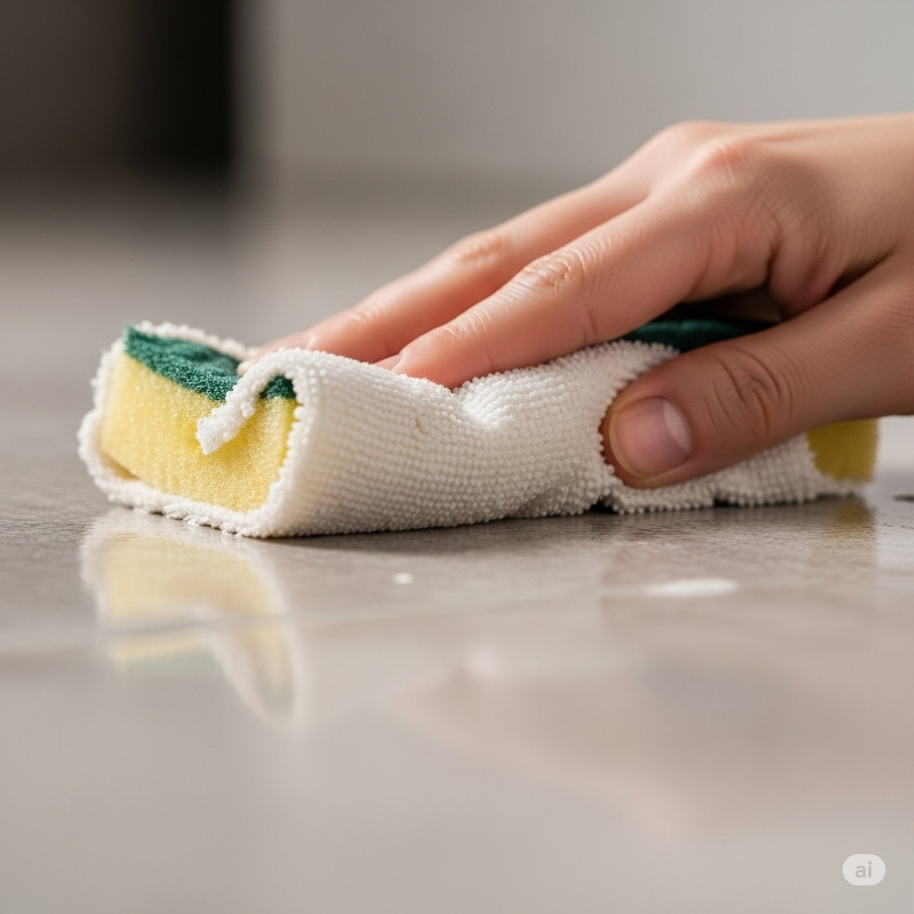
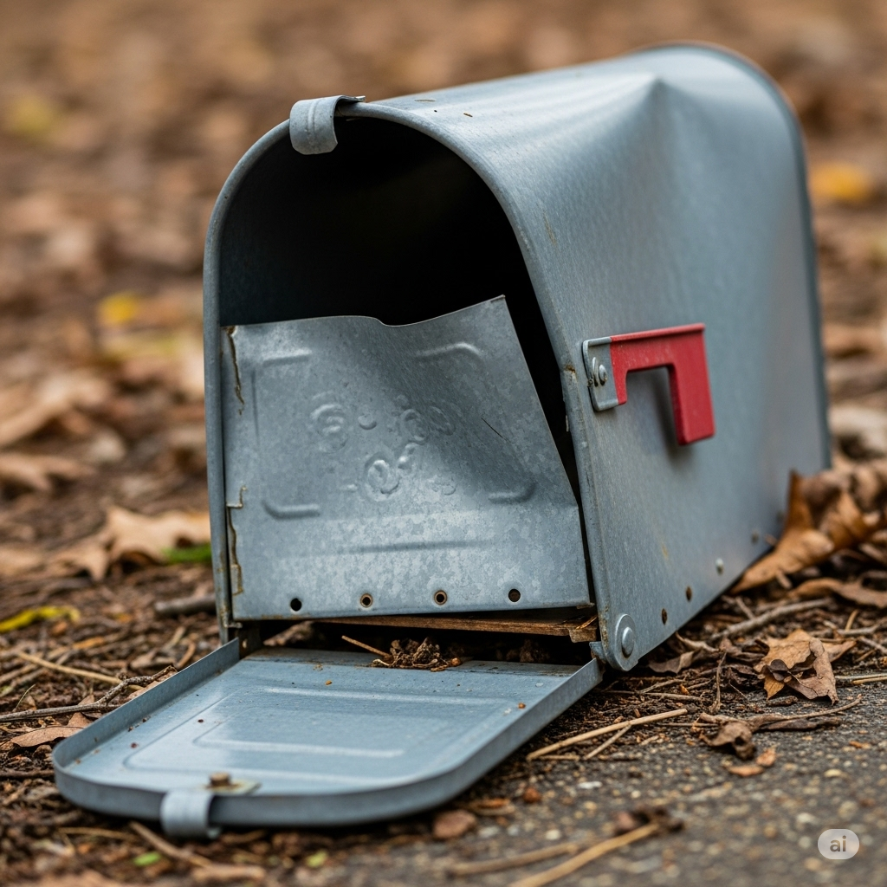

# Essential English Word 3
# Unit 25
## 1. circulate v
### định nghĩa
lưu thông (chất lỏng, không khí); lan truyền (thông tin).

Blood circulates in the body.

News is circulating quickly.

The air has circulated well.

The rumor circulated yesterday.

Ideas were circulating among the group.

Before, the air had not circulated properly.

The money will circulate in the economy.

Information is going to circulate.

Air can circulate through the room.

You should let the air circulate.

I would let the news circulate.

Let the air circulate.

## 2. consequent adj
### định nghĩa
xảy ra như một kết quả của điều gì đó.

The storm was strong, and the consequent damage was huge.

They are dealing with the consequent problems.

We have seen the consequent effects.

He faced the consequent difficulties.

They were discussing the consequent actions.

Before, I had not thought about the consequent results.

The consequent changes will be big.

There are going to be consequent issues.

Consequent events can be hard.

You should prepare for the consequent challenges.

I would consider the consequent impact.

Think about the consequent steps.

## 3. derive v
### định nghĩa
có nguồn gốc từ, lấy được từ.

He derives pleasure from reading.

She is deriving benefit from the course.

They have derived their income from farming.

He derived the answer from the data.

We were deriving energy from the sun.

Before, I had not derived much help from it.

You will derive knowledge from books.

I am going to derive a conclusion.

You can derive meaning from the text.

You should derive strength from your experiences.

I would derive happiness from simple things.

Derive your power from within.

## 4. drown v
### định nghĩa
chết đuối (trong nước); nhấn chìm.

He drowns in the river.

She is drowning her sorrows.

Many people have drowned in the flood.

He almost drowned last summer.

They were drowning their voices with music.

Before, I had not seen anyone drown.

He will drown if he doesn't learn to swim.

The sound is going to drown out the noise.

You can drown in shallow water.

You should be careful not to drown.

I would help someone who was drowning.

Don't drown your feelings.

## 5. dynasty n
### định nghĩa
một dòng họ vua chúa hoặc những người cai trị một quốc gia trong một thời gian dài.

This is an ancient dynasty.

They are studying the dynasty.

We have learned about the dynasty.

He read about a famous dynasty.

They were researching the history of the dynasty.

Before, I had not known about this dynasty.

You will learn about the next dynasty.

I am going to visit the palace of the dynasty.

A dynasty can rule for centuries.

You should study the history of dynasties.

I would be interested in the Ming Dynasty.

Learn about the dynasty.

## 6. fraction n
### định nghĩa
một phần nhỏ của cái gì đó; phân số.

Only a fraction of people came.

She is eating a fraction of the cake.

They have used a fraction of the resources.

He understood only a fraction of what was said.

We were discussing fractions in math class.

Before, I had not worked with fractions.

You will need a fraction of the amount.

I am going to explain fractions.

A fraction can be small.

You should understand fractions.

I would give you a fraction of my share.

Give me a fraction.

## 7. frost n
### định nghĩa
lớp băng mỏng hình thành khi nhiệt độ dưới 0 độ C.

There is frost on the ground.

The plants are covered in frost.

We have had frost every morning.

He saw frost on the window.

They were scraping frost off the car.

Before, I had not seen such heavy frost.

There will be frost tonight.

It is going to be a hard frost.

Frost can damage plants.

You should cover your plants if there is frost.

I would stay inside when there is frost.

Look at the frost.

## 8. illusion n
### định nghĩa
ảo giác (điều gì đó trông có thật nhưng không phải).

It is just an illusion.

She is creating an illusion.

They have seen the illusion.

He saw an optical illusion.

We were discussing the illusion.

Before, I had not understood the illusion.

You will see the illusion.

I am going to show you an illusion.

An illusion can trick your eyes.

You should not believe every illusion.

I would be surprised by that illusion.

It's an illusion.

## 9. invade v
### định nghĩa
xâm lược (quân đội tiến vào một quốc gia khác để chiếm đóng).

They invade the country.

The army is invading the territory.

They have invaded the privacy.

The enemy invaded last night.

They were invading the land.

Before, they had not invaded this area.

They will invade if we are not ready.

The insects are going to invade the garden.

They can invade quickly.

You should prepare if they invade.

I would resist if they invaded.

Don't invade my space.

## 10. lieutenant n
### định nghĩa
một cấp bậc trong quân đội hoặc hải quân, dưới đại úy.

He is a lieutenant.

She is talking to the lieutenant.

They have promoted him to lieutenant.

He was a lieutenant in the army.

We were waiting for the lieutenant.

Before, I had not met a lieutenant.

You will meet the lieutenant.

I am going to become a lieutenant.

A lieutenant has responsibilities.

You should follow the lieutenant's orders.

I would salute the lieutenant.

Report to the lieutenant.

## 11. marine adj
### định nghĩa
liên quan đến biển hoặc sinh vật biển.

We study marine life.

They are exploring the marine environment.

He has a marine biology degree.

He saw many marine animals.

We were looking at marine plants.

Before, I had not learned about marine ecosystems.

You will see marine creatures.

I am going to work in marine research.

Marine animals can be beautiful.

You should protect the marine habitat.

I would love to explore marine caves.

Study marine science.

## 12. merit n
### định nghĩa
giá trị tốt, công lao xứng đáng được khen thưởng.

The idea has merit.

She is judging the merit of the proposal.

They have recognized his merit.

He proved his merit through hard work.

We were discussing the merits of the plan.

Before, I had not seen the merit in it.

Your work will have merit.

I am going to show my merit.

It has its merits.

You should judge people on their merit.

I would reward him for his merit.

Judge it on its merit.

## 13. navy n
### định nghĩa
lực lượng quân sự chiến đấu trên biển.

He joined the navy.

She is serving in the navy.

They have a strong navy.

He was in the navy for ten years.

We were watching the navy ships.

Before, I had not considered joining the navy.

You will see the navy fleet.

I am going to work for the navy.

The navy protects the seas.

You should respect the navy.

I would be proud to serve in the navy.

Join the navy.

## 14. polar adj
### định nghĩa
liên quan đến vùng cực (Bắc Cực hoặc Nam Cực).

Polar bears live in the Arctic.

They are studying the polar regions.

We have visited the polar ice caps.

He saw a polar fox.

They were exploring the polar landscape.

Before, I had not learned about polar climates.

You will experience polar conditions.

I am going to see the polar lights.

Polar weather can be extreme.

You should wear warm clothes in polar areas.

I would like to visit the polar circle.

Study polar science.

## 15. ray n
### định nghĩa
tia (ánh sáng); cá đuối (loại cá).

A ray of sunlight came through.

She is drawing a ray.

They have seen a stingray.

He felt a ray of hope.

We were watching the rays of light.

Before, I had not seen a stingray.

You will see a ray of light.

I am going to draw a ray.

A ray can be bright.

You should follow the ray of hope.

I would be careful near a stingray.

See the ray of light.

## 16. resign v
### định nghĩa
từ chức (rời bỏ công việc hoặc vị trí chính thức).

He resigns from his job.

She is resigning tomorrow.

They have resigned from the committee.

He resigned last week.

They were resigning from their positions.

Before, I had not thought about resigning.

You will resign soon.

I am going to resign.

You can resign if you are unhappy.

You should resign if you are not happy.

I would resign if I were in his place.

He decided to resign.

## 17. suicide n
### định nghĩa
hành động tự kết liễu đời mình.

It was ruled a suicide.

They are investigating the suicide.

The number of suicides has increased.

He read about a historical suicide.

They were discussing the topic of suicide.

Before, I had not known about that suicide case.

The report will mention the suicide rate.

They are going to work on suicide prevention.

Suicide is a serious issue.

You should seek help if you have thoughts of suicide.

I would try to help someone considering suicide.

Talk about suicide prevention.

## 18. tremble v
### định nghĩa
run rẩy (vì sợ hãi, lạnh hoặc yếu).

His hands tremble.

She is trembling with fear.

They have trembled at the sight.

He trembled when he heard the news.

We were trembling in the cold.

Before, I had not trembled like that.

You will tremble if you are scared.

I am going to tremble.

You can tremble from the cold.

You should not tremble.

I would tremble if I saw a ghost.

Don't tremble.

## 19. underlying adj
### định nghĩa
cơ bản, ẩn dưới (là nguyên nhân chính nhưng không rõ ràng).

What is the underlying problem?

She is looking for the underlying cause.

They have found the underlying issue.

He understood the underlying meaning.

We were discussing the underlying factors.

Before, I had not seen the underlying truth.

You will find the underlying reason.

I am going to analyze the underlying data.

There is an underlying tension.

You should look for the underlying pattern.

I would consider the underlying risks.

Find the underlying cause.

## 20. via prep
### định nghĩa
qua, thông qua (đi qua một địa điểm hoặc dùng một phương tiện).

I will send it via email.

We are traveling via Paris.

They have sent the package via airmail.

He came via the back door.

We were communicating via video call.

Before, I had not sent anything via post.

You will receive it via courier.

I am going to contact you via phone.

You can go via the main road.

You should send the message via the system.

I would travel via train.

Send it via the internet.

## How Did Greenland Get Its Name?

The nation of Greenland isn’t very green. The sun’s **rays** don’t shine there for three whole months. As a result, it’s covered with snow, ice and **frost**. Then how was the name **derived**? It started with a Viking named Erik the Red. Erik had many **merits**. However, there was an **underlying** problem . . . he got angry easily. People were scared of him. However, he was married to the niece of a very powerful man. So everybody tried to be nice to him.

One day, Erik fought with his neighbor and killed him. His **consequent** punishment was to leave Iceland.

Many stories **circulated** about a land west of Iceland. But only a **fraction** of the people in Iceland believed them. Still, Erik wanted to find it.

Erik sailed toward the land **via** the Atlantic Ocean. His **marine** knowledge was good, but the trip was hard. Some of his men **drowned**. Erik’s **lieutenant** wanted to **resign** from his position. Others thought about committing **suicide**.

Suddenly, Erik thought he saw something. “ I don’t believe it,” said Erik. “ It must be an **illusion**.” But it was no trick—it was the new land!

Erik **trembled** in the cold **polar** air. He saw that there was ice everywhere. He realized that the ice could keep enemies out. Not even the best **navy** could **invade** the new land. He could start a new **dynasty** in his name. But how could he convince people to live here?

“ I’ll call it ‘Greenland,’” he said. Erik’s plan worked Within two years, over a thousand people moved to Greenland. In the end, Greenland got its name all because of a trick.

