# Essential English Word 3
# Unit 30
## 1. appliance n
### định nghĩa
thiết bị hoặc máy móc nhỏ dùng trong nhà (như máy nướng bánh mì, máy hút bụi).
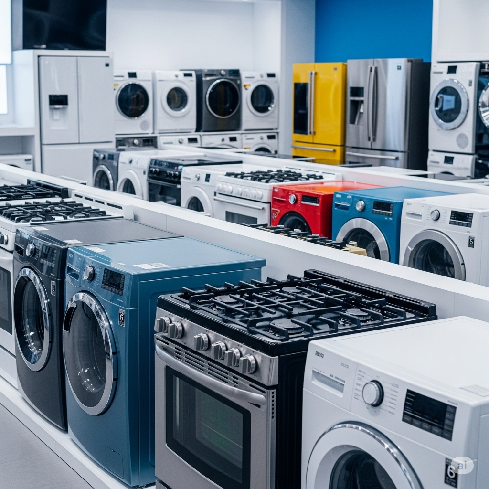
This appliance is new.
She is using a kitchen appliance.
They have bought many appliances.
He fixed the appliance yesterday.
We were looking at electrical appliances.
Before, I had not used this appliance.
You will need a new appliance.
I am going to buy an appliance.
An appliance can save time.
You should unplug the appliance.
I would buy that appliance.
Use the appliance carefully.

------------

## 2. basin n
### định nghĩa
chậu rửa (trong phòng tắm hoặc nhà bếp); lưu vực (sông).
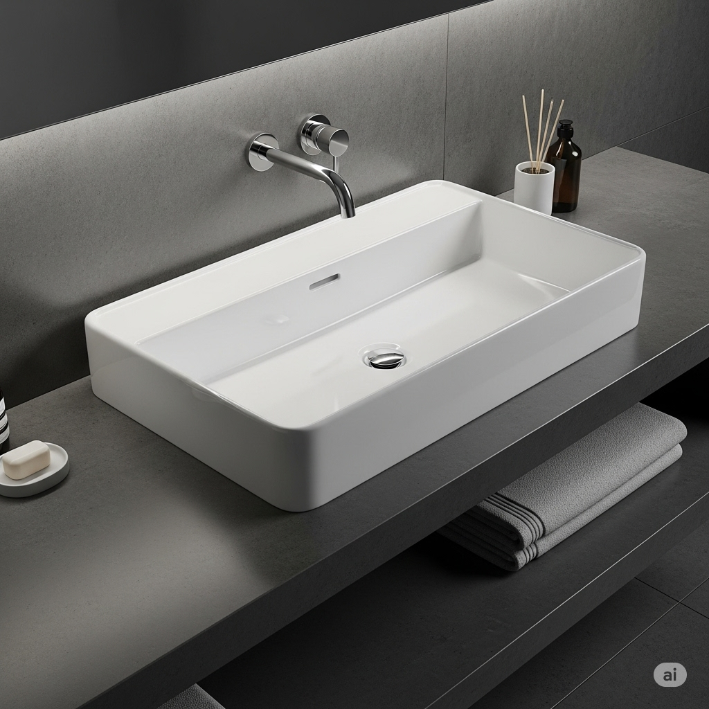
The basin is full of water.
She is cleaning the basin.
They have installed a new basin.
He washed his hands in the basin.
We were filling the basin.
Before, I had not seen such a large basin.
You will find a basin there.
I am going to wash the basin.
A basin can be made of ceramic.
You should clean the basin regularly.
I would use the basin to wash clothes.
Clean the basin.

------------

## 3. broom n
### định nghĩa
cái chổi (dụng cụ có cán dài và lông cứng để quét sàn).

He is using a broom.
She is buying a new broom.
They have broken the broom.
He swept the floor with a broom.
We were looking for the broom.
Before, I had not used a broom.
You will need a broom.
I am going to buy a broom.
A broom helps you clean.
You should use the broom to sweep.
I would use a broom to clean the porch.
Where is the broom?

------------

## 4. caterpillar n
### định nghĩa
sâu bướm (con vật nhỏ, dài, có nhiều chân, sau này biến thành bướm).
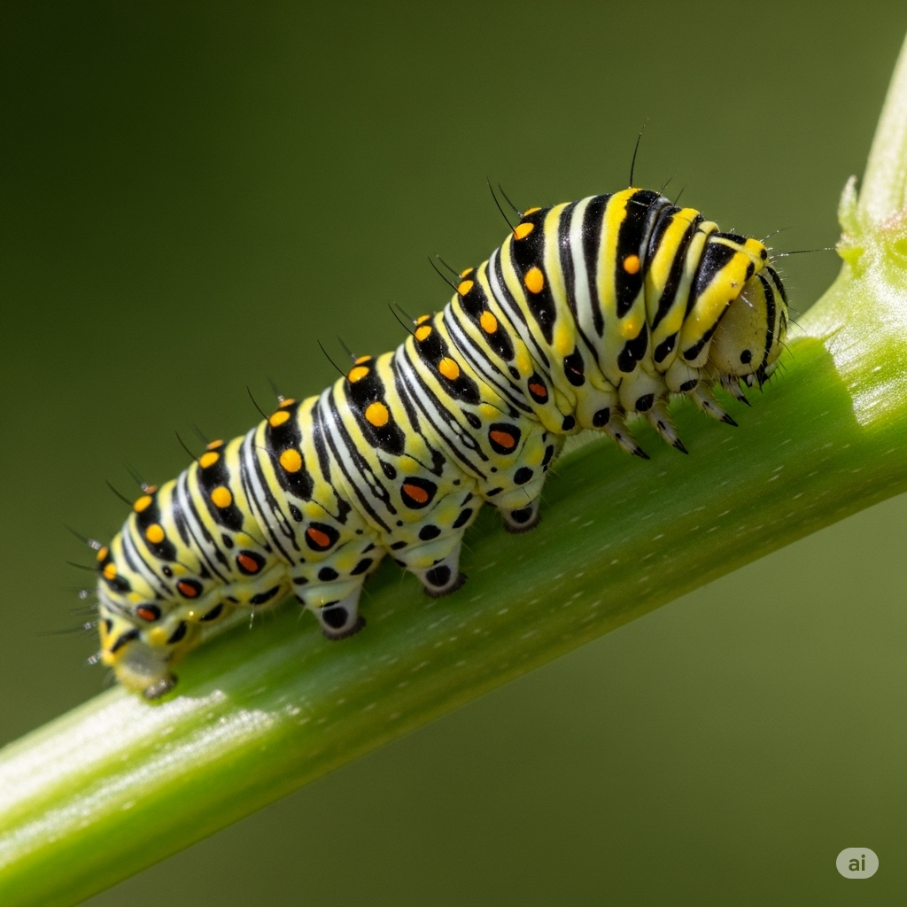
The caterpillar is eating a leaf.
She is watching the caterpillar.
They have seen many caterpillars.
He saw a caterpillar in the garden.
We were looking at the caterpillar.
Before, I had not seen a caterpillar like this.
You will see a caterpillar.
I am going to draw a caterpillar.
A caterpillar can become a butterfly.
You should not touch the caterpillar.
I would like to see a caterpillar turn into a butterfly.
Look at the caterpillar.

------------

## 5. cupboard n
### định nghĩa
tủ có cửa, dùng để đựng đồ (như chén đĩa, quần áo).
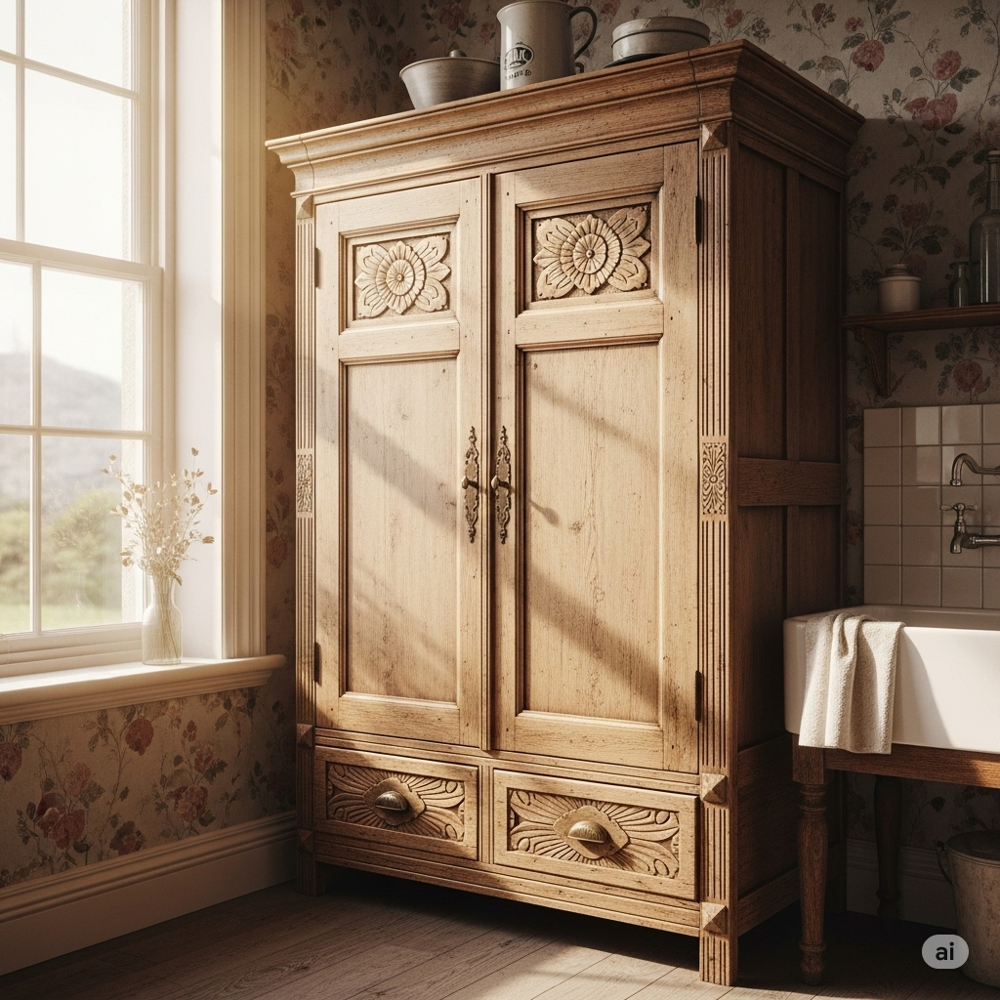
The cupboard is full.
She is opening the cupboard.
They have cleaned the cupboard.
He put the plates in the cupboard.
We were searching the cupboard.
Before, I had not organized the cupboard.
You will find it in the cupboard.
I am going to clean the cupboard.
A cupboard can be in the kitchen.
You should close the cupboard door.
I would put the food in the cupboard.
Open the cupboard.

------------

## 6. delicate adj
### định nghĩa
mỏng manh, dễ vỡ; cần sự cẩn thận.

The glass is delicate.
She is handling a delicate situation.
They have a delicate flower.
He touched the delicate fabric gently.
We were discussing a delicate matter.
Before, I had not seen such a delicate object.
You will need to be delicate.
I am going to handle it delicately.
It can be very delicate.
You should be delicate with it.
I would treat it delicately.
Be delicate.

------------

## 7. emerge v
### định nghĩa
xuất hiện, nổi lên (từ bên trong hoặc từ dưới nước).

The sun emerges from behind the clouds.
She is emerging from the water.
A new leader has emerged.
He emerged from the building.
They were emerging from the tunnel.
Before, it had not emerged yet.
The truth will emerge.
A pattern is going to emerge.
It can emerge slowly.
You should wait for the facts to emerge.
I would wait until they emerge.
Watch it emerge.

------------

## 8. handicap n
### định nghĩa
sự cản trở, bất lợi; khuyết tật về thể chất hoặc tinh thần.

He has a physical handicap.
She is overcoming her handicap.
They have supported people with handicaps.
He lived with a handicap.
We were learning about different handicaps.
Before, I had not understood his handicap.
You will see people with handicaps.
I am going to help people with handicaps.
A handicap can be challenging.
You should not discriminate based on handicap.
I would support research into handicaps.
Understand the handicap.

------------

## 9. hook n
### định nghĩa
cái móc (vật cong dùng để treo đồ hoặc bắt cá).
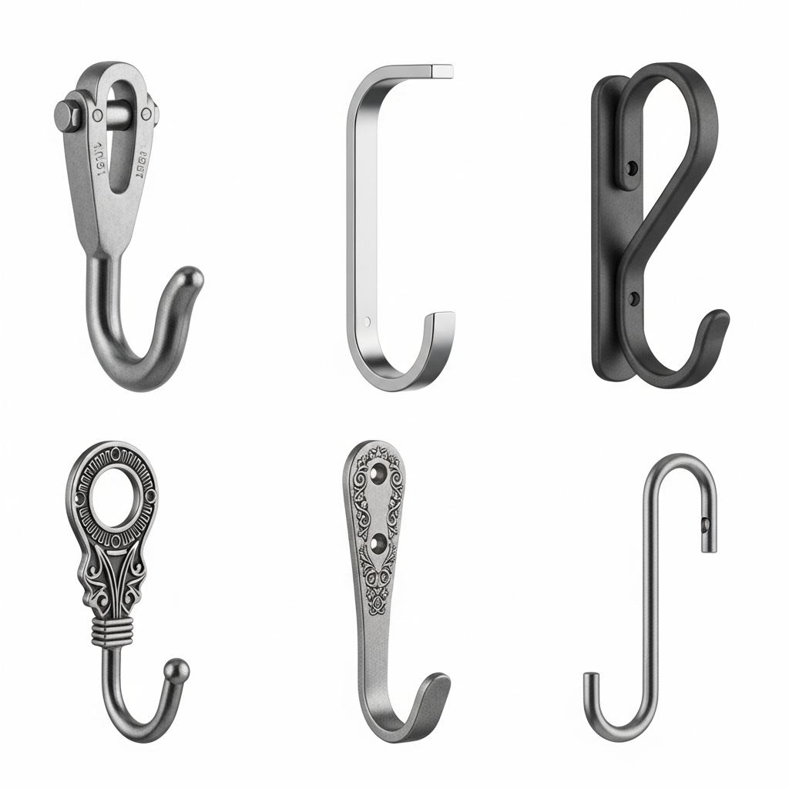
Hang your coat on the hook.
She is looking for a hook.
They have put up a hook.
He used a hook to hang the picture.
We were attaching the hook.
Before, I had not used this type of hook.
You will need a hook.
I am going to buy a hook.
A hook can be strong.
You should hang it on the hook.
I would use a bigger hook.
Hang it on the hook.

------------

## 10. hop v
### định nghĩa
nhảy lò cò (nhảy bằng một chân); nhảy ngắn (động vật nhỏ).
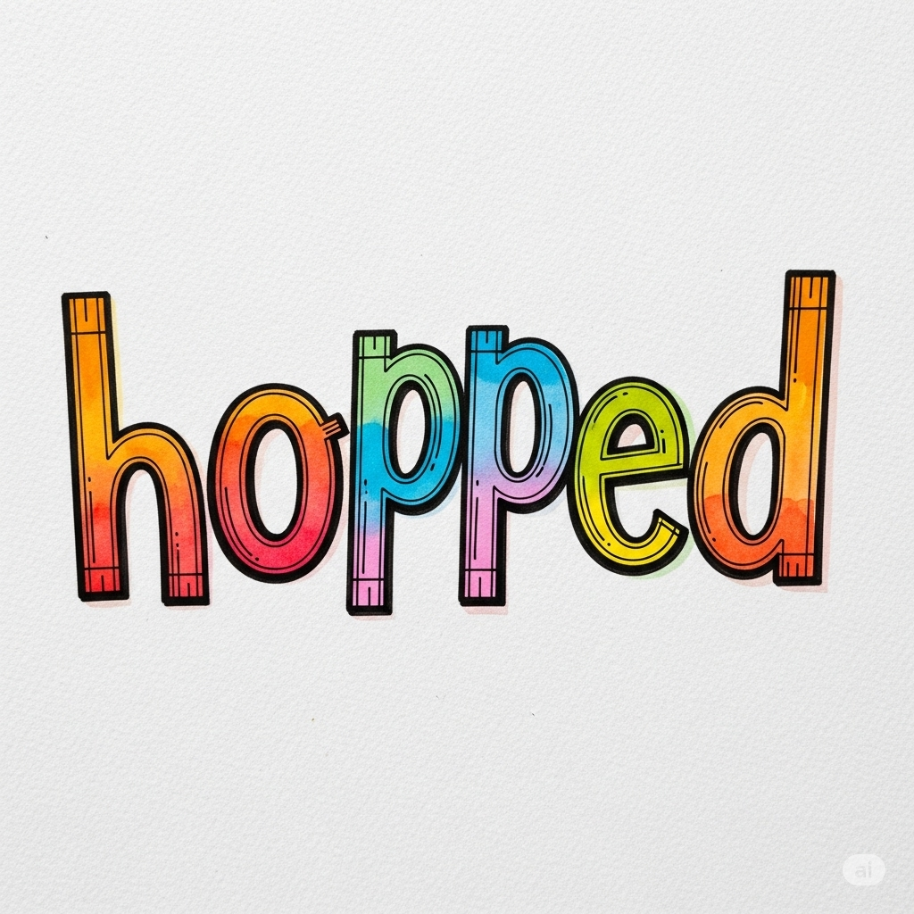
The bird hops on the ground.
She is hopping on one leg.
They have hopped across the line.
He hopped over the puddle.
We were hopping like rabbits.
Before, I had not hopped in years.
You will hop to the finish line.
I am going to hop on the bus.
You can hop quickly.
You should hop if you can't walk.
I would hop if my leg hurt.
Hop on one foot.

------------

## 11. laundry n
### định nghĩa
quần áo cần giặt hoặc đang giặt; tiệm giặt là.
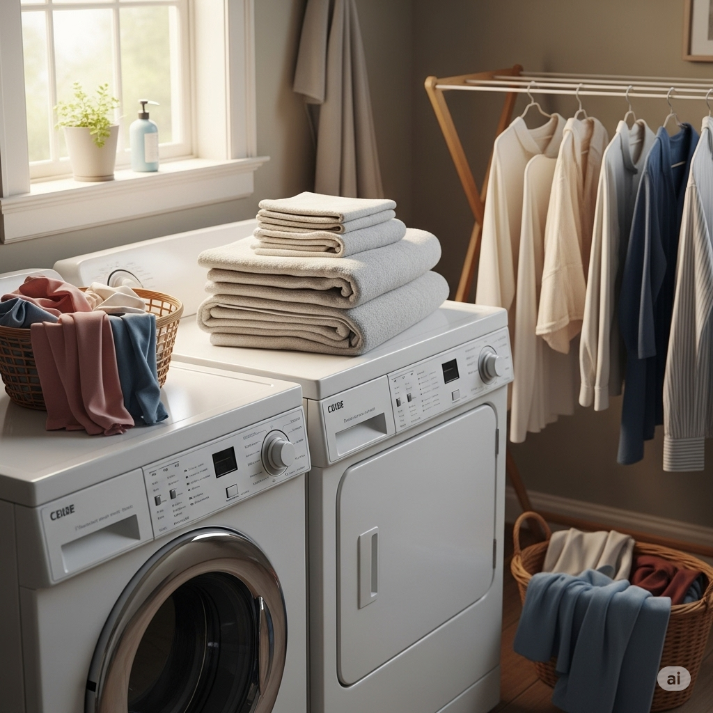
I need to do the laundry.
She is folding the laundry.
They have finished the laundry.
He did the laundry yesterday.
We were sorting the laundry.
Before, I had not done the laundry myself.
You will do the laundry tomorrow.
I am going to take the laundry to the laundromat.
Laundry can pile up.
You should separate the laundry.
I would help you with the laundry.
Do the laundry.

------------

## 12. pursue v
### định nghĩa
theo đuổi (cố gắng đạt được mục tiêu); truy đuổi (ai đó).

He pursues his dreams.
She is pursuing a career in medicine.
They have pursued the suspect.
He pursued his studies diligently.
We were pursuing the truth.
Before, I had not pursued anything seriously.
You will pursue your goals.
I am going to pursue this opportunity.
You can pursue happiness.
You should pursue your passion.
I would pursue that idea further.
Pursue your dreams.

------------

## 13. reluctant adj
### định nghĩa
miễn cưỡng, không sẵn lòng làm điều gì đó.

He is reluctant to go.
She is being reluctant.
They have been reluctant to agree.
He was reluctant to share his food.
We were reluctant to leave.
Before, I had not been so reluctant.
You will be reluctant.
I am going to be reluctant.
You can be reluctant.
You should not be reluctant to try.
I would be reluctant to do that.
He is reluctant.

------------

## 14. sleeve n
### định nghĩa
ống tay áo (phần của quần áo che cánh tay).

His sleeve is torn.
She is rolling up her sleeves.
The shirt has long sleeves.
He wiped his mouth on his sleeve.
We were looking at the sleeves.
Before, I had not noticed the sleeve.
You will tear your sleeve.
I am going to mend the sleeve.
A sleeve can be short or long.
You should roll up your sleeves to work.
I would prefer short sleeves.
Roll up your sleeves.

------------

## 15. spine n
### định nghĩa
xương sống (dãy xương ở lưng); gáy sách (phần dày của sách nơi các trang được gắn vào).
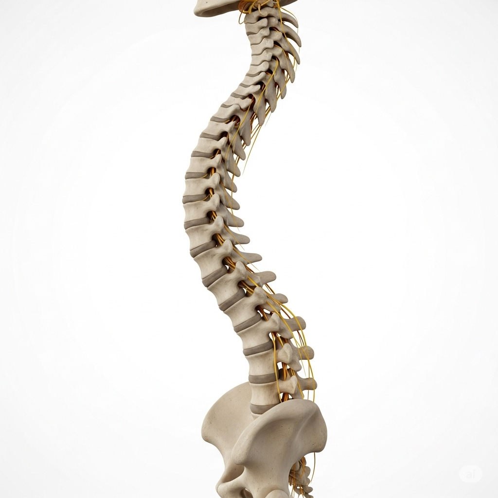
He hurt his spine.
She is reading the title on the spine.
The book has a broken spine.
He felt a chill down his spine.
We were looking at the spines of the books.
Before, I had not injured my spine.
You will feel it in your spine.
I am going to strengthen my spine.
The spine supports the body.
You should protect your spine.
I would check the spine of the book.
Be careful with your spine.

------------

## 16. stain n
### định nghĩa
vết bẩn (vết màu khó làm sạch).
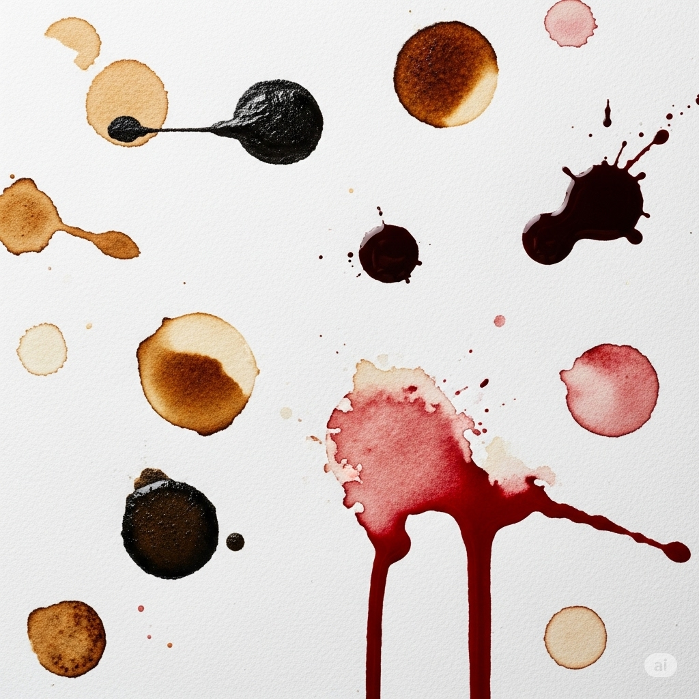
There is a stain on my shirt.
She is trying to remove the stain.
They have found a stain.
He noticed the stain yesterday.
We were cleaning the stain.
Before, I had not seen such a stubborn stain.
You will get a stain.
I am going to clean the stain.
A stain can be hard to remove.
You should treat the stain quickly.
I would use a special cleaner for that stain.
Remove the stain.

------------

## 17. strip n
### định nghĩa
dải, mảnh dài và hẹp.
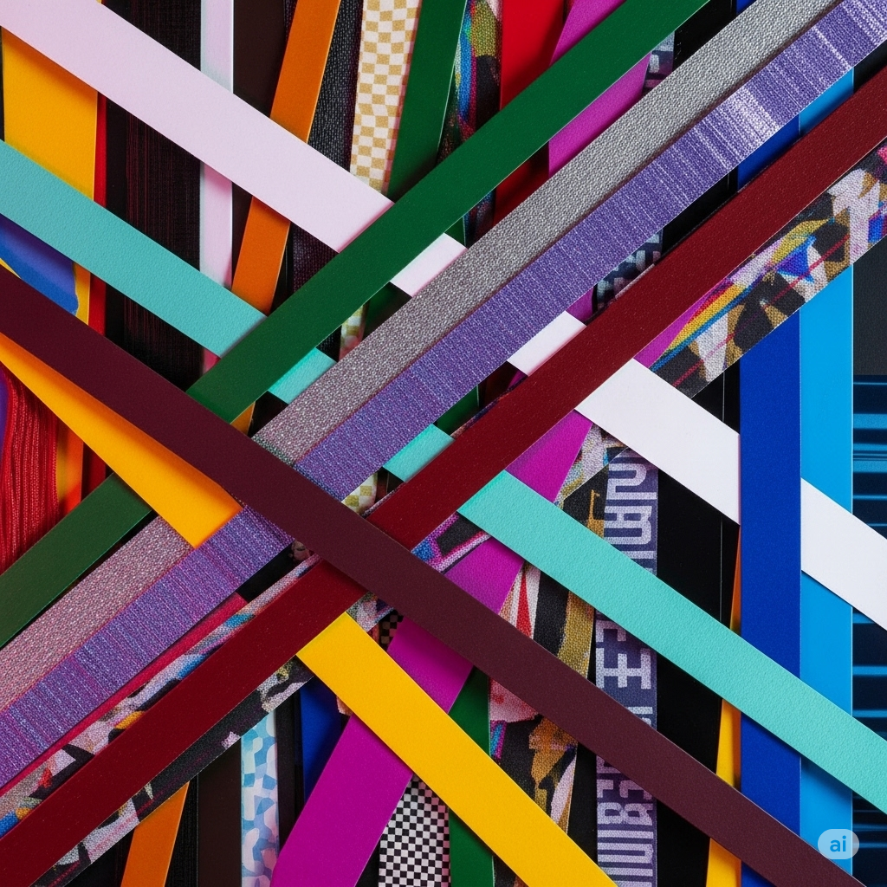
He cut a strip of paper.
She is painting a strip on the wall.
They have put up a strip of wood.
He saw a strip of light.
We were cutting the material into strips.
Before, I had not used a strip like this.
You will need a strip of tape.
I am going to cut a strip.
A strip can be thin.
You should use a long strip.
I would use a strip of fabric.
Cut a strip.

------------

## 18. swear v
### định nghĩa
thề (hứa làm điều gì đó một cách nghiêm túc); chửi rủa (dùng từ ngữ thô tục).
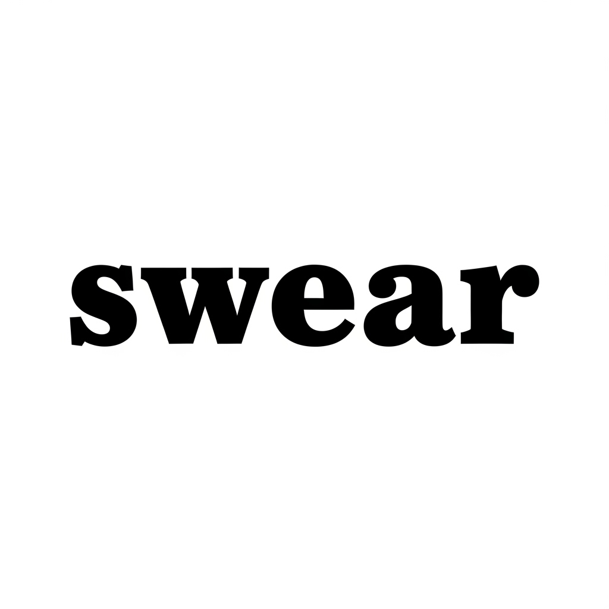
He swears to tell the truth.
She is swearing under her breath.
They have sworn loyalty.
He swore he didn't do it.
We were swearing at the bad driver.
Before, I had not sworn before.
You will swear an oath.
I am going to swear never to do that again.
You can swear on the Bible.
You should not swear in public.
I would swear if I was very angry.
Don't swear.

------------

## 19. swing v
### định nghĩa
đung đưa, lắc lư qua lại.

He swings the bat.
She is swinging on the swing.
They have swung the door open.
He swung his arms as he walked.
We were swinging from the trees.
Before, I had not swung so high.
You will swing the rope.
I am going to swing the bag.
You can swing gently.
You should not swing too hard.
I would swing on the hammock.
Swing the door open.

------------

## 20. utilize v
### định nghĩa
sử dụng, tận dụng (cái gì đó một cách hiệu quả).
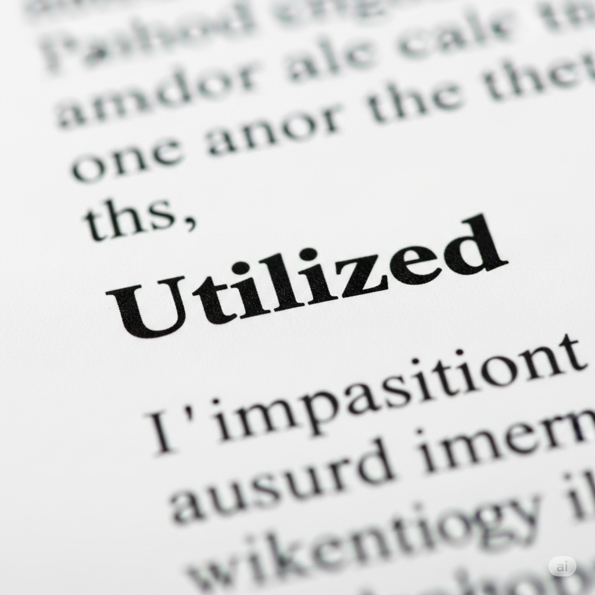
He utilizes his skills.
She is utilizing the resources.
They have utilized the opportunity.
He utilized the tool effectively.
We were utilizing the available space.
Before, I had not utilized it fully.
You will utilize the new system.
I am going to utilize this method.
You can utilize your time well.
You should utilize your strengths.
I would utilize every chance I get.
Utilize your potential.

------------

## THE KITTEN AND THE CATERPILLAR

Katie the kitten liked to play. One day, Cory the **_caterpillar_** **_emerged_** from a hole in the wall while Katie was playing in the living room.

“ Hey!” Katie yelled. “ Do you want to play with me?”

Cory was **_reluctant_**. He said, “ I’d rather not play with you. I have several **_handicaps_**. My body is very **_delicate_**. Your claws are as sharp as **_hooks_**. You might cut me. Plus, I have no bones, not even a **_spine_**. You could easily hurt me.”

“ I **_swear_** that I won’t hurt you,” Katie said.

“ No, I don’t want to,” he said again. He **_hopped_** from the wall, but Katie **_pursued_** him.

Cory ran into the kitchen and into the **_cupboard_**, but Katie chased closely behind. Katie knocked **_appliances_** to the floor. Plates fell into the sink and broke in the **_basin_**.

Then he ran into a bedroom. Some **_laundry_** was on the floor. Cory hid under a shirt, but Katie saw him. She jumped on the shirt. Her paws left **_stains_** on the cloth, and her claws ripped the **_sleeves_** into **_strips_**.

However, Cory escaped. He **_utilized_** a small crack in the floor to hide. But Katie saw him.

“ Now you are trapped!” said Katie.

Cory tried to avoid Katie’s claws. He moved his body as far into the hole as possible. He didn’t know how he’d get out of the hole.

Just then, Katie’s owner came home. She saw that the house was a mess. She took a **_broom_** and **_swung_** it at Katie. She chased Katie out of the house.

Cory was safe, and Katie was left outside because she didn’t listen to the wishes of others.