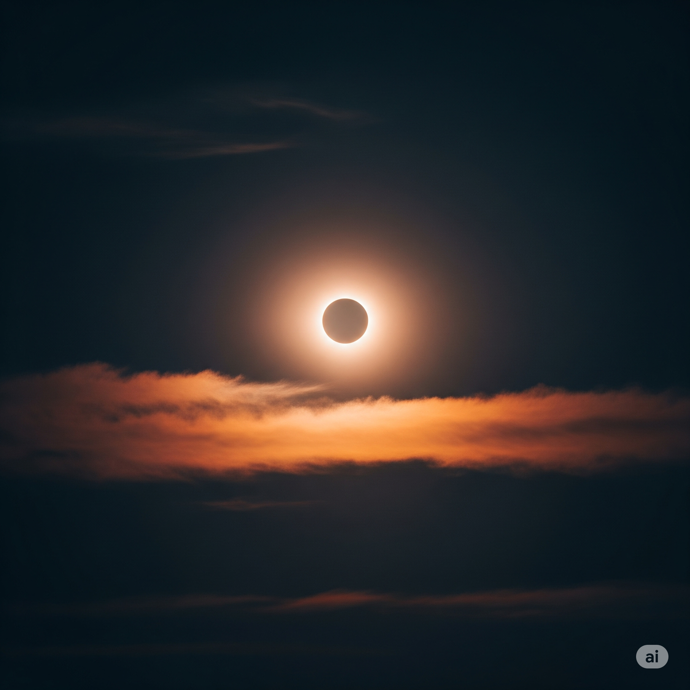

# Essential English Word 3
# Unit 4

## Bloom - v
- To produce flowers. (A1)

- **Examples:**
    - Simple Present: Flowers bloom in the spring.
    - Present Continuous: The roses are blooming now.
    - Simple Past: The cherry blossoms bloomed last week.
    - Past Continuous: The garden was blooming beautifully.
    - Present Perfect: The tulips have bloomed early this year.
    - Past Perfect: The flowers had bloomed before the rain started.
    - Simple Future: The lilies will bloom in July.
    - Future Continuous: The flowers will be blooming all summer.
    - Present Perfect Continuous: The jasmine has been blooming for days.
    - Past Perfect Continuous: The garden had been blooming for weeks before the storm.
    - Future Perfect: All the flowers will have bloomed by the end of June.
    - Future Perfect Continuous: The roses will have been blooming for a month by next week.

- 

## Compact - adj
- Small and not using much space. (A2)

- **Examples:**
    - Simple Present: This car is very compact.
    - Present Continuous: They are making the phone more compact.
    - Simple Past: The apartment was compact but comfortable.
    - Past Continuous: The designer was making the furniture more compact.
    - Present Perfect: The company has made a compact version of the device.
    - Past Perfect: The suitcase had been compact before I added more things.
    - Simple Future: The new model will be more compact.
    - Future Continuous: The engineers will be making the design more compact.
    - Present Perfect Continuous: The team has been working to make the design more compact.
    - Past Perfect Continuous: The engineers had been working to make the design more compact before the deadline.
    - Future Perfect: The design will have become compact by the end of the project.
    - Future Perfect Continuous: The team will have been working to make the design more compact for a month by next week.

- 

## Curl - n
- A round shape in something, especially hair. (A2)

- **Examples:**
    - Simple Present: She has a natural curl in her hair.
    - Present Continuous: The stylist is adding a curl to her hair.
    - Simple Past: The baby had a cute curl on his forehead.
    - Past Continuous: The hairdresser was creating a curl in her hair.
    - Present Perfect: She has added a curl to her hair.
    - Past Perfect: She had a curl in her hair before she straightened it.
    - Simple Future: She will add a curl to her hair.
    - Future Continuous: She will be adding a curl to her hair.
    - Present Perfect Continuous: She has been trying to get a curl in her hair.
    - Past Perfect Continuous: She had been trying to get a curl in her hair before she gave up.
    - Future Perfect: She will have added a curl to her hair by the time she leaves.
    - Future Perfect Continuous: She will have been trying to get a curl in her hair for an hour by then.

- 

## Decay - v
- To be slowly damaged. (A2)

- **Examples:**
    - Simple Present: Teeth decay if you don't brush them.
    - Present Continuous: The wood is decaying in the rain.
    - Simple Past: The fruit decayed quickly in the heat.
    - Past Continuous: The building was decaying over time.
    - Present Perfect: The old house has decayed a lot.
    - Past Perfect: The food had decayed before we found it.
    - Simple Future: The metal will decay if left outside.
    - Future Continuous: The building will be decaying if it is not maintained.
    - Present Perfect Continuous: The wood has been decaying for years.
    - Past Perfect Continuous: The building had been decaying for years before it was renovated.
    - Future Perfect: The wood will have decayed completely by next year.
    - Future Perfect Continuous: The building will have been decaying for a decade by then.

- 

## Dessert - n
- Sweet food eaten at the end of a meal. (A1)

- **Examples:**
    - Simple Present: I like to have dessert after dinner.
    - Present Continuous: We are having dessert now.
    - Simple Past: We ate dessert after the meal.
    - Past Continuous: They were eating dessert when I arrived.
    - Present Perfect: I have already had dessert.
    - Past Perfect: We had finished dessert before the guests arrived.
    - Simple Future: We will have dessert later.
    - Future Continuous: We will be eating dessert soon.
    - Present Perfect Continuous: I have been looking forward to dessert all day.
    - Past Perfect Continuous: We had been waiting for dessert for a long time.
    - Future Perfect: We will have eaten dessert by the time the movie starts.
    - Future Perfect Continuous: We will have been enjoying dessert for an hour by then.

- 

## Dip - v
- To put something into liquid for a short time. (A2)

- **Examples:**
    - Simple Present: I dip my bread in olive oil.
    - Present Continuous: She is dipping her finger in the paint.
    - Simple Past: He dipped the brush in the water.
    - Past Continuous: She was dipping her toes in the pool.
    - Present Perfect: I have dipped the cookies in chocolate.
    - Past Perfect: He had dipped the cloth in water before cleaning.
    - Simple Future: I will dip the vegetables in the sauce.
    - Future Continuous: She will be dipping her brush in the paint.
    - Present Perfect Continuous: I have been dipping the fries in ketchup.
    - Past Perfect Continuous: He had been dipping the cloth in water for a while.
    - Future Perfect: I will have dipped all the vegetables by the time you arrive.
    - Future Perfect Continuous: She will have been dipping her brush in the paint for an hour by then.

- 

## Distant - adj
- Far away. (A1)

- **Examples:**
    - Simple Present: The stars are distant.
    - Present Continuous: The ship is getting more distant.
    - Simple Past: The mountains looked distant.
    - Past Continuous: The island was becoming more distant as we sailed away.
    - Present Perfect: The city has seemed distant since I moved.
    - Past Perfect: The sound had seemed distant before we realized it was close.
    - Simple Future: The destination will be distant.
    - Future Continuous: The shore will be getting more distant.
    - Present Perfect Continuous: The island has been seeming distant for hours.
    - Past Perfect Continuous: The mountains had been seeming distant for a long time.
    - Future Perfect: The destination will have seemed distant by the time we arrive.
    - Future Perfect Continuous: The shore will have been seeming distant for days by then.

- 

## Eclipse - n
- An occasion when the sun or moon cannot be seen because the earth is between them. (A2)

- **Examples:**
    - Simple Present: An eclipse is a rare event.
    - Present Continuous: The moon is eclipsing the sun.
    - Simple Past: There was an eclipse last year.
    - Past Continuous: The moon was eclipsing the sun slowly.
    - Present Perfect: There has been an eclipse this year.
    - Past Perfect: The eclipse had ended before we arrived.
    - Simple Future: There will be an eclipse next year.
    - Future Continuous: The moon will be eclipsing the sun.
    - Present Perfect Continuous: The scientists have been studying the eclipse.
    - Past Perfect Continuous: The scientists had been studying the eclipse for hours.
    - Future Perfect: The eclipse will have ended by the time we wake up.
    - Future Perfect Continuous: The scientists will have been studying the eclipse for days by then.

- 

## Fairy - n
- An imaginary creature with magic powers. (A1)

- **Examples:**
    - Simple Present: Fairies are magical creatures.
    - Present Continuous: The child is dressing up as a fairy.
    - Simple Past: She believed in fairies when she was young.
    - Past Continuous: The children were pretending to be fairies.
    - Present Perfect: She has always loved fairies.
    - Past Perfect: She had believed in fairies before she grew up.
    - Simple Future: She will dress up as a fairy.
    - Future Continuous: She will be dressing up as a fairy.
    - Present Perfect Continuous: She has been reading about fairies.
    - Past Perfect Continuous: She had been dreaming about fairies.
    - Future Perfect: She will have dressed up as a fairy by the time the party starts.
    - Future Perfect Continuous: She will have been pretending to be a fairy for hours by then.

- 

## Grace - n
- A quality of moving in a smooth, relaxed, and attractive way. (A2)

- **Examples:**
    - Simple Present: She moves with grace.
    - Present Continuous: The dancer is showing grace.
    - Simple Past: She danced with grace.
    - Past Continuous: The ballerina was moving with grace.
    - Present Perfect: She has shown grace in her performance.
    - Past Perfect: She had danced with grace before her injury.
    - Simple Future: She will dance with grace.
    - Future Continuous: She will be moving with grace.
    - Present Perfect Continuous: She has been practicing to improve her grace.
    - Past Perfect Continuous: She had been practicing to improve her grace before the show.
    - Future Perfect: She will have danced with grace by the end of the show.
    - Future Perfect Continuous: She will have been dancing with grace for hours by then.

- 

## Leisure - n
- The time when you are not working or doing other duties. (A2)

- **Examples:**
    - Simple Present: I enjoy my leisure time.
    - Present Continuous: He is spending his leisure time reading.
    - Simple Past: We spent our leisure time at the beach.
    - Past Continuous: They were enjoying their leisure time.
    - Present Perfect: I have had a lot of leisure time lately.
    - Past Perfect: We had enjoyed our leisure time before the work started.
    - Simple Future: I will use my leisure time to relax.
    - Future Continuous: I will be spending my leisure time traveling.
    - Present Perfect Continuous: I have been using my leisure time to learn new things.
    - Past Perfect Continuous: We had been enjoying our leisure time before the rain started.
    - Future Perfect: I will have used my leisure time to finish the project.
    - Future Perfect Continuous: I will have been enjoying my leisure time for a week by then.

- 

## Mankind - n
- All humans, considered as a group. (A2)

- **Examples:**
    - Simple Present: Mankind is always learning.
    - Present Continuous: Mankind is facing new challenges.
    - Simple Past: Mankind explored the world.
    - Past Continuous: Mankind was making progress.
    - Present Perfect: Mankind has achieved great things.
    - Past Perfect: Mankind had made many discoveries before the 20th century.
    - Simple Future: Mankind will explore space.
    - Future Continuous: Mankind will be facing new challenges.
    - Present Perfect Continuous: Mankind has been trying to solve the problem.
    - Past Perfect Continuous: Mankind had been trying to understand the universe.
    - Future Perfect: Mankind will have explored other planets by then.
    - Future Perfect Continuous: Mankind will have been trying to solve the problem for centuries by then.

- 

## Passion - n
- A very strong feeling. (A2)

- **Examples:**
    - Simple Present: She has a passion for music.
    - Present Continuous: He is showing his passion for art.
    - Simple Past: She spoke with passion.
    - Past Continuous: He was expressing his passion for the subject.
    - Present Perfect: She has always had a passion for dance.
    - Past Perfect: She had shown passion for her work before she retired.
    - Simple Future: She will follow her passion.
    - Future Continuous: She will be pursuing her passion.
    - Present Perfect Continuous: She has been studying with passion.
    - Past Perfect Continuous: She had been working with passion before she got sick.
    - Future Perfect: She will have achieved her goals through passion.
    - Future Perfect Continuous: She will have been working with passion for years by then.

- 

## Pillow - n
- A soft object used to support your head when you are lying down. (A1)

- **Examples:**
    - Simple Present: I use a pillow when I sleep.
    - Present Continuous: She is putting her head on the pillow.
    - Simple Past: I slept on a soft pillow.
    - Past Continuous: She was resting her head on the pillow.
    - Present Perfect: I have used this pillow for years.
    - Past Perfect: I had used that pillow before I bought a new one.
    - Simple Future: I will use a pillow tonight.
    - Future Continuous: She will be resting her head on the pillow.
    - Present Perfect Continuous: I have been using this pillow for a long time.
    - Past Perfect Continuous: I had been using that pillow for years before I replaced it.
    - Future Perfect: I will have used the pillow by the time I wake up.
    - Future Perfect Continuous: I will have been using the pillow all night.

- 

## Pulse - n
- The regular beating of blood in your body. (A2)

- **Examples:**
    - Simple Present: The doctor checks my pulse.
    - Present Continuous: The nurse is feeling his pulse.
    - Simple Past: The doctor felt my pulse.
    - Past Continuous: The nurse was checking his pulse.
    - Present Perfect: The doctor has checked my pulse.
    - Past Perfect: The nurse had checked his pulse before the surgery.
    - Simple Future: The doctor will check my pulse.
    - Future Continuous: The nurse will be checking his pulse.
    - Present Perfect Continuous: The doctor has been monitoring his pulse.
    - Past Perfect Continuous: The nurse had been monitoring his pulse for hours.
    - Future Perfect: The doctor will have checked my pulse by the end of the exam.
    - Future Perfect Continuous: The nurse will have been monitoring his pulse for hours by then.

- 

## Refresh - v
- To make someone feel less hot or tired. (A2)

- **Examples:**
    - Simple Present: A cold drink refreshes me.
    - Present Continuous: The rain is refreshing the garden.
    - Simple Past: The shower refreshed me.
    - Past Continuous: The rain was refreshing the earth.
    - Present Perfect: The drink has refreshed me.
    - Past Perfect: The shower had refreshed me before I went out.
    - Simple Future: The drink will refresh me.
    - Future Continuous: The rain will be refreshing the garden.
    - Present Perfect Continuous: The water has been refreshing the plants.
    - Past Perfect Continuous: The rain had been refreshing the earth for hours.
    - Future Perfect: The drink will have refreshed me by the time I finish.
    - Future Perfect Continuous: The rain will have been refreshing the garden for hours by then.

- 

## Sneeze - v
- To suddenly blow air out through your nose and mouth. (A2)

- **Examples:**
    - Simple Present: I sneeze when I have a cold.
    - Present Continuous: He is sneezing because of the dust.
    - Simple Past: I sneezed loudly.
    - Past Continuous: He was sneezing all morning.
    - Present Perfect: I have sneezed three times today.
    - Past Perfect: I had sneezed before I took the medicine.
    - Simple Future: I will sneeze if I smell pepper.
    - Future Continuous: He will be sneezing if he stays outside.
    - Present Perfect Continuous: I have been sneezing all day.
    - Past Perfect Continuous: He had been sneezing for hours before he took medicine.
    - Future Perfect: I will have sneezed by the time I get home.
    - Future Perfect Continuous: He will have been sneezing all day by the time he sees a doctor.

- 

## Spice - n
- A substance made from a plant, used to give a special taste to food. (A2)

- **Examples:**
    - Simple Present: I add spice to my food.
    - Present Continuous: She is adding spice to the soup.
    - Simple Past: I used spice in the recipe.
    - Past Continuous: She was adding spice to the dish.
    - Present Perfect: I have added spice to the meal.
    - Past Perfect: I had added spice before I tasted the food.
    - Simple Future: I will add spice to the curry.
    - Future Continuous: She will be adding spice to the sauce.
    - Present Perfect Continuous: I have been using spice in my cooking.
    - Past Perfect Continuous: She had been adding spice to the dish for a while.
    - Future Perfect: I will have added spice by the time the food is ready.
    - Future Perfect Continuous: She will have been adding spice to the sauce for an hour by then.

- 

## Whistle - v
- To make a high sound by forcing air through a small hole made with your lips, or between your teeth. (A2)

- **Examples:**
    - Simple Present: He can whistle a tune.
    - Present Continuous: She is whistling a song.
    - Simple Past: He whistled to get attention.
    - Past Continuous: She was whistling while she worked.
    - Present Perfect: He has learned to whistle.
    - Past Perfect: He had whistled before he spoke.
    - Simple Future: He will whistle for the dog.
    - Future Continuous: She will be whistling while she walks.
    - Present Perfect Continuous: He has been whistling all morning.
    - Past Perfect Continuous: She had been whistling for a long time.
    - Future Perfect: He will have whistled by the time the show starts.
    - Future Perfect Continuous: She will have been whistling for an hour by then.

- 

## Wool - n
- The soft, thick hair of a sheep. (A1)

- **Examples:**
    - Simple Present: Wool keeps you warm.
    - Present Continuous: She is knitting with wool.
    - Simple Past: I bought a wool sweater.
    - Past Continuous: She was knitting with wool.
    - Present Perfect: I have worn wool socks.
    - Past Perfect: I had worn wool gloves before it got warmer.
    - Simple Future: I will buy a wool coat.
    - Future Continuous: She will be knitting with wool.
    - Present Perfect Continuous: I have been wearing wool socks all winter.
    - Past Perfect Continuous: She had been knitting with wool for hours.
    - Future Perfect: I will have bought a wool coat by winter.
    - Future Perfect Continuous: She will have been knitting with wool for weeks by then.

- 