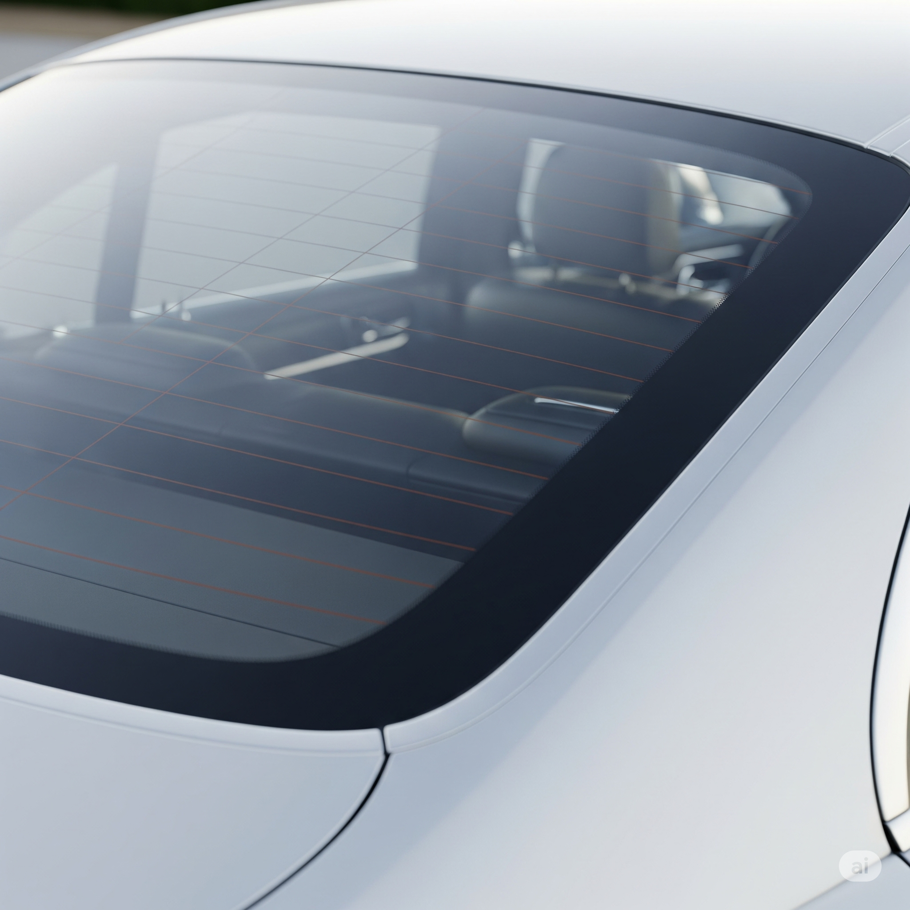
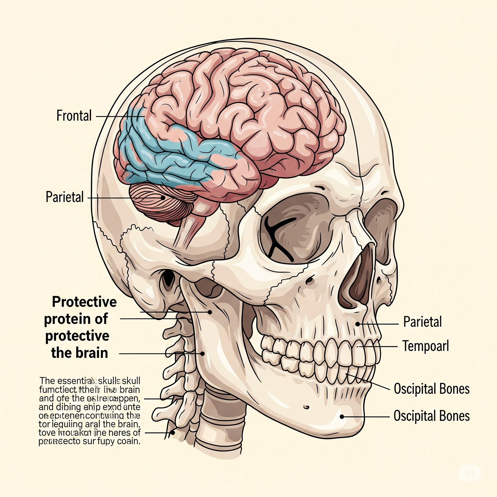

# Essential English Word 3
## Unit 6

## Từ vựng

- **Alert** (v): To tell someone about danger.
  - Định nghĩa: To tell someone to be careful because something bad might happen.
  - Hình minh họa: 
  - Ví dụ:
    - Simple Present: I alert my friend when I see a car coming.
    - Present Continuous: I am alerting my friend about the dog.
    - Simple Past: I alerted my mom when I saw the fire.
    - Past Continuous: I was alerting my friend when the thief came.
    - Simple Future: I will alert my dad when the rain comes.
    - Future Continuous: I will be alerting my mom when the storm comes.
    - Present Perfect: I have alerted my friend about the test.
    - Past Perfect: I had alerted my mom before the fire started.
    - Future Perfect: I will have alerted my friend before the class starts.
    - Present Perfect Continuous: I have been alerting my friend about the danger.
    - Past Perfect Continuous: I had been alerting my friend before he got hurt.
    - Future Perfect Continuous: I will have been alerting my friend for hours before he understands.

- **Broadcast** (n): A TV or radio show.
  - Định nghĩa: A show on TV or radio that many people can watch or listen to.
  - Hình minh họa: 
  - Ví dụ:
    - Simple Present: I watch the broadcast every day.
    - Present Continuous: I am watching the broadcast now.
    - Simple Past: I watched the broadcast yesterday.
    - Past Continuous: I was watching the broadcast when you called.
    - Simple Future: I will watch the broadcast tomorrow.
    - Future Continuous: I will be watching the broadcast at 8 PM.
    - Present Perfect: I have watched the broadcast many times.
    - Past Perfect: I had watched the broadcast before I went to bed.
    - Future Perfect: I will have watched the broadcast by the time you arrive.
    - Present Perfect Continuous: I have been watching the broadcast for an hour.
    - Past Perfect Continuous: I had been watching the broadcast before I fell asleep.
    - Future Perfect Continuous: I will have been watching the broadcast for two hours when it ends.

- **Bulletin** (n): A short news report.
  - Định nghĩa: A short piece of news that tells you important information.
  - Hình minh họa: 
  - Ví dụ:
    - Simple Present: I read the bulletin every morning.
    - Present Continuous: I am reading the bulletin now.
    - Simple Past: I read the bulletin yesterday.
    - Past Continuous: I was reading the bulletin when the phone rang.
    - Simple Future: I will read the bulletin tomorrow.
    - Future Continuous: I will be reading the bulletin at lunch.
    - Present Perfect: I have read the bulletin already.
    - Past Perfect: I had read the bulletin before the meeting.
    - Future Perfect: I will have read the bulletin by tomorrow.
    - Present Perfect Continuous: I have been reading the bulletin for 10 minutes.
    - Past Perfect Continuous: I had been reading the bulletin before you came.
    - Future Perfect Continuous: I will have been reading the bulletin for an hour when you arrive.

- **Bump** (n): A raised part on a surface.
  - Định nghĩa: A small, raised area on a surface.
  - Hình minh họa: 
  - Ví dụ:
    - Simple Present: The road has a bump.
    - Present Continuous: The car is bumping on the road.
    - Simple Past: I bumped my head on the door.
    - Past Continuous: I was bumping into things in the dark.
    - Simple Future: I will bump into something if I don't look.
    - Future Continuous: The car will be bumping along the road.
    - Present Perfect: I have bumped my knee.
    - Past Perfect: I had bumped my head before.
    - Future Perfect: I will have bumped into everything by the time I leave.
    - Present Perfect Continuous: I have been bumping into things all day.
    - Past Perfect Continuous: I had been bumping into things before I turned on the light.
    - Future Perfect Continuous: I will have been bumping into things for hours by the time I find my way.

- **Chop** (v): To cut something into pieces with a sharp tool.
  - Định nghĩa: To cut something into smaller pieces using a knife or axe.
  - Hình minh họa: 
  - Ví dụ:
    - Simple Present: I chop vegetables every day.
    - Present Continuous: I am chopping wood now.
    - Simple Past: I chopped the carrots yesterday.
    - Past Continuous: I was chopping onions when I started to cry.
    - Simple Future: I will chop the lettuce for the salad.
    - Future Continuous: I will be chopping the vegetables at 6 PM.
    - Present Perfect: I have chopped all the wood.
    - Past Perfect: I had chopped the vegetables before the guests arrived.
    - Future Perfect: I will have chopped the wood by the time it gets dark.
    - Present Perfect Continuous: I have been chopping vegetables for an hour.
    - Past Perfect Continuous: I had been chopping wood before it started raining.
    - Future Perfect Continuous: I will have been chopping vegetables for hours when dinner is ready.

- **Closet** (n): A small room or space for storing things.
  - Định nghĩa: A small room or space where you keep your clothes and other things.
  - Hình minh họa: 
  - Ví dụ:
    - Simple Present: I keep my clothes in the closet.
    - Present Continuous: I am cleaning the closet now.
    - Simple Past: I cleaned the closet yesterday.
    - Past Continuous: I was cleaning the closet when you called.
    - Simple Future: I will organize the closet tomorrow.
    - Future Continuous: I will be organizing the closet all day.
    - Present Perfect: I have organized the closet.
    - Past Perfect: I had organized the closet before winter.
    - Future Perfect: I will have organized the closet by next week.
    - Present Perfect Continuous: I have been cleaning the closet for an hour.
    - Past Perfect Continuous: I had been cleaning the closet before you came.
    - Future Perfect Continuous: I will have been cleaning the closet for hours when I finish.

- **Console** (v): To give comfort to someone who is sad.
  - Định nghĩa: To make someone feel better when they are sad or upset.
  - Hình minh họa: 
  - Ví dụ:
    - Simple Present: I console my friend when she is sad.
    - Present Continuous: I am consoling my friend now.
    - Simple Past: I consoled my friend yesterday.
    - Past Continuous: I was consoling my friend when she cried.
    - Simple Future: I will console my friend tomorrow.
    - Future Continuous: I will be consoling my friend later.
    - Present Perfect: I have consoled my friend.
    - Past Perfect: I had consoled my friend before she left.
    - Future Perfect: I will have consoled my friend by tomorrow.
    - Present Perfect Continuous: I have been consoling my friend for hours.
    - Past Perfect Continuous: I had been consoling my friend before you came.
    - Future Perfect Continuous: I will have been consoling my friend for a long time when she feels better.

- **District** (n): An area or region.
  - Định nghĩa: A part of a city or country.
  - Hình minh họa: 
  - Ví dụ:
    - Simple Present: I live in this district.
    - Present Continuous: They are building a new school in this district.
    - Simple Past: I visited that district last year.
    - Past Continuous: They were building a new road in the district.
    - Simple Future: I will move to a new district next year.
    - Future Continuous: They will be building a new hospital in the district.
    - Present Perfect: I have lived in this district for 10 years.
    - Past Perfect: I had lived in that district before I moved here.
    - Future Perfect: I will have lived in this district for 20 years by 2045.
    - Present Perfect Continuous: I have been living in this district since I was born.
    - Past Perfect Continuous: I had been living in that district before I moved.
    - Future Perfect Continuous: I will have been living in this district for a long time when I retire.

- **Drawer** (n): A sliding box that is part of a piece of furniture.
  - Định nghĩa: A part of furniture that you can pull out and push in, used for keeping things.
  - Hình minh họa: 
  - Ví dụ:
    - Simple Present: I keep my socks in the drawer.
    - Present Continuous: I am opening the drawer now.
    - Simple Past: I opened the drawer yesterday.
    - Past Continuous: I was opening the drawer when the phone rang.
    - Simple Future: I will close the drawer later.
    - Future Continuous: I will be organizing the drawers tomorrow.
    - Present Perfect: I have cleaned the drawer.
    - Past Perfect: I had closed the drawer before I left.
    - Future Perfect: I will have organized the drawers by next week.
    - Present Perfect Continuous: I have been looking in the drawer for 10 minutes.
    - Past Perfect Continuous: I had been searching in the drawer before I found it.
    - Future Perfect Continuous: I will have been looking in the drawer for an hour when I find it.

- **Endure** (v): To suffer something difficult for a long time.
  - Định nghĩa: To go through something hard or painful for a long time without giving up.
  - Hình minh họa: 
  - Ví dụ:
    - Simple Present: I endure the pain.
    - Present Continuous: I am enduring the cold weather.
    - Simple Past: I endured the long journey.
    - Past Continuous: I was enduring the pain when the doctor came.
    - Simple Future: I will endure the hardship.
    - Future Continuous: I will be enduring the exam tomorrow.
    - Present Perfect: I have endured many challenges.
    - Past Perfect: I had endured the storm before it stopped.
    - Future Perfect: I will have endured the training by next month.
    - Present Perfect Continuous: I have been enduring the noise for hours.
    - Past Perfect Continuous: I had been enduring the cold before I found shelter.
    - Future Perfect Continuous: I will have been enduring the wait for a long time when they arrive.

- **Execute** (v): To do something, especially something planned.
  - Định nghĩa: To do something that you have planned to do.
  - Hình minh họa: 
  - Ví dụ:
    - Simple Present: I execute my tasks every day.
    - Present Continuous: I am executing the plan now.
    - Simple Past: I executed the project successfully.
    - Past Continuous: I was executing the plan when the problem occurred.
    - Simple Future: I will execute the project tomorrow.
    - Future Continuous: I will be executing the plan all day.
    - Present Perfect: I have executed the task.
    - Past Perfect: I had executed the plan before the deadline.
    - Future Perfect: I will have executed the project by next week.
    - Present Perfect Continuous: I have been executing the plan for hours.
    - Past Perfect Continuous: I had been executing the plan before the meeting.
    - Future Perfect Continuous: I will have been executing the plan for a long time when it is finished.

- **Grasp** (v): To understand something.
  - Định nghĩa: To understand something, especially something difficult.
  - Hình minh họa: 
  - Ví dụ:
    - Simple Present: I grasp the concept.
    - Present Continuous: I am grasping the idea now.
    - Simple Past: I grasped the meaning of the poem.
    - Past Continuous: I was grasping the concept when you explained it.
    - Simple Future: I will grasp the lesson tomorrow.
    - Future Continuous: I will be grasping the concept during the class.
    - Present Perfect: I have grasped the idea.
    - Past Perfect: I had grasped the concept before the test.
    - Future Perfect: I will have grasped the lesson by next week.
    - Present Perfect Continuous: I have been grasping the concept for hours.
    - Past Perfect Continuous: I had been grasping the idea before I understood it.
    - Future Perfect Continuous: I will have been grasping the concept for a long time when I understand it fully.

- **Rear** (n): The back part of something.
  - Định nghĩa: The back part of something, like a car or a building.
  - Hình minh họa: 
  - Ví dụ:
    - Simple Present: The car has a rear window.
    - Present Continuous: The cat is sitting at the rear of the house.
    - Simple Past: I looked at the rear of the car.
    - Past Continuous: The dog was sitting at the rear of the house.
    - Simple Future: I will check the rear of the car.
    - Future Continuous: The kids will be playing at the rear of the house.
    - Present Perfect: I have cleaned the rear window.
    - Past Perfect: I had checked the rear of the car before driving.
    - Future Perfect: I will have cleaned the rear of the car by tomorrow.
    - Present Perfect Continuous: I have been looking at the rear of the house for a while.
    - Past Perfect Continuous: I had been checking the rear of the car before the trip.
    - Future Perfect Continuous: I will have been watching the rear of the house for hours when they arrive.

- **Senator** (n): A member of a senate.
  - Định nghĩa: A person who is elected to make laws in a senate.
  - Hình minh họa: 
  - Ví dụ:
    - Simple Present: The senator votes on laws.
    - Present Continuous: The senator is speaking now.
    - Simple Past: The senator voted yesterday.
    - Past Continuous: The senator was speaking when the protest started.
    - Simple Future: The senator will vote tomorrow.
    - Future Continuous: The senator will be speaking at the meeting.
    - Present Perfect: The senator has voted on many laws.
    - Past Perfect: The senator had voted before the meeting ended.
    - Future Perfect: The senator will have voted by next week.
    - Present Perfect Continuous: The senator has been speaking for an hour.
    - Past Perfect Continuous: The senator had been working before the meeting.
    - Future Perfect Continuous: The senator will have been working for a long time when the law passes.

- **Skull** (n): The bone that protects the brain.
  - Định nghĩa: The bone in your head that protects your brain.
  - Hình minh họa: 
  - Ví dụ:
    - Simple Present: The skull protects the brain.
    - Present Continuous: The doctor is studying the skull.
    - Simple Past: The scientist examined the skull.
    - Past Continuous: The doctor was studying the skull when the light went out.
    - Simple Future: The doctor will examine the skull tomorrow.
    - Future Continuous: The doctor will be studying the skull all day.
    - Present Perfect: The doctor has studied the skull.
    - Past Perfect: The doctor had studied the skull before the class.
    - Future Perfect: The doctor will have studied the skull by next week.
    - Present Perfect Continuous: The doctor has been studying the skull for hours.
    - Past Perfect Continuous: The doctor had been studying the skull before the lecture.
    - Future Perfect Continuous: The doctor will have been studying the skull for a long time when he understands it fully.

- **Stir** (v): To mix something by moving a spoon or stick around in it.
  - Định nghĩa: To mix food or liquid by moving a spoon or other tool around and around.
  - Hình minh họa: 
  - Ví dụ:
    - Simple Present: I stir the soup.
    - Present Continuous: I am stirring the coffee.
    - Simple Past: I stirred the sauce.
    - Past Continuous: I was stirring the soup when the phone rang.
    - Simple Future: I will stir the tea.
    - Future Continuous: I will be stirring the soup later.
    - Present Perfect: I have stirred the paint.
    - Past Perfect: I had stirred the drink before serving it.
    - Future Perfect: I will have stirred the mixture by tomorrow.
    - Present Perfect Continuous: I have been stirring the sauce for 10 minutes.
    - Past Perfect Continuous: I had been stirring the soup before you came.
    - Future Perfect Continuous: I will have been stirring the mixture for a long time when it is ready.

- **Tap** (v): To hit something lightly.
  - Định nghĩa: To hit something gently and quickly.
  - Hình minh họa: 
  - Ví dụ:
    - Simple Present: I tap the table.
    - Present Continuous: I am tapping my foot.
    - Simple Past: I tapped the door.
    - Past Continuous: I was tapping my fingers when I was bored.
    - Simple Future: I will tap the glass.
    - Future Continuous: I will be tapping the rhythm.
    - Present Perfect: I have tapped the screen.
    - Past Perfect: I had tapped the desk before the teacher saw me.
    - Future Perfect: I will have tapped the code by tomorrow.
    - Present Perfect Continuous: I have been tapping my foot for a while.
    - Past Perfect Continuous: I had been tapping my fingers before you told me to stop.
    - Future Perfect Continuous: I will have been tapping the code for hours when it works.

- **Tremendous** (adj): Very large or great.
  - Định nghĩa: Very big or very good.
  - Hình minh họa: 
  - Ví dụ:
    - Simple Present: The building is tremendous.
    - Present Continuous: The team is showing tremendous effort.
    - Simple Past: The party was tremendous.
    - Past Continuous: The team was showing tremendous improvement.
    - Simple Future: The view will be tremendous.
    - Future Continuous: The team will be showing tremendous progress.
    - Present Perfect: The movie has been a tremendous success.
    - Past Perfect: The show had been a tremendous hit.
    - Future Perfect: The project will have been a tremendous achievement.
    - Present Perfect Continuous: The team has been showing tremendous dedication.
    - Past Perfect Continuous: The show had been receiving tremendous praise.
    - Future Perfect Continuous: The project will have been showing tremendous results.

- **Underneath** (prep): Below or under something.
  - Định nghĩa: Below something else.
  - Hình minh họa: 
  - Ví dụ:
    - Simple Present: The cat is underneath the table.
    - Present Continuous: The dog is hiding underneath the bed.
    - Simple Past: I found the key underneath the rug.
    - Past Continuous: The cat was hiding underneath the car.
    - Simple Future: I will look underneath the sofa.
    - Future Continuous: The kids will be hiding underneath the blanket.
    - Present Perfect: I have looked underneath the chair.
    - Past Perfect: I had hidden the gift underneath the bed.
    - Future Perfect: I will have looked underneath the table by tomorrow.
    - Present Perfect Continuous: I have been searching underneath the furniture for hours.
    - Past Perfect Continuous: I had been hiding underneath the covers before you found me.
    - Future Perfect Continuous: I will have been searching underneath the furniture for a long time when I find it.

- **Worm** (n): A long, thin animal with no legs.
  - Định nghĩa: A small, long, and soft animal that lives in the ground.
  - Hình minh họa: 
  - Ví dụ:
    - Simple Present: The worm lives in the soil.
    - Present Continuous: The worm is crawling on the ground.
    - Simple Past: I saw a worm in the garden.
    - Past Continuous: The worm was crawling when I saw it.
    - Simple Future: I will see a worm tomorrow.
    - Future Continuous: The worm will be crawling in the garden.
    - Present Perfect: I have seen a worm.
    - Past Perfect: I had seen a worm before.
    - Future Perfect: I will have seen a worm by tomorrow.
    - Present Perfect Continuous: I have been watching the worm for a while.
    - Past Perfect Continuous: I had been watching the worm before it went into the ground.
    - Future Perfect Continuous: I will have been watching the worm for a long time when it disappears.