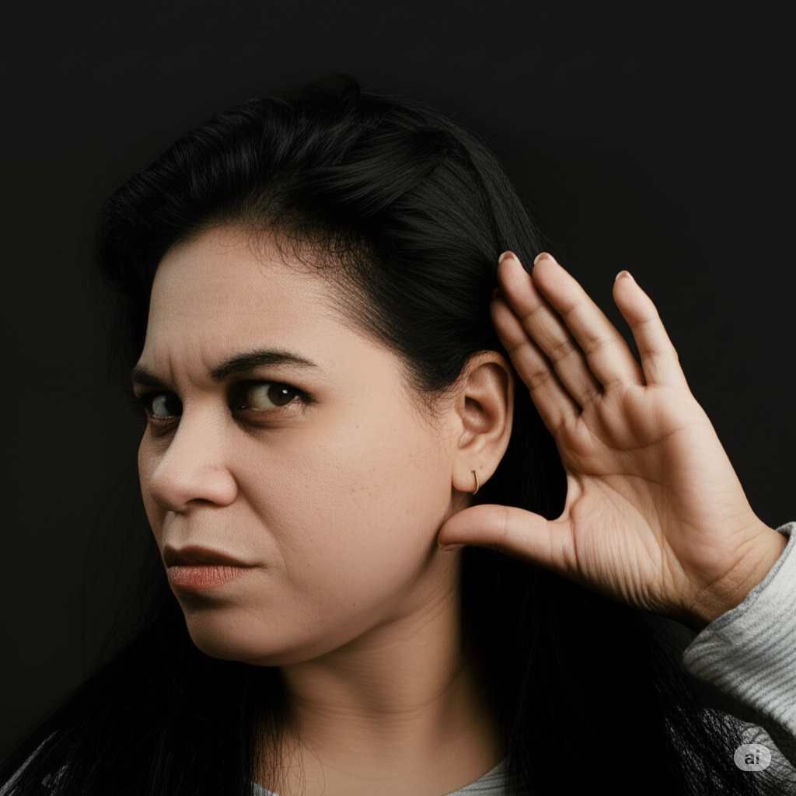

# Essential English Word 3
## Unit 7

## Từ vựng

- **Abandon** (v): To leave someone or something behind.
  - Định nghĩa: To leave a place or person, usually forever.
  - Hình minh họa: 
  - Ví dụ:
    - Simple Present: I abandon the game.
    - Present Continuous: I am abandoning my old toys.
    - Simple Past: I abandoned my old house.
    - Past Continuous: I was abandoning my old clothes.
    - Simple Future: I will abandon my bad habits.
    - Future Continuous: I will be abandoning the old project.
    - Present Perfect: I have abandoned the old plan.
    - Past Perfect: I had abandoned the old car.
    - Future Perfect: I will have abandoned the old ways.
    - Present Perfect Continuous: I have been abandoning old ideas.
    - Past Perfect Continuous: I had been abandoning old things.
    - Future Perfect Continuous: I will have been abandoning the old stuff.

- **Ambitious** (adj): Wanting to be successful or powerful.
  - Định nghĩa: Wanting to be rich or famous.
  - Hình minh họa: 
  - Ví dụ:
    - Simple Present: I am ambitious.
    - Present Continuous: I am being ambitious.
    - Simple Past: I was ambitious.
    - Past Continuous: I was being ambitious.
    - Simple Future: I will be ambitious.
    - Future Continuous: I will be being ambitious.
    - Present Perfect: I have been ambitious.
    - Past Perfect: I had been ambitious.
    - Future Perfect: I will have been ambitious.
    - Present Perfect Continuous: I have been being ambitious.
    - Past Perfect Continuous: I had been being ambitious.
    - Future Perfect Continuous: I will have been being ambitious.

- **Bark** (v): When a dog makes a loud noise.
  - Định nghĩa: The sound a dog makes.
  - Hình minh họa: 
  - Ví dụ:
    - Simple Present: The dog barks.
    - Present Continuous: The dog is barking.
    - Simple Past: The dog barked.
    - Past Continuous: The dog was barking.
    - Simple Future: The dog will bark.
    - Future Continuous: The dog will be barking.
    - Present Perfect: The dog has barked.
    - Past Perfect: The dog had barked.
    - Future Perfect: The dog will have barked.
    - Present Perfect Continuous: The dog has been barking.
    - Past Perfect Continuous: The dog had been barking.
    - Future Perfect Continuous: The dog will have been barking.

- **Bay** (n): A part of the ocean that is next to land.
  - Định nghĩa: A small area of sea next to the land.
  - Hình minh họa: 
  - Ví dụ:
    - Simple Present: The bay is beautiful.
    - Present Continuous: I am sailing in the bay.
    - Simple Past: I swam in the bay.
    - Past Continuous: I was swimming in the bay.
    - Simple Future: I will swim in the bay.
    - Future Continuous: I will be swimming in the bay.
    - Present Perfect: I have sailed in the bay.
    - Past Perfect: I had sailed in the bay.
    - Future Perfect: I will have sailed in the bay.
    - Present Perfect Continuous: I have been sailing in the bay.
    - Past Perfect Continuous: I had been sailing in the bay.
    - Future Perfect Continuous: I will have been sailing in the bay.

- **Brilliant** (adj): Very smart or clever.
  - Định nghĩa: Very clever or bright.
  - Hình minh họa: 
  - Ví dụ:
    - Simple Present: I am brilliant.
    - Present Continuous: I am being brilliant.
    - Simple Past: I was brilliant.
    - Past Continuous: I was being brilliant.
    - Simple Future: I will be brilliant.
    - Future Continuous: I will be being brilliant.
    - Present Perfect: I have been brilliant.
    - Past Perfect: I had been brilliant.
    - Future Perfect: I will have been brilliant.
    - Present Perfect Continuous: I have been being brilliant.
    - Past Perfect Continuous: I had been being brilliant.
    - Future Perfect Continuous: I will have been being brilliant.

- **Chin** (n): The part of your face below your mouth.
  - Định nghĩa: The part of your face under your mouth.
  - Hình minh họa: 
  - Ví dụ:
    - Simple Present: I touch my chin.
    - Present Continuous: I am touching my chin.
    - Simple Past: I touched my chin.
    - Past Continuous: I was touching my chin.
    - Simple Future: I will touch my chin.
    - Future Continuous: I will be touching my chin.
    - Present Perfect: I have touched my chin.
    - Past Perfect: I had touched my chin.
    - Future Perfect: I will have touched my chin.
    - Present Perfect Continuous: I have been touching my chin.
    - Past Perfect Continuous: I had been touching my chin.
    - Future Perfect Continuous: I will have been touching my chin.

- **Complaint** (n): When you say you are not happy about something.
  - Định nghĩa: Saying that you don't like something.
  - Hình minh họa: 
  - Ví dụ:
    - Simple Present: I have a complaint.
    - Present Continuous: I am making a complaint.
    - Simple Past: I made a complaint.
    - Past Continuous: I was making a complaint.
    - Simple Future: I will make a complaint.
    - Future Continuous: I will be making a complaint.
    - Present Perfect: I have made a complaint.
    - Past Perfect: I had made a complaint.
    - Future Perfect: I will have made a complaint.
    - Present Perfect Continuous: I have been making a complaint.
    - Past Perfect Continuous: I had been making a complaint.
    - Future Perfect Continuous: I will have been making a complaint.

- **Deaf** (adj): Not able to hear.
  - Định nghĩa: Not able to hear sounds.
  - Hình minh họa: 
  - Ví dụ:
    - Simple Present: I am deaf.
    - Present Continuous: I am becoming deaf.
    - Simple Past: I became deaf.
    - Past Continuous: I was becoming deaf.
    - Simple Future: I will be deaf.
    - Future Continuous: I will be becoming deaf.
    - Present Perfect: I have been deaf.
    - Past Perfect: I had been deaf.
    - Future Perfect: I will have been deaf.
    - Present Perfect Continuous: I have been becoming deaf.
    - Past Perfect Continuous: I had been becoming deaf.
    - Future Perfect Continuous: I will have been becoming deaf.

- **Enthusiastic** (adj): Very excited about something.
  - Định nghĩa: Very happy and excited.
  - Hình minh họa: 
  - Ví dụ:
    - Simple Present: I am enthusiastic.
    - Present Continuous: I am being enthusiastic.
    - Simple Past: I was enthusiastic.
    - Past Continuous: I was being enthusiastic.
    - Simple Future: I will be enthusiastic.
    - Future Continuous: I will be being enthusiastic.
    - Present Perfect: I have been enthusiastic.
    - Past Perfect: I had been enthusiastic.
    - Future Perfect: I will have been enthusiastic.
    - Present Perfect Continuous: I have been being enthusiastic.
    - Past Perfect Continuous: I had been being enthusiastic.
    - Future Perfect Continuous: I will have been being enthusiastic.

- **Expedition** (n): A trip to a new place.
  - Định nghĩa: A journey to a new place.
  - Hình minh họa: 
  - Ví dụ:
    - Simple Present: I go on an expedition.
    - Present Continuous: I am going on an expedition.
    - Simple Past: I went on an expedition.
    - Past Continuous: I was going on an expedition.
    - Simple Future: I will go on an expedition.
    - Future Continuous: I will be going on an expedition.
    - Present Perfect: I have gone on an expedition.
    - Past Perfect: I had gone on an expedition.
    - Future Perfect: I will have gone on an expedition.
    - Present Perfect Continuous: I have been going on an expedition.
    - Past Perfect Continuous: I had been going on an expedition.
    - Future Perfect Continuous: I will have been going on an expedition.

- **Horizon** (n): The line where the sky meets the land or sea.
  - Định nghĩa: The line far away where the land meets the sky.
  - Hình minh họa: 
  - Ví dụ:
    - Simple Present: I see the horizon.
    - Present Continuous: I am looking at the horizon.
    - Simple Past: I saw the horizon.
    - Past Continuous: I was looking at the horizon.
    - Simple Future: I will see the horizon.
    - Future Continuous: I will be looking at the horizon.
    - Present Perfect: I have seen the horizon.
    - Past Perfect: I had seen the horizon.
    - Future Perfect: I will have seen the horizon.
    - Present Perfect Continuous: I have been looking at the horizon.
    - Past Perfect Continuous: I had been looking at the horizon.
    - Future Perfect Continuous: I will have been looking at the horizon.

- **Loyal** (adj): Always supporting someone.
  - Định nghĩa: Always helping someone.
  - Hình minh họa: 
  - Ví dụ:
    - Simple Present: I am loyal.
    - Present Continuous: I am being loyal.
    - Simple Past: I was loyal.
    - Past Continuous: I was being loyal.
    - Simple Future: I will be loyal.
    - Future Continuous: I will be being loyal.
    - Present Perfect: I have been loyal.
    - Past Perfect: I had been loyal.
    - Future Perfect: I will have been loyal.
    - Present Perfect Continuous: I have been being loyal.
    - Past Perfect Continuous: I had been being loyal.
    - Future Perfect Continuous: I will have been being loyal.

- **Mayor** (n): The leader of a town or city.
  - Định nghĩa: The boss of a town.
  - Hình minh họa: 
  - Ví dụ:
    - Simple Present: The mayor is here.
    - Present Continuous: The mayor is speaking.
    - Simple Past: The mayor spoke.
    - Past Continuous: The mayor was speaking.
    - Simple Future: The mayor will speak.
    - Future Continuous: The mayor will be speaking.
    - Present Perfect: The mayor has spoken.
    - Past Perfect: The mayor had spoken.
    - Future Perfect: The mayor will have spoken.
    - Present Perfect Continuous: The mayor has been speaking.
    - Past Perfect Continuous: The mayor had been speaking.
    - Future Perfect Continuous: The mayor will have been speaking.

- **Mutual** (adj): Shared by two or more people.
  - Định nghĩa: Shared between people.
  - Hình minh họa: 
  - Ví dụ:
    - Simple Present: We have mutual friends.
    - Present Continuous: We are having mutual fun.
    - Simple Past: We had mutual respect.
    - Past Continuous: We were having mutual fun.
    - Simple Future: We will have mutual friends.
    - Future Continuous: We will be having mutual fun.
    - Present Perfect: We have had mutual friends.
    - Past Perfect: We had had mutual respect.
    - Future Perfect: We will have had mutual friends.
    - Present Perfect Continuous: We have been having mutual fun.
    - Past Perfect Continuous: We had been having mutual fun.
    - Future Perfect Continuous: We will have been having mutual fun.

- **Overweight** (adj): Weighing too much.
  - Định nghĩa: Too heavy.
  - Hình minh họa: 
  - Ví dụ:
    - Simple Present: I am overweight.
    - Present Continuous: I am becoming overweight.
    - Simple Past: I was overweight.
    - Past Continuous: I was becoming overweight.
    - Simple Future: I will be overweight.
    - Future Continuous: I will be becoming overweight.
    - Present Perfect: I have been overweight.
    - Past Perfect: I had been overweight.
    - Future Perfect: I will have been overweight.
    - Present Perfect Continuous: I have been becoming overweight.
    - Past Perfect Continuous: I had been becoming overweight.
    - Future Perfect Continuous: I will have been becoming overweight.

- **Refuge** (n): A safe place.
  - Định nghĩa: A safe place to stay.
  - Hình minh họa: 
  - Ví dụ:
    - Simple Present: I need refuge.
    - Present Continuous: I am finding refuge.
    - Simple Past: I found refuge.
    - Past Continuous: I was finding refuge.
    - Simple Future: I will find refuge.
    - Future Continuous: I will be finding refuge.
    - Present Perfect: I have found refuge.
    - Past Perfect: I had found refuge.
    - Future Perfect: I will have found refuge.
    - Present Perfect Continuous: I have been finding refuge.
    - Past Perfect Continuous: I had been finding refuge.
    - Future Perfect Continuous: I will have been finding refuge.

- **Restore** (v): To fix something and make it like new again.
  - Định nghĩa: To make something new again.
  - Hình minh họa: 
  - Ví dụ:
    - Simple Present: I restore things.
    - Present Continuous: I am restoring the car.
    - Simple Past: I restored the house.
    - Past Continuous: I was restoring the house.
    - Simple Future: I will restore the car.
    - Future Continuous: I will be restoring the car.
    - Present Perfect: I have restored the car.
    - Past Perfect: I had restored the house.
    - Future Perfect: I will have restored the car.
    - Present Perfect Continuous: I have been restoring the car.
    - Past Perfect Continuous: I had been restoring the house.
    - Future Perfect Continuous: I will have been restoring the car.

- **Rub** (v): To move your hand back and forth on something.
  - Định nghĩa: To move your hand on something.
  - Hình minh họa: 
  - Ví dụ:
    - Simple Present: I rub my eyes.
    - Present Continuous: I am rubbing my eyes.
    - Simple Past: I rubbed my eyes.
    - Past Continuous: I was rubbing my eyes.
    - Simple Future: I will rub my eyes.
    - Future Continuous: I will be rubbing my eyes.
    - Present Perfect: I have rubbed my eyes.
    - Past Perfect: I had rubbed my eyes.
    - Future Perfect: I will have rubbed my eyes.
    - Present Perfect Continuous: I have been rubbing my eyes.
    - Past Perfect Continuous: I had been rubbing my eyes.
    - Future Perfect Continuous: I will have been rubbing my eyes.

- **Senses** (n): The ways we see, hear, smell, taste, and touch.
  - Định nghĩa: How we see, hear, smell, taste, and touch.
  - Hình minh họa: 
  - Ví dụ:
    - Simple Present: I use my senses.
    - Present Continuous: I am using my senses.
    - Simple Past: I used my senses.
    - Past Continuous: I was using my senses.
    - Simple Future: I will use my senses.
    - Future Continuous: I will be using my senses.
    - Present Perfect: I have used my senses.
    - Past Perfect: I had used my senses.
    - Future Perfect: I will have used my senses.
    - Present Perfect Continuous: I have been using my senses.
    - Past Perfect Continuous: I had been using my senses.
    - Future Perfect Continuous: I will have been using my senses.

- **Veterinarian** (n): A doctor for animals.
  - Định nghĩa: A doctor for pets.
  - Hình minh họa: 
  - Ví dụ:
    - Simple Present: I see a veterinarian.
    - Present Continuous: I am seeing a veterinarian.
    - Simple Past: I saw a veterinarian.
    - Past Continuous: I was seeing a veterinarian.
    - Simple Future: I will see a veterinarian.
    - Future Continuous: I will be seeing a veterinarian.
    - Present Perfect: I have seen a veterinarian.
    - Past Perfect: I had seen a veterinarian.
    - Future Perfect: I will have seen a veterinarian.
    - Present Perfect Continuous: I have been seeing a veterinarian.
    - Past Perfect Continuous: I had been seeing a veterinarian.
    - Future Perfect Continuous: I will have been seeing a veterinarian.