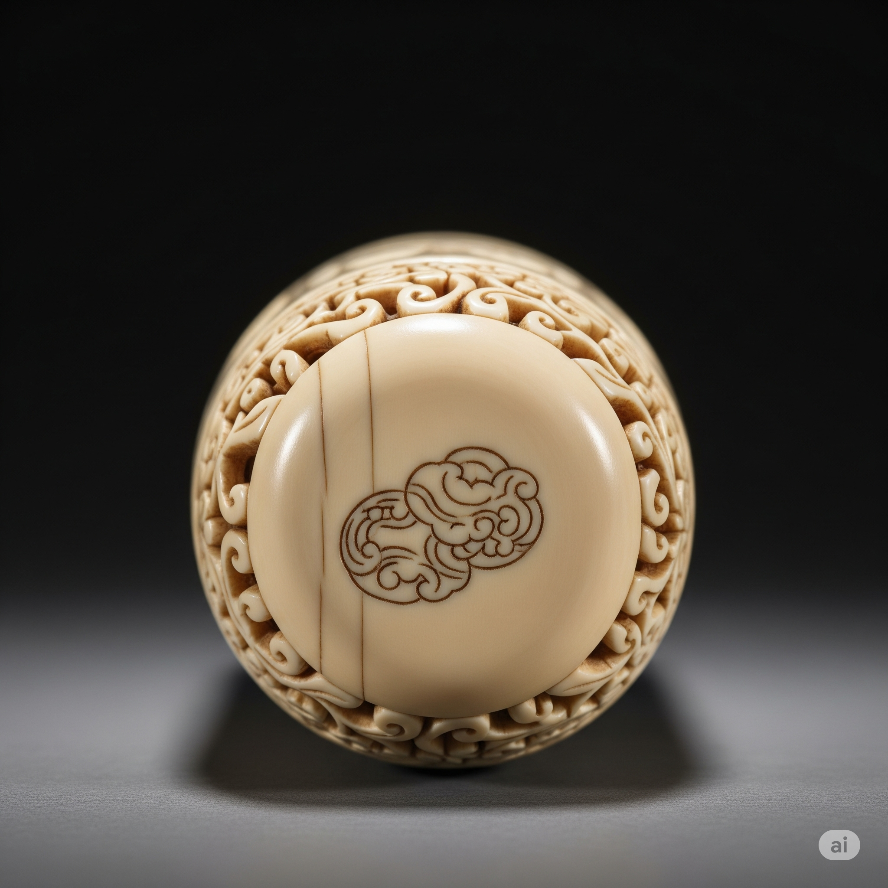

# Essential English Word 3
## Unit 8

### 1. anniversary (n)
A date that is remembered or celebrated because a special or important thing happened on that date in the past.

- My parents have a wedding **anniversary** every year. (Simple Present)
- I am having an **anniversary** party next week. (Present Continuous)
- My parents will have an **anniversary** next year. (Simple Future)
- My parents are going to have an **anniversary** party. (Near Future)
- My parents had an **anniversary** last week. (Simple Past)
- My parents were having an **anniversary** party when I came. (Past Continuous)
- My parents have had an **anniversary** every year since they got married. (Present Perfect)
- My parents had had an **anniversary** before I was born. (Past Perfect)
- My parents will have had 50 **anniversaries** by 2050. (Future Perfect)
- If I have a lot of money, I will celebrate my **anniversary** in Hawaii. (Conditional Sentence Type 1)
- If I had a lot of money, I would celebrate my **anniversary** in Hawaii. (Conditional Sentence Type 2)
- If I had had a lot of money, I would have celebrated my **anniversary** in Hawaii. (Conditional Sentence Type 3)

---

### 2. arithmetic (n)
Math that involves adding, subtracting, multiplying, and dividing.

- I learn **arithmetic** at school. (Simple Present)
- I am learning **arithmetic** now. (Present Continuous)
- I will learn **arithmetic** next year. (Simple Future)
- I am going to learn **arithmetic** next year. (Near Future)
- I learned **arithmetic** last year. (Simple Past)
- I was learning **arithmetic** when the bell rang. (Past Continuous)
- I have learned **arithmetic** since I was a child. (Present Perfect)
- I had learned **arithmetic** before I went to high school. (Past Perfect)
- I will have learned **arithmetic** by the time I finish school. (Future Perfect)
- If I study hard, I will be good at **arithmetic**. (Conditional Sentence Type 1)
- If I studied hard, I would be good at **arithmetic**. (Conditional Sentence Type 2)
- If I had studied hard, I would have been good at **arithmetic**. (Conditional Sentence Type 3)

---

### 3. ashamed (adj)
Feeling sorry for doing something wrong.

- I am **ashamed** of my bad behavior. (Simple Present)
- I am being **ashamed** because I did something wrong. (Present Continuous)
- I will be **ashamed** if I fail the exam. (Simple Future)
- I am going to be **ashamed** if I do not study. (Near Future)
- I was **ashamed** when I made a mistake. (Simple Past)
- I was being **ashamed** because I had lied. (Past Continuous)
- I have been **ashamed** of my actions. (Present Perfect)
- I had been **ashamed** before I apologized. (Past Perfect)
- I will have been **ashamed** if I had not told the truth. (Future Perfect)
- If I tell a lie, I will be **ashamed**. (Conditional Sentence Type 1)
- If I told a lie, I would be **ashamed**. (Conditional Sentence Type 2)
- If I had told a lie, I would have been **ashamed**. (Conditional Sentence Type 3)

---

### 4. burst (v)
To break open or apart suddenly and violently.

- The balloon **bursts** when I poke it. (Simple Present)
- The balloon is **bursting** because it has too much air. (Present Continuous)
- The balloon will **burst** if you put too much air in it. (Simple Future)
- The balloon is going to **burst** if you keep blowing it up. (Near Future)
- The balloon **burst** when I touched it. (Simple Past)
- The balloon was **bursting** when I saw it. (Past Continuous)
- The balloon has **burst** because it was too full. (Present Perfect)
- The balloon had **burst** before I could tie it. (Past Perfect)
- The balloon will have **burst** by the time we get there. (Future Perfect)
- If you blow up the balloon too much, it will **burst**. (Conditional Sentence Type 1)
- If you blew up the balloon too much, it would **burst**. (Conditional Sentence Type 2)
- If you had blown up the balloon too much, it would have **burst**. (Conditional Sentence Type 3)

---

### 5. carpenter (n)
A person who makes things out of wood.

- The **carpenter** makes chairs. (Simple Present)
- The **carpenter** is making a table. (Present Continuous)
- The **carpenter** will make a door. (Simple Future)
- The **carpenter** is going to make a shelf. (Near Future)
- The **carpenter** made a bed. (Simple Past)
- The **carpenter** was making a cabinet when I arrived. (Past Continuous)
- The **carpenter** has made many things for my house. (Present Perfect)
- The **carpenter** had made the table before we moved in. (Past Perfect)
- The **carpenter** will have made all the furniture by next week. (Future Perfect)
- If I need a table, I will ask the **carpenter**. (Conditional Sentence Type 1)
- If I needed a table, I would ask the **carpenter**. (Conditional Sentence Type 2)
- If I had needed a table, I would have asked the **carpenter**. (Conditional Sentence Type 3)

---

### 6. coal (n)
A black rock that is burned to produce heat.

- We burn **coal** to keep warm. (Simple Present)
- We are burning **coal** in the winter. (Present Continuous)
- We will burn **coal** to heat the house. (Simple Future)
- We are going to burn **coal** because it is cold. (Near Future)
- We burned **coal** last winter. (Simple Past)
- We were burning **coal** when the fire started. (Past Continuous)
- We have burned **coal** for many years. (Present Perfect)
- We had burned **coal** before we got a new heater. (Past Perfect)
- We will have burned all the **coal** by the end of winter. (Future Perfect)
- If it gets cold, we will burn **coal**. (Conditional Sentence Type 1)
- If it got cold, we would burn **coal**. (Conditional Sentence Type 2)
- If it had gotten cold, we would have burned **coal**. (Conditional Sentence Type 3)

---

### 7. couch (n)
A long, soft seat that people can sit or lie on.

- I sit on the **couch**. (Simple Present)
- I am sitting on the **couch** now. (Present Continuous)
- I will sit on the **couch** later. (Simple Future)
- I am going to sit on the **couch** to relax. (Near Future)
- I sat on the **couch** yesterday. (Simple Past)
- I was sitting on the **couch** when you called. (Past Continuous)
- I have sat on the **couch** many times. (Present Perfect)
- I had sat on the **couch** before I went to bed. (Past Perfect)
- I will have sat on the **couch** for an hour by the time you arrive. (Future Perfect)
- If I am tired, I will sit on the **couch**. (Conditional Sentence Type 1)
- If I were tired, I would sit on the **couch**. (Conditional Sentence Type 2)
- If I had been tired, I would have sat on the **couch**. (Conditional Sentence Type 3)

---

### 8. drip (v)
To fall in small drops.

- The water **drips** from the tap. (Simple Present)
- The water is **dripping** from the tap. (Present Continuous)
- The water will **drip** if you don't turn off the tap. (Simple Future)
- The water is going to **drip** all night. (Near Future)
- The water **dripped** from the tap last night. (Simple Past)
- The water was **dripping** when I woke up. (Past Continuous)
- The water has **dripped** all day. (Present Perfect)
- The water had **dripped** before I fixed the tap. (Past Perfect)
- The water will have **dripped** for hours by the time I get home. (Future Perfect)
- If the tap is loose, the water will **drip**. (Conditional Sentence Type 1)
- If the tap were loose, the water would **drip**. (Conditional Sentence Type 2)
- If the tap had been loose, the water would have **dripped**. (Conditional Sentence Type 3)

---

### 9. elegant (adj)
Beautiful and stylish.

- She looks **elegant** in that dress. (Simple Present)
- She is being **elegant** at the party. (Present Continuous)
- She will look **elegant** at the wedding. (Simple Future)
- She is going to look **elegant** tonight. (Near Future)
- She looked **elegant** last night. (Simple Past)
- She was being **elegant** when I saw her. (Past Continuous)
- She has looked **elegant** every time I see her. (Present Perfect)
- She had looked **elegant** before she changed her clothes. (Past Perfect)
- She will have looked **elegant** by the time the party starts. (Future Perfect)
- If she wears that dress, she will look **elegant**. (Conditional Sentence Type 1)
- If she wore that dress, she would look **elegant**. (Conditional Sentence Type 2)
- If she had worn that dress, she would have looked **elegant**. (Conditional Sentence Type 3)

---

### 10. fabric (n)
Cloth used for making clothes, curtains, etc.

- This **fabric** is soft. (Simple Present)
- I am feeling the **fabric**. (Present Continuous)
- I will buy some **fabric** tomorrow. (Simple Future)
- I am going to buy **fabric** to make a shirt. (Near Future)
- I bought some **fabric** yesterday. (Simple Past)
- I was touching the **fabric** when the shop owner came. (Past Continuous)
- I have bought this **fabric** before. (Present Perfect)
- I had bought the **fabric** before I saw the pattern. (Past Perfect)
- I will have bought enough **fabric** by the end of the day. (Future Perfect)
- If I have enough money, I will buy this **fabric**. (Conditional Sentence Type 1)
- If I had enough money, I would buy this **fabric**. (Conditional Sentence Type 2)
- If I had had enough money, I would have bought this **fabric**. (Conditional Sentence Type 3)

---

### 11. highlands (n)
High or mountainous land.

- The **highlands** are beautiful. (Simple Present)
- We are visiting the **highlands** this summer. (Present Continuous)
- We will go to the **highlands** next year. (Simple Future)
- We are going to visit the **highlands** next month. (Near Future)
- We visited the **highlands** last year. (Simple Past)
- We were hiking in the **highlands** when it started to rain. (Past Continuous)
- We have visited the **highlands** many times. (Present Perfect)
- We had visited the **highlands** before we moved here. (Past Perfect)
- We will have visited all the **highlands** by the time we retire. (Future Perfect)
- If we have time, we will visit the **highlands**. (Conditional Sentence Type 1)
- If we had time, we would visit the **highlands**. (Conditional Sentence Type 2)
- If we had had time, we would have visited the **highlands**. (Conditional Sentence Type 3)

---

### 12. ivory (n)
A hard, white material from the teeth and tusks of some animals.

- This is made of **ivory**. (Simple Present)
- I am looking at the **ivory** statue. (Present Continuous)
- I will buy something made of **ivory**. (Simple Future)
- I am going to buy an **ivory** necklace. (Near Future)
- I bought something made of **ivory** yesterday. (Simple Past)
- I was admiring the **ivory** carving when I saw the price. (Past Continuous)
- I have never bought anything made of **ivory**. (Present Perfect)
- I had never seen **ivory** before I went to the museum. (Past Perfect)
- I will have seen many things made of **ivory** by the end of the trip. (Future Perfect)
- If I have enough money, I will buy something made of **ivory**. (Conditional Sentence Type 1)
- If I had enough money, I would buy something made of **ivory**. (Conditional Sentence Type 2)
- If I had had enough money, I would have bought something made of **ivory**. (Conditional Sentence Type 3)

---

### 13. mill (n)
A building where grain is ground into flour.

- The **mill** grinds grain. (Simple Present)
- The **mill** is grinding grain now. (Present Continuous)
- The **mill** will grind grain tomorrow. (Simple Future)
- The **mill** is going to grind grain all day. (Near Future)
- The **mill** ground grain yesterday. (Simple Past)
- The **mill** was grinding grain when I visited. (Past Continuous)
- The **mill** has ground grain for many years. (Present Perfect)
- The **mill** had ground grain before the storm. (Past Perfect)
- The **mill** will have ground all the grain by the end of the week. (Future Perfect)
- If we need flour, we will go to the **mill**. (Conditional Sentence Type 1)
- If we needed flour, we would go to the **mill**. (Conditional Sentence Type 2)
- If we had needed flour, we would have gone to the **mill**. (Conditional Sentence Type 3)

---

### 14. needle (n)
A small, thin piece of steel with a point at one end and a hole for thread at the other.

- I use a **needle** to sew. (Simple Present)
- I am using a **needle** to sew a button. (Present Continuous)
- I will use a **needle** to fix my shirt. (Simple Future)
- I am going to use a **needle** to sew this tear. (Near Future)
- I used a **needle** to sew the patch. (Simple Past)
- I was using a **needle** when I pricked my finger. (Past Continuous)
- I have used a **needle** many times. (Present Perfect)
- I had used a **needle** before I learned to use a sewing machine. (Past Perfect)
- I will have used the **needle** many times by the end of the project. (Future Perfect)
- If I need to sew something, I will use a **needle**. (Conditional Sentence Type 1)
- If I needed to sew something, I would use a **needle**. (Conditional Sentence Type 2)
- If I had needed to sew something, I would have used a **needle**. (Conditional Sentence Type 3)

---

### 15. polish (v)
To make something shine.

- I **polish** my shoes. (Simple Present)
- I am **polishing** my shoes now. (Present Continuous)
- I will **polish** my shoes tomorrow. (Simple Future)
- I am going to **polish** my shoes for the party. (Near Future)
- I **polished** my shoes yesterday. (Simple Past)
- I was **polishing** my shoes when you called. (Past Continuous)
- I have **polished** my shoes many times. (Present Perfect)
- I had **polished** my shoes before I went out. (Past Perfect)
- I will have **polished** all the furniture by the end of the day. (Future Perfect)
- If I have time, I will **polish** my shoes. (Conditional Sentence Type 1)
- If I had time, I would **polish** my shoes. (Conditional Sentence Type 2)
- If I had had time, I would have **polished** my shoes. (Conditional Sentence Type 3)

---

### 16. sew (v)
To use a needle and thread to make or fix clothes.

- I **sew** clothes. (Simple Present)
- I am **sewing** a dress. (Present Continuous)
- I will **sew** a shirt. (Simple Future)
- I am going to **sew** a button on my coat. (Near Future)
- I **sewed** a dress last week. (Simple Past)
- I was **sewing** when the lights went out. (Past Continuous)
- I have **sewn** many clothes. (Present Perfect)
- I had **sewn** the dress before the party. (Past Perfect)
- I will have **sewn** all the costumes by the end of the week. (Future Perfect)
- If I have time, I will **sew** a new dress. (Conditional Sentence Type 1)
- If I had time, I would **sew** a new dress. (Conditional Sentence Type 2)
- If I had had time, I would have **sewn** a new dress. (Conditional Sentence Type 3)

---

### 17. shed (n)
A small building used for storing things.

- I store tools in the **shed**. (Simple Present)
- I am cleaning the **shed** now. (Present Continuous)
- I will build a new **shed** next year. (Simple Future)
- I am going to clean the **shed** this weekend. (Near Future)
- I cleaned the **shed** last weekend. (Simple Past)
- I was cleaning the **shed** when it started to rain. (Past Continuous)
- I have stored many things in the **shed**. (Present Perfect)
- I had cleaned the **shed** before winter. (Past Perfect)
- I will have organized everything in the **shed** by the end of the day. (Future Perfect)
- If I need tools, I will go to the **shed**. (Conditional Sentence Type 1)
- If I needed tools, I would go to the **shed**. (Conditional Sentence Type 2)
- If I had needed tools, I would have gone to the **shed**. (Conditional Sentence Type 3)

---

### 18. thread (n)
A thin string used for sewing.

- I use **thread** to sew. (Simple Present)
- I am using **thread** to sew a button. (Present Continuous)
- I will buy more **thread** tomorrow. (Simple Future)
- I am going to use this **thread** to fix my shirt. (Near Future)
- I used **thread** to sew the patch. (Simple Past)
- I was using **thread** when the **needle** broke. (Past Continuous)
- I have used this **thread** many times. (Present Perfect)
- I had used all the **thread** before I finished sewing. (Past Perfect)
- I will have used all the **thread** by the end of the project. (Future Perfect)
- If I need to sew, I will use **thread**. (Conditional Sentence Type 1)
- If I needed to sew, I would use **thread**. (Conditional Sentence Type 2)
- If I had needed to sew, I would have used **thread**. (Conditional Sentence Type 3)

---

### 19. trim (v)
To cut off small pieces of something.

- I **trim** the grass. (Simple Present)
- I am **trimming** the grass now. (Present Continuous)
- I will **trim** the grass tomorrow. (Simple Future)
- I am going to **trim** the grass this weekend. (Near Future)
- I **trimmed** the grass last weekend. (Simple Past)
- I was **trimming** the grass when it started to rain. (Past Continuous)
- I have **trimmed** the grass many times. (Present Perfect)
- I had **trimmed** the grass before the party. (Past Perfect)
- I will have **trimmed** all the hedges by the end of the day. (Future Perfect)
- If the grass is long, I will **trim** it. (Conditional Sentence Type 1)
- If the grass were long, I would **trim** it. (Conditional Sentence Type 2)
- If the grass had been long, I would have **trimmed** it. (Conditional Sentence Type 3)

---

### 20. upwards (adv)
Going towards a higher place or level.

- The bird flies **upwards**. (Simple Present)
- The bird is flying **upwards**. (Present Continuous)
- The bird will fly **upwards** to its nest. (Simple Future)
- The bird is going to fly **upwards** to reach the tree. (Near Future)
- The bird flew **upwards** into the sky. (Simple Past)
- The bird was flying **upwards** when I saw it. (Past Continuous)
- The bird has flown **upwards** many times. (Present Perfect)
- The bird had flown **upwards** before I arrived. (Past Perfect)
- The bird will have flown **upwards** many times by the end of the day. (Future Perfect)
- If the bird wants to reach its nest, it will fly **upwards**. (Conditional Sentence Type 1)
- If the bird wanted to reach its nest, it would fly **upwards**. (Conditional Sentence Type 2)
- If the bird had wanted to reach its nest, it would have flown **upwards**. (Conditional Sentence Type 3)

## THE ANNIVERSARY GIFT

<audio controls src="eew-3-8/Unit 8- The Anniversary Gift (1).mp3" title="Title"></audio>

Joe was a carpenter. He bulit houses in the highlands. Joe's wife Stella used a needle and thread to sew elegant clothing. She only used beautiful fabric to make clothes.

Since they didn't have a lot of money, they lived in an old shed. Water dripped in when it rained. They had broken chairs instead of a couch. But they had coal for heat, and flour from the mill for bread. Together, they trimmed the bushes to make their house look nice. Joe and Stella were poor, but not ashamed. They were happy.

Sometimes in the evening, they walked downtown. They looked in store windows and dreamed. Stella wanted a hairbrush with an ivory handle. Joe wanted to fix his grandfather's watch.

For their anniversary, Stella wanted to get Joe what he wanted. But then she did the arithmetic. It would take at least six months to save enough money. Then she had an idea. She cut off all of her hair and sold it.

Meanwhile, Joe knew that he could never fix his watch. So he polished it and sold it. He made enough to buy the brush. On their anniversary, the door burst open. Joe was excited to give Stella his gift. But first, Stella gave him the money to fix the watch. When he saw his wife without any hair, he smiled. " I sold my watch to buy you something", Joe said. He gave her the brush, and she laughed. They wer both willing to give up something very special to make each other happy.