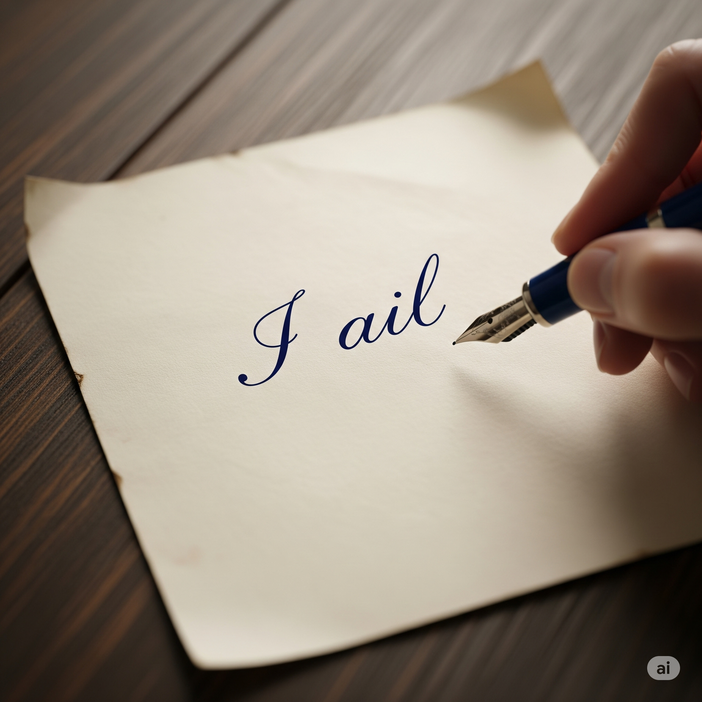

# Essential English Word 3
## Unit 9

### ail (v)
To feel sick or have pain.

- I ail. (Simple Present)
- I am ailing. (Present Continuous)
- I have ailed. (Present Perfect)
- I have been ailing. (Present Perfect Continuous)
- I ailed. (Simple Past)
- I was ailing. (Past Continuous)
- I had ailed. (Past Perfect)
- I had been ailing. (Past Perfect Continuous)
- I will ail. (Simple Future)
- I will be ailing. (Future Continuous)
- I will have ailed. (Future Perfect)
- I will have been ailing. (Future Perfect Continuous)

### ally (n)
A friend who helps you.

- I am an ally. (Simple Present)
- I am being an ally. (Present Continuous)
- I have been an ally. (Present Perfect)
- I have been being an ally. (Present Perfect Continuous)
- I was an ally. (Simple Past)
- I was being an ally. (Past Continuous)
- I had been an ally. (Past Perfect)
- I had been being an ally. (Past Perfect Continuous)
- I will be an ally. (Simple Future)
- I will be being an ally. (Future Continuous)
- I will have been an ally. (Future Perfect)
- I will have been being an ally. (Future Perfect Continuous)

### boast (v)
To talk big about yourself.

- I boast. (Simple Present)
- I am boasting. (Present Continuous)
- I have boasted. (Present Perfect)
- I have been boasting. (Present Perfect Continuous)
- I boasted. (Simple Past)
- I was boasting. (Past Continuous)
- I had boasted. (Past Perfect)
- I had been boasting. (Past Perfect Continuous)
- I will boast. (Simple Future)
- I will be boasting. (Future Continuous)
- I will have boasted. (Future Perfect)
- I will have been boasting. (Future Perfect Continuous)

### bounce (v)
To jump up and down.

- I bounce. (Simple Present)
- I am bouncing. (Present Continuous)
- I have bounced. (Present Perfect)
- I have been bouncing. (Present Perfect Continuous)
- I bounced. (Simple Past)
- I was bouncing. (Past Continuous)
- I had bounced. (Past Perfect)
- I had been bouncing. (Past Perfect Continuous)
- I will bounce. (Simple Future)
- I will be bouncing. (Future Continuous)
- I will have bounced. (Future Perfect)
- I will have been bouncing. (Future Perfect Continuous)

### bully (n)
Someone who hurts others.

- I am a bully. (Simple Present)
- I am being a bully. (Present Continuous)
- I have been a bully. (Present Perfect)
- I have been being a bully. (Present Perfect Continuous)
- I was a bully. (Simple Past)
- I was being a bully. (Past Continuous)
- I had been a bully. (Past Perfect)
- I had been being a bully. (Past Perfect Continuous)
- I will be a bully. (Simple Future)
- I will be being a bully. (Future Continuous)
- I will have been a bully. (Future Perfect)
- I will have been being a bully. (Future Perfect Continuous)

### carbohydrate (n)
Food that gives you energy.

- I eat carbohydrate. (Simple Present)
- I am eating carbohydrate. (Present Continuous)
- I have eaten carbohydrate. (Present Perfect)
- I have been eating carbohydrate. (Present Perfect Continuous)
- I ate carbohydrate. (Simple Past)
- I was eating carbohydrate. (Past Continuous)
- I had eaten carbohydrate. (Past Perfect)
- I had been eating carbohydrate. (Past Perfect Continuous)
- I will eat carbohydrate. (Simple Future)
- I will be eating carbohydrate. (Future Continuous)
- I will have eaten carbohydrate. (Future Perfect)
- I will have been eating carbohydrate. (Future Perfect Continuous)

### crawl (v)
To move on your hands and knees.

- I crawl. (Simple Present)
- I am crawling. (Present Continuous)
- I have crawled. (Present Perfect)
- I have been crawling. (Present Perfect Continuous)
- I crawled. (Simple Past)
- I was crawling. (Past Continuous)
- I had crawled. (Past Perfect)
- I had been crawling. (Past Perfect Continuous)
- I will crawl. (Simple Future)
- I will be crawling. (Future Continuous)
- I will have crawled. (Future Perfect)
- I will have been crawling. (Future Perfect Continuous)

### defeat (v)
To win against someone.

- I defeat. (Simple Present)
- I am defeating. (Present Continuous)
- I have defeated. (Present Perfect)
- I have been defeating. (Present Perfect Continuous)
- I defeated. (Simple Past)
- I was defeating. (Past Continuous)
- I had defeated. (Past Perfect)
- I had been defeating. (Past Perfect Continuous)
- I will defeat. (Simple Future)
- I will be defeating. (Future Continuous)
- I will have defeated. (Future Perfect)
- I will have been defeating. (Future Perfect Continuous)

### dial (n)
The front of a clock.

- I see a dial. (Simple Present)
- I am seeing a dial. (Present Continuous)
- I have seen a dial. (Present Perfect)
- I have been seeing a dial. (Present Perfect Continuous)
- I saw a dial. (Simple Past)
- I was seeing a dial. (Past Continuous)
- I had seen a dial. (Past Perfect)
- I had been seeing a dial. (Past Perfect Continuous)
- I will see a dial. (Simple Future)
- I will be seeing a dial. (Future Continuous)
- I will have seen a dial. (Future Perfect)
- I will have been seeing a dial. (Future Perfect Continuous)

### dominant (adj)
The strongest one.

- I am dominant. (Simple Present)
- I am being dominant. (Present Continuous)
- I have been dominant. (Present Perfect)
- I have been being dominant. (Present Perfect Continuous)
- I was dominant. (Simple Past)
- I was being dominant. (Past Continuous)
- I had been dominant. (Past Perfect)
- I had been being dominant. (Past Perfect Continuous)
- I will be dominant. (Simple Future)
- I will be being dominant. (Future Continuous)
- I will have been dominant. (Future Perfect)
- I will have been being dominant. (Future Perfect Continuous)

### mercy (n)
Being kind to someone.

- I show mercy. (Simple Present)
- I am showing mercy. (Present Continuous)
- I have shown mercy. (Present Perfect)
- I have been showing mercy. (Present Perfect Continuous)
- I showed mercy. (Simple Past)
- I was showing mercy. (Past Continuous)
- I had shown mercy. (Past Perfect)
- I had been showing mercy. (Past Perfect Continuous)
- I will show mercy. (Simple Future)
- I will be showing mercy. (Future Continuous)
- I will have shown mercy. (Future Perfect)
- I will have been showing mercy. (Future Perfect Continuous)

### nod (v)
To move your head up and down.

- I nod. (Simple Present)
- I am nodding. (Present Continuous)
- I have nodded. (Present Perfect)
- I have been nodding. (Present Perfect Continuous)
- I nodded. (Simple Past)
- I was nodding. (Past Continuous)
- I had nodded. (Past Perfect)
- I had been nodding. (Past Perfect Continuous)
- I will nod. (Simple Future)
- I will be nodding. (Future Continuous)
- I will have nodded. (Future Perfect)
- I will have been nodding. (Future Perfect Continuous)

### opponent (n)
Someone you play against.

- I face an opponent. (Simple Present)
- I am facing an opponent. (Present Continuous)
- I have faced an opponent. (Present Perfect)
- I have been facing an opponent. (Present Perfect Continuous)
- I faced an opponent. (Simple Past)
- I was facing an opponent. (Past Continuous)
- I had faced an opponent. (Past Perfect)
- I had been facing an opponent. (Past Perfect Continuous)
- I will face an opponent. (Simple Future)
- I will be facing an opponent. (Future Continuous)
- I will have faced an opponent. (Future Perfect)
- I will have been facing an opponent. (Future Perfect Continuous)

### quarrel (v)
To have a fight with words.

- I quarrel. (Simple Present)
- I am quarreling. (Present Continuous)
- I have quarreled. (Present Perfect)
- I have been quarreling. (Present Perfect Continuous)
- I quarreled. (Simple Past)
- I was quarreling. (Past Continuous)
- I had quarreled. (Past Perfect)
- I had been quarreling. (Past Perfect Continuous)
- I will quarrel. (Simple Future)
- I will be quarreling. (Future Continuous)
- I will have quarreled. (Future Perfect)
- I will have been quarreling. (Future Perfect Continuous)

### rival (n)
Someone you compete with.

- I have a rival. (Simple Present)
- I am having a rival. (Present Continuous)
- I have had a rival. (Present Perfect)
- I have been having a rival. (Present Perfect Continuous)
- I had a rival. (Simple Past)
- I was having a rival. (Past Continuous)
- I had had a rival. (Past Perfect)
- I had been having a rival. (Past Perfect Continuous)
- I will have a rival. (Simple Future)
- I will be having a rival. (Future Continuous)
- I will have had a rival. (Future Perfect)
- I will have been having a rival. (Future Perfect Continuous)

### sore (adj)
Feeling pain in your body.

- I am sore. (Simple Present)
- I am being sore. (Present Continuous)
- I have been sore. (Present Perfect)
- I have been being sore. (Present Perfect Continuous)
- I was sore. (Simple Past)
- I was being sore. (Past Continuous)
- I had been sore. (Past Perfect)
- I had been being sore. (Past Perfect Continuous)
- I will be sore. (Simple Future)
- I will be being sore. (Future Continuous)
- I will have been sore. (Future Perfect)
- I will have been being sore. (Future Perfect Continuous)

### sting (v)
To feel a sharp pain.

- I sting. (Simple Present)
- I am stinging. (Present Continuous)
- I have stung. (Present Perfect)
- I have been stinging. (Present Perfect Continuous)
- I stung. (Simple Past)
- I was stinging. (Past Continuous)
- I had stung. (Past Perfect)
- I had been stinging. (Past Perfect Continuous)
- I will sting. (Simple Future)
- I will be stinging. (Future Continuous)
- I will have stung. (Future Perfect)
- I will have been stinging. (Future Perfect Continuous)

### strain (v)
To try too hard.

- I strain. (Simple Present)
- I am straining. (Present Continuous)
- I have strained. (Present Perfect)
- I have been straining. (Present Perfect Continuous)
- I strained. (Simple Past)
- I was straining. (Past Continuous)
- I had strained. (Past Perfect)
- I had been straining. (Past Perfect Continuous)
- I will strain. (Simple Future)
- I will be straining. (Future Continuous)
- I will have strained. (Future Perfect)
- I will have been straining. (Future Perfect Continuous)

### torture (n)
To hurt someone very badly.

- I see torture. (Simple Present)
- I am seeing torture. (Present Continuous)
- I have seen torture. (Present Perfect)
- I have been seeing torture. (Present Perfect Continuous)
- I saw torture. (Simple Past)
- I was seeing torture. (Past Continuous)
- I had seen torture. (Past Perfect)
- I had been seeing torture. (Past Perfect Continuous)
- I will see torture. (Simple Future)
- I will be seeing torture. (Future Continuous)
- I will have seen torture. (Future Perfect)
- I will have been seeing torture. (Future Perfect Continuous)

### wrestle (v)
To fight by holding someone.

- I wrestle. (Simple Present)
- I am wrestling. (Present Continuous)
- I have wrestled. (Present Perfect)
- I have been wrestling. (Present Perfect Continuous)
- I wrestled. (Simple Past)
- I was wrestling. (Past Continuous)
- I had wrestled. (Past Perfect)
- I had been wrestling. (Past Perfect Continuous)
- I will wrestle. (Simple Future)
- I will be wrestling. (Future Continuous)
- I will have wrestled. (Future Perfect)
- I will have been wrestling. (Future Perfect Continuous)

## DALTON VS THE BULLY

Dalton was a nice boy, but sometimes the other boys made fun of him because he was so tall and skinny. Dalton’s biggest problem was Mitch. He was a bully who boasted about his strength. He quarreled with the other boys. Sometimes, if boys gave Mitch their lunch money, he would have mercy and leave them alone.

One day, the boys learned about a special Middle School Olympics. Their gym class was going to be in it. Many kids were excited. But Dalton thought it sounded like torture.

That morning, Dalton ate plenty of carbohydrates for breakfast. He entered the gym and looked at the dial on the clock. It was time to begin. The teacher asked if they were ready. Everyone nodded, except Dalton.

“ I got stung by a bee. I need to see the nurse.” said Dalton. He made it up so he wouldn’t have to play.

“ I don’t believe you. Get ready to play,” responded the coach.

First, they wrestled. Then they jumped, crawled and played other games. But Mitch was dominant in every event.

They strained all morning to defeat him. By lunch, they were sore. Their entire bodies ailed them. They thought about how to win. They knew the last game of the day was volleyball. Kids who used to be Dalton’s rivals became his allies. They wanted him to help them beat Mitch. Dalton was going to be Mitch’s opponent.

The game started. Every time Mitch tried to hit the ball over the net, Dalton stopped it. Finally, Mitch used all of his strength. But the ball bounced off Dalton’s hands and back into Mitch’s face! Finally Mitch was defeated.