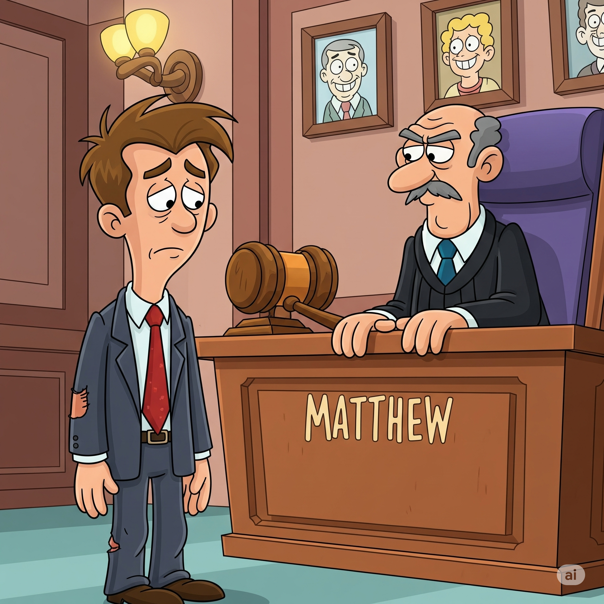

# Essential English Word 3
# Unit 16
## 1. adolescent n
### định nghĩa
A young person who is changing from a child to an adult.

- He is an adolescent. (Simple Present)
- She was acting like an adolescent. (Past Continuous)
- He will become an adolescent next year. (Simple Future - will)
- She is going to be an adolescent soon. (Simple Future - going to)
- He has been an adolescent for two years. (Present Perfect)
- She had already passed the adolescent stage. (Past Perfect)
- They will be going through the adolescent years. (Future Continuous)
- By age 18, he will have been an adolescent for several years. (Future Perfect)
- If he was older, he would not be an adolescent. (Conditional - would)
- Understand adolescents. (Imperative)
- Adolescents are between childhood and adulthood. (Simple Present - general truth)
- He was an adolescent last year. (Simple Past)

## 2. aptitude n
### định nghĩa
A natural ability to do something well.

- She has an aptitude for music. (Simple Present)
- He was showing an aptitude for math. (Past Continuous)
- She will discover her aptitude. (Simple Future - will)
- He is going to develop his aptitude. (Simple Future - going to)
- She has shown great aptitude in art. (Present Perfect)
- He had already proven his aptitude. (Past Perfect)
- They will be testing his aptitude. (Future Continuous)
- By the end of the course, she will have improved her aptitude. (Future Perfect)
- If you had the aptitude, you would learn quickly. (Conditional - would)
- Find your aptitude. (Imperative)
- Some people have a natural aptitude for languages. (Simple Present - general truth)
- He showed aptitude at a young age. (Simple Past)

## 3. compliment v
### định nghĩa
To say something nice to someone to praise them.

- I compliment your work. (Simple Present)
- She was complimenting his cooking. (Past Continuous)
- He will compliment her dress. (Simple Future - will)
- We are going to compliment the chef. (Simple Future - going to)
- He has complimented me before. (Present Perfect)
- She had already complimented his effort. (Past Perfect)
- They will be complimenting your performance. (Future Continuous)
- By the end of the evening, he will have complimented everyone. (Future Perfect)
- If you liked it, you would compliment it. (Conditional - would)
- Compliment her on her success. (Imperative)
- People like to be complimented. (Simple Present - general truth)
- He complimented my drawing. (Simple Past)

## 4. hinder v
### định nghĩa
To make it difficult for someone to do something or for something to happen.

- The rain hinders our progress. (Simple Present)
- The noise was hindering his study. (Past Continuous)
- The bad weather will hinder the journey. (Simple Future - will)
- This problem is going to hinder our plans. (Simple Future - going to)
- The lack of tools has hindered the work. (Present Perfect)
- The traffic had hindered their arrival. (Past Perfect)
- The new rules will be hindering the process. (Future Continuous)
- By tomorrow, the obstacle will have hindered them for a day. (Future Perfect)
- If you didn't help, you would hinder me. (Conditional - would)
- Don't hinder their efforts. (Imperative)
- Lack of sleep can hinder performance. (Simple Present - general truth)
- The broken car hindered our trip. (Simple Past)

## 5. journalism n
### định nghĩa
The job of collecting and writing news for newspapers, magazines, TV, or radio.

- Journalism is an important job. (Simple Present)
- She was studying journalism. (Past Continuous)
- He will work in journalism. (Simple Future - will)
- She is going to study journalism. (Simple Future - going to)
- He has worked in journalism for years. (Present Perfect)
- She had already decided on journalism. (Past Perfect)
- They will be discussing journalism. (Future Continuous)
- By next year, she will have finished her degree in journalism. (Future Perfect)
- If I liked writing, I would do journalism. (Conditional - would)
- Learn about journalism. (Imperative)
- Journalism informs the public. (Simple Present - general truth)
- He started in journalism after college. (Simple Past)

## 6. jury n
### định nghĩa
A group of people in a court who listen to the facts and decide if someone is guilty or not guilty.

- The jury listens carefully. (Simple Present)
- The jury was considering the evidence. (Past Continuous)
- The jury will make a decision. (Simple Future - will)
- They are going to be on the jury. (Simple Future - going to)
- The jury has reached a verdict. (Present Perfect)
- The jury had heard all the witnesses. (Past Perfect)
- The jury will be deliberating all afternoon. (Future Continuous)
- By evening, the jury will have decided. (Future Perfect)
- If I was chosen, I would be on the jury. (Conditional - would)
- Listen to the jury. (Imperative)
- A jury decides guilt or innocence. (Simple Present - general truth)
- The jury found him guilty. (Simple Past)

## 7. justice n
### định nghĩa
Fairness in the way people are treated.

- Justice is important. (Simple Present)
- They were fighting for justice. (Past Continuous)
- Justice will be served. (Simple Future - will)
- We are going to seek justice. (Simple Future - going to)
- Justice has been done. (Present Perfect)
- They had always believed in justice. (Past Perfect)
- The court will be working towards justice. (Future Continuous)
- By the end of the trial, justice will have been achieved. (Future Perfect)
- If it was fair, it would be justice. (Conditional - would)
- Seek justice. (Imperative)
- Justice should be blind. (Simple Present - general truth)
- He believed in justice. (Simple Past)

## 8. liberty n
### định nghĩa
The freedom to do what you want without being controlled.

- Liberty is a right. (Simple Present)
- They were fighting for liberty. (Past Continuous)
- People will gain liberty. (Simple Future - will)
- We are going to defend our liberty. (Simple Future - going to)
- They have won their liberty. (Present Perfect)
- They had lost their liberty. (Past Perfect)
- People will be celebrating their liberty. (Future Continuous)
- By the end of the war, they will have achieved liberty. (Future Perfect)
- If we were free, we would have liberty. (Conditional - would)
- Fight for liberty. (Imperative)
- Liberty is a precious thing. (Simple Present - general truth)
- They gained liberty after the revolution. (Simple Past)

## 9. literary adj
### định nghĩa
Relating to literature (books, poems, plays).

- This is a literary magazine. (Simple Present)
- They were discussing literary works. (Past Continuous)
- She will study literary theory. (Simple Future - will)
- He is going to write a literary review. (Simple Future - going to)
- She has a literary talent. (Present Perfect)
- He had read many literary books. (Past Perfect)
- They will be attending a literary event. (Future Continuous)
- By the end of the year, she will have read many literary classics. (Future Perfect)
- If you liked reading, you would enjoy literary studies. (Conditional - would)
- Read literary books. (Imperative)
- Literary works are often complex. (Simple Present - general truth)
- He had a literary style. (Simple Past)

## 10. pharmacy n
### định nghĩa
A shop where you can buy medicines.

- The pharmacy is open. (Simple Present)
- She was going to the pharmacy. (Past Continuous)
- He will go to the pharmacy. (Simple Future - will)
- We are going to find a pharmacy. (Simple Future - going to)
- I have been to the pharmacy. (Present Perfect)
- They had already closed the pharmacy. (Past Perfect)
- She will be working at the pharmacy. (Future Continuous)
- By noon, the pharmacy will have opened. (Future Perfect)
- If you needed medicine, you would go to the pharmacy. (Conditional - would)
- Go to the pharmacy. (Imperative)
- Pharmacies sell medicine. (Simple Present - general truth)
- I went to the pharmacy yesterday. (Simple Past)

## 11. pill n
### định nghĩa
A small, round piece of medicine that you swallow.

- Take this pill. (Simple Present)
- He was taking a pill. (Past Continuous)
- She will need a pill for her headache. (Simple Future - will)
- I am going to take a pill. (Simple Future - going to)
- He has taken his pill. (Present Perfect)
- She had already taken her pill. (Past Perfect)
- He will be taking his pills every morning. (Future Continuous)
- By tomorrow, he will have taken all his pills. (Future Perfect)
- If you were sick, you would take a pill. (Conditional - would)
- Take your pill. (Imperative)
- Pills contain medicine. (Simple Present - general truth)
- I took a pill for my cold. (Simple Past)

## 12. presume v
### định nghĩa
To think that something is true, although you are not certain.

- I presume you are tired. (Simple Present)
- She was presuming he would come. (Past Continuous)
- He will presume you are busy. (Simple Future - will)
- We are going to presume they agree. (Simple Future - going to)
- I have presumed you knew. (Present Perfect)
- They had presumed it was correct. (Past Perfect)
- He will be presuming you understand. (Future Continuous)
- By the time he arrives, she will have presumed he is late. (Future Perfect)
- If you didn't know, you would presume. (Conditional - would)
- Don't presume anything. (Imperative)
- People often presume things. (Simple Present - general truth)
- I presumed you were coming. (Simple Past)

## 13. privacy n
### định nghĩa
The state of being alone and not watched or disturbed by other people.

- I need some privacy. (Simple Present)
- She was enjoying her privacy. (Past Continuous)
- He will respect your privacy. (Simple Future - will)
- We are going to give them privacy. (Simple Future - going to)
- She has always valued her privacy. (Present Perfect)
- They had ensured his privacy. (Past Perfect)
- He will be seeking privacy. (Future Continuous)
- By the end of the day, she will have had enough privacy. (Future Perfect)
- If you wanted to be alone, you would need privacy. (Conditional - would)
- Respect their privacy. (Imperative)
- Everyone needs privacy sometimes. (Simple Present - general truth)
- I enjoyed the privacy of my room. (Simple Past)

## 14. punishment n
### định nghĩa
Something done to someone because they have done something wrong.

- The punishment is fair. (Simple Present)
- They were discussing the punishment. (Past Continuous)
- He will receive a punishment. (Simple Future - will)
- She is going to get a punishment. (Simple Future - going to)
- He has received his punishment. (Present Perfect)
- They had decided on the punishment. (Past Perfect)
- The court will be deciding the punishment. (Future Continuous)
- By the end of the trial, the punishment will have been given. (Future Perfect)
- If you broke the rule, you would get a punishment. (Conditional - would)
- Accept your punishment. (Imperative)
- Punishment follows breaking rules. (Simple Present - general truth)
- He received a light punishment. (Simple Past)

## 15. sensible adj
### định nghĩa
Having or showing good judgment; practical and wise.

- That is a sensible idea. (Simple Present)
- She was being very sensible. (Past Continuous)
- He will make a sensible choice. (Simple Future - will)
- We are going to take a sensible approach. (Simple Future - going to)
- She has always been sensible. (Present Perfect)
- He had made a sensible decision. (Past Perfect)
- They will be acting sensibly. (Future Continuous)
- By the end of the discussion, they will have reached a sensible conclusion. (Future Perfect)
- If you were sensible, you would save money. (Conditional - would)
- Be sensible. (Imperative)
- Sensible people think before they act. (Simple Present - general truth)
- He gave sensible advice. (Simple Past)

## 16. slice n
### định nghĩa
A thin, flat piece cut from something.

- I want a slice of cake. (Simple Present)
- She was cutting a slice of bread. (Past Continuous)
- He will eat a slice of pizza. (Simple Future - will)
- We are going to have a slice of pie. (Simple Future - going to)
- I have eaten a slice. (Present Perfect)
- They had already cut the first slice. (Past Perfect)
- She will be cutting slices for everyone. (Future Continuous)
- By dinner time, the whole cake will have been sliced. (Future Perfect)
- If it was big enough, I would have another slice. (Conditional - would)
- Give me a slice. (Imperative)
- Bread is often sold in slices. (Simple Present - general truth)
- I ate a slice of cheese. (Simple Past)

## 17. sorrow n
### định nghĩa
A feeling of great sadness.

- He feels great sorrow. (Simple Present)
- She was feeling deep sorrow. (Past Continuous)
- They will feel sorrow at the news. (Simple Future - will)
- We are going to share our sorrow. (Simple Future - going to)
- She has known sorrow. (Present Perfect)
- He had felt sorrow for a long time. (Past Perfect)
- They will be expressing their sorrow. (Future Continuous)
- By the end of the day, the sorrow will have lessened. (Future Perfect)
- If it was sad news, you would feel sorrow. (Conditional - would)
- Share your sorrow. (Imperative)
- Loss can cause sorrow. (Simple Present - general truth)
- He felt sorrow after the funeral. (Simple Past)

## 18. straw n
### định nghĩa
A thin tube used for drinking. Also, dry stalks of grain plants.

- I need a straw for my drink. (Simple Present)
- She was drinking with a straw. (Past Continuous)
- He will use a straw. (Simple Future - will)
- We are going to buy paper straws. (Simple Future - going to)
- I have used this straw before. (Present Perfect)
- They had already finished the straw. (Past Perfect)
- The children will be drinking with straws. (Future Continuous)
- By the end of the party, all the straws will have been used. (Future Perfect)
- If it was a cold drink, I would use a straw. (Conditional - would)
- Use a straw. (Imperative)
- Straws help you drink. (Simple Present - general truth)
- I drank juice with a straw. (Simple Past)

## 19. swell v
### định nghĩa
To become larger or rounder.

- My ankle swells when I walk. (Simple Present)
- His hand was swelling. (Past Continuous)
- The injured area will swell. (Simple Future - will)
- Her foot is going to swell. (Simple Future - going to)
- The bee sting has made it swell. (Present Perfect)
- It had already swollen before I saw it. (Past Perfect)
- His knee will be swelling more. (Future Continuous)
- By morning, the bruise will have swollen. (Future Perfect)
- If you hit it, it would swell. (Conditional - would)
- Don't let it swell too much. (Imperative)
- Injuries can cause swelling. (Simple Present - general truth)
- His eye swelled after the punch. (Simple Past)

## 20. tidy adj
### định nghĩa
Arranged neatly and in order.

- My room is tidy. (Simple Present)
- She was making the room tidy. (Past Continuous)
- He will make his desk tidy. (Simple Future - will)
- We are going to make the house tidy. (Simple Future - going to)
- She has made everything tidy. (Present Perfect)
- He had already made the place tidy. (Past Perfect)
- They will be making the garden tidy. (Future Continuous)
- By the end of the hour, the room will have been made tidy. (Future Perfect)
- If you cleaned, it would be tidy. (Conditional - would)
- Make your bed tidy. (Imperative)
- Tidy places are nice to be in. (Simple Present - general truth)
- The kitchen was tidy this morning. (Simple Past)

## Matthew learns a lesson

Matthew was a **sensible** boy. He always kept his room **tidy** and had a natural **literary** **aptitude**. One day, he hoped to have a career in **journalism**. The **adolescent** spent much of his time reading and liked having **privacy**. But his quiet personality **hindered** his ability to make friends.

One day, Matthew went to the **pharmacy** to pick up some **pills** for his grandmother. He saw some boys leaning against a pole outside. One of the boys **complimented** Matthew. “ I like your jacket.”

Another boy asked, “ Do you want to go to Nate’s Restaurant?”

“ Sure!” Matthew said.

The boys walked to the restaurant. They were going to have **slices** of pizza. They ordered their food and drank soda with **straws**. They ate until their bellies **swelled** up. Matthew was having so much fun.

One of the boys said, “ Let’s leave without paying.”

Matthew didn’t want to. But he **presumed** his new friends wouldn’t like him if he didn’t.

Suddenly, the waiter yelled, “ Stop!” The two other boys ran, leaving Matthew there alone.

Soon, the police arrived. “ Leaving without paying for your meal is the same as stealing,” said the police officer. “ The restaurant wants **justice**. So next week you have to go to court and let a **jury** decide your **punishment**.”

When he went to court, the judge asked, “ Do you have anything to say, Matthew?”

He said, “ I feel **sorrow** for what I’ve done. Now I know that real friends won’t ask you to do something illegal.”

The **jury** then let him have his **liberty**. But they made Matthew pick up trash as **punishment**.

Much to Matthew’s surprise, he ended up meeting some new friends.

---------------

Matthew was a **sensible** boy. He always kept his room **tidy** and had a natural **literary** **aptitude**. One day, he hoped to have a career in **journalism**. The **adolescent** spent much of his time reading and liked having **privacy**. But his quiet personality **hindered** his ability to make friends.

One day, Matthew went to the **pharmacy** to pick up some **pills** for his grandmother. He saw some boys leaning against a pole outside. One of the boys **complimented** Matthew. “ I like your jacket.”

Another boy asked, “ Do you want to go to Nate’s Restaurant?”

“ Sure!” Matthew said.

The boys walked to the restaurant. They were going to have **slices** of pizza. They ordered their food and drank soda with **straws**. They ate until their bellies **swelled** up. Matthew was having so much fun.

One of the boys said, “ Let’s leave without paying.”

Matthew didn’t want to. But he **presumed** his new friends wouldn’t like him if he didn’t.

Suddenly, the waiter yelled, “ Stop!” The two other boys ran, leaving Matthew there alone.

Soon, the police arrived. “ Leaving without paying for your meal is the same as stealing,” said the police officer. “ The restaurant wants **justice**. So next week you have to go to court and let a **jury** decide your **punishment**.”

When he went to court, the judge asked, “ Do you have anything to say, Matthew?”

He said, “ I feel **sorrow** for what I’ve done. Now I know that real friends won’t ask you to do something illegal.”

The **jury** then let him have his **liberty**. But they made Matthew pick up trash as **punishment**.

Much to Matthew’s surprise, he ended up meeting some new friends.