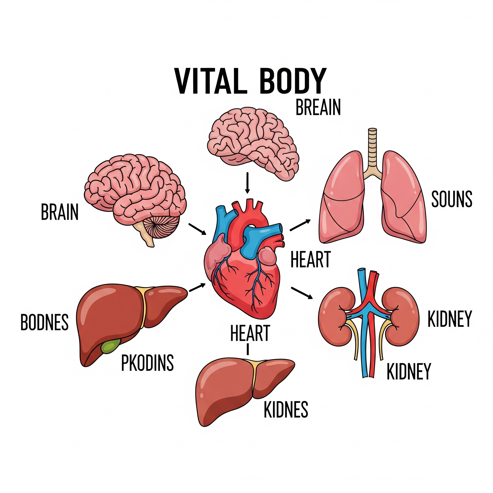

# Essential English Word 3
# Unit 20

## 1. beneath prep
### under something

The cat sits beneath the table.

The dog is sleeping beneath the tree.

He has put the box beneath the bed.

They have been hiding beneath the covers for an hour.

She found a coin beneath the rug.

We were walking beneath the stars.

The treasure had been buried beneath the ground.

It had been raining beneath the bridge all night.

I will place the book beneath the pillow.

Tomorrow, they will be working beneath the hot sun.

By noon, he will have finished digging beneath the wall.

By next week, she will have been living beneath the same roof for a year.

## 2. cub n
### a young animal like a bear or lion

A lion cub plays with its mother.

The bear cub is following its parent.

We have seen a tiger cub at the zoo.

The wolf cub has been sleeping soundly.

I saw a fox cub yesterday.

The small cub was drinking milk.

The mother bear had protected her cub.

The little cub had been trying to climb the tree.

The zoo will get a new lion cub.

This time tomorrow, the cub will be eating.

By next month, the cub will have grown bigger.

By the end of the day, the cub will have been playing for hours.

## 3. dawn n
### the time of day when light first appears

The birds sing at dawn.

The sky is getting light at dawn.

We have woken up before dawn.

The farmer has been working since dawn.

We left the house at dawn.

The sun was rising at dawn.

They had arrived before dawn.

It had been raining since dawn.

We will meet at dawn.

Tomorrow, I will be sleeping at dawn.

By dawn, the journey will have ended.

By 6 AM, the light will have been appearing since dawn.

## 4. dissatisfied adj
### not happy with something

He feels dissatisfied with the result.

She is feeling dissatisfied with her job.

They have been dissatisfied with the service.

I have been feeling dissatisfied lately.

The customer was dissatisfied.

We were feeling dissatisfied after the meal.

He had been dissatisfied before he complained.

She had been feeling dissatisfied for weeks.

You will be dissatisfied if you don't study.

Next week, I will be feeling dissatisfied with the progress.

By the end of the day, he will have become completely dissatisfied.

By the time the project finishes, they will have been feeling dissatisfied for months.

## 5. ease n
### a state of comfort or without difficulty

He does the work with ease.

She is living a life of ease.

They have found ease in their new home.

He has been working with ease all morning.

The task was completed with ease.

We were enjoying the ease of the journey.

The problem had been solved with ease.

She had been living in ease for years.

This tool will bring ease to the job.

Tomorrow, I will be working with ease.

By then, the system will have brought great ease.

By next year, they will have been living in ease for a decade.

## 6. evident adj
### clear to see or understand

His happiness is evident.

The truth is becoming evident.

The change has been evident to everyone.

His effort has been evident in his work.

Her fear was evident.

The problem was becoming evident.

The damage had been evident for days.

His tiredness had been evident all morning.

The result will be evident soon.

By tomorrow, the effect will be becoming evident.

By the end of the test, his knowledge will have been evident.

By the time they finish, the improvements will have been becoming evident for weeks.

## 7. hail n
### small balls of ice that fall like rain

Hail falls from the sky.

The sound of hail is hitting the roof.

We have seen heavy hail today.

The hail has been falling for ten minutes.

Hail damaged the car.

The hail was hitting the windows.

The crops had been destroyed by hail.

The ground had been covered in hail since the storm started.

There will be hail tomorrow.

This afternoon, the hail will be falling.

By evening, the hail will have stopped.

By the time we arrive, the hail will have been falling for an hour.

## 8. howl v
### to make a long, loud cry like a wolf or dog

The wolf howls at the moon.

The dog is howling outside.

We have heard the wind howl.

The baby has been howling all night.

The wind howled through the trees.

The injured animal was howling in pain.

The wolves had howled before the attack.

The dog had been howling for hours before we came home.

The wind will howl tonight.

Tomorrow evening, the wolves will be howling.

By midnight, the storm will have howled itself out.

By the time you get here, the dog will have been howling for an hour.

## 9. leap v
### to jump a long way or high

The frog leaps into the water.

The deer is leaping over the fence.

He has leaped across the gap.

The athlete has been leaping for practice.

The cat leaped onto the table.

The children were leaping with joy.

The fish had leaped out of the water.

The dancer had been leaping gracefully.

He will leap over the obstacle.

This afternoon, the monkeys will be leaping from tree to tree.

By the end of the show, the acrobats will have leaped many times.

By the time the race starts, he will have been leaping for warm-up.

## 10. magnificent adj
### very beautiful or impressive

The view is magnificent.

The building is looking magnificent.

We have seen a magnificent sunset.

The garden has been looking magnificent all summer.

The palace was magnificent.

The fireworks were looking magnificent.

The old castle had been magnificent.

The decorations had been looking magnificent for the party.

The new bridge will be magnificent.

Tomorrow, the flowers will be looking magnificent.

By then, the results will have been terrific.

By the end of the week, the artist will have been creating a magnificent painting.

## 11. necessity n
### something that you need

Food is a necessity for life.

Learning English is becoming a necessity.

We have understood the necessity of water.

The need for clean air has been a necessity for years.

Water was a necessity in the desert.

Safety was becoming a necessity.

Shelter had been a necessity during the storm.

Clean water had been a necessity for the village.

Education will be a necessity.

In the future, clean energy will be becoming a necessity.

By then, the importance of this necessity will have been clear.

By next year, this service will have been a necessity for the community.

## 12. outcome n
### the result of something

The outcome of the game is unknown.

The outcome of the meeting is becoming clear.

We have discussed the possible outcome.

The situation has been affecting the outcome.

The outcome was positive.

The outcome was becoming obvious.

The outcome had been decided.

The process had been influencing the outcome.

The outcome will be good.

Tomorrow, we will be waiting for the outcome.

By the end of the week, the outcome will have been announced.

By the time the project finishes, the team will have been working towards a positive outcome.

## 13. pile n
### a group of things on top of each other

There is a pile of books on the desk.

He is making a pile of leaves.

She has made a pile of clothes.

The snow has been forming a large pile.

I saw a pile of stones.

The children were building a sand pile.

The workers had created a pile of wood.

The machine had been creating a pile of waste.

We will make a pile of logs.

This afternoon, they will be sorting the pile of mail.

By evening, he will have finished the pile of work.

By the time you arrive, the laundry will have been sitting in a pile for days.

## 14. profound adj
### very deep or strong

His words have a profound effect.

The silence is becoming profound.

She has shown profound understanding.

The book has been having a profound impact.

The change was profound.

His sadness was becoming profound.

The discovery had a profound meaning.

The experience had been having a profound effect on him.

This event will have a profound influence.

Next year, the research will be having a profound effect.

By then, the message will have been understood profoundly.

By the end of the course, they will have been gaining profound knowledge.

## 15. seize v
### to take something quickly and strongly

He seizes the opportunity.

The police are seizing the illegal goods.

She has seized control.

They have been seizing power gradually.

The dog seized the ball.

The army was seizing the city.

The king had seized the throne.

The pirates had been seizing ships for months.

We will seize the moment.

Tomorrow, the team will be seizing the chance.

By noon, they will have seized the main building.

By the end of the day, the police will have been seizing evidence for hours.

## 16. squeeze v
### to press something firmly

She squeezes the orange.

He is squeezing the tube of toothpaste.

I have squeezed the lemon.

The machine has been squeezing the fruit.

We squeezed through the crowd.

She was squeezing his hand.

He had squeezed all the juice.

The factory had been squeezing oil from the seeds.

I will squeeze the sponge.

This evening, she will be squeezing the stress ball.

By then, he will have squeezed the last drop.

By the time the process finishes, the machine will have been squeezing for hours.

## 17. supreme adj
### highest in rank or importance

He is the supreme leader.

The court is making a supreme decision.

They have reached the supreme level.

The team has been showing supreme effort.

It was a supreme act of courage.

The general was holding supreme command.

The law had been declared supreme.

The artist had been creating a work of supreme beauty.

This will be the supreme test.

Next year, the council will be making a supreme judgment.

By then, his supreme authority will have been established.

By the end of the project, they will have been working with supreme dedication.

## 18. terrific adj
### very good or great

This food is terrific.

The weather is looking terrific.

We have had a terrific time.

The band has been playing terrific music.

The party was terrific.

The view was looking terrific.

The performance had been terrific.

The team had been showing terrific spirit.

The concert will be terrific.

Tomorrow, the show will be looking terrific.

By then, the results will have been terrific.

By the end of the trip, we will have been having a terrific experience.

## 19. trait n
### a quality that is part of someone's character

Honesty is a good trait.

Kindness is becoming a common trait.

We have observed this trait in him.

This trait has been developing over time.

Patience was his best trait.

Loyalty was becoming a rare trait.

This trait had been passed down.

The animal had been showing this trait since birth.

This will be a useful trait.

In the future, this trait will be becoming more important.

By then, this trait will have been fully formed.

By the end of the training, they will have been developing this trait.

## 20. vital adj
### very important or necessary

Water is vital for life.

This information is becoming vital.

We have learned a vital lesson.

The heart has been performing a vital function.

Air was vital for survival.

The decision was becoming vital.

The missing part had been vital.

The engine had been performing a vital role.

This step will be vital.

Next week, this meeting will be becoming vital.

By then, the vital supplies will have arrived.

By the end of the project, this team will have been playing a vital part.

### LITTLE WOLF AND MOTHER WOLF

Mother Wolf was a **magnificent** animal. She had all the **traits** of a **terrific** hunter. She was very strong and fast. She knew how to hide and how to **seize** prey. Mother Wolf was the forest’s **supreme** creature. Her skills were **evident** to all the other animals.

Mother Wolf lived in a den **beneath** a tree with her **cub**, Little Wolf. At **dawn**, Little Wolf and Mother Wolf were eating breakfast. Little Wolf looked sad. Mother Wolf said, “ What is wrong, my **cub**?”

Little Wolf said, “ I want to be big like you. You can run and **leap** better than anyone. You can **howl** so loudly. Being big is a **necessity**, and I am so small.”

Mother Wolf said, “ Don’t be **dissatisfied** with your size. Being small can be very helpful sometimes.”

Just then, rain and **hail** began to fall. The tree was hit by lightning. It fell on the wolves’ den. Little Wolf was scared. The wolves knew that escaping the den was **vital**. Mother Wolf said, “ Little Wolf, I cannot move the heavy **pile** of branches. But you can escape with **ease**. You can get out and find help!”

Little Wolf crawled out of the den and called all the large animals for help. They went to the den and pulled away the branches. Mother Wolf came out and said, “ Thank you Little Wolf! You saved my life!” She softly **squeezed** Little Wolf and kissed her.

Little Wolf smiled. She said, “ Mother, this **outcome** has taught me a **profound** lesson. Even though I’m small, I’m still important.”

