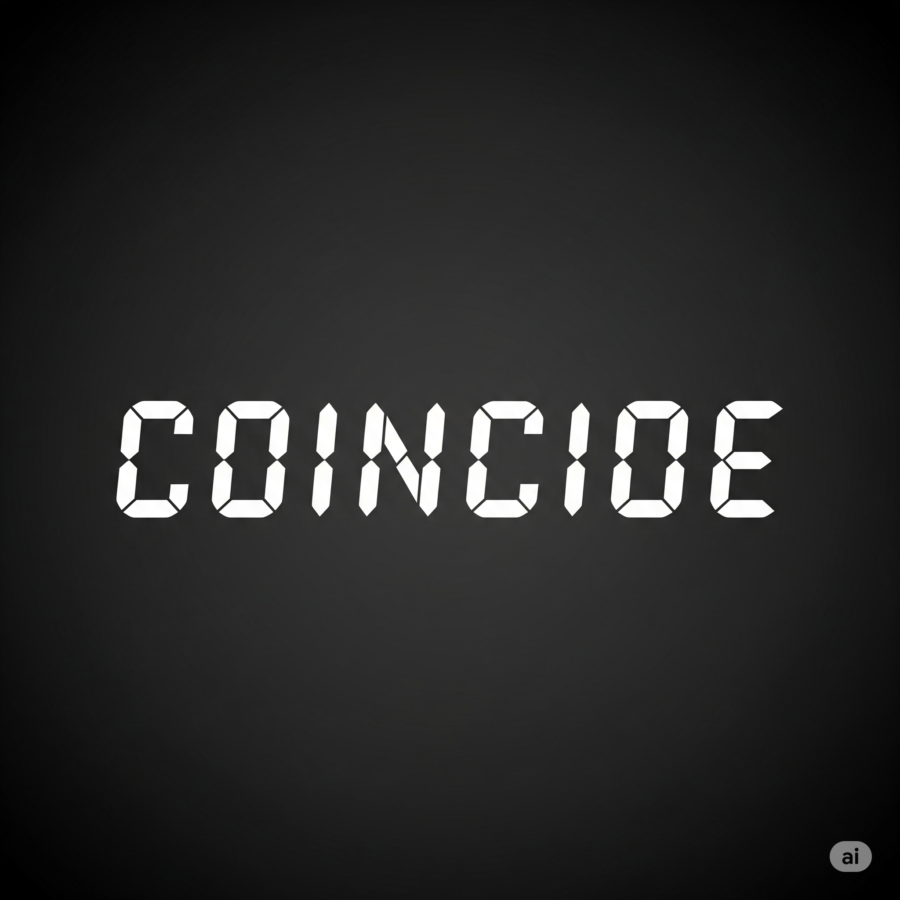
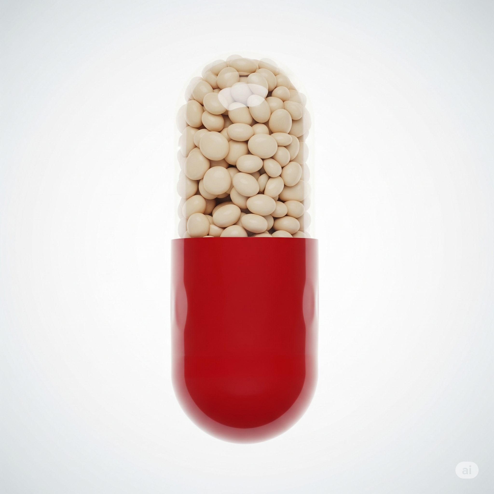
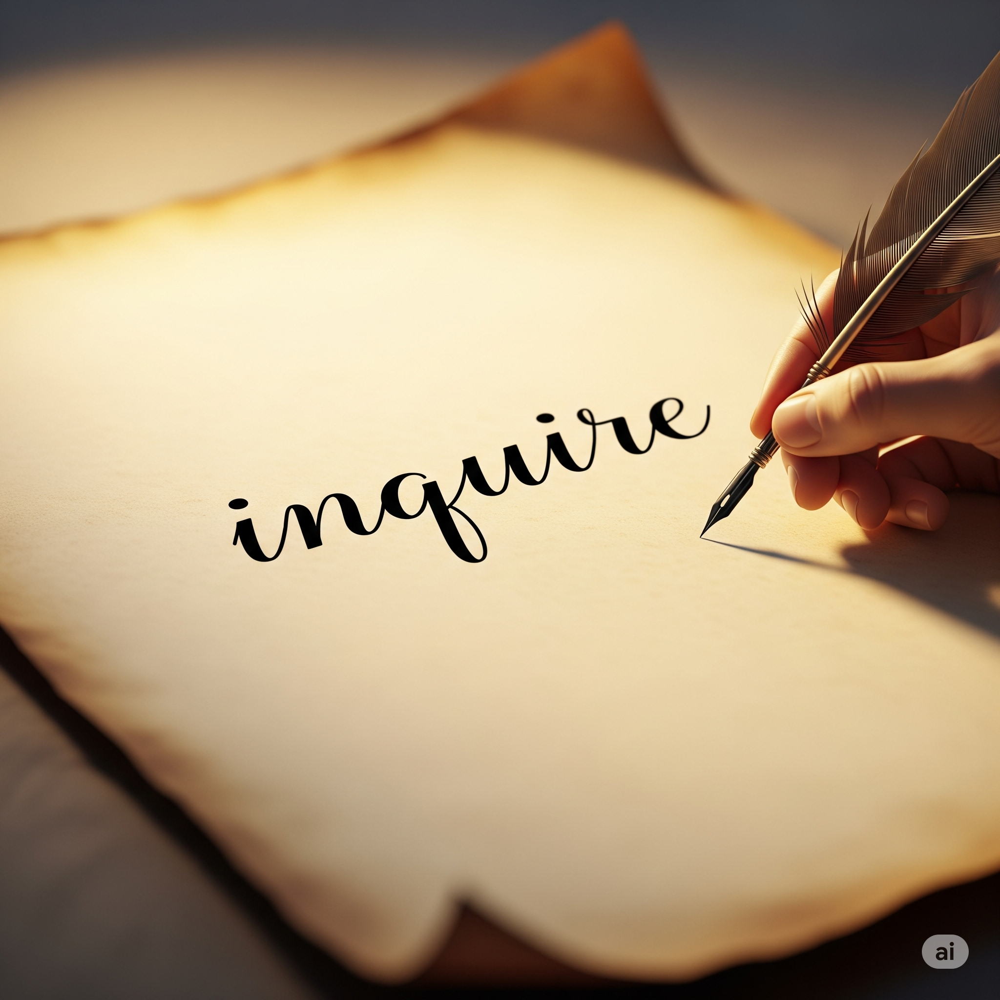

# Essential English Word 3
# Unit 22
## 1. accommodate v
### định nghĩa
cung cấp chỗ ở hoặc không gian cho ai đó/cái gì đó.

The hotel can accommodate many guests.

They are accommodating the new students.

We have accommodated all requests.

He accommodated my needs yesterday.

They were accommodating the crowd.

Before, I had not accommodated such a large group.

The room will accommodate the furniture.

She is going to accommodate us.

It can accommodate up to ten people.

You should accommodate their wishes.

I would accommodate you if I could.

Please accommodate this change.

## 2. circus n
### định nghĩa
một buổi biểu diễn với động vật, người nhào lộn, chú hề, thường diễn ra trong lều lớn.

The circus is in town.

Children are watching the circus.

They have seen the circus before.

We went to the circus last year.

They were enjoying the circus show.

Before, I had never been to a circus.

You will love the circus.

We are going to the circus tomorrow.

A circus can be fun.

You should visit the circus.

I would like to see the circus.

Let's go to the circus!

## 3. coincide v
### định nghĩa
xảy ra cùng lúc.

My birthday coincides with a holiday.

Their visits are coinciding this week.

The events have coincided perfectly.

His arrival coincided with the party.

Our breaks were coinciding.

Before, our schedules had not coincided.

The meeting will coincide with lunch.

The two shows are going to coincide.

These dates can coincide.

Your trip should coincide with mine.

I would be happy if they coincided.

Try to make them coincide.

## 4. commission v
### định nghĩa
yêu cầu ai đó làm một công việc đặc biệt, thường là nghệ thuật.

He commissions paintings.

She is commissioning a portrait.

They have commissioned a new building.

He commissioned the work last month.

We were commissioning a report.

Before, I had not commissioned any art.

You will commission a song.

I am going to commission a sculpture.

You can commission custom work.

You should commission a local artist.

I would commission a piece for my home.

Commission a design.

## 5. dose n
### định nghĩa
một lượng thuốc cụ thể; một lượng nhỏ của cái gì đó.

Take one dose of this medicine.

She is taking her dose now.

They have taken their first dose.

He took a dose this morning.

We were measuring the correct dose.

Before, I had not needed a dose.

You will need another dose.

He is going to get a dose.

You can take a small dose.

You should not exceed the dose.

I would take a dose if I felt sick.

Take your dose.

## 6. dye v
### định nghĩa
thay đổi màu sắc của cái gì đó, thường là vải hoặc tóc.

She dyes her hair.

They are dyeing the fabric.

He has dyed his shirt blue.

She dyed her hair red last week.

We were dyeing eggs for Easter.

Before, I had not dyed anything.

You will dye your clothes.

I am going to dye my hair.

You can dye it any color.

You should dye it carefully.

I would dye it if I wanted a change.

Dye the cloth green.

## 7. extent n
### định nghĩa
mức độ hoặc phạm vi của cái gì đó.

I agree to some extent.

She is showing the extent of the damage.

They have understood the full extent.

He realized the extent of the problem.

We were discussing the extent of the project.

Before, I had not known the extent of his knowledge.

You will see the extent of the work.

We are going to measure the extent.

The extent can be large.

You should consider the extent of the risk.

I would not go to that extent.

Know the full extent.

## 8. gender n
### định nghĩa
giới tính (nam hoặc nữ).

Please state your gender.

They are asking about gender.

We have recorded the gender information.

He asked about my gender.

They were checking the gender balance.

Before, I had not thought about gender roles.

You will need to specify your gender.

The form is going to ask for gender.

Both genders are welcome.

You should not discriminate based on gender.

I would ask about gender if it was relevant.

Indicate your gender.

## 9. headline n
### định nghĩa
tiêu đề lớn ở đầu bài báo.

Read the headline.

They are writing the headline.

The newspaper has a big headline.

He saw the headline this morning.

We were discussing the headline news.

Before, I had not noticed that headline.

You will see the headline tomorrow.

They are going to change the headline.

A headline can be catchy.

You should read the headline first.

I would write a better headline.

Look at the headline!

## 10. informal adj
### định nghĩa
không trang trọng, thân mật.

It was an informal meeting.

They are having an informal chat.

We have made informal plans.

He gave an informal presentation.

They were having an informal dinner.

Before, I had not attended such an informal event.

The dress code will be informal.

We are going to have an informal party.

It can be informal.

You should keep it informal.

I would prefer an informal setting.

Let's keep it informal.

## 11. inquire v
### định nghĩa
hỏi thông tin.

I will inquire about the price.

She is inquiring about the job.

They have inquired about the schedule.

He inquired about the room yesterday.

We were inquiring about the details.

Before, I had not inquired about it.

You will inquire later.

I am going to inquire about the status.

You can inquire by email.

You should inquire if you have questions.

I would inquire if I were you.

Please inquire at the desk.

## 12. messenger n
### định nghĩa
người mang tin nhắn hoặc thông điệp.

The messenger arrived.

She is waiting for the messenger.

They have sent a messenger.

He was a messenger for the king.

We were talking to the messenger.

Before, I had not received a message from a messenger.

A messenger will bring the letter.

They are going to send a messenger.

A messenger can be fast.

You should give the message to the messenger.

I would trust the messenger.

Wait for the messenger.

## 13. peer v
### định nghĩa
nhìn kỹ hoặc nhìn chăm chú.

He peers through the window.

She is peering at the small print.

They have peered into the darkness.

He peered at the map.

We were peering at the distant object.

Before, I had not peered so closely.

You will peer into the box.

She is going to peer around the corner.

You can peer through the hole.

You should peer carefully.

I would peer to see better.

Peer closely at it.

## 14. portrait n
### định nghĩa
bức tranh, bức ảnh hoặc mô tả về một người.

She painted a portrait.

He is looking at the portrait.

They have finished the portrait.

She drew a portrait of me.

We were admiring the portrait.

Before, I had not seen such a beautiful portrait.

You will see the portrait in the museum.

I am going to hang the portrait.

A portrait can capture a person.

You should get a portrait painted.

I would like a portrait of my family.

Look at this portrait.

## 15. pose v
### định nghĩa
giữ một vị trí cụ thể để chụp ảnh hoặc vẽ tranh.

She poses for photos.

He is posing for the artist.

They have posed together.

She posed for the picture yesterday.

We were posing for a group photo.

Before, I had not posed professionally.

You will pose for the camera.

They are going to pose for a picture.

You can pose like this.

You should pose naturally.

I would pose if you asked me.

Please pose for the photo.

## 16. ranch n
### định nghĩa
một trang trại lớn, đặc biệt là ở Mỹ, nơi nuôi gia súc.

He lives on a ranch.

They are working on the ranch.

We have visited the ranch.

He bought the ranch last year.

They were managing the ranch.

Before, I had not been to a ranch.

You will visit the ranch next summer.

We are going to buy a ranch.

A ranch can be very large.

You should see their ranch.

I would love to live on a ranch.

Visit the ranch.

## 17. steer v
### định nghĩa
điều khiển hướng đi của xe, thuyền, v.v.

He steers the boat.

She is steering the car.

They have steered clear of trouble.

He steered the ship to the harbor.

We were steering the raft down the river.

Before, I had not steered a vehicle.

You will steer the bike.

I am going to steer the conversation.

You can steer it this way.

You should steer carefully.

I would steer left here.

Steer the car straight.

## 18. stripe n
### định nghĩa
một đường màu khác trên bề mặt.

The shirt has stripes.

She is drawing a stripe.

They have painted stripes on the wall.

He saw a tiger with stripes.

We were counting the stripes.

Before, I had not seen such wide stripes.

The flag will have stripes.

They are going to add a stripe.

A stripe can be thin or thick.

You should paint a stripe here.

I would like a shirt with stripes.

Draw a stripe.

## 19. tame adj
### định nghĩa
(động vật) đã được huấn luyện để không sợ người và sống gần người.

The bird is tame.

They are making the animal tame.

He has a tame rabbit.

The lion was tame in the circus.

We were surprised by how tame it was.

Before, I had not seen such a tame creature.

The dog will become tame.

She is going to get a tame pet.

Some animals can be tame.

You should be gentle with tame animals.

I would like a tame cat.

Is it tame?

## 20. tempt v
### định nghĩa
làm cho ai đó muốn làm điều gì đó, đặc biệt là điều không tốt.

The offer tempts me.

She is tempting him with candy.

They have tempted fate.

The smell tempted me to eat.

We were tempting the dog with a treat.

Before, I had not been tempted by such things.

The dessert will tempt you.

He is going to tempt her.

Money can tempt people.

You should not tempt him.

I would be tempted to buy it.

Don't tempt me!

## THE CIRCUS

Ben was unhappy. He lived on a **_ranch_** near a small town, and he didn’t have many friends. Then one day a **_messenger_** came to the **_ranch_**. He showed the **_headline_** in the town newspaper. The **_circus_** was coming to the town. It even **_coincided_** with Ben’s birthday!

Ben was very excited as his father **_steered_** the car through the town. The **_circus_** couldn’t **_accommodate_** all the people who wanted to see the show, but Ben had a ticket.

Ben **_peered_** at the activity around him. He watched people of both **_genders_** dance all around. They wore funny costumes, and their hair was **_dyed_** many different colors. Also, **_tame_** tigers with **_stripes_** on their fur did tricks. Outside, people could **_commission_** an **_informal_** **_portrait_**. They **_posed_** in front of a funny picture while an artist quickly drew them. Ben couldn’t believe it. He was happier than he had ever been before.

That day, Ben knew what he wanted to do. He loved the **_circus_** to such an **_extent_** that he wanted to have his own **_circus_** when he grew older.

Seeing the **_circus_** was like a **_dose_** of medicine for him. He wasn’t unhappy anymore. He felt special. He **_inquired_** about what he needed to do to have his own **_circus_**. He studied hard and learned about business.

Ben worked very hard, and one day, he had his own **_circus_**. It was a great **_circus_**. People told him that he could be very rich. But he wasn’t **_tempted_** by money. He just wanted to make children happy. He knew the **_circus_** had changed his life, and he wanted to do the same thing for others.

-------------

Ben was unhappy. He lived on a ranch near a small town, and he didn’t have many friends. Then one day a messenger came to the ranch. He showed the headline in the town newspaper. The circus was coming to the town. It even coincided with Ben’s birthday!

Ben was very excited as his father steered the car through the town. The circus couldn’t accommodate all the people who wanted to see the show, but Ben had a ticket.

Ben peered at the activity around him. He watched people of both genders dance all around. They wore funny costumes, and their hair was dyed many different colors. Also, tame tigers with stripes on their fur did tricks. Outside, people could commission an informal portrait. They posed in front of a funny picture while an artist quickly drew them. Ben couldn’t believe it. He was happier than he had ever been before.

That day, Ben knew what he wanted to do. He loved the circus to such an extent that he wanted to have his own circus when he grew older.

Seeing the circus was like a dose of medicine for him. He wasn’t unhappy anymore. He felt special. He inquired about what he needed to do to have his own circus. He studied hard and learned about business.

Ben worked very hard, and one day, he had his own circus. It was a great circus. People told him that he could be very rich. But he wasn’t tempted by money. He just wanted to make children happy. He knew the circus had changed his life, and he wanted to do the same thing for others.