# Essential English Word 3
# Unit 26
## 1. alter v
### định nghĩa
thay đổi điều gì đó một chút.
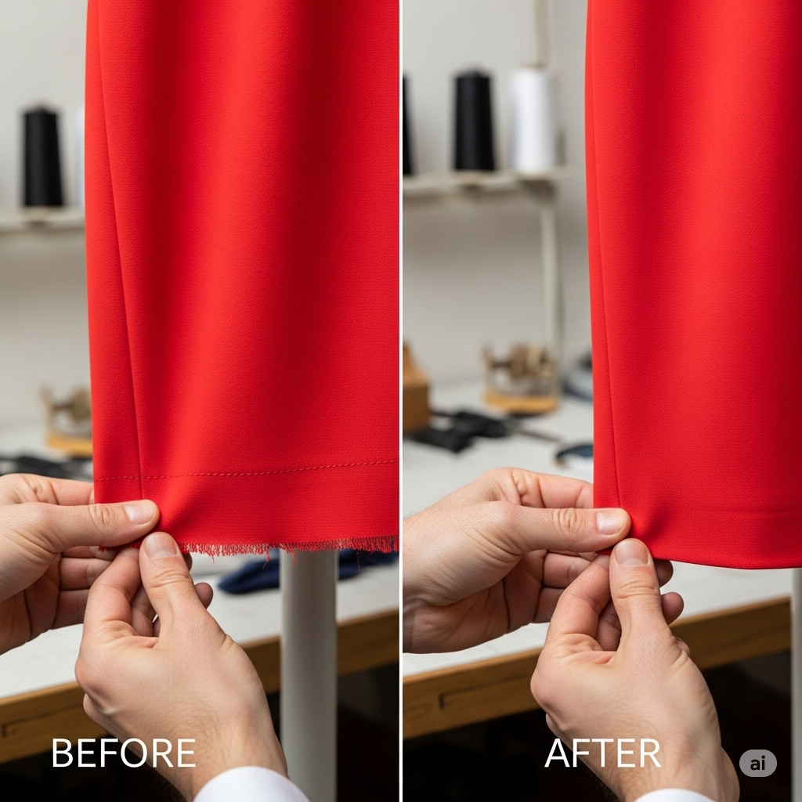
He alters his clothes.

She is altering the plan.

They have altered the design.

He altered the time of the meeting.

We were altering the document.

Before, I had not altered anything.

You will alter your opinion.

I am going to alter the recipe.

You can alter the settings.

You should alter your approach.

I would alter it if I could.

Alter the size.

## 2. aside adv
### định nghĩa
sang một bên, để riêng ra.

He stepped aside.

She is putting money aside.

They have set aside time.

He moved the chair aside.

We were putting the books aside.

Before, I had not put anything aside.

You will put it aside.

I am going to step aside.

You can put it aside for later.

You should set aside some time.

I would put that idea aside.

Step aside, please.

## 3. autumn n
### định nghĩa
mùa thu (mùa sau mùa hè và trước mùa đông).

Autumn is my favorite season.

The leaves are falling in autumn.

We have enjoyed the autumn colors.

He visited in autumn last year.

They were preparing for autumn.

Before, I had not seen such a beautiful autumn.

Autumn will arrive soon.

It is going to be a warm autumn.

Autumn can be cool.

You should visit in autumn.

I would love to see the leaves change in autumn.

Enjoy the autumn weather.

## 4. blend v
### định nghĩa
trộn lẫn, hòa quyện (kết hợp hai hoặc nhiều thứ lại với nhau).
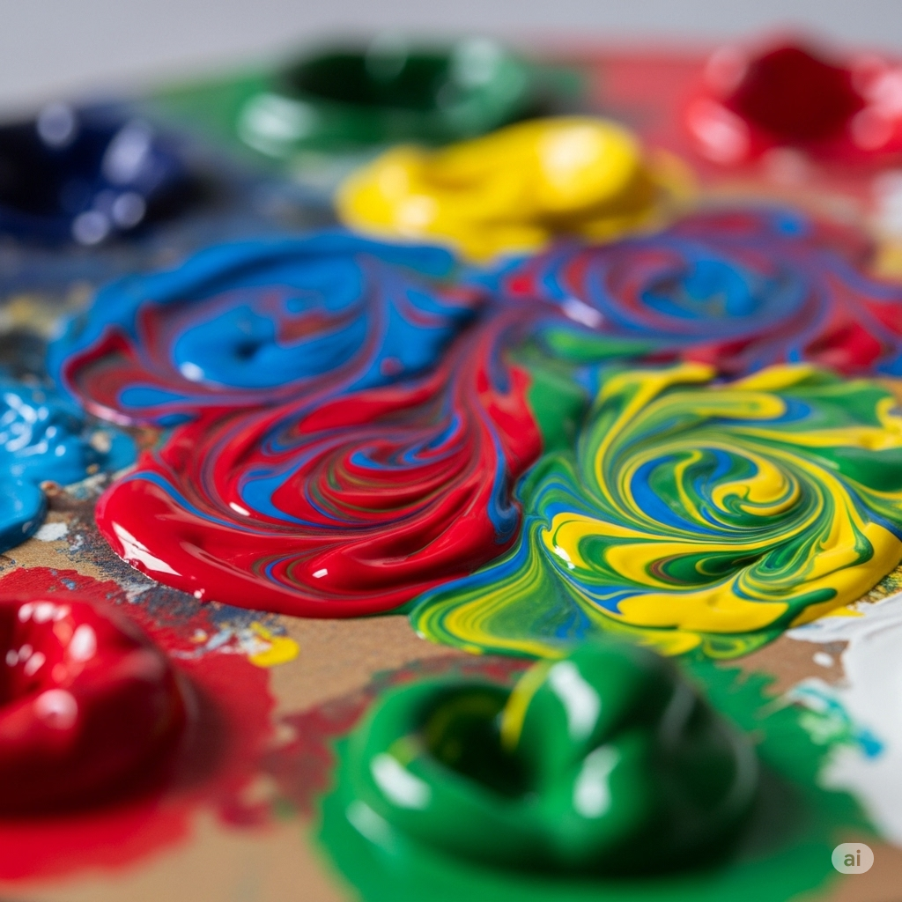
She blends the ingredients.

He is blending the colors.

They have blended the tea.

She blended the fruit for a smoothie.

We were blending the spices.

Before, I had not blended these flavors.

You will blend the mixture.

I am going to blend the paint.

These colors can blend well.

You should blend it until smooth.

I would blend them together.

Blend the ingredients.

## 5. collapse v
### định nghĩa
đổ sập, sụp đổ (rơi xuống đột ngột).
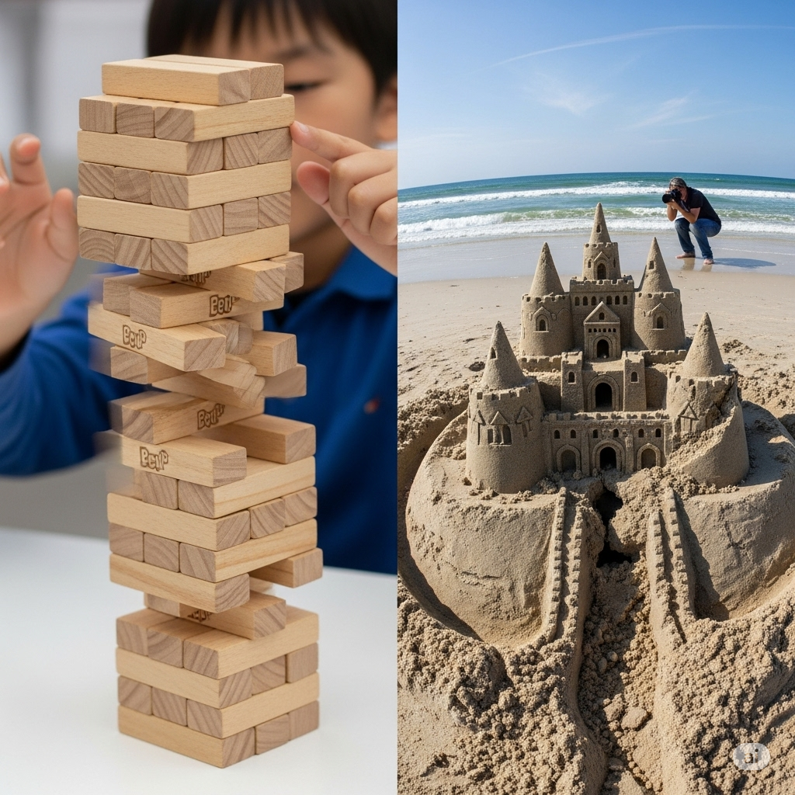
The building collapses.

He is collapsing from exhaustion.

The bridge has collapsed.

The old house collapsed last night.

They were collapsing under the pressure.

Before, I had not seen a building collapse.

The structure will collapse.

It is going to collapse soon.

It can collapse easily.

You should leave before it collapses.

I would be scared if it collapsed.

The tent collapsed.

## 6. crush v
### định nghĩa
nghiền nát, ép mạnh (làm cho cái gì đó bị biến dạng hoặc vỡ vụn).
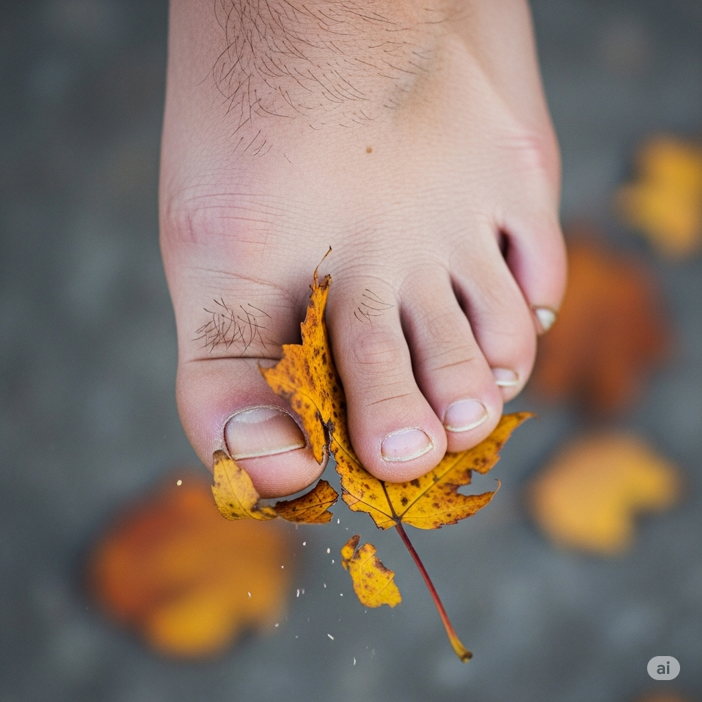
He crushes the can.

She is crushing the grapes.

They have crushed the stones.

He crushed the paper in his hand.

We were crushing ice for drinks.

Before, I had not crushed anything hard.

You will crush it if you step on it.

I am going to crush the garlic.

It can crush easily.

You should crush the herbs finely.

I would crush it with a hammer.

Crush the berries.

## 7. curve v
### định nghĩa
uốn cong, tạo đường cong.

The road curves here.

She is curving the wire.

The path has curved to the left.

The river curved around the hill.

They were curving the metal.

Before, it had not curved like this.

The line will curve upwards.

It is going to curve sharply.

It can curve gently.

You should curve the edges.

I would curve it slightly.

The path curves.

## 8. disgusting adj
### định nghĩa
rất khó chịu, kinh tởm.
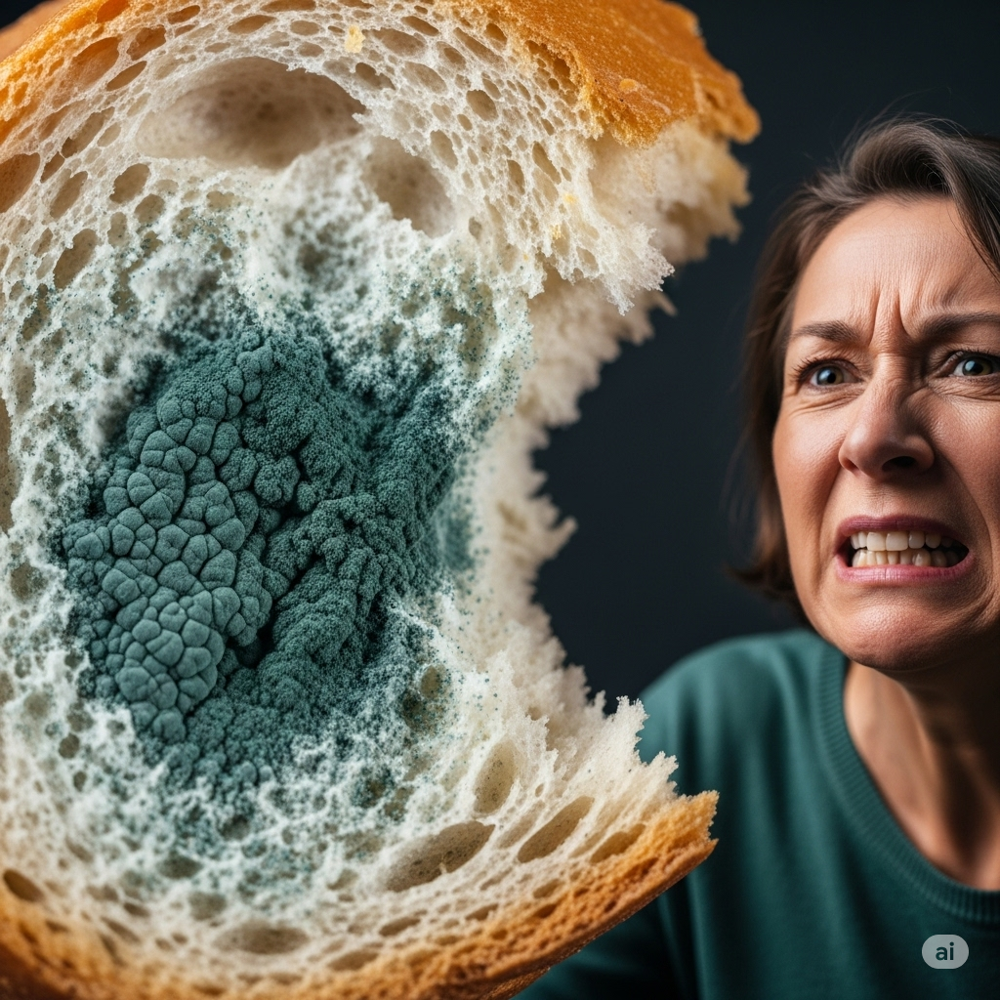
That food is disgusting.

He is making a disgusting mess.

They have found something disgusting.

It smelled disgusting.

We were looking at something disgusting.

Before, I had not eaten anything so disgusting.

It will be disgusting if you don't clean it.

That is going to be disgusting.

It can be disgusting.

You should not eat that, it's disgusting.

I would feel sick if I ate that disgusting thing.

It looks disgusting.

## 9. drain n
### định nghĩa
ống thoát nước; sự tiêu hao (năng lượng, tiền bạc).
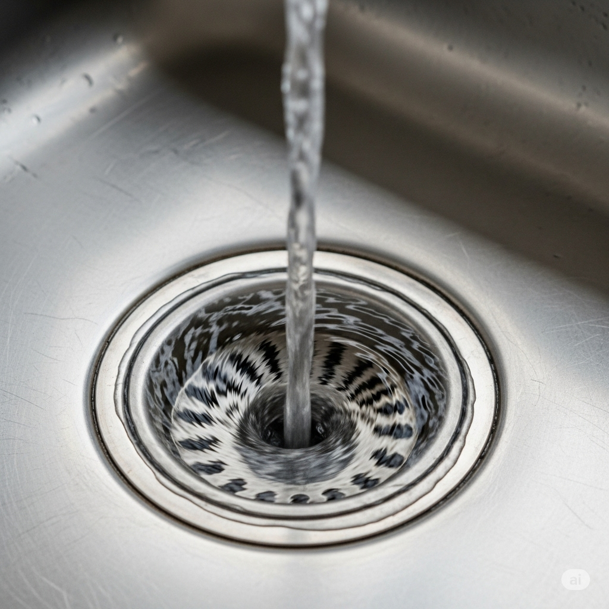
The drain is blocked.

She is cleaning the drain.

They have fixed the drain.

He saw water going down the drain.

We were clearing the drain.

Before, the drain had not been blocked.

The drain will need cleaning.

It is going to be a drain on resources.

The drain can be slow.

You should check the drain.

I would fix the drain myself.

Clear the drain.

## 10. embrace v
### định nghĩa
ôm chặt; chấp nhận một ý tưởng hoặc thay đổi.

They embrace each other.

She is embracing the opportunity.

They have embraced the new culture.

He embraced his friend warmly.

We were embracing the challenge.

Before, I had not embraced change easily.

You will embrace the future.

I am going to embrace this idea.

You can embrace new experiences.

You should embrace the moment.

I would embrace you if you were here.

Embrace the change.

## 11. envy v
### định nghĩa
ghen tị (muốn có những gì người khác có).

He envies her success.

She is envying his freedom.

They have envied our lifestyle.

He envied his brother's toys.

We were envying their vacation.

Before, I had not envied anyone.

You will envy their happiness.

I am going to envy your new car.

You can envy others.

You should not envy others.

I would envy that view.

Don't envy him.

## 12. fireworks n
### định nghĩa
pháo hoa (thiết bị tạo ra ánh sáng và tiếng ồn khi đốt, dùng trong lễ kỷ niệm).

We watched the fireworks.

They are setting off fireworks.

There have been fireworks every night.

He saw fireworks on New Year's Eve.

We were enjoying the fireworks display.

Before, I had not seen such beautiful fireworks.

There will be fireworks tonight.

They are going to have fireworks.

Fireworks can be loud.

You should watch the fireworks from a safe distance.

I would love to see the fireworks.

Watch the fireworks.

## 13. flour n
### định nghĩa
bột mì (bột mịn làm từ ngũ cốc, dùng để làm bánh mì, bánh ngọt).
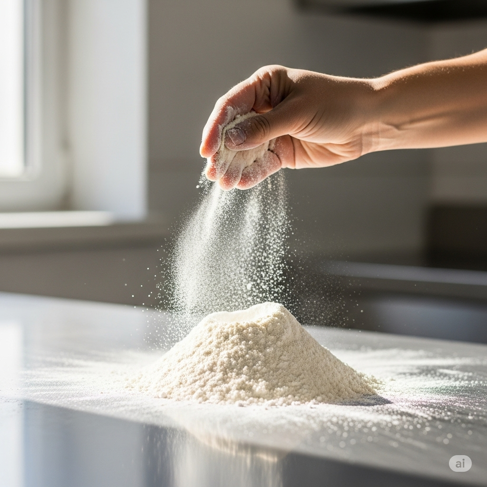
We need flour for the cake.

She is measuring the flour.

They have bought a bag of flour.

He spilled flour on the floor.

We were mixing the flour and water.

Before, I had not used this type of flour.

You will need more flour.

I am going to buy some flour.

Flour can be white or brown.

You should add the flour slowly.

I would use whole wheat flour.

Add the flour.

## 14. fuse n
### định nghĩa
cầu chì (thiết bị an toàn trong hệ thống điện); dây cháy chậm (để đốt pháo).
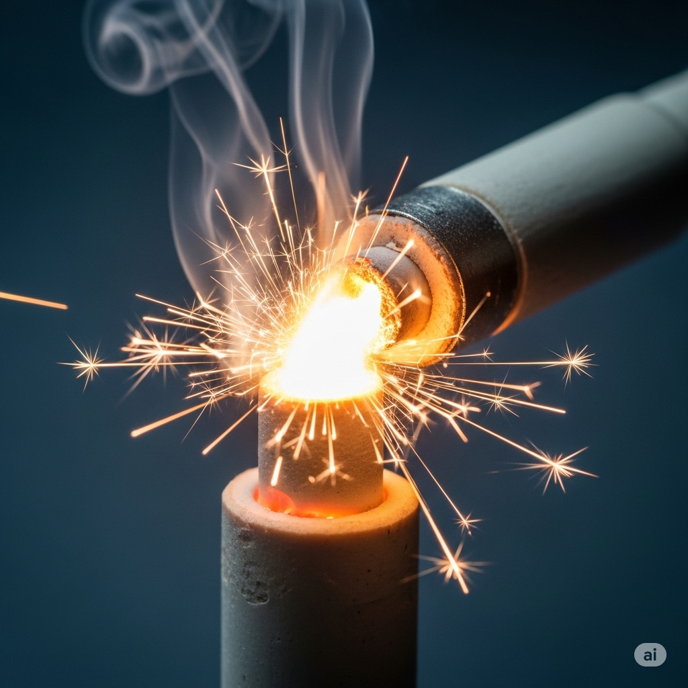
The fuse blew.

He is replacing the fuse.

They have checked the fuse box.

The fuse broke yesterday.

We were looking for the correct fuse.

Before, I had not changed a fuse.

You will need a new fuse.

I am going to check the fuse.

A fuse can protect the circuit.

You should use the right fuse.

I would replace the fuse.

Check the fuse.

## 15. ginger n
### định nghĩa
gừng (một loại củ có vị cay, dùng làm gia vị hoặc thuốc).

I like ginger tea.

She is grating ginger.

They have planted ginger.

He added ginger to the soup.

We were cutting fresh ginger.

Before, I had not cooked with ginger.

You will need some ginger.

I am going to buy ginger.

Ginger can be spicy.

You should add ginger for flavor.

I would use ginger in this recipe.

Add ginger.

## 16. jealous adj
### định nghĩa
ghen tị (cảm thấy không vui vì người khác có điều bạn muốn); ghen tuông (sợ mất người mình yêu).
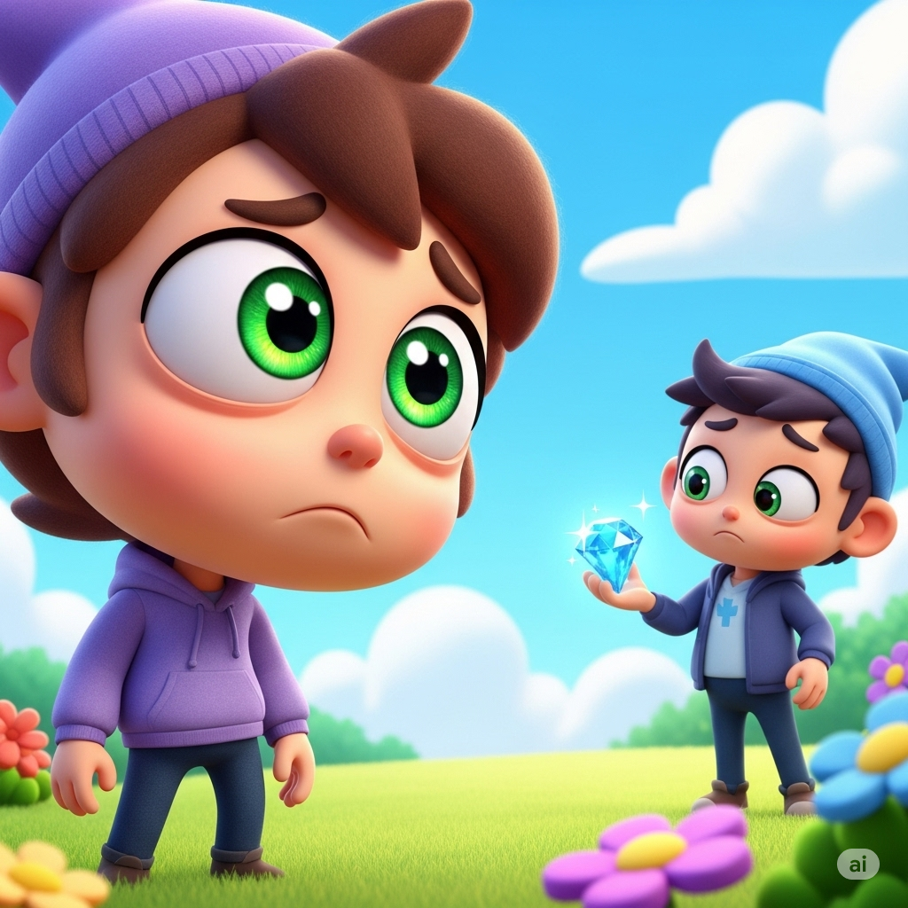
He is jealous of her success.

She is feeling jealous.

They have been jealous of each other.

He was jealous when she talked to him.

We were feeling jealous.

Before, I had not been jealous.

You will be jealous.

I am going to be jealous.

You can be jealous.

You should not be jealous.

I would feel jealous in that situation.

Don't be jealous.

## 17. paste n
### định nghĩa
hỗn hợp mềm, sệt (như kem đánh răng, hồ dán).
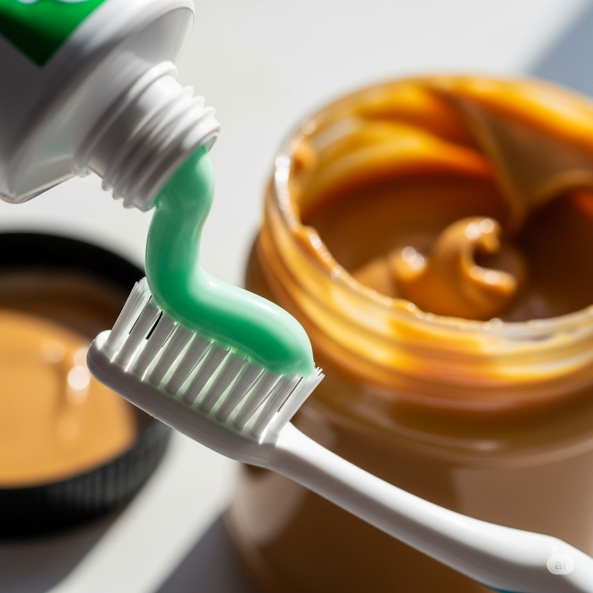
Use this paste to stick it.

She is making a paste.

They have used too much paste.

He applied the paste to the wall.

We were mixing the paste.

Before, I had not used this kind of paste.

You will need more paste.

I am going to buy some paste.

This paste can be sticky.

You should spread the paste evenly.

I would use a strong paste.

Apply the paste.

## 18. receipt n
### định nghĩa
biên lai (mảnh giấy chứng minh bạn đã trả tiền cho cái gì đó).
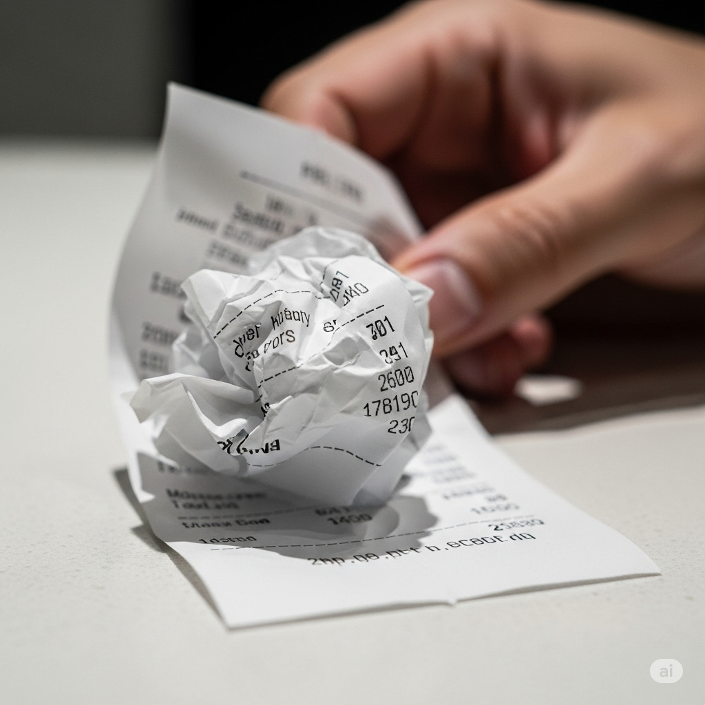
Keep your receipt.

She is looking for the receipt.

They have given me the receipt.

He lost the receipt yesterday.

We were checking the receipt.

Before, I had not needed a receipt.

You will get a receipt.

I am going to ask for a receipt.

A receipt can be important.

You should keep your receipts.

I would ask for a receipt.

Give me the receipt.

## 19. wipe v
### định nghĩa
lau chùi (dùng vải hoặc giấy để làm sạch bề mặt).
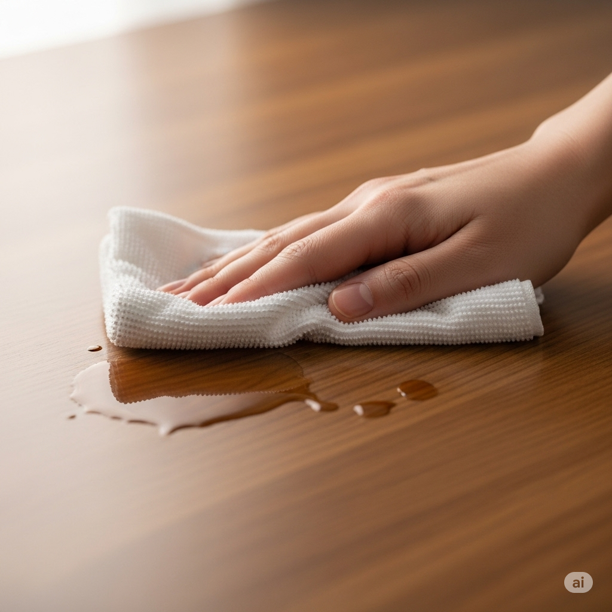
He wipes the table.

She is wiping the window.

They have wiped the floor.

He wiped his hands on a towel.

We were wiping the dust.

Before, I had not wiped it clean.

You will wipe the counter.

I am going to wipe the mirror.

You can wipe it with a cloth.

You should wipe it regularly.

I would wipe it if it was dirty.

Wipe the surface.

## 20. wire n
### định nghĩa
dây kim loại (sợi kim loại mỏng, dùng để dẫn điện hoặc làm hàng rào).
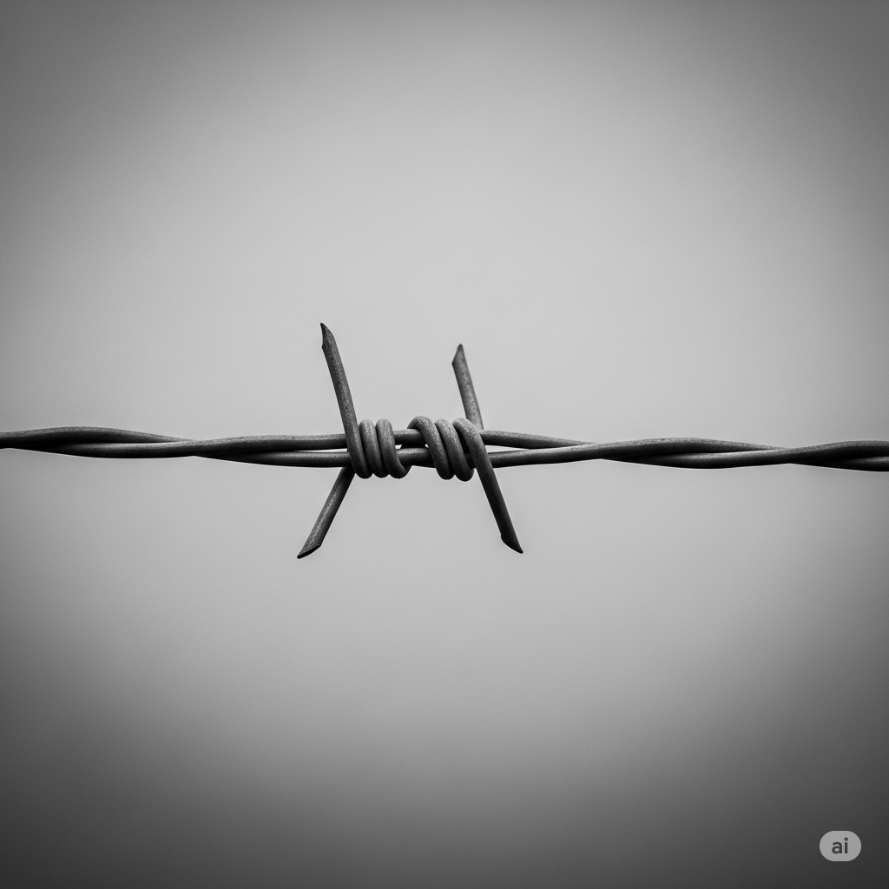
The wire is broken.

He is cutting the wire.

They have connected the wires.

He saw a bird on the wire.

We were fixing the wire.

Before, I had not worked with wire.

You will need some wire.

I am going to buy wire.

Wire can conduct electricity.

You should be careful with live wires.

I would use a thicker wire.

Cut the wire.

## Everyone is Special

When I was young, everything that went wrong in my house seemed to be my fault. Once, my brothers tried to make cookies. They **blended** **flour** and **ginger** and made a **disgusting** **paste**. Then they tried to wash it down the **drain**, but it got all over the floor. Later, my brothers said that I did it and I had to **wipe** it up.

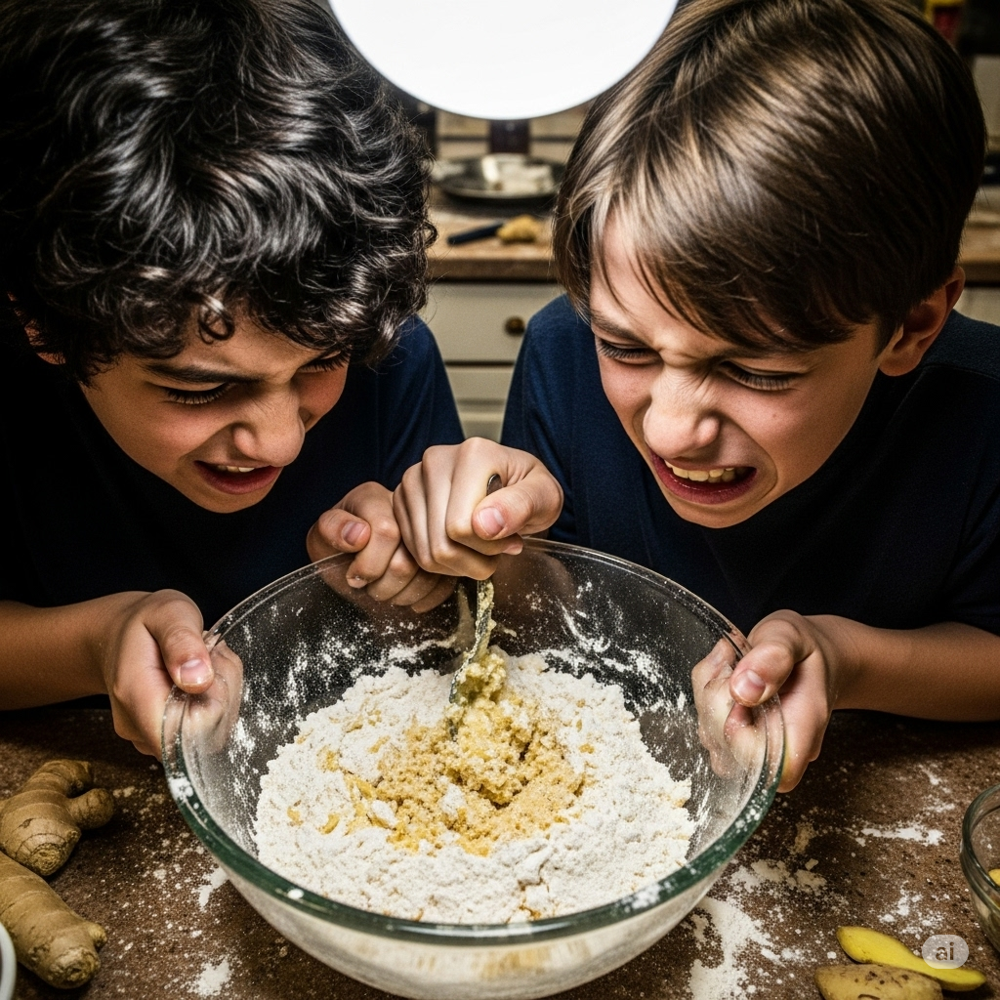

I worried that my parents liked them more than me. One **autumn** day, I was sure I would make my parents proud. I bought a model rocket. After I put it together, I invited everybody to watch it. I wanted my brothers to **envy** my technical knowledge. I lit the **fuse**, but nothing happened.

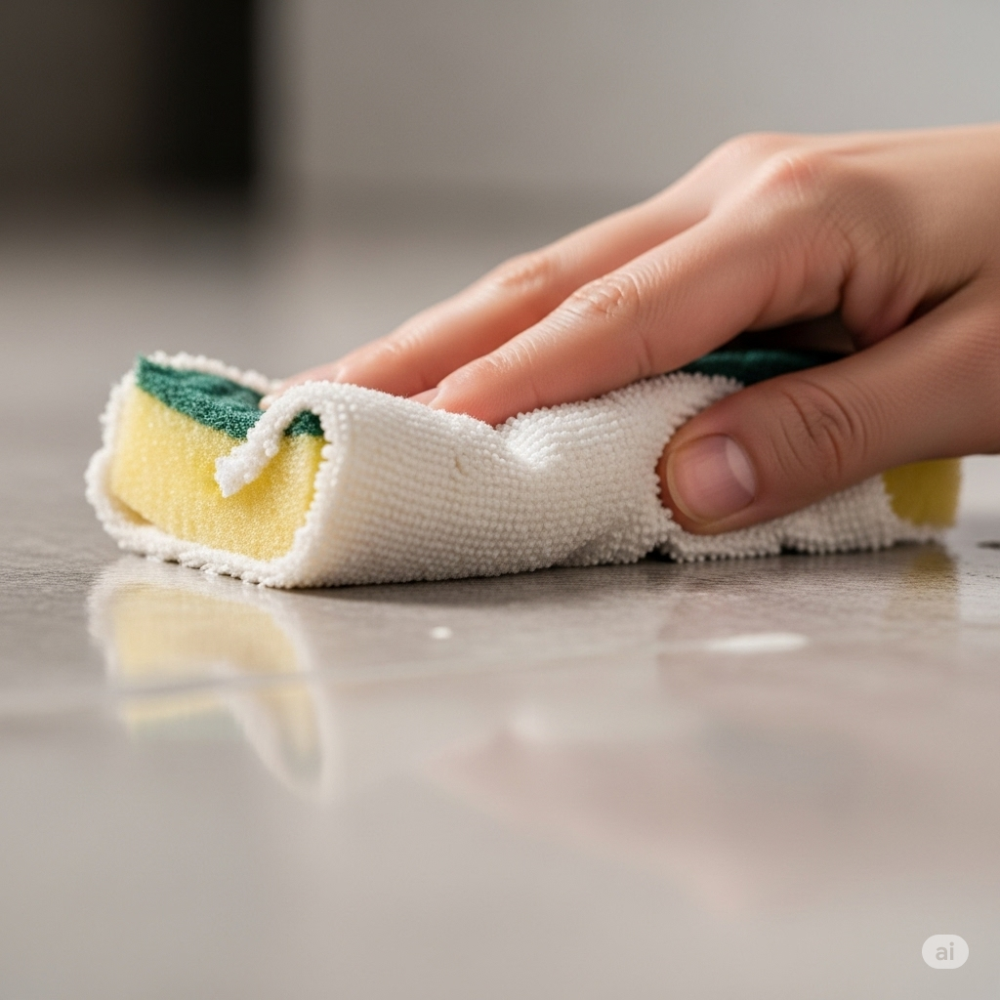

“ Looks like your **fireworks** don’t work. I hope you kept the **receipt** so you can return them,” my brother said.

“ It’s not **fireworks**!” I screamed. They were making fun of me again.

I didn’t know what went wrong. I hadn’t **altered** anything. I quickly moved the **wires** on the bottom, hoping that would help. Suddenly, the rocket flew up. We stood **aside** as it **curved** through the lawn and ran straight into the mailbox. Then the mailbox **collapsed**. The rocket was **crushed**.

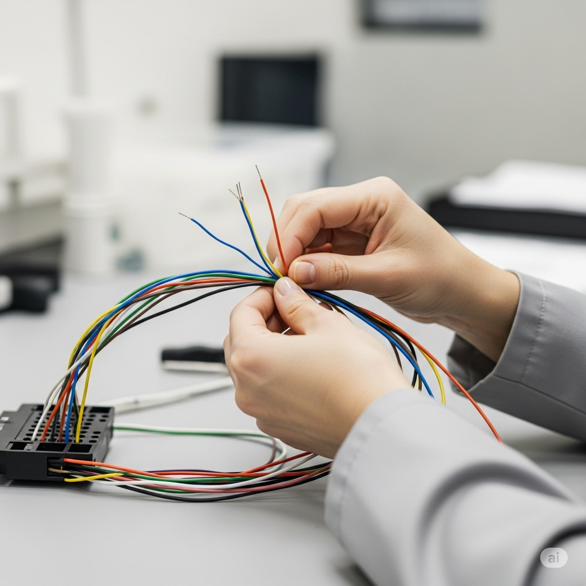

Embarrassed, I ran inside and hid. A few minutes later, my mom asked, “ Are you OK?”

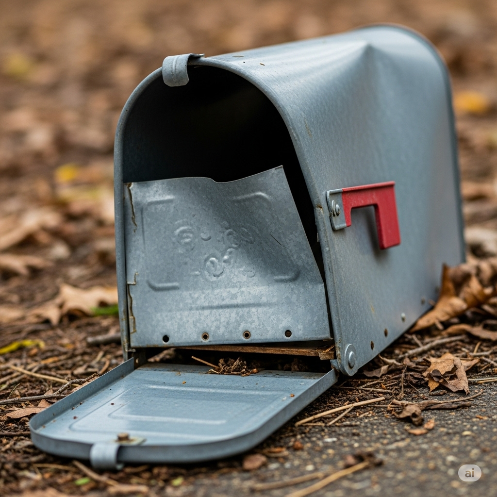

“ I just wanted them to be **jealous** of me for once. Now I see why you and Dad don’t love me as much as them,” I said.

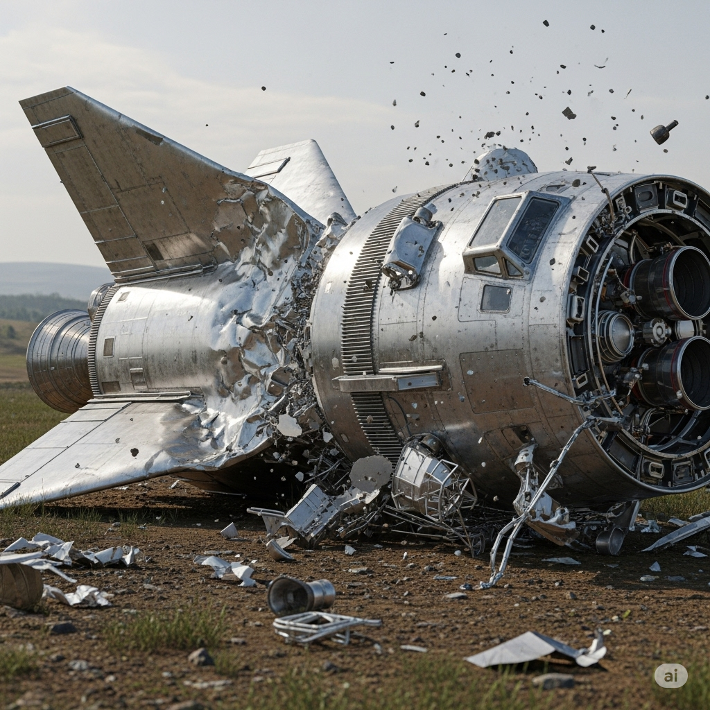

“ That’s not true!” said my mom. “ See my fingers . . . each one is different. You kids are like my fingers: all are different, but I love them all the same.”

I **embraced** her. Now I know that my parents love me just as much as my brothers.

