# Essential English Word 3
# Unit 27
## 1. acknowledge v
### định nghĩa
thừa nhận điều gì đó là đúng hoặc tồn tại.

He acknowledges his mistake.

She is acknowledging the applause.

They have acknowledged receipt of the letter.

He acknowledged the problem yesterday.

We were acknowledging their efforts.

Before, I had not acknowledged the truth.

You will acknowledge the fact.

I am going to acknowledge your help.

You can acknowledge the message.

You should acknowledge their presence.

I would acknowledge it if it were true.

Acknowledge the request.

------------

## 2. ambassador n
### định nghĩa
người đại diện cho quốc gia của mình ở một quốc gia khác.

He is the ambassador to France.

She is meeting the ambassador.

They have appointed a new ambassador.

He was an ambassador many years ago.

We were talking to the ambassador.

Before, I had not met an ambassador.

You will meet the ambassador.

I am going to become an ambassador.

An ambassador represents their country.

You should respect the ambassador.

I would like to be an ambassador.

Welcome the ambassador.

------------

## 3. blonde adj
### định nghĩa
(tóc) màu vàng nhạt.

She has blonde hair.

He is looking at the blonde girl.

They have a blonde child.

She was blonde when she was young.

We were talking about the blonde woman.

Before, I had not seen such bright blonde hair.

Her hair will be blonde.

She is going to dye her hair blonde.

Hair can be blonde.

You should describe the blonde person.

I would like to have blonde hair.

She is blonde.

------------

## 4. conquer v
### định nghĩa
chiếm lấy hoặc kiểm soát một vùng đất hoặc người khác bằng vũ lực.

They conquer the city.

The army is conquering the territory.

He has conquered his fear.

They conquered the land centuries ago.

We were conquering the mountain.

Before, they had not conquered this area.

They will conquer the enemy.

He is going to conquer his shyness.

You can conquer your challenges.

You should try to conquer your weaknesses.

I would conquer the world if I could.

Conquer your fears.

------------

## 5. drag v
### định nghĩa
kéo lê cái gì đó nặng trên mặt đất.

He drags the box.

She is dragging the chair.

They have dragged the boat ashore.

He dragged the heavy bag yesterday.

We were dragging the furniture.

Before, I had not dragged anything so heavy.

You will drag it across the floor.

I am going to drag the table.

You can drag it slowly.

You should not drag it on the wood floor.

I would drag it if I had help.

Drag the box here.

------------

## 6. exaggerate v
### định nghĩa
phóng đại (nói điều gì đó lớn hơn, tốt hơn hoặc tệ hơn sự thật).
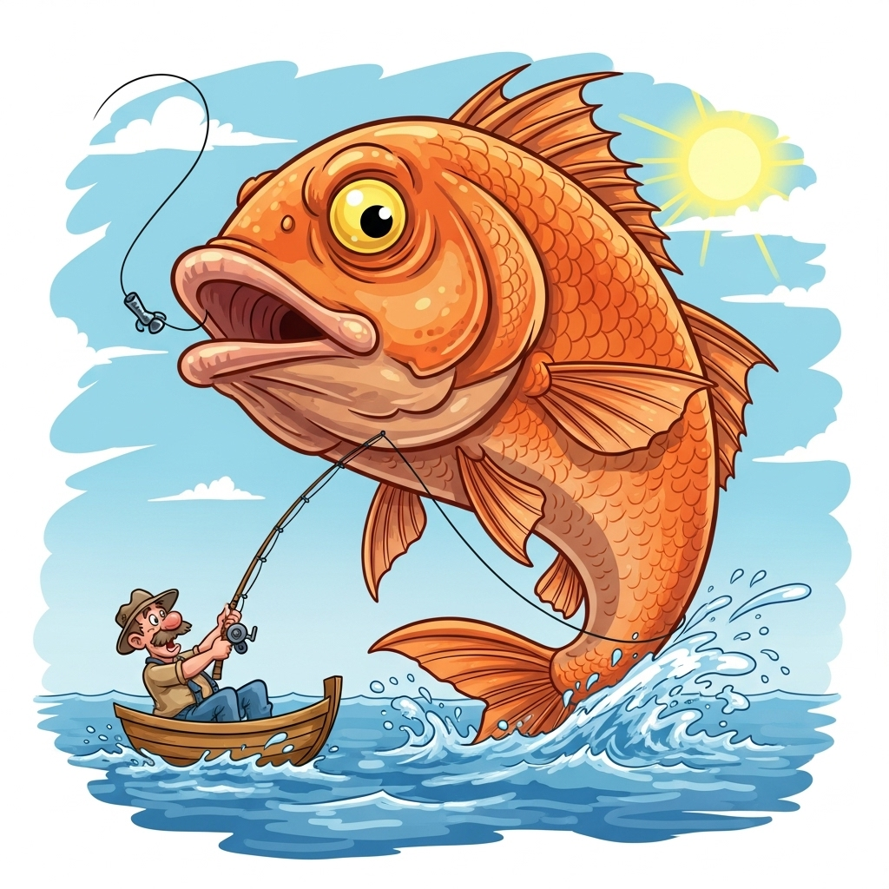
He exaggerates the story.

She is exaggerating the problem.

They have exaggerated the danger.

He exaggerated his achievements.

We were exaggerating the fun we had.

Before, I had not exaggerated anything.

You will exaggerate the details.

I am going to exaggerate a little.

People can exaggerate.

You should not exaggerate the truth.

I would exaggerate to make it funny.

Don't exaggerate.

------------

## 7. heritage n
### định nghĩa
di sản (những truyền thống, văn hóa, lịch sử được truyền lại từ thế hệ trước).
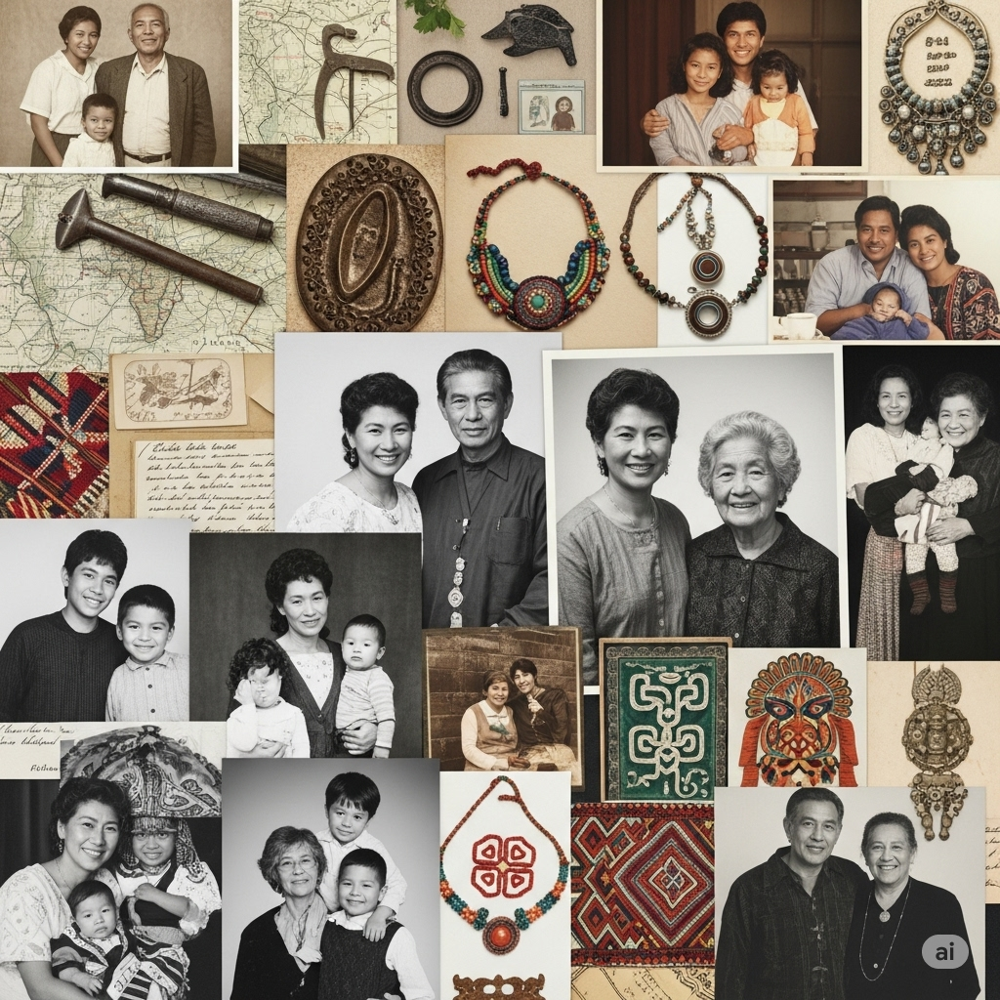
They protect their heritage.

She is studying her heritage.

We have preserved our heritage.

He learned about his heritage.

They were celebrating their cultural heritage.

Before, I had not known much about my heritage.

You will appreciate your heritage.

I am going to explore my heritage.

Heritage is important.

You should be proud of your heritage.

I would like to learn more about my heritage.

Preserve your heritage.

------------

## 8. insult v
### định nghĩa
lăng mạ, xúc phạm (nói hoặc làm điều gì đó thô lỗ khiến người khác cảm thấy bị tổn thương).
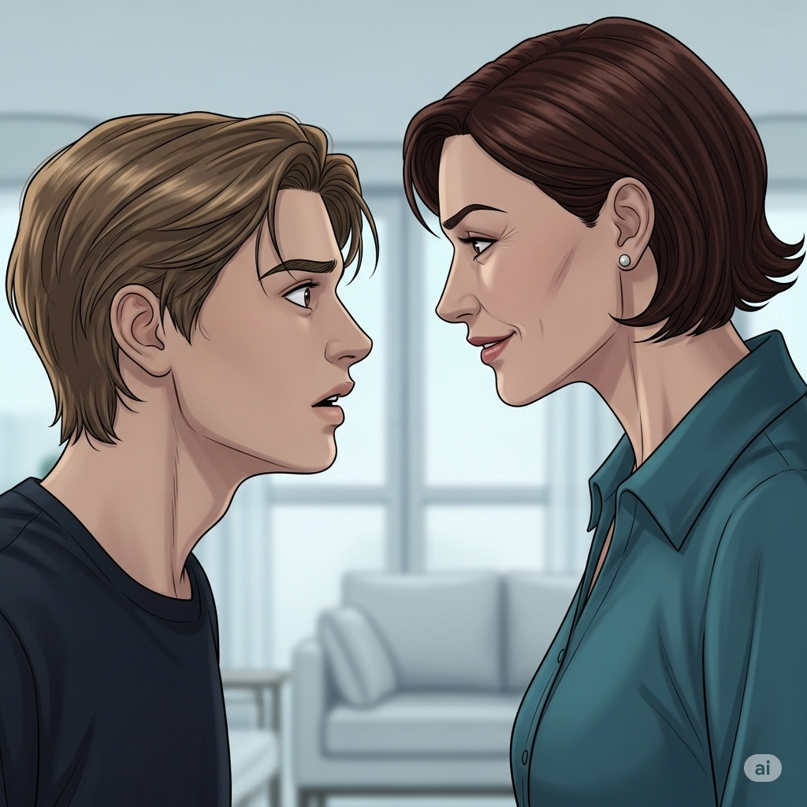
He insults people.

She is insulting him.

They have insulted us.

He insulted me yesterday.

We were insulting each other playfully.

Before, I had not insulted anyone.

You will insult her if you say that.

I am not going to insult anyone.

You can insult someone with words.

You should not insult others.

I would never insult my friends.

Don't insult him.

------------

## 9. meanwhile adv
### định nghĩa
trong khi đó (cùng lúc với điều gì đó khác đang xảy ra).

He is working. Meanwhile, she is sleeping.

She is cooking. Meanwhile, he is watching TV.

They have finished the first part. Meanwhile, we are still working.

He left the room. Meanwhile, I stayed here.

We were waiting. Meanwhile, they were preparing.

Before, I had not noticed what was happening meanwhile.

He will arrive soon. Meanwhile, we can wait.

I am going to study. Meanwhile, you can play.

Meanwhile, something else is happening.

You should wait here. Meanwhile, I will go.

I would read a book. Meanwhile, you can rest.

Wait here. Meanwhile, I'll get the car.

------------

## 10. necklace n
### định nghĩa
vòng cổ (trang sức đeo quanh cổ).
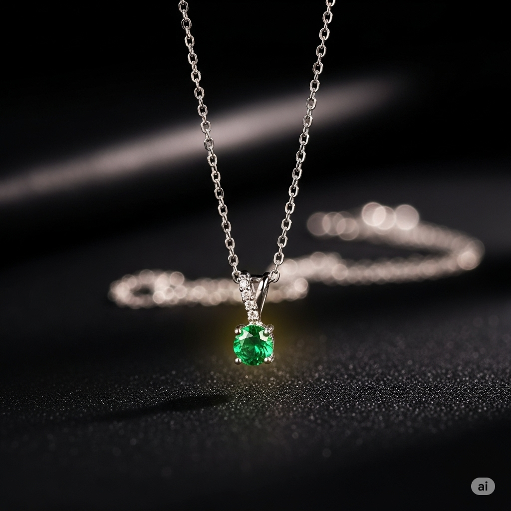
She wears a necklace.

He is buying a necklace.

They have found the necklace.

She lost her necklace yesterday.

We were looking at the necklaces.

Before, I had not owned a necklace.

You will get a beautiful necklace.

I am going to wear my necklace.

A necklace can be made of gold.

You should wear a necklace with that dress.

I would like a pearl necklace.

Look at her necklace.

------------

## 11. noble adj/n
### định nghĩa
(adj) cao quý, có phẩm chất tốt; (n) người thuộc tầng lớp quý tộc.
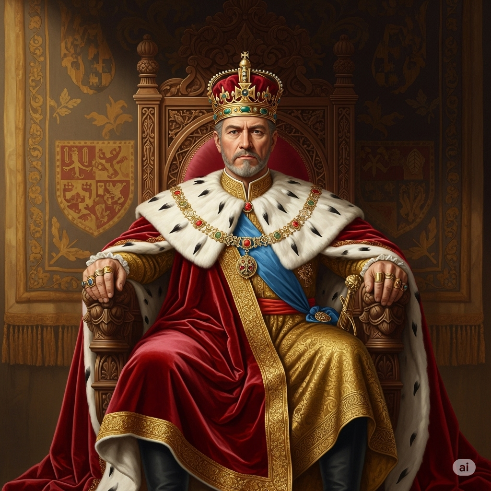
He is a noble person.

She is from a noble family.

They have shown noble qualities.

He was a noble knight.

We were discussing noble ideas.

Before, I had not met a noble.

You will meet a noble.

I am going to act in a noble way.

A noble can be kind.

You should strive to be noble.

I would admire a noble leader.

He is a noble.

------------

## 12. precious adj
### định nghĩa
quý giá, có giá trị lớn (vì hiếm, đắt tiền hoặc quan trọng với bạn).
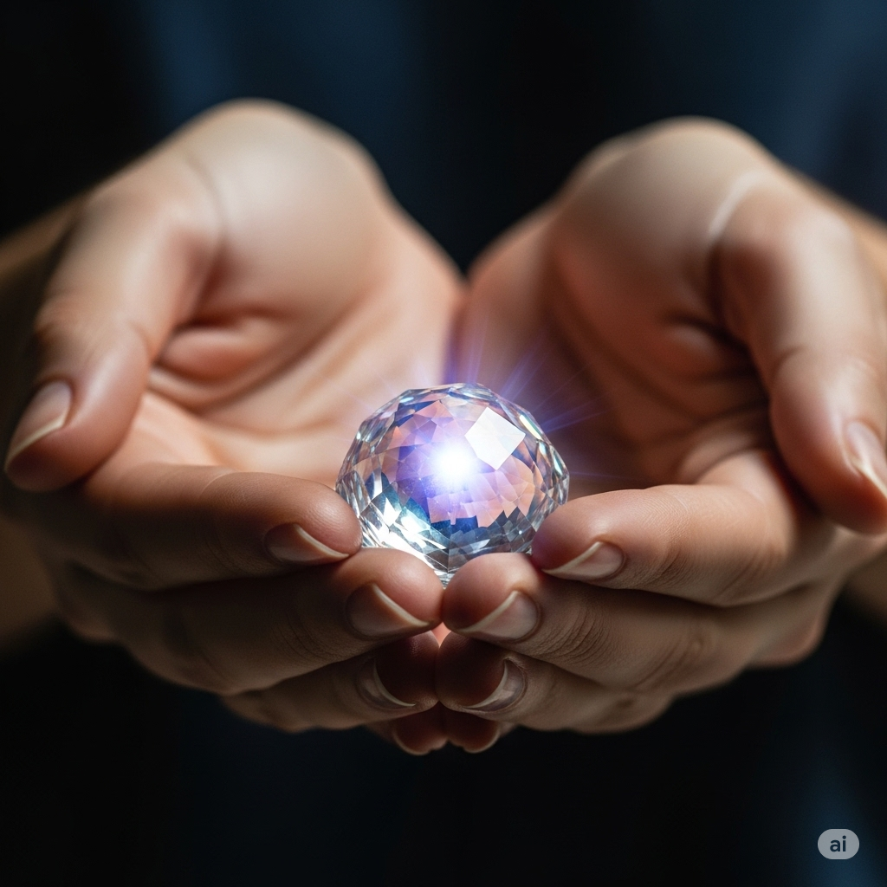
This ring is precious.

She is holding a precious object.

They have found precious stones.

He lost something precious.

We were protecting the precious cargo.

Before, I had not owned anything so precious.

You will find something precious.

I am going to keep this precious memory.

Time is precious.

You should take care of precious things.

I would never sell this precious item.

This is precious to me.

------------

## 13. prejudice n
### định nghĩa
định kiến (ý kiến không tốt về ai đó hoặc cái gì đó trước khi biết rõ).

He has a lot of prejudice.

She is fighting against prejudice.

They have overcome their prejudice.

He showed prejudice against the group.

We were discussing the effects of prejudice.

Before, I had not understood prejudice.

You will see prejudice in some places.

I am going to work to reduce prejudice.

Prejudice can be harmful.

You should not have prejudice.

I would try to avoid prejudice.

Fight against prejudice.

------------

## 14. rumor n
### định nghĩa
tin đồn (thông tin được lan truyền nhưng có thể không đúng).
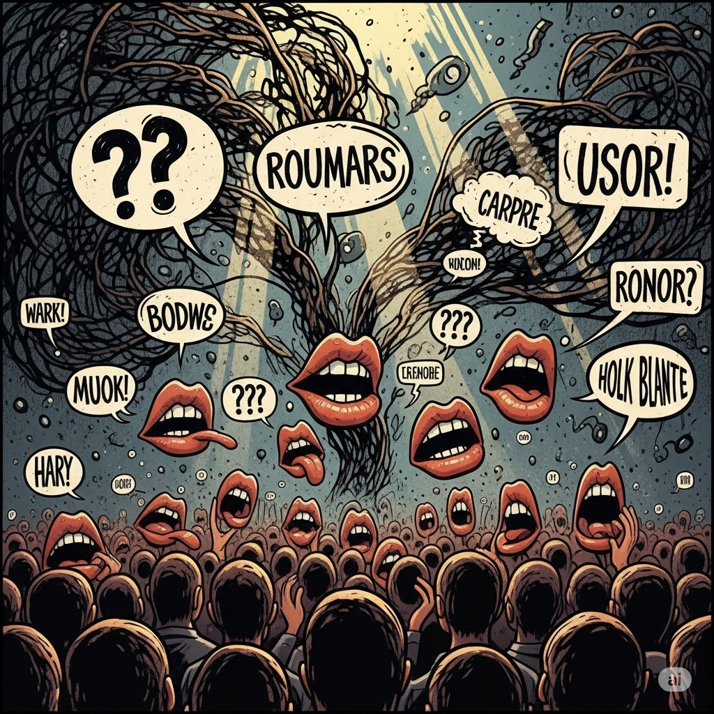
There is a rumor going around.

She is spreading a rumor.

They have heard the rumor.

He heard the rumor yesterday.

We were talking about the rumor.

Before, I had not believed the rumor.

You will hear the rumor.

I am going to ignore the rumor.

A rumor can be false.

You should not spread rumors.

I would not trust that rumor.

Ignore the rumor.

------------

## 15. sin n
### định nghĩa
tội lỗi (hành động sai trái, đặc biệt là theo quan điểm tôn giáo).
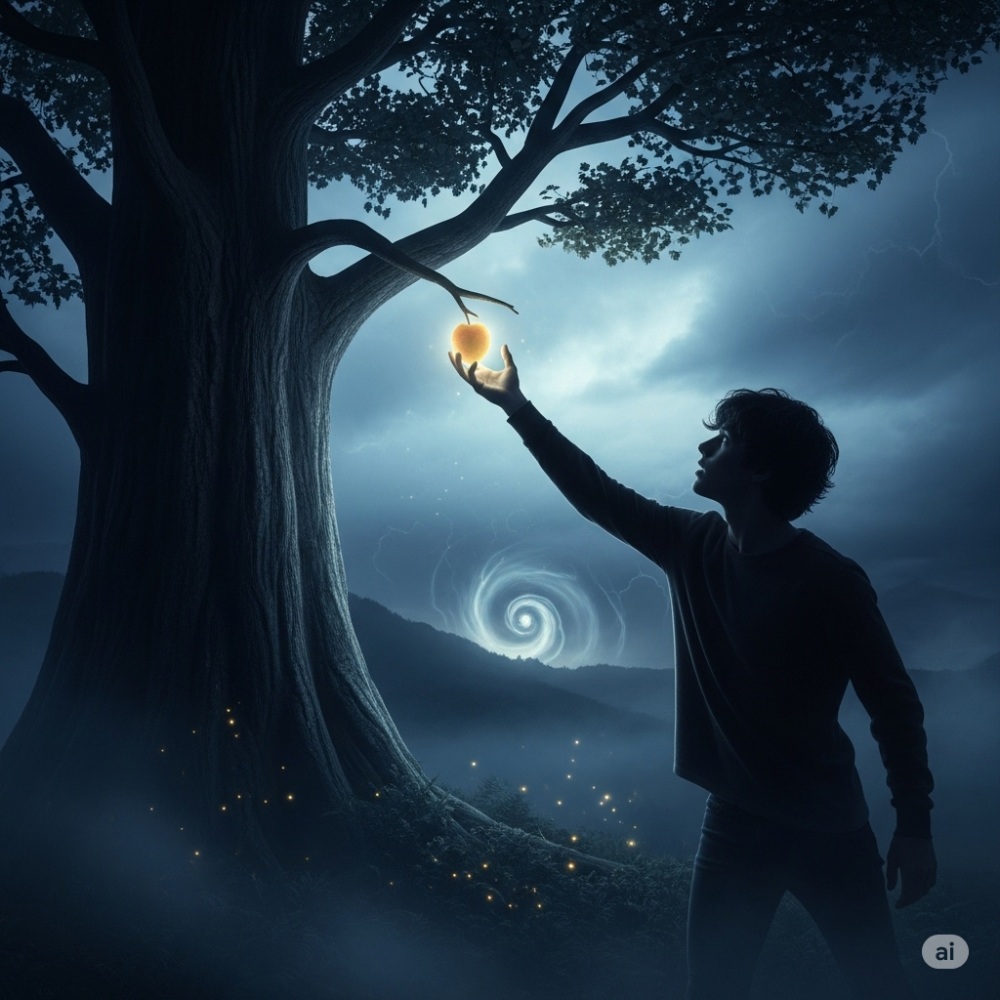
Lying is a sin.

He is confessing his sin.

They have committed a sin.

He regretted his sin.

We were discussing the concept of sin.

Before, I had not thought of it as a sin.

You will regret your sin.

I am not going to commit a sin.

Greed can be a sin.

You should avoid sin.

I would ask for forgiveness for my sin.

Confess your sin.

------------

## 16. spectacle n
### định nghĩa
cảnh tượng (một màn trình diễn hoặc sự kiện ấn tượng); kính mắt (số nhiều: spectacles).
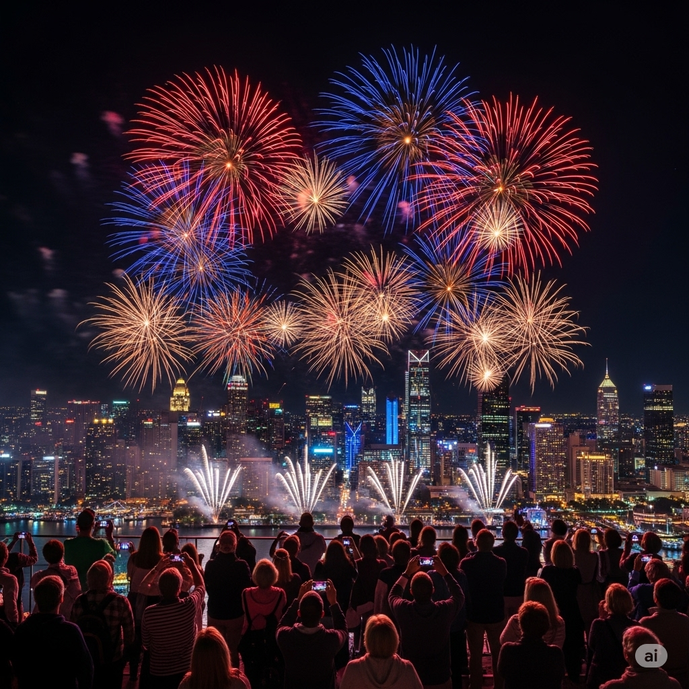
It was a great spectacle.

She is watching the spectacle.

They have created a spectacle.

He saw a strange spectacle.

We were enjoying the spectacle.

Before, I had not seen such a spectacle.

You will see the spectacle.

I am going to watch the spectacle.

A spectacle can be amazing.

You should see the spectacle.

I would describe the spectacle.

Enjoy the spectacle.

------------

## 17. stack n
### định nghĩa
chồng, đống (một nhóm đồ vật được xếp gọn gàng lên nhau).

He has a stack of books.

She is making a stack of papers.

They have built a stack of wood.

He saw a stack of boxes.

We were counting the stacks.

Before, I had not seen such a tall stack.

You will see a stack there.

I am going to make a stack.

A stack can fall over.

You should make a stable stack.

I would organize them into a stack.

Make a stack of plates.

------------

## 18. suspicious adj
### định nghĩa
đáng ngờ (khiến bạn nghĩ có điều gì đó sai hoặc không trung thực).

He looks suspicious.

She is being suspicious.

They have become suspicious.

He felt suspicious about the offer.

We were looking at the suspicious package.

Before, I had not been suspicious.

You will feel suspicious.

I am going to be suspicious.

It can be suspicious.

You should be suspicious of strangers.

I would be suspicious if that happened.

He is suspicious.

------------

## 19. tin n
### định nghĩa
thiếc (kim loại); hộp thiếc (đựng thực phẩm hoặc đồ uống).
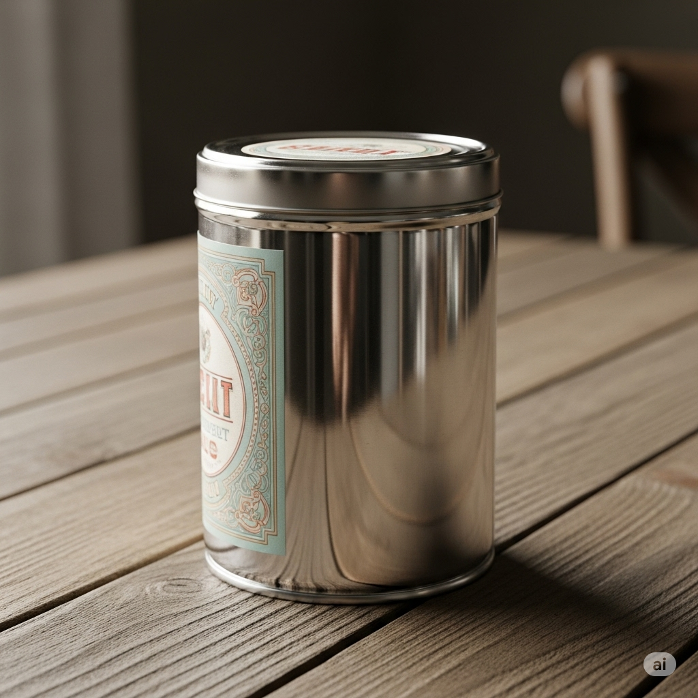
The can is made of tin.

She is opening a tin of beans.

They have collected tin cans.

He found an old tin box.

We were recycling tin.

Before, I had not used a tin opener.

You will need a tin.

I am going to buy a tin of soup.

A tin can rust.

You should recycle tin cans.

I would use a tin for storage.

Open the tin.

------------

## 20. vase n
### định nghĩa
bình hoa (đồ vật dùng để cắm hoa).
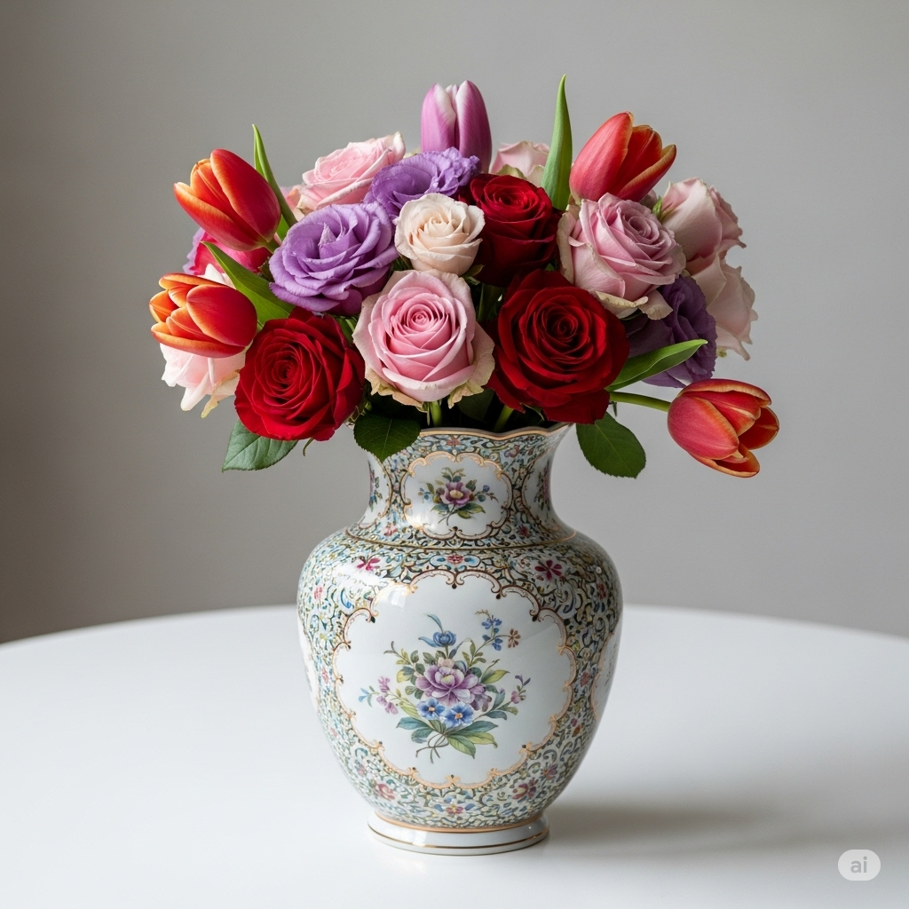
She put flowers in the vase.

He is cleaning the vase.

They have broken the vase.

She bought a new vase yesterday.

We were looking at the vases.

Before, I had not owned a vase.

You will need a vase for the flowers.

I am going to buy a vase.

A vase can be fragile.

You should fill the vase with water.

I would put the vase on the table.

Put the flowers in the vase.

------------

## Pizarro and the inca gold

According to **rumors**, there’s lots of **precious** gold hidden in the jungles of Peru. It got there when the Spanish **conquered** parts of South America. The Spanish **noble**, Francisco Pizarro, arrived in Peru in the 1500s. He found a group of people called the Incas. The Incas believed that their leader, Atahualpa, was both a king and a god. But Pizarro didn’t agree.

“ It is a **sin** for a man to think he is God!” he said to Atahualpa.

Atahualpa thought Pizarro was **insulting** his **heritage**. He thought the **blonde** Spanish men held **prejudices** against the Incas. But Atahualpa was a kind man and didn’t want to fight the Spaniards. He said, “ If I give you a room full of gold, will you leave my country in peace?”

Pizarro was **suspicious**. He thought Atahualpa was **exaggerating**. But a few days later, Pizarro returned to the Inca palace with his **ambassadors**. He saw a room filled with **stacks** of gold. There were golden **necklaces**, cups, plates and **vases**. It was a great **spectacle**. He **acknowledged** that Atahualpa had told the truth. But after seeing the gold, he wanted all of Peru’s gold. So he didn’t leave the country.

The Spanish soldiers stayed in Peru and grabbed all the gold they could find. But the Inca people tricked the Spaniards. They mixed the gold with **tin** so that it was poor quality. They gave this gold to the Spaniards. **Meanwhile**, they hid the good gold. They stuffed it into sacks and **dragged** it deep into the jungle. The Spanish **conquerors** never found the gold. People think it is still there today.