# Essential English Word 3
# Unit 28
## 1. ache v
### định nghĩa
đau (cảm thấy đau âm ỉ, không quá dữ dội).
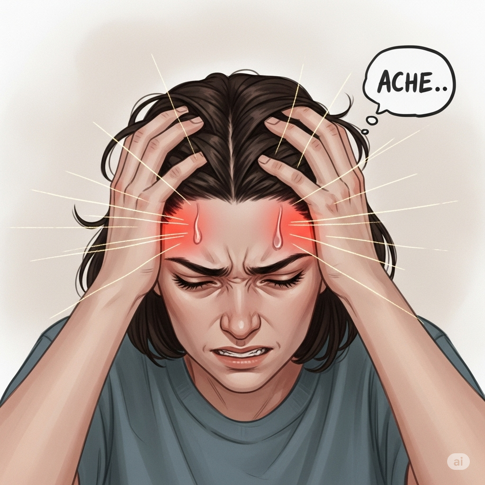
My head aches.

His leg is aching.

My teeth have ached all day.

My back ached yesterday.

My feet were aching after the walk.

Before, my stomach had not ached.

Your tooth will ache if you don't see a dentist.

My arm is going to ache tomorrow.

It can ache sometimes.

You should rest if you ache.

I would ache if I ran a marathon.

Does your head ache?

------------

## 2. arctic adj
### định nghĩa
liên quan đến vùng Bắc Cực; rất lạnh.
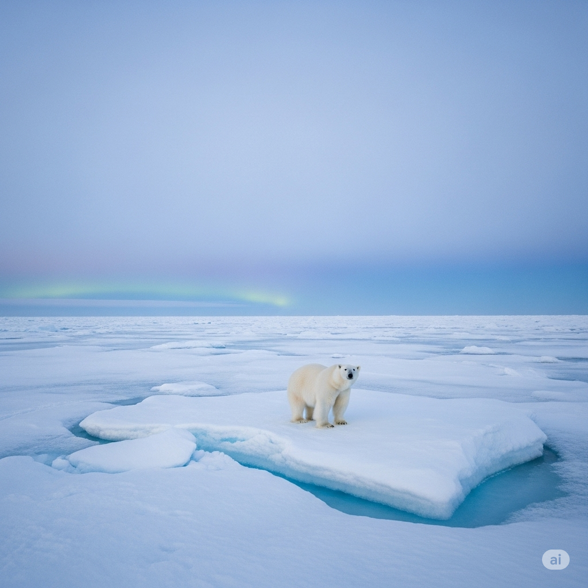
It is arctic weather.

They are exploring the arctic region.

We have studied arctic animals.

He visited the arctic circle last year.

They were living in arctic conditions.

Before, I had not experienced arctic cold.

The arctic ice will melt.

It is going to be an arctic winter.

The arctic can be beautiful.

You should wear warm clothes in arctic areas.

I would not like to live in an arctic climate.

Study the arctic.

------------

## 3. canal n
### định nghĩa
kênh đào (đường nước nhân tạo cho thuyền đi lại hoặc tưới tiêu).
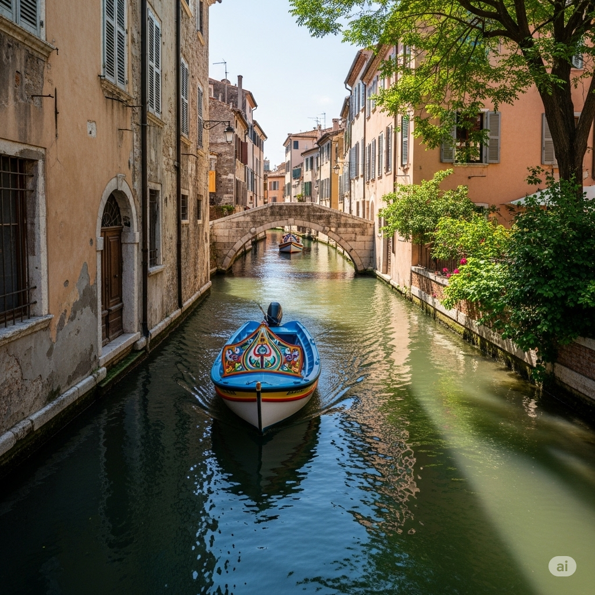
The boat is in the canal.

They are digging a canal.

We have traveled along the canal.

He saw the canal yesterday.

They were cleaning the canal.

Before, I had not seen such a wide canal.

The canal will be finished soon.

They are going to build a new canal.

A canal can connect cities.

You should take a boat trip on the canal.

I would like to live near a canal.

Walk by the canal.

------------

## 4. chemist n
### định nghĩa
nhà hóa học (người nghiên cứu hóa học); dược sĩ (người bán thuốc).

She is a chemist.

He is working at the chemist's.

They have consulted a chemist.

He went to the chemist yesterday.

We were waiting at the chemist's.

Before, I had not needed a chemist.

You will find a chemist nearby.

I am going to ask the chemist.

A chemist can give you advice.

You should ask the chemist about the medicine.

I would go to the chemist for help.

Ask the chemist.

------------

## 5. chill n
### định nghĩa
cảm giác lạnh; cảm giác sợ hãi.
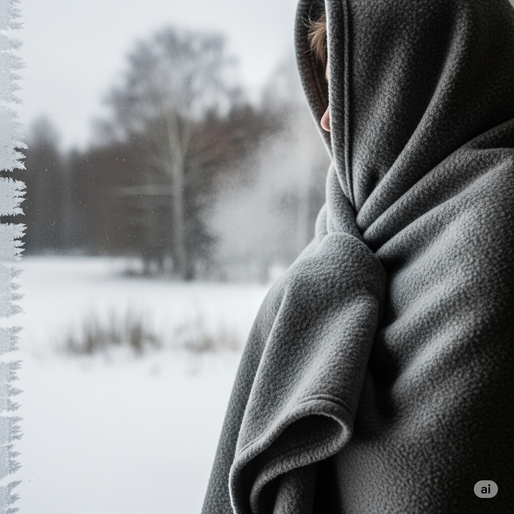
There is a chill in the air.

She is feeling a chill.

We have felt a sudden chill.

He felt a chill when he heard the story.

They were feeling the evening chill.

Before, I had not felt such a deep chill.

You will feel a chill tonight.

It is going to be a chill evening.

A chill can make you shiver.

You should put on a jacket if you feel a chill.

I would get a chill if I went outside now.

Feel the chill.

------------

## 6. congress n
### định nghĩa
quốc hội (nhóm người được bầu để làm luật ở một số quốc gia).

Congress is meeting today.

They are voting in congress.

Congress has passed a new law.

He worked for congress years ago.

They were debating in congress.

Before, I had not followed the news about congress.

Congress will discuss the issue.

They are going to address congress.

Congress has many members.

You should learn about how congress works.

I would like to visit congress.

Congress is in session.

------------

## 7. dairy adj
### định nghĩa
liên quan đến sữa hoặc các sản phẩm từ sữa.
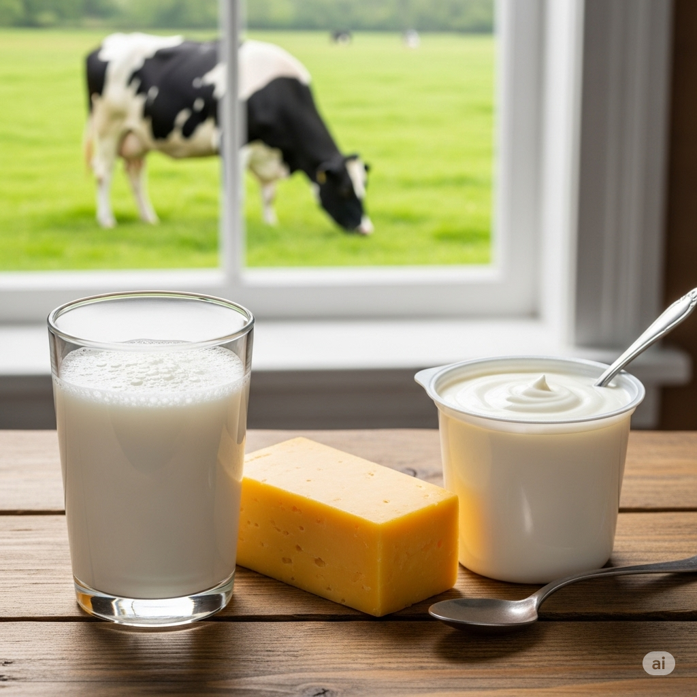
We buy dairy products.

She is working at a dairy farm.

They have removed dairy from their diet.

He drank dairy milk this morning.

We were looking at the dairy section.

Before, I had not eaten many dairy products.

You will find dairy items there.

I am going to buy some dairy.

Dairy can be a good source of calcium.

You should check if it contains dairy.

I would choose a non-dairy option.

Buy dairy products.

------------

## 8. descend v
### định nghĩa
đi xuống, hạ xuống.

They descend the stairs.

The plane is descending.

We have descended into the valley.

He descended the mountain carefully.

They were descending into the cave.

Before, I had not descended that far.

You will descend slowly.

The sun is going to descend soon.

You can descend using the lift.

You should descend carefully.

I would descend if I had a rope.

Descend the ladder.

------------

## 9. grocer n
### định nghĩa
người bán hàng tạp hóa (người bán thực phẩm và đồ dùng gia đình nhỏ).

He is a grocer.

She is talking to the grocer.

They have bought food from the grocer.

He visited the grocer yesterday.

We were waiting at the grocer's.

Before, I had not been to that grocer.

You will find a good grocer here.

I am going to the grocer's.

A grocer sells food.

You should buy your vegetables from the grocer.

I would ask the grocer for advice.

Go to the grocer.

------------

## 10. hesitate v
### định nghĩa
do dự, ngần ngại (dừng lại một chút trước khi làm hoặc nói điều gì đó).

He hesitates before speaking.

She is hesitating to answer.

They have hesitated too long.

He hesitated before jumping.

We were hesitating to cross the road.

Before, I had not hesitated.

You will hesitate if you are unsure.

I am not going to hesitate this time.

You can hesitate.

You should not hesitate to ask for help.

I would hesitate if it was dangerous.

Don't hesitate.

------------

## 11. institution n
### định nghĩa
tổ chức (như trường học, bệnh viện, ngân hàng); thể chế (luật lệ, phong tục quan trọng).

This is a famous institution.

She is working for an institution.

They have established a new institution.

He studied at this institution.

We were visiting the institution.

Before, I had not heard of this institution.

You will join the institution.

I am going to apply to that institution.

An institution can be large.

You should respect the rules of the institution.

I would trust this institution.

Visit the institution.

------------

## 12. jog v
### định nghĩa
chạy bộ nhẹ nhàng (để tập thể dục).

He jogs every morning.

She is jogging in the park.

They have jogged five kilometers.

He jogged yesterday.

We were jogging along the beach.

Before, I had not jogged regularly.

You will jog tomorrow.

I am going to jog later.

You can jog slowly.

You should jog for exercise.

I would jog if I had time.

Let's jog together.

------------

## 13. merchant n
### định nghĩa
thương gia (người buôn bán, đặc biệt là với nước ngoài).
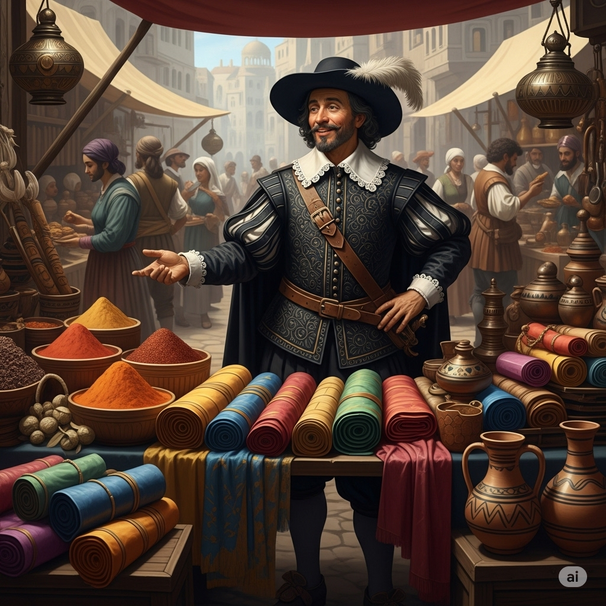
He is a wealthy merchant.

She is talking to the merchant.

They have traded with the merchant.

He met the merchant in the market.

They were negotiating with the merchant.

Before, I had not met a merchant.

You will meet the merchant tomorrow.

I am going to become a merchant.

A merchant buys and sells goods.

You should deal honestly with the merchant.

I would learn from the merchant.

Talk to the merchant.

------------

## 14. poke v
### định nghĩa
chọc, huých nhẹ (dùng ngón tay hoặc vật nhọn đẩy nhẹ).
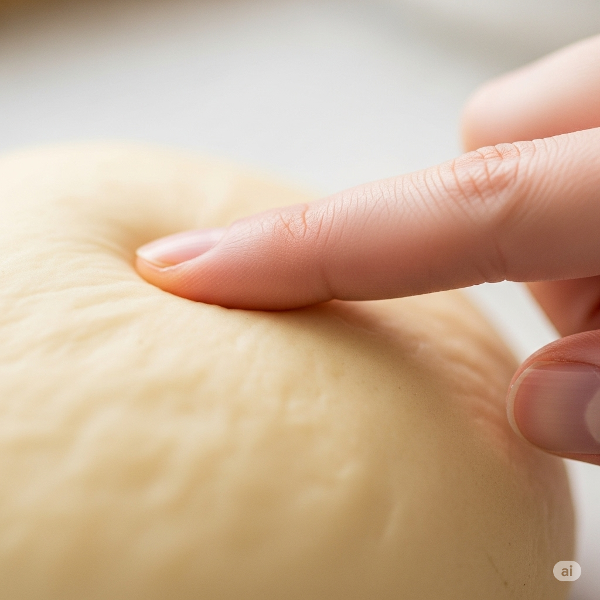
He pokes the fire.

She is poking him with a stick.

They have poked holes in the paper.

He poked me in the arm.

We were poking the ground with a stick.

Before, I had not poked anything.

You will poke it carefully.

I am going to poke it to see if it's soft.

You can poke it gently.

You should not poke people.

I would poke it with a finger.

Don't poke me!

------------

## 15. postpone v
### định nghĩa
hoãn lại (lùi thời gian diễn ra cái gì đó).
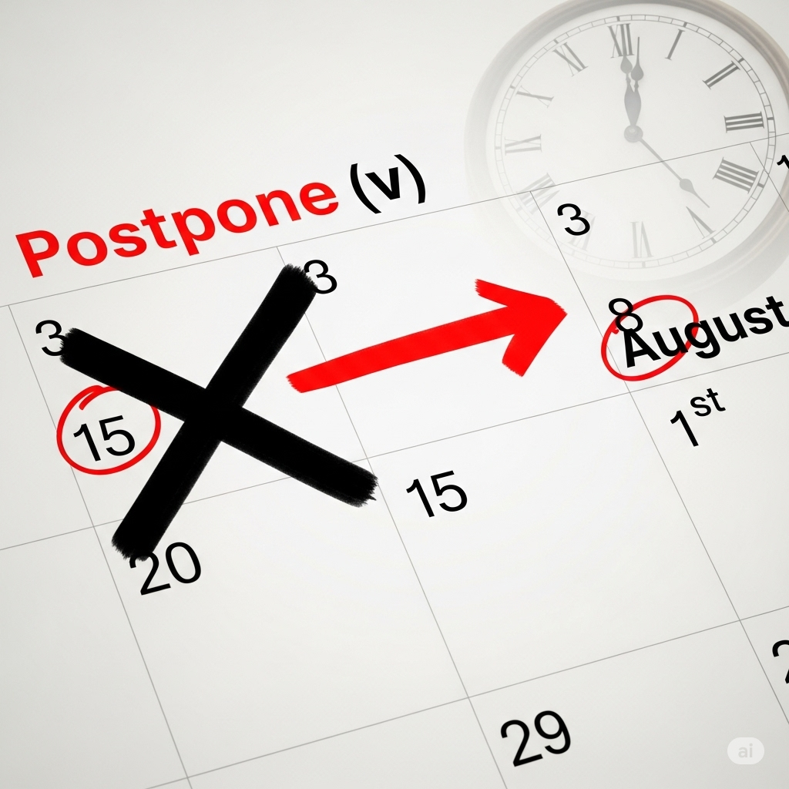
They postpone the meeting.

She is postponing her trip.

We have postponed the event.

He postponed the decision yesterday.

They were postponing the game due to rain.

Before, I had not postponed anything important.

You will postpone the appointment.

I am going to postpone the party.

You can postpone it until next week.

You should postpone it if you are not ready.

I would postpone it if necessary.

Postpone the game.

------------

## 16. splash v
### định nghĩa
làm văng nước; té nước.

He splashes water on his face.

She is splashing in the puddles.

They have splashed paint everywhere.

He splashed water on me.

We were splashing each other in the pool.

Before, I had not splashed like that.

You will splash if you jump in.

I am going to splash some water.

You can splash gently.

You should not splash people.

I would splash if it was hot.

Don't splash me!

------------

## 17. stubborn adj
### định nghĩa
bướng bỉnh, cứng đầu (không chịu thay đổi ý kiến hoặc làm theo lời người khác).

He is very stubborn.

She is being stubborn.

They have always been stubborn.

He was stubborn and wouldn't listen.

We were dealing with a stubborn problem.

Before, I had not met anyone so stubborn.

You will find him stubborn.

I am going to be stubborn about this.

You can be stubborn.

You should not be so stubborn.

I would be stubborn if I believed I was right.

Don't be stubborn.

------------

## 18. suburb n
### định nghĩa
khu vực ngoại ô (khu dân cư ở rìa thành phố).
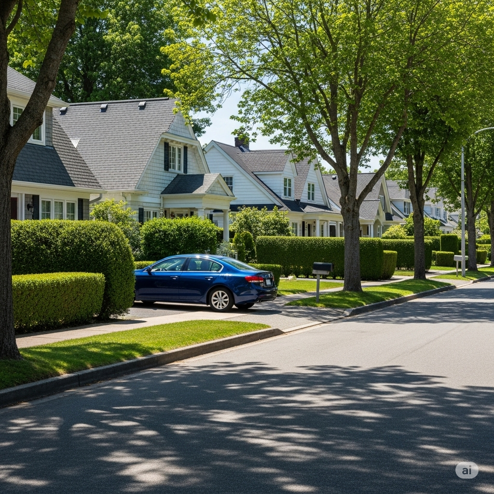
They live in the suburb.

She is moving to the suburb.

We have visited the suburb.

He grew up in this suburb.

They were building houses in the suburb.

Before, I had not lived in a suburb.

You will like the suburb.

I am going to buy a house in the suburb.

A suburb can be quiet.

You should consider living in the suburb.

I would prefer to live in the suburb.

Visit the suburb.

------------

## 19. tide n
### định nghĩa
thủy triều (sự lên xuống của mực nước biển).
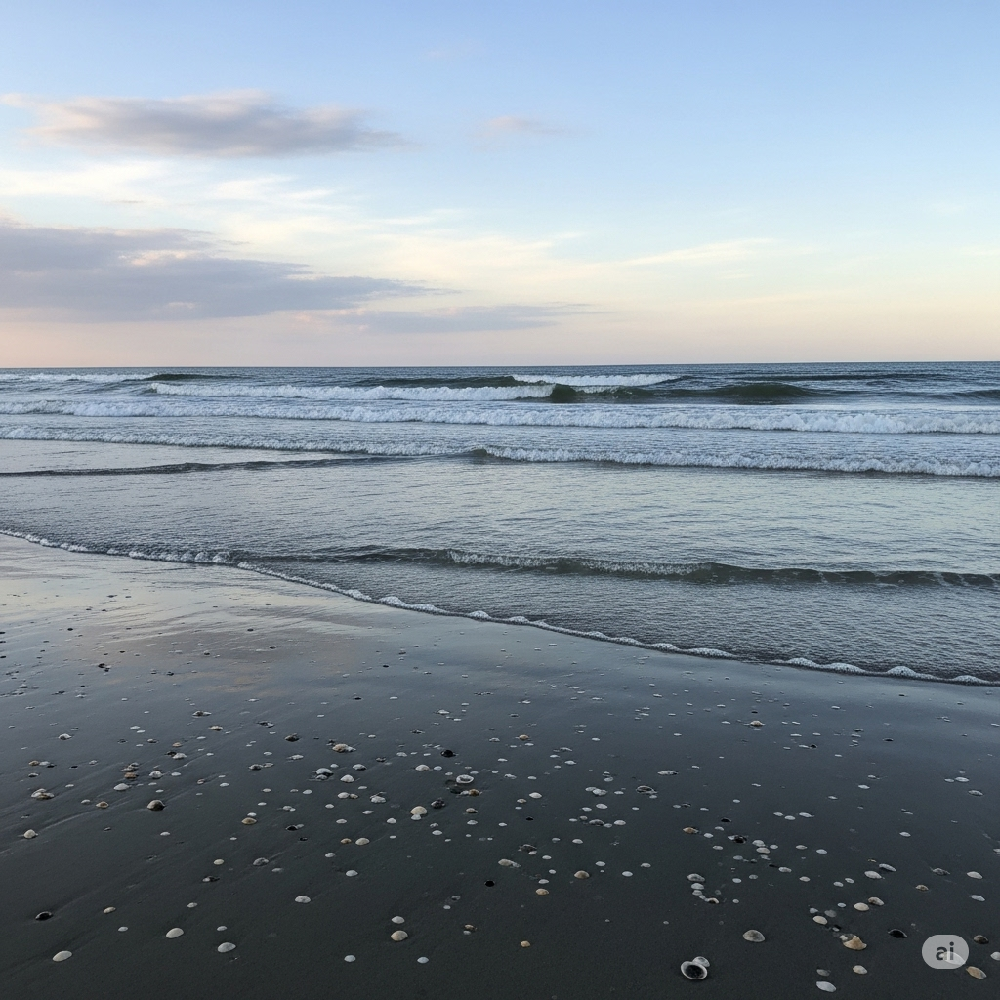
The tide is high.

The tide is coming in.

The tide has gone out.

He watched the tide yesterday.

We were waiting for the tide to change.

Before, I had not paid attention to the tide.

The tide will be low later.

The tide is going to turn.

The tide can be strong.

You should check the tide times.

I would swim when the tide is high.

Watch the tide.

------------

## 20. tragedy n
### định nghĩa
bi kịch (một sự kiện rất buồn hoặc thảm khốc).
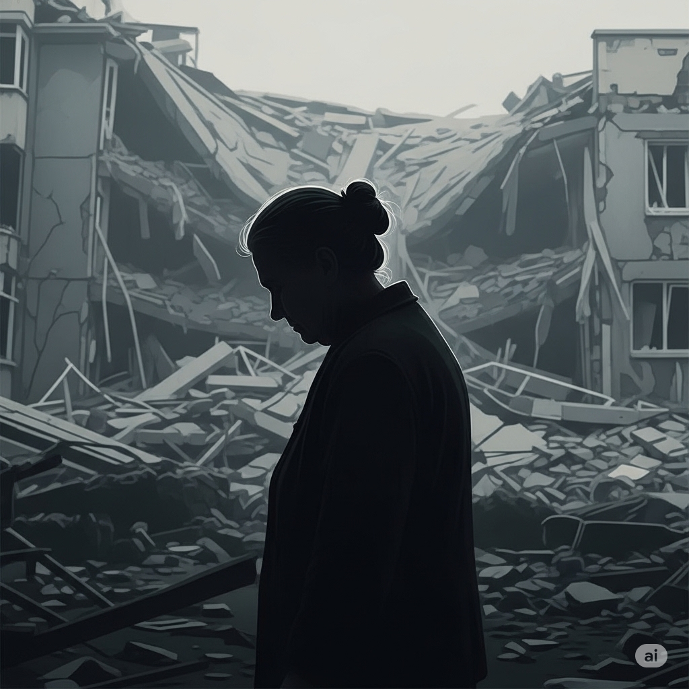
It was a great tragedy.

She is talking about the tragedy.

They have experienced a tragedy.

He heard about the tragedy on the news.

We were discussing the tragedy.

Before, I had not witnessed such a tragedy.

You will read about the tragedy.

It is going to be a tragedy.

A tragedy can affect many people.

You should learn from the tragedy.

I would feel sad about the tragedy.

It is a tragedy.

------------

## The boy who saved the town

Marcus lived in a small **suburb** near the sea. He was a **stubborn** boy, and he only cared about himself. His father worked as a **chemist** for an **institution** and wanted Marcus to get a job there. Instead, the boy delivered milk. Each morning he took **dairy** products to the **grocers**.

One day, Marcus was **jogging** down the street with a gallon of milk to give to a **merchant**. He didn’t want to be late. He ran down a path beside a large **canal**. A wall there kept water from coming into the town during high **tide**. But Marcus saw a small hole in the wall. Marcus knew that if the wall broke, it would be a **tragedy** for the town.

At first, he **hesitated**. He had to choose between helping himself and helping the town. There was only one way to save the town. It seemed crazy to him, but it was the only thing he could do. He **poked** his finger into the hole. This didn’t fix the problem forever, but it did **postpone** the **tragedy**.

His finger **ached**. He felt the **chill** of the **arctic** water as it **splashed** him. There was no one else around. He knew he had to wait until the **tide** **descended**. It was very difficult, but Marcus stayed there and saved the town.

Once the **tide** had **descended**, Marcus told everyone what happened. A group of people went to the wall. They saw the hole and fixed it. Everyone was very happy with Marcus. The local **congress** even gave him a gift for saving the town. He was a hero.