# Essential English Word 3
# Unit 29
## 1. bomb n
### định nghĩa
một thiết bị gây nổ mạnh.
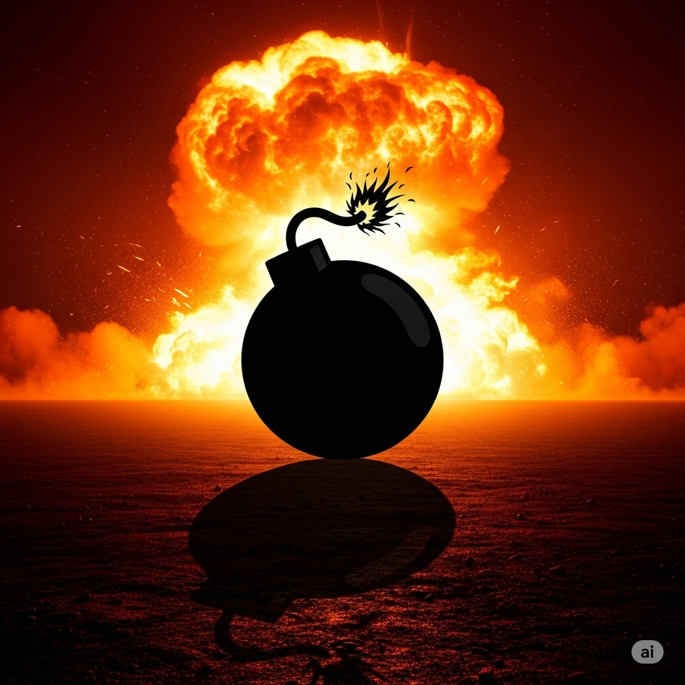
The police found a bomb.
They are defusing the bomb.
The bomb has exploded.
He saw a bomb in the movie.
They were searching for the bomb.
Before, I had not seen a real bomb.
The bomb will explode soon.
They are going to drop a bomb.
A bomb can cause damage.
You should run away from a bomb.
I would be scared of a bomb.
Beware of the bomb.

------------

## 2. certificate n
### định nghĩa
một tờ giấy chính thức chứng nhận điều gì đó (như hoàn thành khóa học).
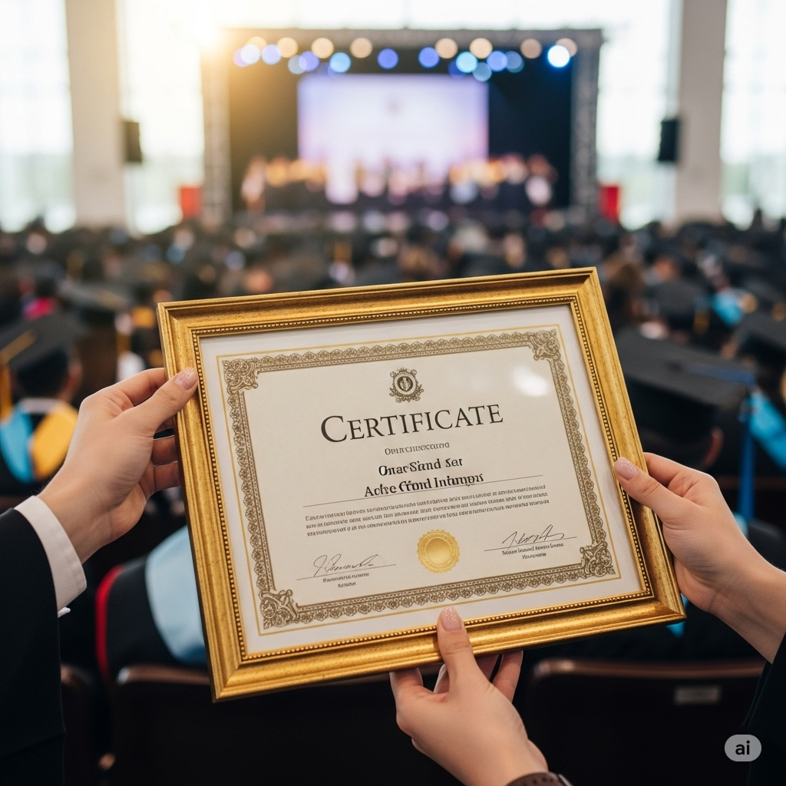
He received a certificate.
She is getting her certificate.
They have earned a certificate.
He got his certificate last week.
We were waiting for the certificate.
Before, I had not received a certificate.
You will get a certificate.
I am going to print the certificate.
A certificate proves you finished.
You should keep your certificate safe.
I would be proud of that certificate.
Show me your certificate.

------------

## 3. circumstance n
### định nghĩa
tình huống hoặc điều kiện xung quanh một sự kiện.

Under the circumstances, we must leave.
She is explaining the circumstances.
They have considered the circumstances.
He described the circumstances of the accident.
We were discussing the difficult circumstances.
Before, I had not faced such circumstances.
The circumstances will change.
They are going to adapt to the circumstances.
Circumstances can be difficult.
You should understand the circumstances.
I would act differently in different circumstances.
Consider the circumstances.

------------

## 4. coffin n
### định nghĩa
hộp dùng để đặt thi thể người chết vào.
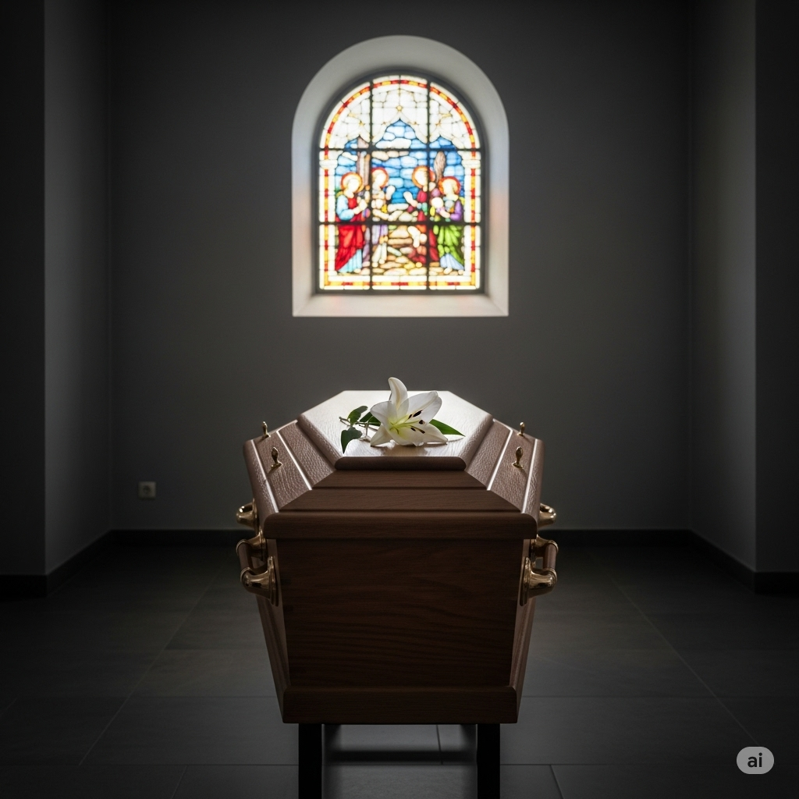
They carried the coffin.
She is looking at the coffin.
The coffin has been closed.
He saw the coffin at the funeral.
They were lowering the coffin.
Before, I had not seen a coffin.
The coffin will be buried.
They are going to prepare the coffin.
A coffin is usually made of wood.
You should be respectful near a coffin.
I would feel sad near a coffin.
Look at the coffin.

------------

## 5. cope v
### định nghĩa
đối phó thành công với điều gì đó khó khăn.

He copes with stress.
She is coping well.
They have coped with the changes.
He coped with the loss bravely.
We were coping with the pressure.
Before, I had not coped well.
You will cope with the situation.
I am going to cope with it.
You can cope with difficulties.
You should learn how to cope.
I would cope better with help.
Cope with the challenge.

------------

## 6. criticism n
### định nghĩa
những lời nhận xét tiêu cực về ai đó hoặc cái gì đó.
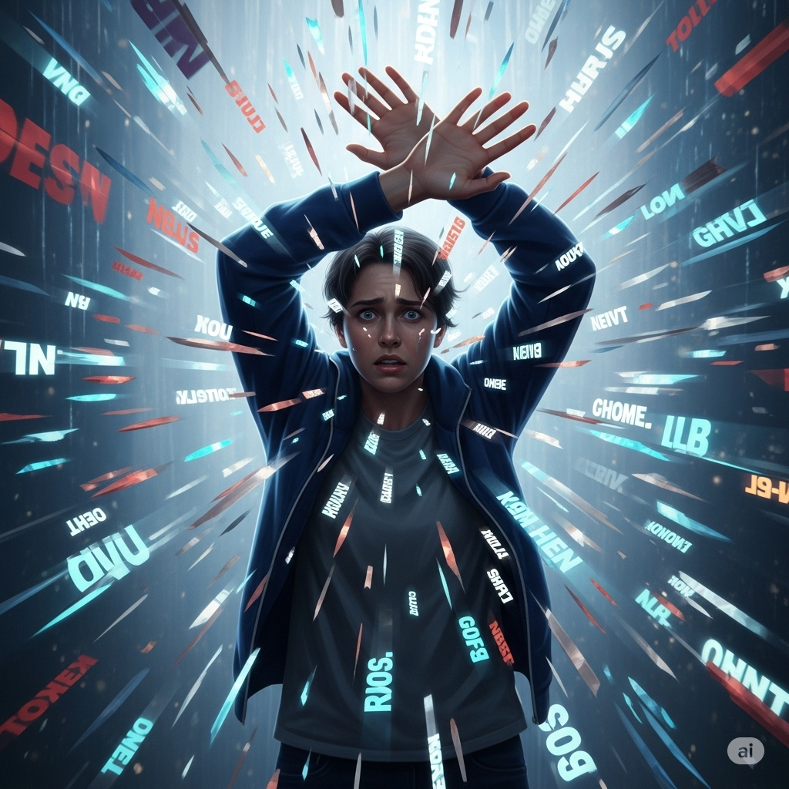
He received a criticism.
She is dealing with criticism.
They have faced a lot of criticism.
He ignored the criticism yesterday.
We were listening to the criticism.
Before, I had not heard such harsh criticism.
You will get criticism.
I am going to accept the criticism.
Criticism can be helpful.
You should learn from criticism.
I would respond to the criticism.
Accept the criticism.

------------

## 7. devastate v
### định nghĩa
tàn phá hoàn toàn; làm cho ai đó rất buồn.
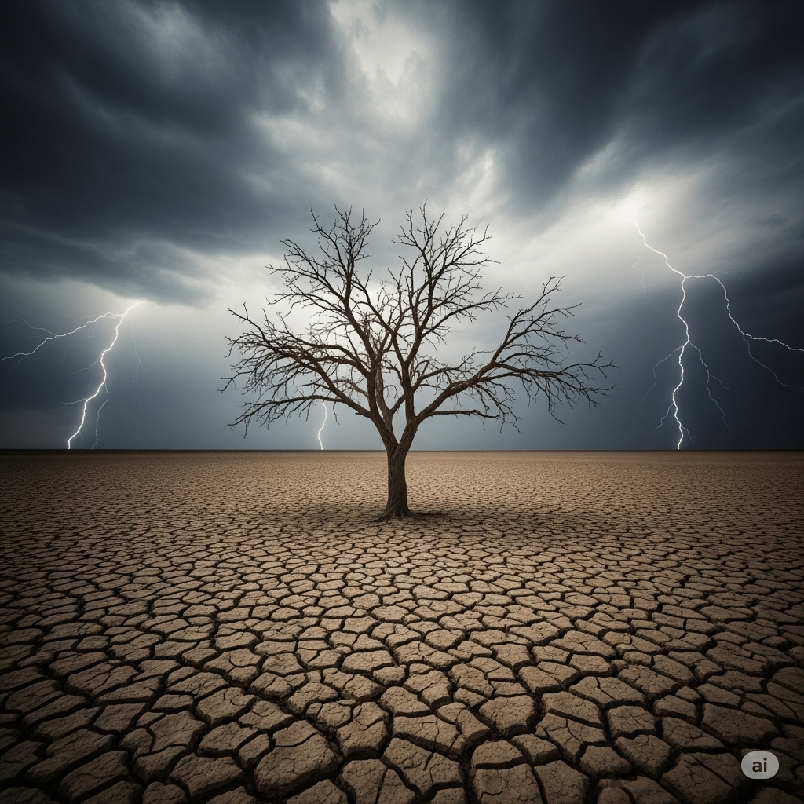
The storm devastates the town.
The news is devastating her.
The fire has devastated the forest.
The flood devastated the area last year.
They were devastating the land.
Before, I had not seen such a devastated place.
The news will devastate him.
It is going to devastate the economy.
It can devastate a family.
You should help those who are devastated.
I would be devastated if that happened.
The loss devastated her.

------------

## 8. frown v
### định nghĩa
cau mày (nhăn trán để thể hiện sự không hài lòng hoặc suy nghĩ).
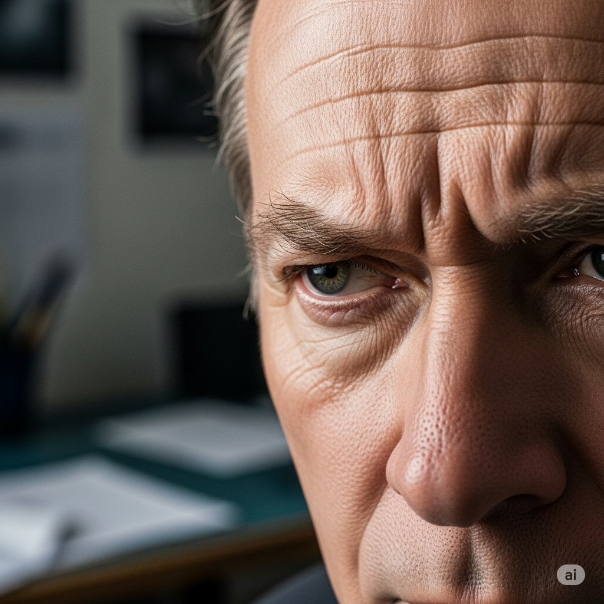
He frowns when he is angry.
She is frowning at the screen.
They have frowned at the idea.
He frowned when he heard the news.
We were frowning at the bad weather.
Before, I had not frowned so much.
You will frown if you don't understand.
I am going to frown.
You can frown.
You should not frown so much.
I would frown if I disagreed.
Don't frown.

------------

## 9. gaze v
### định nghĩa
nhìn chằm chằm trong một thời gian dài.

He gazes at the stars.
She is gazing out the window.
They have gazed at the painting.
He gazed at her for a moment.
We were gazing at the sunset.
Before, I had not gazed at anything so beautiful.
You will gaze at the view.
I am going to gaze at the ocean.
You can gaze at the sky.
You should gaze at the beauty around you.
I would gaze at the mountains.
Gaze at the horizon.

------------

## 10. glance v
### định nghĩa
liếc nhìn nhanh.

He glances at his watch.
She is glancing at the paper.
They have glanced at the report.
He glanced at me quickly.
We were glancing at the menu.
Before, I had not glanced at it.
You will glance at the time.
I am going to glance at the news.
You can glance at the answer.
You should glance at the road while driving.
I would glance at the message.
Glance at the clock.

------------

## 11. grief n
### định nghĩa
nỗi buồn sâu sắc, đặc biệt là sau khi ai đó qua đời.
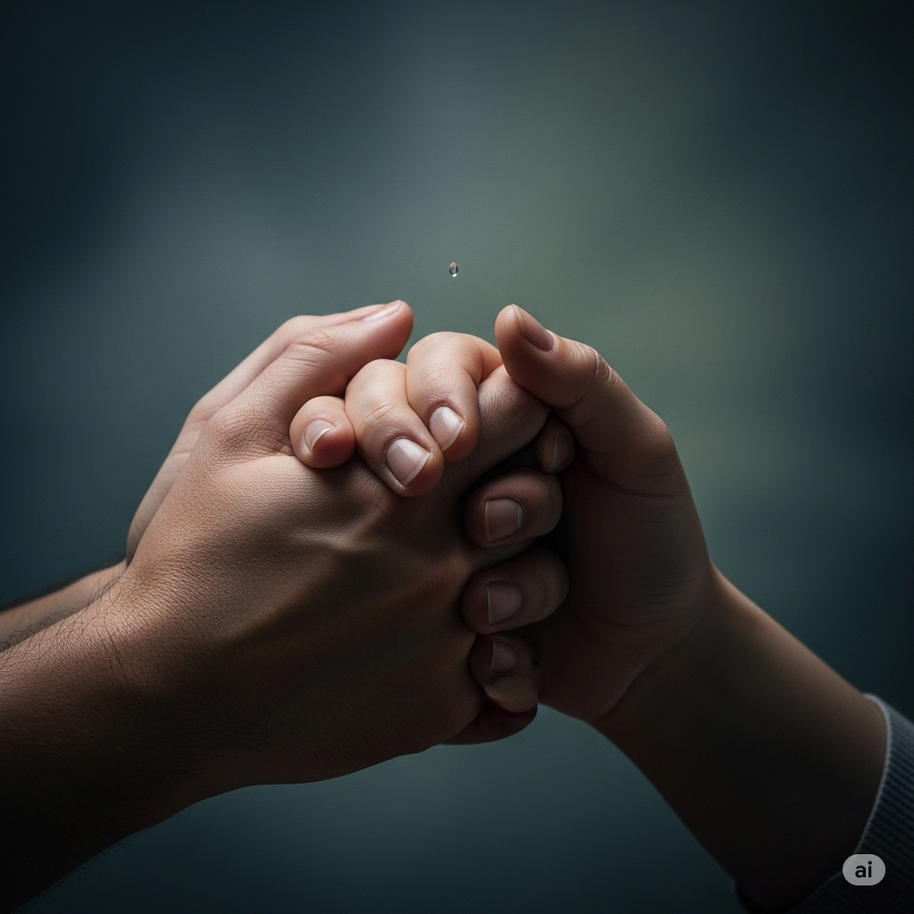
He feels great grief.
She is dealing with her grief.
They have shared their grief.
He felt grief after the loss.
We were trying to comfort them in their grief.
Before, I had not experienced such grief.
You will feel grief.
I am going to help her with her grief.
Grief can be hard to bear.
You should allow yourself to feel grief.
I would offer support during grief.
Share your grief.

------------

## 12. groom n
### định nghĩa
chú rể (người đàn ông sắp hoặc vừa kết hôn).
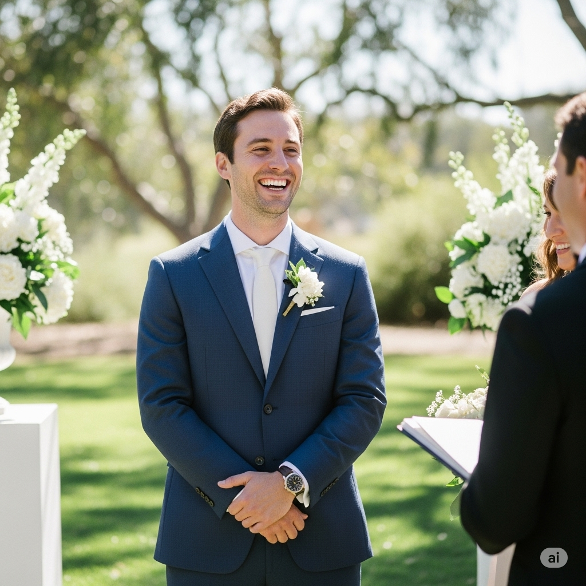
The groom is waiting.
She is talking to the groom.
They have congratulated the groom.
He was the groom at the wedding.
We were watching the groom and bride.
Before, I had not met the groom.
You will see the groom soon.
I am going to dance with the groom.
The groom looks happy.
You should congratulate the groom.
I would give a gift to the groom.
Congratulate the groom.

------------

## 13. license n
### định nghĩa
giấy phép chính thức cho phép bạn làm điều gì đó (như lái xe).
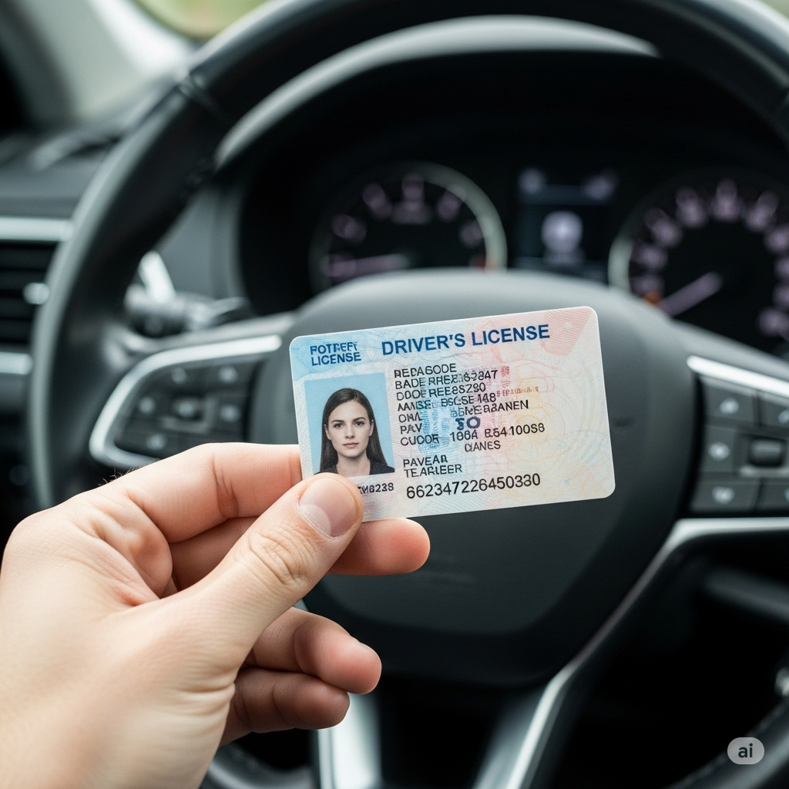
He has a driver's license.
She is getting her license.
They have renewed their license.
He got his license last year.
We were checking the license.
Before, I had not needed a license.
You will need a license.
I am going to get my license.
A license is required.
You should carry your license.
I would show my license if asked.
Show me your license.

------------

## 14. microscope n
### định nghĩa
thiết bị làm cho những vật rất nhỏ trông lớn hơn.
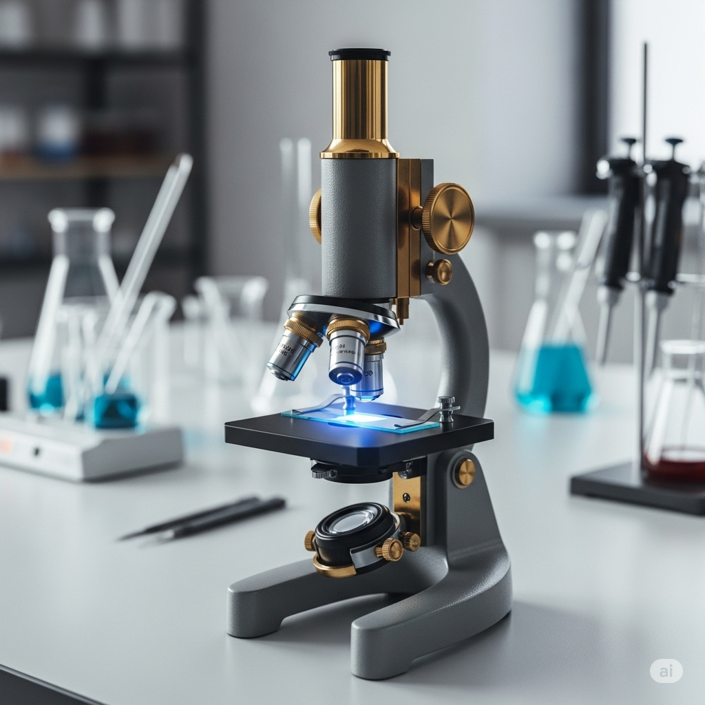
He uses a microscope.
She is looking through the microscope.
They have bought a new microscope.
He used the microscope in class.
We were examining the sample under the microscope.
Before, I had not used a microscope.
You will use the microscope.
I am going to look at it under the microscope.
A microscope helps you see tiny things.
You should look at this under the microscope.
I would like to use a powerful microscope.
Look through the microscope.

------------

## 15. nuclear adj
### định nghĩa
liên quan đến năng lượng từ hạt nhân nguyên tử.
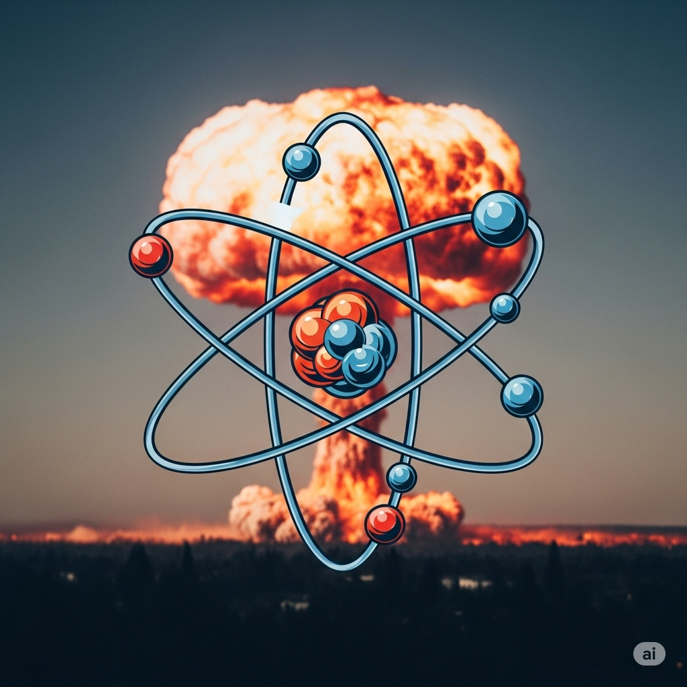
They use nuclear power.
She is studying nuclear physics.
The country has nuclear weapons.
He worked at a nuclear plant.
They were discussing nuclear energy.
Before, I had not understood nuclear reactions.
The nuclear reactor will be built.
They are going to develop nuclear technology.
Nuclear energy can be powerful.
You should be careful with nuclear waste.
I would support safe nuclear power.
Learn about nuclear energy.

------------

## 16. portray v
### định nghĩa
miêu tả ai đó hoặc cái gì đó bằng lời nói hoặc hình ảnh.

The artist portrays her beautifully.
She is portraying a character.
The movie has portrayed the event accurately.
He portrayed the hero in the play.
They were portraying the situation.
Before, I had not portrayed anyone.
You will portray the role well.
I am going to portray the scene.
You can portray emotions.
You should portray the truth.
I would portray him as a kind person.
Portray the character.

------------

## 17. rotate v
### định nghĩa
xoay quanh một điểm hoặc trục.
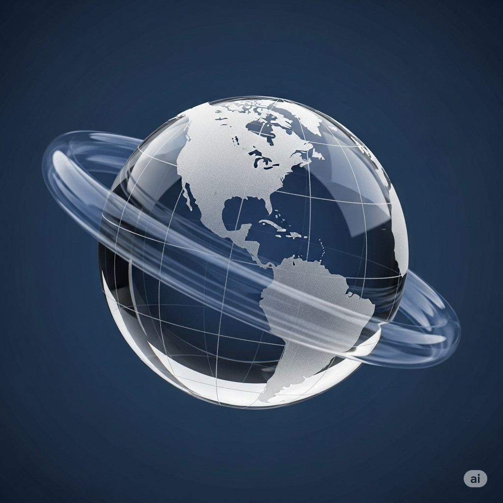
The Earth rotates.
The fan is rotating.
The wheels have rotated.
The machine rotated slowly.
They were rotating the tires.
Before, it had not rotated smoothly.
The part will rotate.
It is going to rotate faster.
It can rotate clockwise.
You should rotate the crops.
I would rotate the image.
Rotate the object.

------------

## 18. souvenir n
### định nghĩa
vật kỷ niệm (thứ bạn mua để nhớ về một nơi hoặc sự kiện).
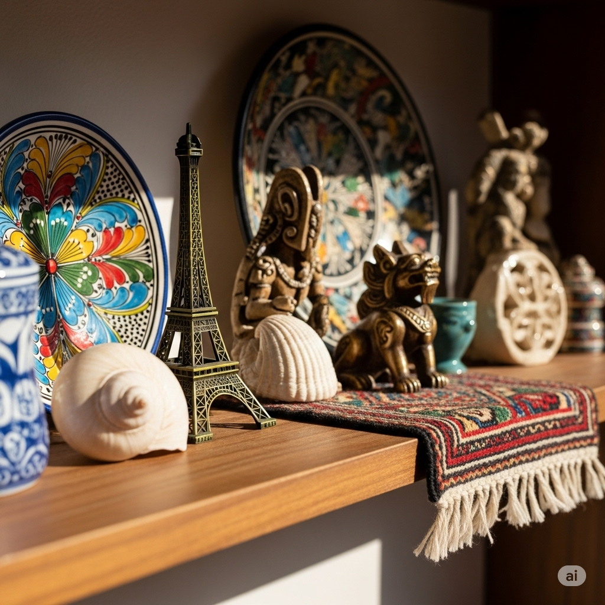
I bought a souvenir.
She is looking for a souvenir.
They have collected many souvenirs.
He bought a souvenir from Paris.
We were choosing souvenirs.
Before, I had not bought a souvenir.
You will find a nice souvenir.
I am going to buy a souvenir.
A souvenir reminds you of a trip.
You should buy a souvenir.
I would like a souvenir from your trip.
Buy a souvenir.

------------

## 19. submarine n
### định nghĩa
tàu đi dưới nước.
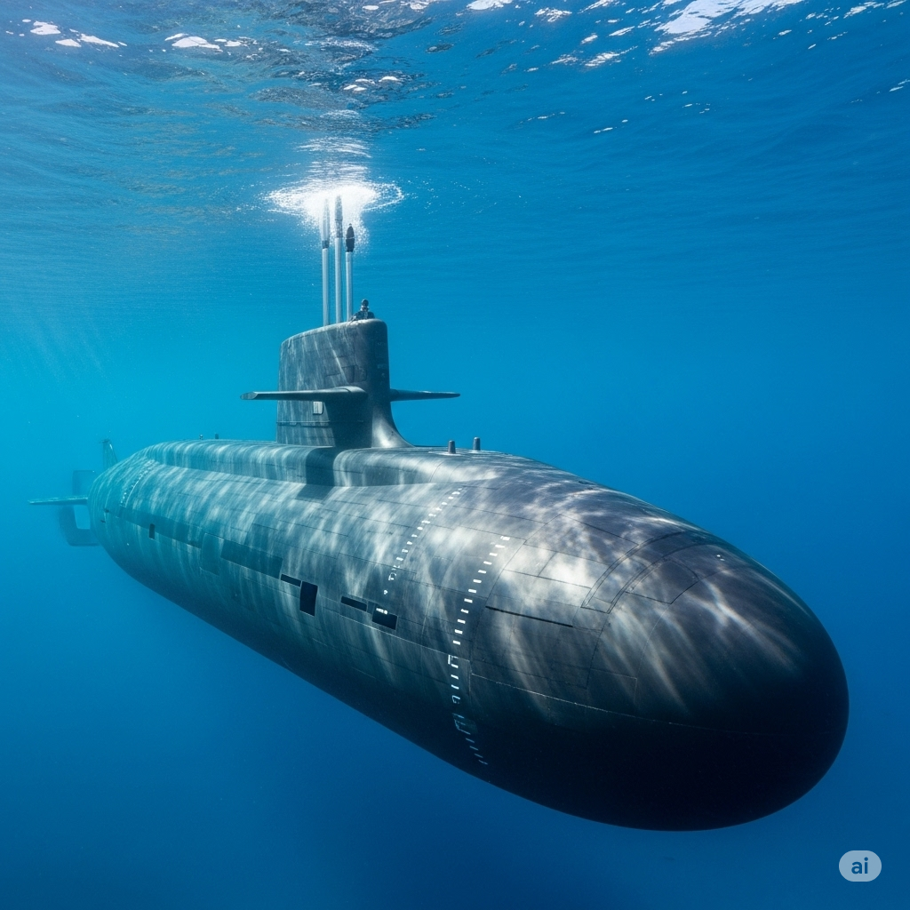
The submarine is diving.
They are on a submarine.
We have seen a submarine.
He worked on a submarine.
They were building a submarine.
Before, I had not been on a submarine.
You will see a submarine.
I am going to visit a submarine museum.
A submarine can stay underwater for a long time.
You should learn about submarines.
I would be interested in a submarine.
Look at the submarine.

------------

## 20. trace v
### định nghĩa
tìm ra dấu vết; vẽ theo đường viền.
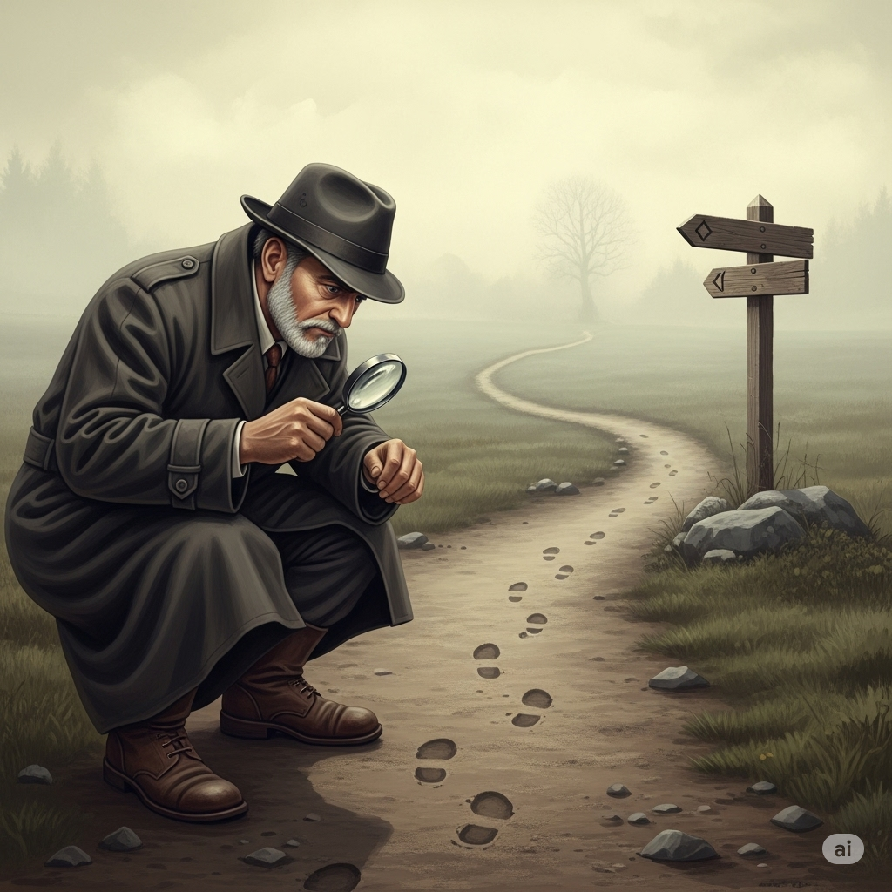
He traces the outline.
She is tracing her hand.
They have traced the call.
He traced the source of the problem.
We were tracing the wires.
Before, I had not traced anything.
You will trace the image.
I am going to trace the history.
You can trace the origin.
You should trace the lines carefully.
I would trace the pattern.
Trace the picture.

------------

## an interesting life

A man looked through some boxes with his grandson. They were filled with old photographs and objects that **portrayed** important events from the grandfather’s life. He wished to share the **circumstances** behind each event with his grandson.

The grandson, however, thought his grandfather’s stories were boring. The grandfather **coped** with this. He ignored his grandson’s **criticism**.

He took a photo from the box. “ That’s the **submarine** I was on during the war,” he explained. The grandson **gazed** at it.

The grandfather **glanced** at the next picture and **frowned**. It showed a row of **coffins**. His grandson noticed the **grief** in his grandfather’s face.

“ What is it?” the boy inquired.

“ This was after a **nuclear** **bomb** was dropped,” the grandfather answered. “ It **devastated** a city.”

Next the grandfather pulled a toy **microscope** from the box and **rotated** it in his hand.

“ Where did you get that?” the grandson asked.

“ This is a **souvenir** I bought at the science museum,” the grandfather said.

Now the boy was really interested. He started to understand that his grandfather was telling him a larger story. It was the story of his grandfather’s life.

He got another photo. It showed a young bride and **groom**. They were very happy. A **certificate** was attached to the photo. The boy couldn’t read it, but he **traced** his finger over paper.

“ What’s this from, Granddad?” he asked.

“ That’s my marriage **license** from the day I married your grandmother,” the grandfather said.

“ Wow!” said the boy. “ Granddad, now I know all about your life!”