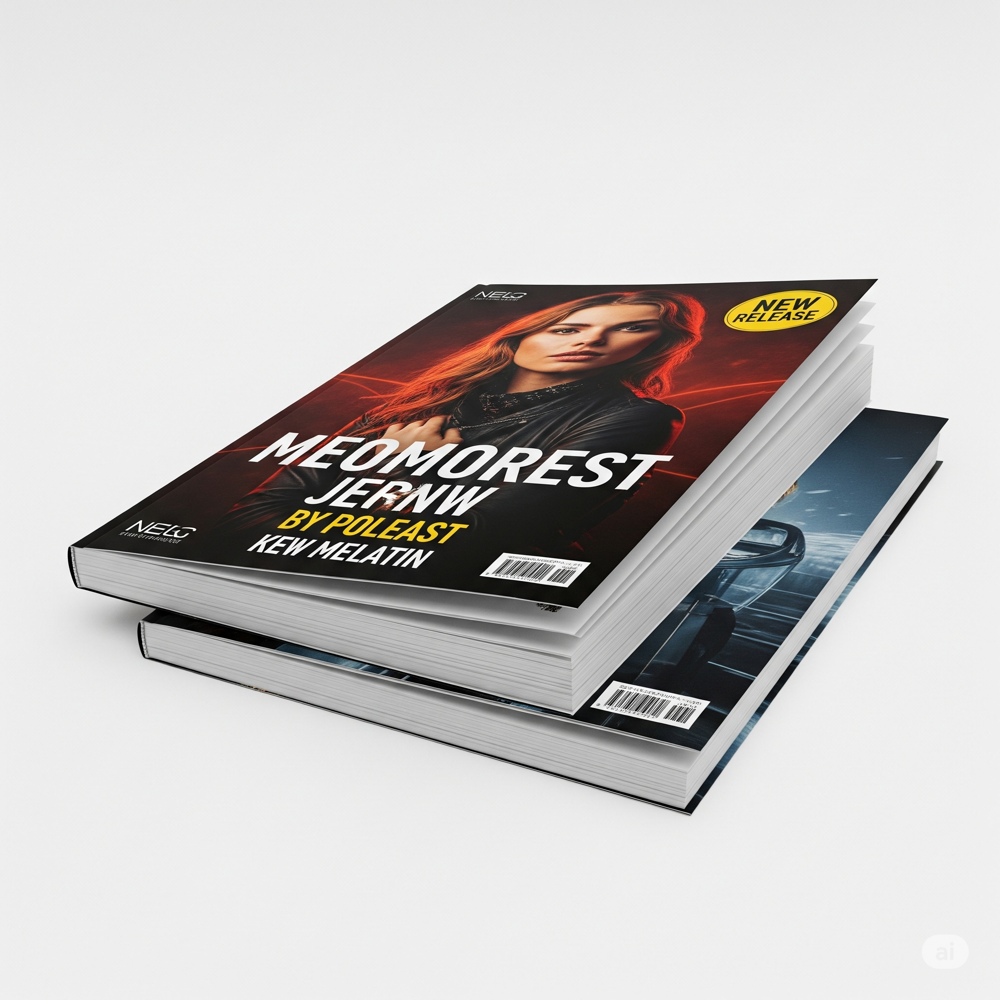
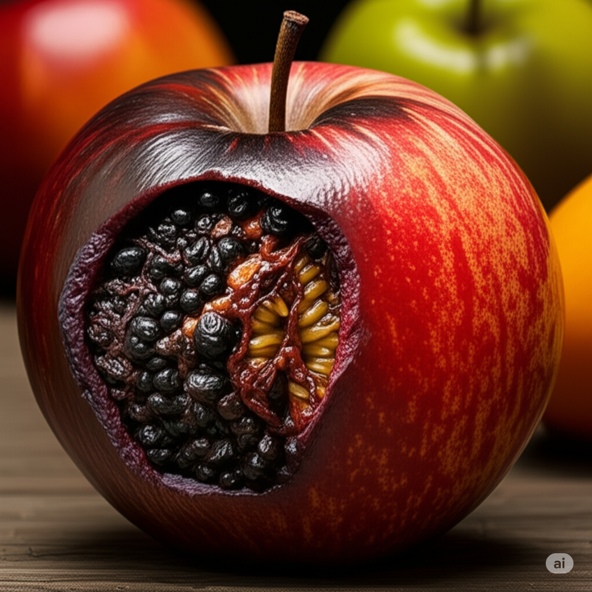
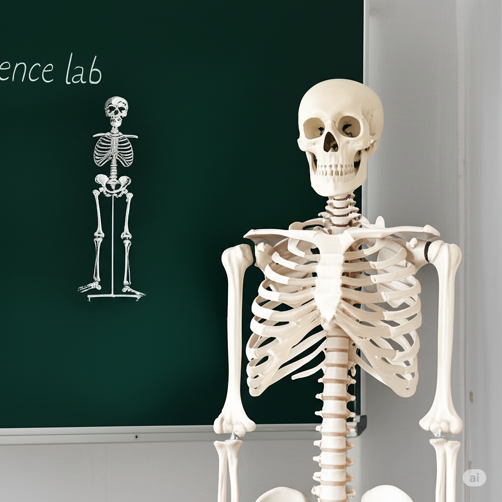

# Essential English Word 3
## Unit 5

## 1. Acquaint (v)
- **Definition:** To get to know someone or something. To make someone familiar with something.
- **Image:**  
- **Examples:**
    - I am acquainting myself with the new software. (Present Continuous)
    - She acquainted her friend with the new city. (Past Simple)
    - He will acquaint you with the rules. (Future Simple)
    - They have acquainted themselves with the local customs. (Present Perfect)
    - She was acquainting herself with the new job. (Past Continuous)
    - He had acquainted his son with the dangers of the forest. (Past Perfect)
    - I will be acquainting him with the team later. (Future Continuous)
    - They will have acquainted the new students by next week. (Future Perfect)
    - If you acquaint yourself with the facts, you will understand. (Conditional Simple)
    - If she had acquainted herself with the map, she wouldn't be lost. (Conditional Perfect)
    - Acquainting children with books is important. (Gerund)
    - To acquaint yourself with a new culture, travel. (Infinitive)

## 2. Cemetery (n)
- **Definition:** A place where dead people are buried.
- **Image:** 
- **Examples:**
    - The cemetery is a quiet place. (Present Simple)
    - They visited the cemetery yesterday. (Past Simple)
    - We will go to the cemetery tomorrow. (Future Simple)
    - She has visited the cemetery many times. (Present Perfect)
    - He was walking through the cemetery. (Past Continuous)
     - They had visited the cemetery before the rain started. (Past Perfect)
    - I will be visiting the cemetery next week. (Future Continuous)
    - They will have cleaned the cemetery by Sunday. (Future Perfect)
    - If I visit the cemetery, I will bring flowers. (Conditional Simple)
    - If he had visited the cemetery, he would have seen the grave. (Conditional Perfect)
    - Visiting the cemetery is a way to remember loved ones. (Gerund)
    - To visit the cemetery is a sign of respect. (Infinitive)

## 3. Curse (v)
- **Definition:** To say bad words or wish bad things would happen to someone.
- **Image:** 
- **Examples:**
    - He curses when he is angry. (Present Simple)
    - She cursed after she stubbed her toe. (Past Simple)
    - I will never curse at anyone. (Future Simple)
    - They have cursed the bad luck. (Present Perfect)
    - He was cursing under his breath. (Past Continuous)
    - She had cursed the day she met him. (Past Perfect)
    - I will be cursing this traffic if I'm late. (Future Continuous)
    - They will have cursed the delay by the time it ends. (Future Perfect)
    - If you curse, people will be upset. (Conditional Simple)
    - If he had cursed, he would have been punished. (Conditional Perfect)
    - Cursing is not a good habit. (Gerund)
    - To curse is considered impolite. (Infinitive)

## 4. Disguise (n)
- **Definition:** Something you wear to change how you look so people don't know you.
- **Image:** 
- **Examples:**
    - The spy wears a disguise. (Present Simple)
    - He wore a disguise to the party. (Past Simple)
    - She will use a disguise for the play. (Future Simple)
    - They have used a disguise before. (Present Perfect)
    - He was wearing a disguise at the event. (Past Continuous)
    - She had used a disguise to enter the building. (Past Perfect)
    - I will be wearing a disguise for Halloween. (Future Continuous)
    - They will have perfected the disguise by opening night. (Future Perfect)
    - If you wear a disguise, no one will recognize you. (Conditional Simple)
    - If she had worn a disguise, she wouldn't have been caught. (Conditional Perfect)
    - Wearing a disguise can be fun. (Gerund)
    - To wear a disguise is sometimes necessary. (Infinitive)

## 5. Fancy (adj)
- **Definition:** Nice or special.
- **Image:** 
- **Examples:**
    - That is a fancy car. (Present Simple)
    - She wore a fancy dress. (Past Simple)
    - They will have a fancy dinner. (Future Simple)
    - He has a fancy phone. (Present Perfect)
    - She was wearing a fancy hat. (Past Continuous)
    - They had a fancy party last week. (Past Perfect)
    - I will be wearing a fancy suit to the wedding. (Future Continuous)
    - They will have decorated the room with fancy lights. (Future Perfect)
    - If you buy a fancy car, it will cost a lot. (Conditional Simple)
    - If she had worn a fancy dress, she would have felt special. (Conditional Perfect)
    - Having a fancy meal is a treat. (Gerund)
    - To buy something fancy is a luxury. (Infinitive)

## 6. Flashlight (n)
- **Definition:** A small electric light you hold in your hand.
- **Image:** 
- **Examples:**
    - I have a flashlight in my bag. (Present Simple)
    - He used a flashlight to see in the dark. (Past Simple)
    - We will need a flashlight for the cave. (Future Simple)
    - She has a flashlight ready for emergencies. (Present Perfect)
    - He was using a flashlight to find his keys. (Past Continuous)
    - They had a flashlight when the power went out. (Past Perfect)
    - I will be using a flashlight on the camping trip. (Future Continuous)
    - They will have packed a flashlight for the hike. (Future Perfect)
    - If you have a flashlight, you can see in the dark. (Conditional Simple)
    - If she had had a flashlight, she wouldn't have tripped. (Conditional Perfect)
    - Using a flashlight is helpful in the dark. (Gerund)
    - To have a flashlight is useful. (Infinitive)

## 7. Hood (n)
- **Definition:** Part of a coat that covers your head.
- **Image:** 
- **Examples:**
    - The jacket has a hood. (Present Simple)
    - He put on his hood because it was raining. (Past Simple)
    - She will wear a hood to keep warm. (Future Simple)
    - The coat has a hood attached. (Present Perfect)
    - He was wearing a hood to hide his face. (Past Continuous)
    - She had her hood up to protect from the wind. (Past Perfect)
    - I will be wearing a hood in the snow. (Future Continuous)
    - They will have put on their hoods before going outside. (Future Perfect)
    - If you wear a hood, you will stay dry. (Conditional Simple)
    - If she had worn a hood, she wouldn't have gotten wet. (Conditional Perfect)
    - Wearing a hood is good in cold weather. (Gerund)
    - To wear a hood is practical in the rain. (Infinitive)

## 8. Inhabitant (n)
- **Definition:** Someone who lives in a place.
- **Image:** 
- **Examples:**
    - The city has many inhabitants. (Present Simple)
    - He was an inhabitant of the island. (Past Simple)
    - They will become inhabitants of the new town. (Future Simple)
    - She has been an inhabitant of this country for years. (Present Perfect)
    - He was a long-time inhabitant of the village. (Past Continuous)
    - They had been inhabitants of the house for decades. (Past Perfect)
    - I will be an inhabitant of this city soon. (Future Continuous)
    - They will have been inhabitants of the planet for centuries. (Future Perfect)
    - If you are an inhabitant, you can vote. (Conditional Simple)
    - If she had been an inhabitant, she would have known the rules. (Conditional Perfect)
    - Being an inhabitant means you belong. (Gerund)
    - To be an inhabitant is to be part of the community. (Infinitive)

## 9. Nourish (v)
- **Definition:** To give food and things that are needed for life and growth.
- **Image:** 
- **Examples:**
    - Food nourishes the body. (Present Simple)
    - She nourished her baby with milk. (Past Simple)
    - We will nourish the plants with water. (Future Simple)
    - They have nourished the soil with compost. (Present Perfect)
    - He was nourishing the sick animal. (Past Continuous)
    - She had nourished her children well. (Past Perfect)
    - I will be nourishing my body with healthy food. (Future Continuous)
    - They will have nourished the plants by the end of the week. (Future Perfect)
    - If you nourish your body, you will be healthy. (Conditional Simple)
    - If she had nourished the plant, it would have grown. (Conditional Perfect)
    - Nourishing your body is important. (Gerund)
    - To nourish is to care for. (Infinitive)

## 10. Pirate (n)
- **Definition:** Someone who attacks and steals from ships at sea.
- **Image:** 
- **Examples:**
    - A pirate sails the sea. (Present Simple)
    - He was dressed as a pirate for Halloween. (Past Simple)
    - They will play the role of pirates in the play. (Future Simple)
    - She has read stories about pirates. (Present Perfect)
    - He was acting like a pirate. (Past Continuous)
    - They had seen pirates in the movies. (Past Perfect)
    - I will be dressing up as a pirate for the party. (Future Continuous)
    - They will have found the pirate treasure by next year. (Future Perfect)
    - If you see a pirate, be careful. (Conditional Simple)
    - If she had met a pirate, she would have been scared. (Conditional Perfect)
    - Being a pirate is dangerous. (Gerund)
    - To be a pirate is to live a life of adventure. (Infinitive)

## 11. Publication (n)
- **Definition:** A book or magazine.
- **Image:** 
- **Examples:**
    - This is a new publication. (Present Simple)
    - The publication was released last week. (Past Simple)
    - They will announce the publication soon. (Future Simple)
    - She has read many publications. (Present Perfect)
    - He was reading a publication about science. (Past Continuous)
    - They had seen the publication in the store. (Past Perfect)
    - I will be writing a publication next year. (Future Continuous)
    - They will have finished the publication by December. (Future Perfect)
    - If you write a publication, you can share your ideas. (Conditional Simple)
    - If she had read the publication, she would have known the answer. (Conditional Perfect)
    - Reading a publication is a good way to learn. (Gerund)
    - To write a publication is a big achievement. (Infinitive)

## 12. Riddle (n)
- **Definition:** A question that is difficult to answer.
- **Image:** 
- **Examples:**
    - I know a riddle. (Present Simple)
    - He told a riddle at the party. (Past Simple)
    - She will ask a riddle tomorrow. (Future Simple)
    - They have heard many riddles. (Present Perfect)
    - He was trying to solve a riddle. (Past Continuous)
    - She had heard the riddle before. (Past Perfect)
    - I will be thinking of a riddle for the game. (Future Continuous)
    - They will have solved the riddle by the end of the day. (Future Perfect)
    - If you know the answer to the riddle, tell me. (Conditional Simple)
    - If she had solved the riddle, she would have won. (Conditional Perfect)
    - Solving a riddle is fun. (Gerund)
    - To tell a riddle is a good way to entertain. (Infinitive)

## 13. Rot (n)
- **Definition:** The process of decaying or breaking down.
- **Image:** 
- **Examples:**
    - The fruit is starting to rot. (Present Simple)
    - The wood rotted over time. (Past Simple)
    - The food will rot if you leave it out. (Future Simple)
    - The apples have started to rot. (Present Perfect)
    - The leaves were rotting on the ground. (Past Continuous)
    - The tree had rotted from the inside. (Past Perfect)
    - The vegetables will be rotting if we don't eat them soon. (Future Continuous)
    - The food will have rotted by the time we get back. (Future Perfect)
    - If things rot, they smell bad. (Conditional Simple)
    - If the food had not rotted, we could have eaten it. (Conditional Perfect)
    - Rotting food attracts flies. (Gerund)
    - To rot is a natural process. (Infinitive)

## 14. Scare (v)
- **Definition:** To make someone afraid.
- **Image:** 
- **Examples:**
    - Loud noises scare me. (Present Simple)
    - He scared her with a mask. (Past Simple)
    - They will scare their friends on Halloween. (Future Simple)
    - She has scared the birds away. (Present Perfect)
    - He was trying to scare his sister. (Past Continuous)
    - They had scared the cat. (Past Perfect)
    - I will be scaring my friends at the party. (Future Continuous)
    - They will have scared everyone by the end of the night. (Future Perfect)
    - If you scare someone, they might scream. (Conditional Simple)
    - If she had scared him, he would have cried. (Conditional Perfect)
    - Scaring people is not nice. (Gerund)
    - To scare someone can be funny, but also mean. (Infinitive)

## 15. Shortly (adv)
- **Definition:** Soon, in a little while.
- **Image:** 
- **Examples:**
    - I will arrive shortly. (Present Simple - adverb of time)
    - He left shortly after the meeting. (Past Simple)
    - She will be here shortly. (Future Simple)
    - They have arrived shortly before the show. (Present Perfect)
    - He was leaving shortly after the call. (Past Continuous)
    - She had finished shortly before the guests arrived. (Past Perfect)
    - I will be leaving shortly after lunch. (Future Continuous)
    - They will have finished shortly after the deadline. (Future Perfect)
    - If you wait shortly, you will see. (Conditional Simple)
    - If she had arrived shortly earlier, she would have seen him. (Conditional Perfect)
    - Arriving shortly is better than being late. (Gerund)
    - To arrive shortly is polite. (Infinitive)

## 16. Skeleton (n)
- **Definition:** The bones of a body.
- **Image:** 
- **Examples:**
    - The skeleton is in the science lab. (Present Simple)
    - He saw a skeleton at Halloween. (Past Simple)
    - They will study the skeleton in class. (Future Simple)
    - She has drawn a picture of a skeleton. (Present Perfect)
    - He was looking at a skeleton in the museum. (Past Continuous)
    - They had seen a skeleton in the doctor's office. (Past Perfect)
    - I will be dressing up as a skeleton for Halloween. (Future Continuous)
    - They will have finished studying the skeleton by the end of the year. (Future Perfect)
    - If you see a skeleton, you know it's Halloween. (Conditional Simple)
    - If she had seen a skeleton, she would have been scared. (Conditional Perfect)
    - Studying a skeleton is part of science. (Gerund)
    - To see a skeleton is common at Halloween. (Infinitive)

## 17. Spoil (v)
- **Definition:** To become bad or not good to eat.
- **Image:** 
- **Examples:**
    - The milk will spoil if you don't refrigerate it. (Present Simple)
    - The food spoiled in the heat. (Past Simple)
    - The fruit will spoil if you leave it out too long. (Future Simple)
    - The milk has spoiled. (Present Perfect)
    - The food was spoiling in the sun. (Past Continuous)
    - The meat had spoiled before they cooked it. (Past Perfect)
    - The leftovers will be spoiling if we don't eat them soon. (Future Continuous)
    - The food will have spoiled by the time we get back from vacation. (Future Perfect)
    - If food spoils, it smells bad. (Conditional Simple)
    - If the food had not spoiled, we could have eaten it. (Conditional Perfect)
    - Spoiling food is a waste. (Gerund)
    - To spoil is a natural process for food. (Infinitive)

## 18. Starve (v)
- **Definition:** To suffer or die because you don't have enough food.
- **Image:** 
- **Examples:**
    - People starve when there is no food. (Present Simple)
    - He starved during the famine. (Past Simple)
    - They will starve if they don't get food. (Future Simple)
    - The animals have starved because of the drought. (Present Perfect)
    - He was starving because he had no money for food. (Past Continuous)
    - They had starved before help arrived. (Past Perfect)
    - I will be starving if I don't eat soon. (Future Continuous)
    - They will have starved if no one helps them. (Future Perfect)
    - If you starve, you will get very sick. (Conditional Simple)
    - If she had starved, she would have died. (Conditional Perfect)
    - Starving is a terrible thing. (Gerund)
    - To starve is to suffer from hunger. (Infinitive)

## 19. Thrill (n)
- **Definition:** A feeling of great excitement and pleasure.
- **Image:** 
- **Examples:**
    - Riding a roller coaster is a thrill. (Present Simple)
    - He felt a thrill when he won the race. (Past Simple)
    - They will experience a thrill on the adventure. (Future Simple)
    - She has felt the thrill of victory. (Present Perfect)
    - He was feeling the thrill of the ride. (Past Continuous)
    - They had felt the thrill of winning before. (Past Perfect)
    - I will be feeling the thrill of the performance. (Future Continuous)
    - They will have experienced the thrill by the end of the show. (Future Perfect)
    - If you ride a roller coaster, you will feel a thrill. (Conditional Simple)
    - If she had won, she would have felt a thrill. (Conditional Perfect)
    - Feeling a thrill is exciting. (Gerund)
    - To experience a thrill is a great feeling. (Infinitive)

## 20. Wicked (adj)
- **Definition:** Very bad or evil.
- **Image:** 
- **Examples:**
    - The witch is wicked. (Present Simple)
    - He was a wicked man. (Past Simple)
    - She will play the wicked queen in the play. (Future Simple)
    - They have heard stories about wicked people. (Present Perfect)
    - He was acting wicked. (Past Continuous)
    - They had seen the wicked character in the movie. (Past Perfect)
    - I will be playing the wicked stepmother in the play. (Future Continuous)
    - They will have defeated the wicked villain by the end of the story. (Future Perfect)
    - If you are wicked, people will not like you. (Conditional Simple)
    - If she had been wicked, she would have been punished. (Conditional Perfect)
    - Being wicked is not good. (Gerund)
    - To be wicked is to be evil. (Infinitive)