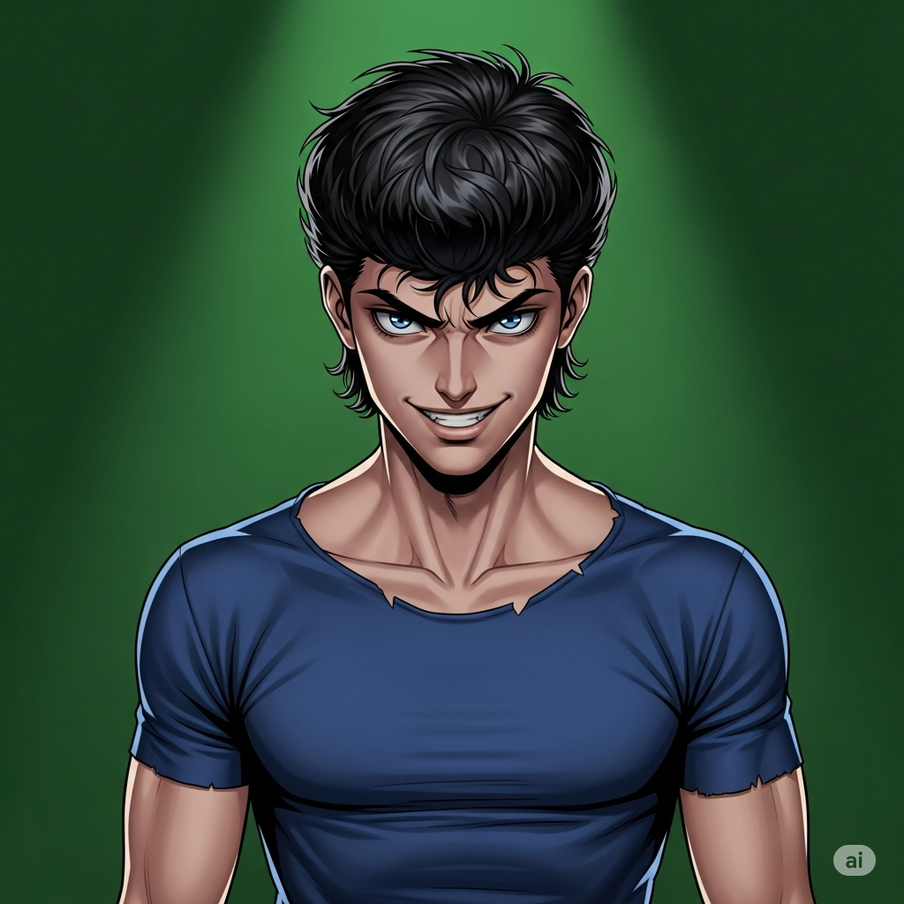
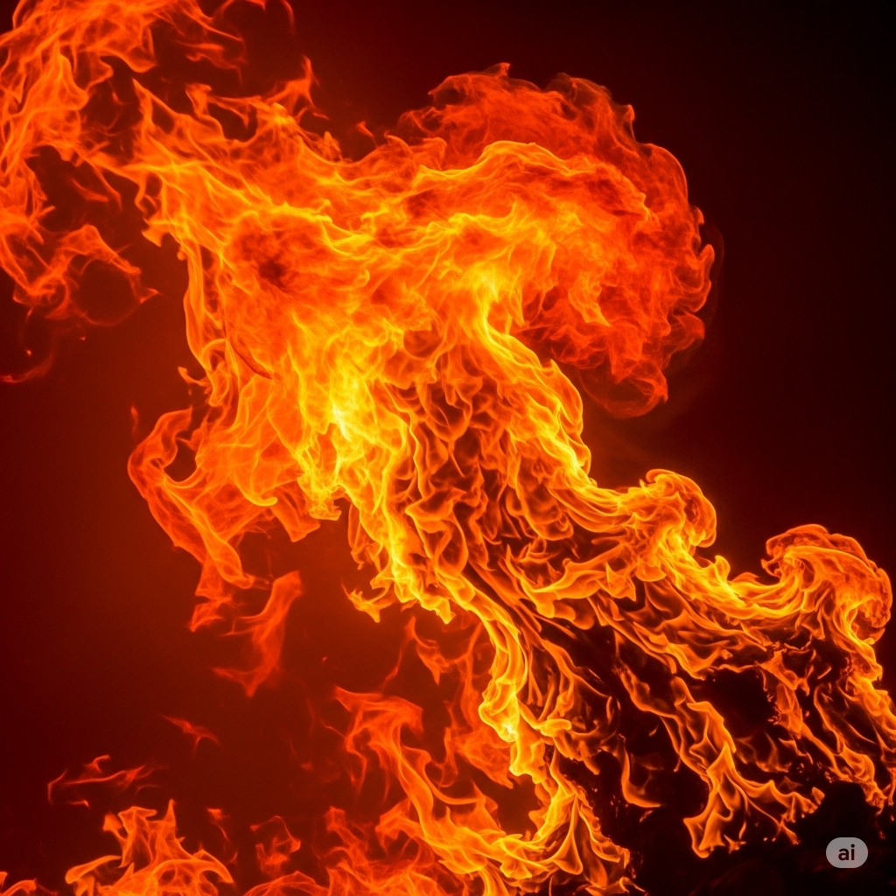

# Essential English Word 4
# Unit 2
## 1. accident n
### định nghĩa
một sự kiện không mong muốn xảy ra do tình cờ, thường gây ra thiệt hại hoặc thương tích.

He had a car accident.

She is reporting an accident.

They have been in an accident.

He saw the accident yesterday.

We were talking about the accident.

Before, I had not seen such a bad accident.

You will avoid an accident if you drive carefully.

There is going to be an accident if you are not careful.

Accidents can happen quickly.

You should be careful to avoid accidents.

I would call for help after an accident.

Be careful, don't have an accident.

------------

## 2. admiral n
### định nghĩa
một sĩ quan cấp cao trong hải quân.

He is an admiral.

She is meeting the admiral.

They have spoken to the admiral.

He was an admiral in the navy.

We were waiting for the admiral's orders.

Before, I had not met an admiral.

You will meet the admiral.

I am going to become an admiral.

An admiral commands ships.

You should salute the admiral.

I would be honored to meet the admiral.

Report to the admiral.

------------

## 3. arc n
### định nghĩa
một đường cong, đặc biệt là một phần của hình tròn.

The ball flew in an arc.

She is drawing an arc.

They have formed an arc.

He saw the rainbow's arc.

We were watching the water arc from the fountain.

Before, I had not noticed the arc.

The light will make an arc.

It is going to form an arc.

An arc can be part of a circle.

You should draw a smooth arc.

I would measure the arc.

Draw an arc.

------------

## 4. character n
### định nghĩa
tính cách (tổng hợp các phẩm chất của một người); nhân vật (trong truyện, phim).

He has a good character.

She is playing a character.

They have strong characters.

He showed his true character.

We were discussing the main character.

Before, I had not understood his character.

You will like her character.

I am going to play a new character.

A character can be complex.

You should judge people by their character.

I would describe his character as kind.

Show your true character.

------------

## 5. conscience n
### định nghĩa
lương tâm (cảm giác bên trong cho bạn biết điều gì đúng và sai).

His conscience is clear.

She is listening to her conscience.

They have a guilty conscience.

He felt his conscience bothering him.

We were talking about having a clear conscience.

Before, I had not thought about my conscience.

Your conscience will tell you what to do.

I am going to follow my conscience.

A conscience can guide you.

You should listen to your conscience.

I would feel bad if my conscience was not clear.

Listen to your conscience.

------------

## 6. fiery adj
### định nghĩa
bốc lửa, nóng bỏng (như lửa); đầy cảm xúc mạnh mẽ (như giận dữ).

He has a fiery temper.

She is giving a fiery speech.

They have seen a fiery sunset.

He saw a fiery explosion.

We were watching the fiery sky.

Before, I had not seen such a fiery color.

The sky will be fiery tonight.

It is going to be a fiery debate.

It can be fiery.

You should be careful with fiery things.

I would avoid his fiery temper.

Look at the fiery sky.

------------

## 7. flesh n
### định nghĩa
thịt (phần mềm của cơ thể người hoặc động vật); phần thịt của trái cây.

The wound went deep into the flesh.

She is cutting the flesh from the bone.

They have eaten the flesh of the fruit.

He felt the cold metal against his flesh.

We were looking at the color of the flesh.

Before, I had not seen the flesh exposed.

The fruit's flesh will be soft.

It is going to feel cold on your flesh.

The flesh can be tender.

You should cook the flesh thoroughly.

I would remove the flesh from the seed.

Cut the flesh.

------------

## 8. grapefruit n
### định nghĩa
quả bưởi chùm (một loại trái cây lớn, tròn, màu vàng, vị chua).

I eat grapefruit for breakfast.

She is cutting a grapefruit.

They have bought grapefruits.

He ate grapefruit this morning.

We were squeezing grapefruit juice.

Before, I had not tried grapefruit.

You will like grapefruit.

I am going to buy a grapefruit.

A grapefruit can be sour.

You should eat grapefruit for vitamin C.

I would prefer a sweet grapefruit.

Eat a grapefruit.

------------

## 9. hay n
### định nghĩa
cỏ khô dùng làm thức ăn cho động vật.

The horses eat hay.

He is stacking hay.

They have stored the hay.

He put fresh hay in the stable.

We were collecting hay from the field.

Before, I had not worked with hay.

You will need more hay.

I am going to buy some hay.

Hay can be itchy.

You should give the animals fresh hay.

I would use hay for bedding.

Bring the hay.

------------

## 10. horrified adj
### định nghĩa
cảm thấy rất sốc và sợ hãi.

She was horrified by the news.

He is looking horrified.

They have been horrified by the sight.

He felt horrified when he saw the accident.

We were horrified by the conditions.

Before, I had not been so horrified.

You will be horrified when you hear this.

I am going to be horrified.

It can make you feel horrified.

You should not show you are horrified.

I would be horrified if that happened.

He looks horrified.

------------

## 11. kerosene n
### định nghĩa
dầu hỏa (một loại nhiên liệu lỏng).

We use kerosene for the lamp.

He is pouring kerosene.

They have bought kerosene.

He filled the lamp with kerosene.

We were smelling the kerosene.

Before, I had not used kerosene.

You will need kerosene for the heater.

I am going to buy kerosene.

Kerosene is flammable.

You should be careful with kerosene.

I would use kerosene for camping.

Be careful with kerosene.

------------

## 12. loop n
### định nghĩa
vòng lặp (hình dạng tròn hoặc cong); vòng (trong chương trình máy tính).

Tie the rope in a loop.

She is making a loop.

They have formed a loop.

He saw a loop in the wire.

We were creating a loop in the code.

Before, I had not made a loop like that.

You will need to make a loop.

I am going to close the loop.

A loop can be tight.

You should tie a secure loop.

I would use a loop to hang it.

Make a loop.

------------

## 13. paddle n
### định nghĩa
mái chèo (dụng cụ có cán dài và bản rộng ở cuối, dùng để đẩy thuyền); vỗ nhẹ.

He uses a paddle.

She is holding the paddle.

They have lost a paddle.

He used the paddle to move the boat.

We were using the paddles.

Before, I had not used a paddle.

You will need a paddle.

I am going to buy a paddle.

A paddle can be made of wood.

You should hold the paddle firmly.

I would use a paddle for the canoe.

Grab the paddle.

------------

## 14. raft n
### định nghĩa
cái bè (một cấu trúc phẳng nổi trên nước, làm từ gỗ hoặc vật liệu khác).

They built a raft.

He is floating on the raft.

We have used a raft.

He made a raft from logs.

They were traveling on the raft.

Before, I had not been on a raft.

You will need a raft to cross the river.

I am going to build a raft.

A raft can be simple.

You should tie the raft securely.

I would use a raft to cross the lake.

Build a raft.

------------

## 15. sour adj
### định nghĩa
chua (có vị như chanh); không vui, khó chịu.

The lemon is sour.

She is making a sour face.

The milk has gone sour.

He tasted something sour.

We were eating sour candy.

Before, I had not liked sour things.

The fruit will be sour.

It is going to taste sour.

Some fruits are naturally sour.

You should add sugar if it's too sour.

I would prefer something less sour.

It tastes sour.

------------

## 16. stake n
### định nghĩa
cọc, cột nhọn cắm xuống đất; tiền đặt cược.

He hammered the stake into the ground.

She is tying the plant to a stake.

They have placed stakes around the area.

He used a stake to mark the spot.

We were putting stakes in the ground.

Before, I had not used a stake.

You will need a stake.

I am going to put a stake here.

A stake can be made of wood.

You should use a strong stake.

I would use a stake to support the tree.

Put a stake here.

------------

## 17. steward n
### định nghĩa
người phục vụ trên máy bay hoặc tàu thủy; người quản lý tài sản.

The steward helped me.

She is talking to the steward.

They have called the steward.

He asked the steward for a blanket.

We were waiting for the steward.

Before, I had not met a steward.

You will see the steward soon.

I am going to ask the steward for a drink.

A steward helps passengers.

You should listen to the steward's instructions.

I would thank the steward.

Call the steward.

------------

## 18. string n
### định nghĩa
sợi dây mỏng.

He tied it with string.

She is holding the string.

They have used a piece of string.

He found a piece of string.

We were tying the package with string.

Before, I had not used string for this.

You will need some string.

I am going to cut the string.

String can be strong.

You should use a strong string.

I would use string to hang it.

Cut the string.

------------

## 19. thorn n
### định nghĩa
gai nhọn trên thân cây (như hoa hồng).

Be careful of the thorns.

She is removing a thorn.

They have many thorns on the bush.

He got a thorn in his finger.

We were avoiding the thorns.

Before, I had not seen such big thorns.

You will find thorns on the rose bush.

It is going to have sharp thorns.

A thorn can hurt you.

You should be careful of thorns.

I would wear gloves to avoid thorns.

Watch out for thorns.

------------

## 20. wreck v
### định nghĩa
phá hủy hoàn toàn; làm hỏng nặng.

The storm will wreck the ship.

He is wrecking his life.

They have wrecked the car.

The accident wrecked the train.

We were wrecking the old building.

Before, I had not wrecked anything.

You will wreck it if you drop it.

He is going to wreck the plan.

It can wreck your chances.

You should not wreck your health.

I would be upset if I wrecked my phone.

Don't wreck it.

------------

## MONKEY ISLAND

In the middle of the ocean, there is a small island shaped like an **arc**. Here, monkeys play on the beach and in the trees. But how did the monkeys get there?

Once, an English **admiral** was exploring Africa when he found hundreds of monkeys. The **admiral’s** **character** was mean. He thought, “I could sell these monkeys and become very rich! I’m going to take them to England.”

So the **admiral** set traps to catch the monkeys. He put **stakes** in the ground, tied **string** around them and made **loops** in the **string**. When the monkeys ran through the forest, their feet got caught in the **loops**, and they couldn’t escape. Then the **admiral** put the monkeys in cages on his ship and sailed away.

The cages were small and uncomfortable. There was no soft **hay** for the monkeys to sleep on. Instead, they slept on branches with sharp **thorns** that cut into the monkeys’ **flesh**. For dinner, he gave them tiny pieces of **sour** **grapefruit** to eat. The monkeys grew hungry and weak.

But one day, the **admiral** hired a new **steward**. He was a kind man with a good **conscience**. He was **horrified** to see the thin monkeys in the cages. So one night he let them out.

The monkeys ran and played all over the ship! They attacked the **admiral** and the **steward** and ate their food. They completely **wrecked** the ship. One monkey ran into a **kerosene** lamp, and it fell over. The ship caught fire and began to sink! The whole crew was lost except for the monkeys.

After the **accident**, the monkeys jumped onto a **raft**. They floated away from the **fiery** blaze of the ship. In the morning, they saw a little island in the distance. The monkeys used a piece of wood as a **paddle**, and they went toward it. They found the island shaped like an **arc**. They felt so happy to find a new home, and they still live there today.