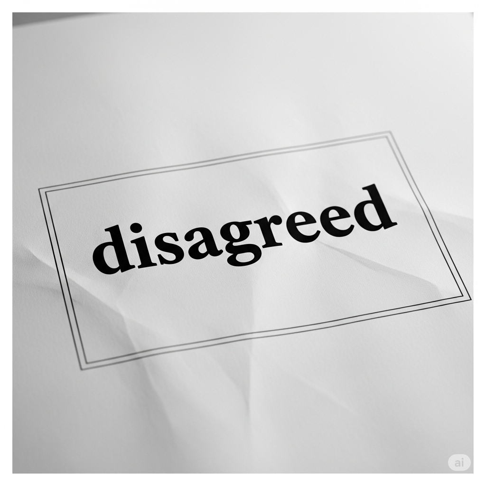
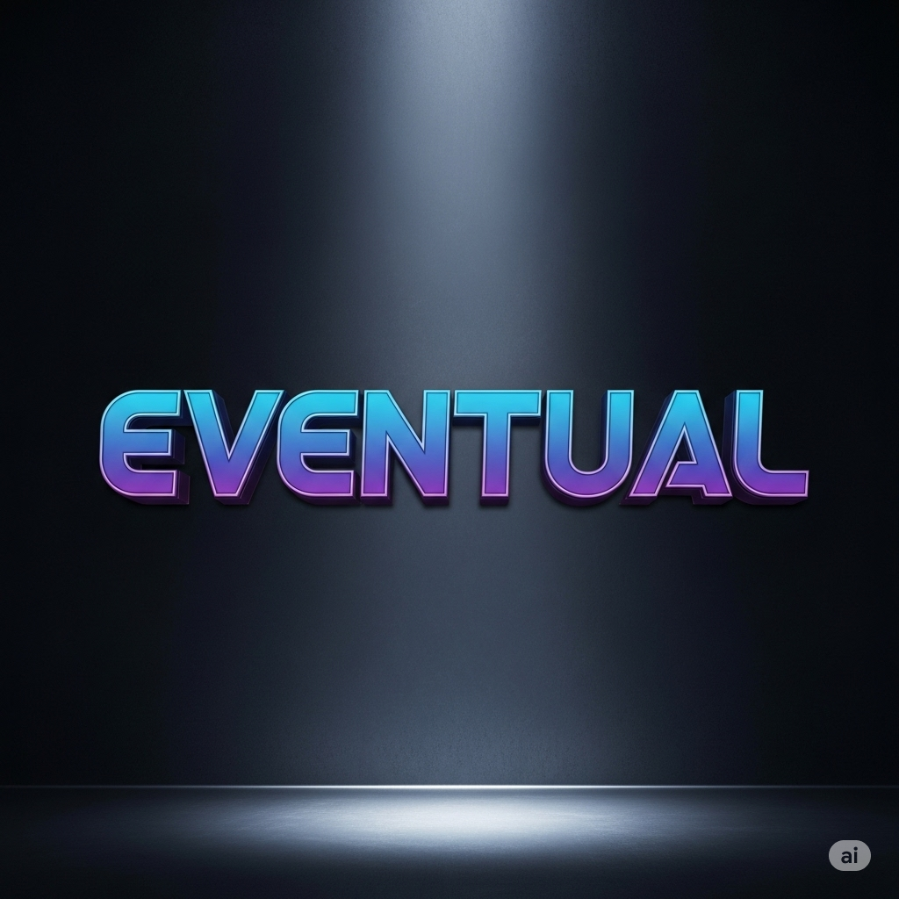
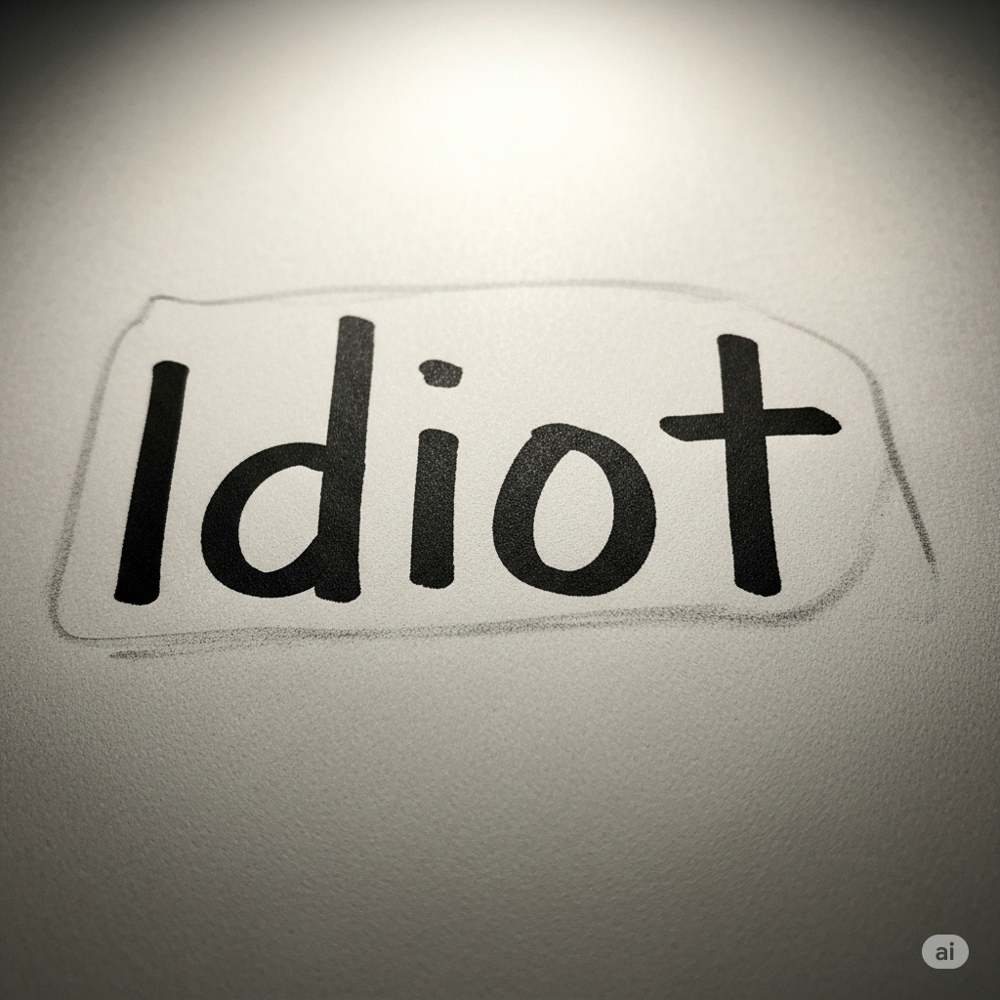
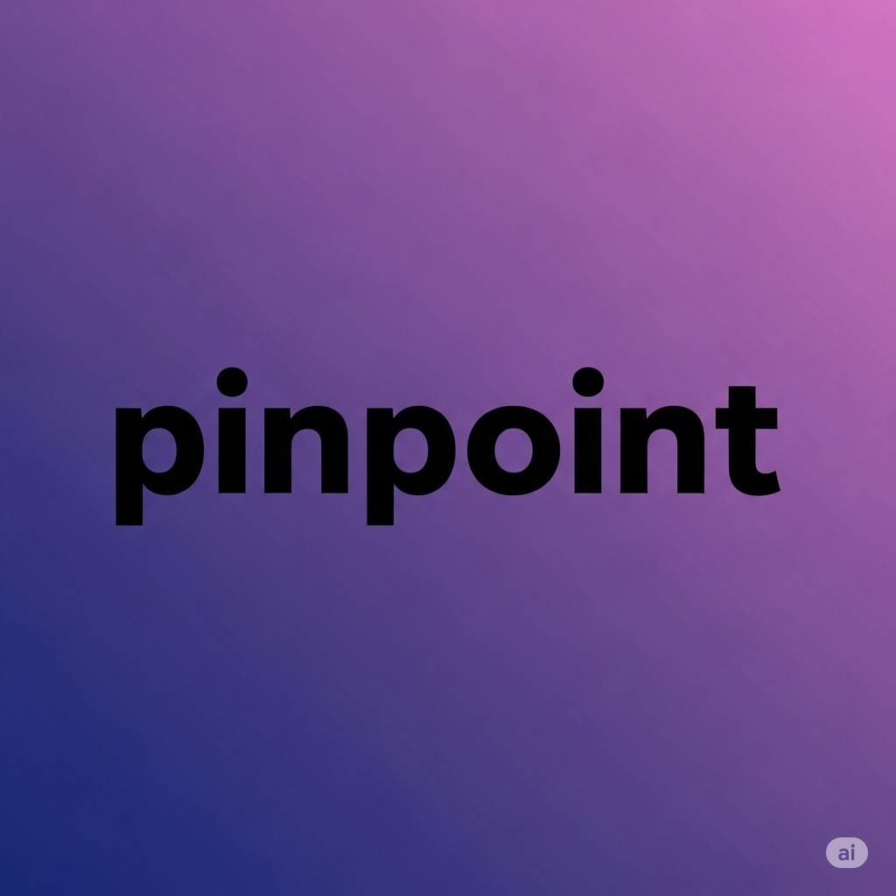
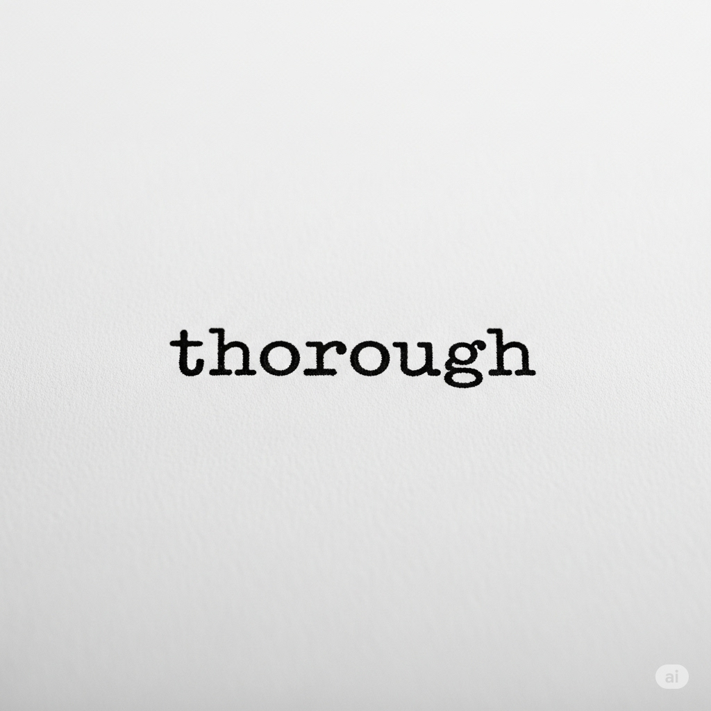

# Essential English Word 4
# Unit 3
## 1. admonish v
### định nghĩa
nhắc nhở, khiển trách nhẹ nhàng (vì làm sai).

She admonishes him for being late.

The teacher is admonishing the student.

They have admonished the team.

He admonished his child for running inside.

We were admonishing them for their behavior.

Before, I had not admonished anyone.

You will admonish him if he does it again.

I am going to admonish them.

You can admonish someone gently.

You should admonish bad behavior.

I would admonish him if I were you.

Admonish them kindly.

------------

## 2. audible adj
### định nghĩa
có thể nghe thấy được.

His voice is barely audible.

The sound is becoming audible.

The signal has been audible.

Her whisper was audible.

We were listening for an audible sign.

Before, the noise had not been audible.

The sound will be audible from here.

It is going to be audible soon.

It can be audible.

You should make sure your voice is audible.

I would speak louder to be audible.

Is it audible?

------------

## 3. awesome adj
### định nghĩa
tuyệt vời, đáng kinh ngạc.

That movie was awesome.

She is doing an awesome job.

They have had an awesome time.

He saw an awesome view.

We were having an awesome party.

Before, I had not seen anything so awesome.

You will have an awesome trip.

It is going to be awesome.

It can be awesome.

You should see that awesome place.

I would describe it as awesome.

That's awesome!

------------

## 4. beware v
### định nghĩa
cẩn thận, coi chừng (về điều gì đó nguy hiểm).

Beware of the dog.

She is telling him to beware.

They have been warned to beware.

He told us to beware of the ice.

We were told to beware of the strong current.

Before, I had not known to beware.

You will need to beware of the risks.

I am going to tell them to beware.

You can beware of danger.

You should beware of strangers.

I would beware of that situation.

Beware of pickpockets.

------------

## 5. brag v
### định nghĩa
khoe khoang (nói về bản thân hoặc thành tích một cách tự hào quá mức).

He likes to brag.

She is bragging about her new car.

They have bragged about their success.

He bragged about winning the game.

We were listening to him bragging.

Before, I had not heard him brag so much.

You will brag about your score.

I am not going to brag.

You can brag sometimes.

You should not brag too much.

I would brag if I achieved something big.

Don't brag.

------------

## 6. conscious adj
### định nghĩa
tỉnh táo, có ý thức; nhận thức được điều gì đó.

He is conscious after the accident.

She is conscious of the problem.

They have become conscious of the need for change.

He was conscious of being watched.

We were conscious of the time.

Before, I had not been conscious of that fact.

You will be conscious soon.

I am going to be conscious of my spending.

You can be conscious of your surroundings.

You should be conscious of the risks.

I would be conscious of my actions.

He is conscious.

------------

## 7. disagree v
### định nghĩa
không đồng ý (có ý kiến khác).

They disagree on the plan.

She is disagreeing with him.

We have disagreed many times.

He disagreed with my idea.

They were disagreeing about the price.

Before, I had not disagreed with him.

You will disagree with his proposal.

I am going to disagree with that statement.

People can disagree.

You should not be afraid to disagree.

I would disagree if I thought it was wrong.

I disagree with you.

------------

## 8. echo v
### định nghĩa
tiếng vang (âm thanh lặp lại); lặp lại ý kiến của người khác.

His voice echoes in the hall.

The sound is echoing.

The words have echoed in my mind.

Her laughter echoed through the mountains.

We were hearing the sound echoing.

Before, the sound had not echoed like that.

The sound will echo.

It is going to echo in the cave.

It can echo loudly.

You should listen for the echo.

I would make a sound to hear the echo.

The sound echoed.

------------

## 9. eventual adj
### định nghĩa
cuối cùng, xảy ra vào cuối cùng.

The eventual result was good.

She is hoping for an eventual success.

They have reached an eventual agreement.

He achieved eventual victory.

We were waiting for the eventual outcome.

Before, I had not thought about the eventual consequences.

You will see the eventual result.

It is going to be the eventual winner.

The eventual cost can be high.

You should consider the eventual impact.

I would wait for the eventual decision.

What was the eventual outcome?

------------

## 10. hint n
### định nghĩa
gợi ý (một dấu hiệu nhỏ về điều gì đó).

He gave me a hint.

She is dropping a hint.

They have given us a hint.

He gave a hint about the surprise.

We were looking for a hint.

Before, I had not understood the hint.

You will get a hint.

I am going to give you a hint.

A hint can be subtle.

You should pay attention to the hints.

I would give you a hint if you were stuck.

Give me a hint.

------------

## 11. idiot n
### định nghĩa
người rất ngu ngốc hoặc hành động ngu ngốc.

He is acting like an idiot.

She is calling him an idiot.

They have called me an idiot.

He felt like an idiot after his mistake.

We were laughing at the idiot.

Before, I had not called anyone an idiot.

You will feel like an idiot if you do that.

I am not going to be an idiot.

You can be an idiot sometimes.

You should not call people idiots.

I would feel like an idiot if I forgot.

Don't be an idiot.

------------

## 12. immense adj
### định nghĩa
rất lớn, khổng lồ.

The building is immense.

She is feeling immense pressure.

They have an immense amount of work.

He saw an immense mountain.

We were looking at the immense size of the ocean.

Before, I had not seen anything so immense.

You will see an immense structure.

It is going to be an immense challenge.

It can be immense.

You should prepare for the immense task.

I would be amazed by the immense scale.

It is immense.

------------

## 13. indirect adj
### định nghĩa
gián tiếp (không thẳng thắn hoặc trực tiếp).

He gave an indirect answer.

She is using an indirect approach.

They have received indirect information.

He made an indirect comment.

We were having an indirect conversation.

Before, I had not used an indirect method.

You will get an indirect response.

I am going to use an indirect way.

It can be indirect.

You should avoid indirect communication if possible.

I would prefer a direct answer, not indirect.

That was an indirect question.

------------

## 14. option n
### định nghĩa
lựa chọn (một trong những điều bạn có thể chọn).

You have two options.

She is considering her options.

They have given us several options.

He chose the best option.

We were discussing the available options.

Before, I had not had many options.

You will have more options.

I am going to choose the first option.

An option gives you a choice.

You should consider all your options.

I would choose that option.

What is your option?

------------

## 15. pastime n
### định nghĩa
sở thích, trò tiêu khiển (hoạt động bạn làm để giải trí).

Reading is my favorite pastime.

She is looking for a new pastime.

They have many pastimes.

He enjoyed fishing as a pastime.

We were talking about our pastimes.

Before, I had not had a pastime.

You will find a good pastime.

I am going to find a new pastime.

A pastime can be relaxing.

You should have a pastime.

I would recommend this pastime.

What is your pastime?

------------

## 16. perfect adj
### định nghĩa
hoàn hảo (không có lỗi); tuyệt vời.

This is a perfect day.

She is making a perfect cake.

They have found the perfect solution.

He gave a perfect answer.

We were looking for the perfect gift.

Before, I had not seen anything so perfect.

You will find the perfect place.

It is going to be a perfect match.

Nothing is perfect.

You should try to be perfect.

I would describe it as perfect.

It's perfect!

------------

## 17. pinpoint v
### định nghĩa
xác định chính xác vị trí hoặc nguyên nhân.

He can pinpoint the location.

She is pinpointing the problem.

They have pinpointed the source.

He pinpointed the error quickly.

We were trying to pinpoint the cause.

Before, I had not been able to pinpoint it.

You will pinpoint the issue.

I am going to pinpoint the exact time.

You can pinpoint the spot.

You should pinpoint the reason.

I would pinpoint the location on the map.

Can you pinpoint the location?

------------

## 18. switch v
### định nghĩa
chuyển đổi (thay đổi từ cái này sang cái khác); bật/tắt (công tắc điện).

He switches the light on.

She is switching channels.

They have switched places.

He switched jobs last year.

We were switching between tasks.

Before, I had not switched it off.

You will switch to a new topic.

I am going to switch the computer off.

You can switch quickly.

You should switch off the lights.

I would switch if I had the chance.

Switch the light off.

------------

## 19. thorough adj
### định nghĩa
kỹ lưỡng, cẩn thận (làm mọi thứ một cách chi tiết).

He did a thorough job.

She is doing a thorough cleaning.

They have conducted a thorough investigation.

He gave a thorough explanation.

We were doing a thorough check.

Before, I had not been so thorough.

You will need a thorough review.

I am going to do a thorough check.

It requires a thorough process.

You should be thorough in your work.

I would do a thorough analysis.

Be thorough.

------------

## 20. torment v
### định nghĩa
làm khổ, hành hạ (gây ra nỗi đau hoặc sự khó chịu lớn).

He torments his little brother.

She is tormenting him with questions.

They have tormented the animal.

He was tormented by guilt.

They were tormenting the prisoner.

Before, I had not tormented anyone.

You will torment yourself with worry.

I am not going to torment you.

You can torment someone mentally.

You should not torment others.

I would never torment an animal.

Don't torment him.

------------

## THE YOUNG MAN AND THE OLD MAN

A proud young man was looking for a new **pastime**. He heard about people hiking in the national parks and decided to try it for himself. As he started his stroll, an old man walked up to him.

“Don’t go this way,” the old man said. “**Beware**. The paths are not clear. It’s easy to become lost.”

But the young man **disagreed** with the old man and **bragged** that he had a **perfect** understanding of the park. “I studied maps of this area,” he told him. “I believe I have a **thorough** knowledge of these trails. I won’t become lost.”

The old man listened to the young man and then **admonished** him for his pride.

“I have walked these trails my entire life,” he said. “If you think you will be safe, then go ahead.”

The young man ignored the old man and started along the trail.

Whenever he had to choose between an easy or difficult route, he always chose the more difficult **option**. In addition, he was not **conscious** of which direction he was going. After a while, he decided to return home. Because his course through the wilderness was so **indirect**, he had no idea where he was.

He looked at his map but could not **pinpoint** his location. He walked one path after another but soon realized he was lost.

The sun was going down, and sudden strong winds gave a **hint** that it might rain. **Immense** clouds filled the sky. **Awesome** sounds of thunder were **audible** from all directions. It **echoed** off the mountains. The thought of the **eventual** storm **tormented** the young man. He hurried in one direction, but soon **switched** out of confusion. Luckily, it led him out of the park.

When he arrived home, he knew that he had acted like an **idiot**. He realized he was lucky to be alive. He decided to listen to people with more experience than himself.