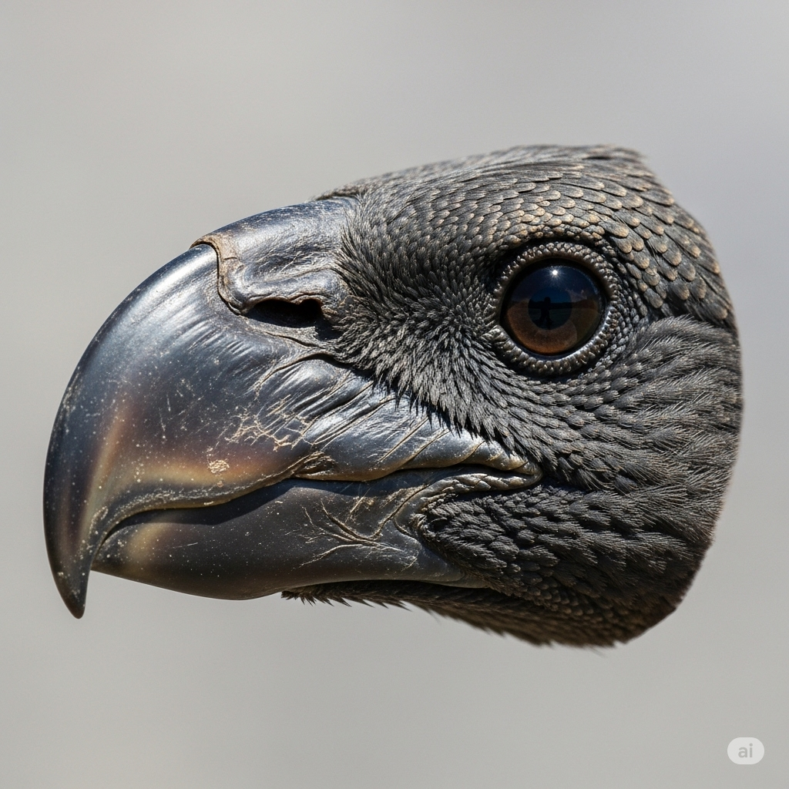
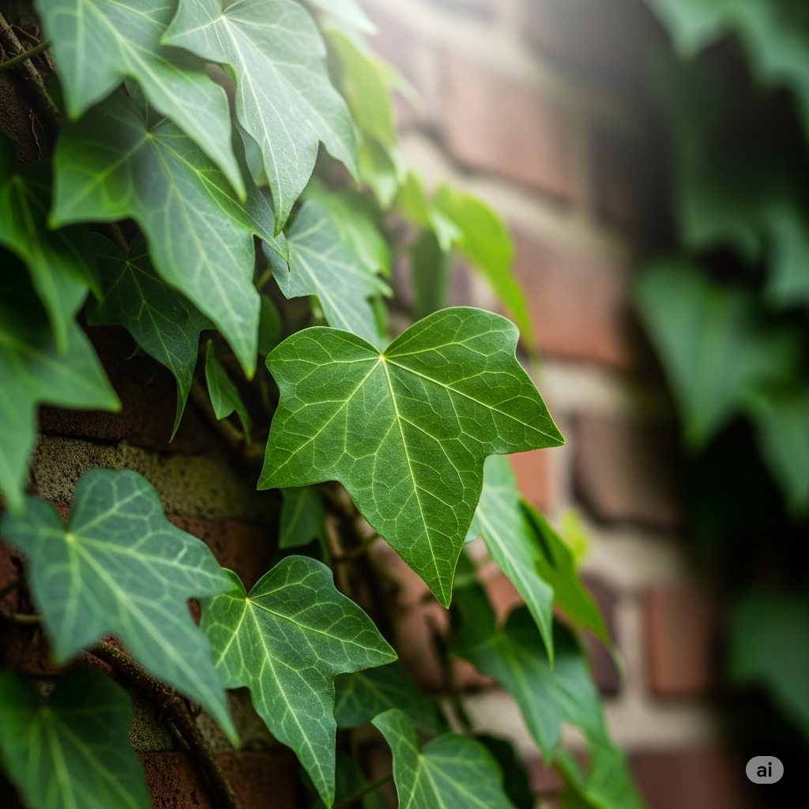
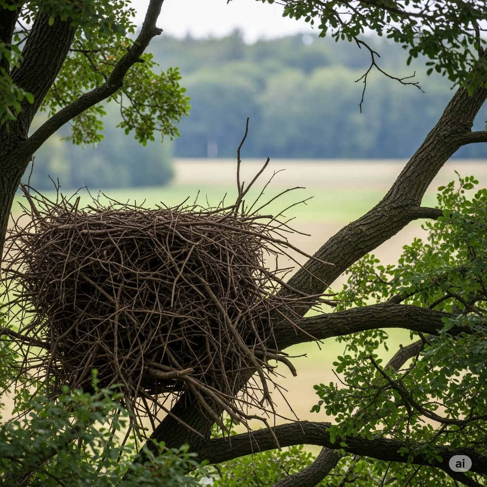
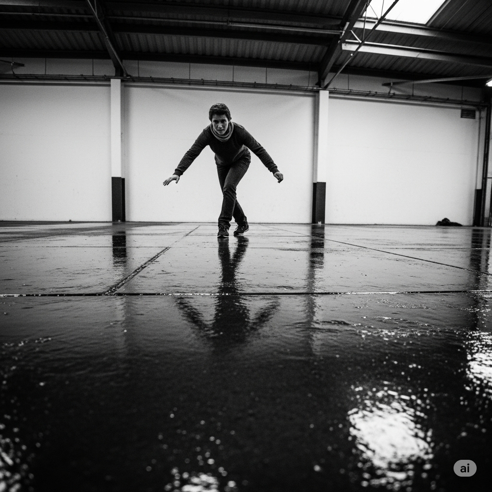
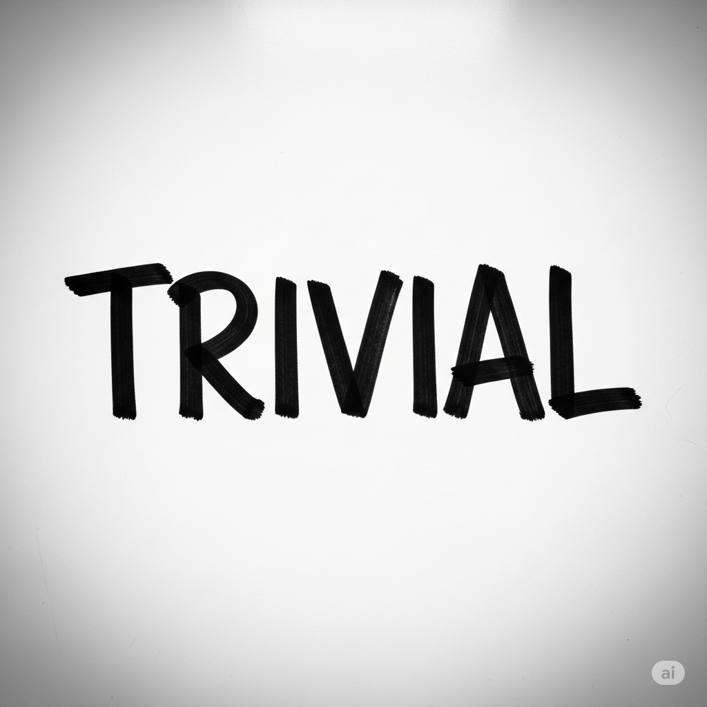

# Essential English Word 4
# Unit 4
## 1. beak n
### định nghĩa
mỏ chim (phần cứng nhọn ở miệng chim).

The bird has a sharp beak.

She is looking at the bird's beak.

The parrot has a strong beak.

He saw the bird cleaning its beak.

We were watching the bird use its beak.

Before, I had not seen such a colorful beak.

The baby bird will use its beak soon.

It is going to peck with its beak.

A beak can be used for eating.

You should be careful of the bird's beak.

I would draw a bird with a big beak.

Look at the bird's beak.

------------

## 2. damp adj
### định nghĩa
hơi ẩm ướt, ẩm thấp.

The clothes are still damp.

She is feeling the damp air.

The wall has become damp.

He noticed the damp spot on the floor.

We were walking on the damp ground.

Before, the room had not been damp.

It will be damp after the rain.

It is going to feel damp inside.

It can be damp in the morning.

You should dry the clothes if they are damp.

I would avoid the damp area.

The towel is damp.

------------

## 3. disapprove v
### định nghĩa
không tán thành, không đồng ý với điều gì đó.

He disapproves of her behavior.

She is disapproving of the plan.

They have disapproved of the changes.

He disapproved of smoking.

We were disapproving of their actions.

Before, I had not disapproved of anything.

You will disapprove of his idea.

I am going to disapprove of that.

You can disapprove.

You should not disapprove without reason.

I would disapprove if it was wrong.

They disapprove.

------------

## 4. except prep
### định nghĩa
ngoại trừ (không bao gồm).

Everyone is here except John.

She likes all fruits except bananas.

They have finished everything except the last part.

He ate everything except the vegetables.

We were ready to go except for one thing.

Before, I had not liked anything except chocolate.

You will need everything except this.

I am going to invite everyone except him.

You can take anything except that.

You should finish all tasks except the last one.

I would go anywhere except there.

Everyone left except me.

------------

## 5. flight n
### định nghĩa
chuyến bay (cuộc hành trình bằng máy bay); sự bay (của chim, côn trùng).

My flight is tomorrow.

She is booking a flight.

They have taken many flights.

He missed his flight yesterday.

We were waiting for the flight.

Before, I had not been on a flight.

You will have a long flight.

I am going to take a flight to London.

A flight can be delayed.

You should check your flight status.

I would prefer a direct flight.

The bird took flight.

------------

## 6. fond adj
### định nghĩa
thích, yêu mến (có cảm giác ấm áp, yêu thích ai đó hoặc cái gì đó).

He is fond of cats.

She is growing fond of him.

They have always been fond of each other.

He was fond of his old teacher.

We were fond of that place.

Before, I had not been fond of reading.

You will become fond of this city.

I am going to be fond of this hobby.

You can be fond of simple things.

You should be fond of your family.

I would be fond of a quiet life.

I am fond of you.

------------

## 7. immoral adj
### định nghĩa
vô đạo đức (sai về mặt đạo đức, xấu).

His actions were immoral.

She is doing something immoral.

They have been accused of immoral behavior.

He felt it was immoral to lie.

We were discussing the immoral aspects.

Before, I had not thought it was immoral.

It will be seen as immoral.

That is going to be an immoral decision.

It can be immoral.

You should avoid immoral acts.

I would never do anything immoral.

It is immoral to steal.

------------

## 8. ivy n
### định nghĩa
cây thường xuân (một loại cây leo có lá xanh quanh năm).

Ivy grows on the wall.

She is planting ivy.

The building has been covered in ivy.

He saw ivy on the old house.

We were clearing the ivy from the fence.

Before, I had not seen so much ivy.

The ivy will grow quickly.

It is going to be covered with ivy.

Ivy can damage walls.

You should trim the ivy.

I would like to have ivy in my garden.

The wall is covered in ivy.

------------

## 9. moan v
### định nghĩa
rên rỉ (kêu lên vì đau hoặc không vui); than vãn.

He moans in pain.

She is moaning about the weather.

They have moaned about the food.

He moaned when he stood up.

We were moaning about the work.

Before, I had not heard him moan.

You will moan if you are hurt.

He is going to moan about it later.

You can moan quietly.

You should not moan so much.

I would moan if I felt sick.

Stop moaning.

------------

## 10. oblivious adj
### định nghĩa
không nhận thức được, không để ý đến điều gì đó.

He is oblivious to the danger.

She is being oblivious to his feelings.

They have been oblivious to the changes.

He was oblivious to what was happening around him.

We were oblivious of the time.

Before, I had not been oblivious.

You will be oblivious if you don't pay attention.

He is going to be oblivious.

You can be oblivious.

You should not be oblivious to the rules.

I would be oblivious if I was focused on something else.

He is completely oblivious.

------------

## 11. perish v
### định nghĩa
chết, diệt vong (đặc biệt là do tai nạn hoặc điều kiện khắc nghiệt).

Many plants perish in the cold.

They are perishing from hunger.

Many people have perished in the disaster.

He perished in the fire.

We were afraid they would perish.

Before, I had not seen so many animals perish.

They will perish if they don't get help.

The crops are going to perish.

They can perish quickly.

You should help them before they perish.

I would be sad if they perished.

Many perished in the storm.

------------

## 12. pit n
### định nghĩa
hố, cái hố; hạt (của quả như đào, mận).

There is a pit in the road.

She is digging a pit.

They have fallen into a pit.

He threw the peach pit away.

We were looking into the pit.

Before, I had not seen such a deep pit.

You will find a pit there.

I am going to dig a pit.

A pit can be dangerous.

You should avoid the pit.

I would fill the pit with sand.

Be careful of the pit.

------------

## 13. rim n
### định nghĩa
vành, mép (của vật tròn như cốc, bánh xe).

The rim of the cup is broken.

She is cleaning the rim.

They have painted the rim.

He looked over the rim of the glass.

We were checking the rim of the wheel.

Before, I had not noticed the rim.

The rim will be smooth.

It is going to have a gold rim.

The rim can be sharp.

You should be careful of the sharp rim.

I would decorate the rim.

Clean the rim.

------------

## 14. roost n
### định nghĩa
chỗ đậu (của chim); về chỗ đậu (chim).

The birds are on their roost.

He is building a roost.

The chickens have gone to roost.

He saw the birds at their roost.

They were heading back to the roost.

Before, I had not seen the roost.

The birds will return to their roost.

They are going to the roost.

A roost can be high up.

You should provide a roost for the birds.

I would watch the birds go to roost.

The birds are at the roost.

------------

## 15. slippery adj
### định nghĩa
trơn trượt (khó đứng vững hoặc cầm nắm).

The floor is slippery.

She is walking on a slippery surface.

The road has become slippery.

He fell on the slippery ice.

We were walking on the slippery path.

Before, it had not been so slippery.

It will be slippery after the rain.

It is going to be slippery.

It can be very slippery.

You should be careful, it's slippery.

I would wear shoes with good grip on a slippery surface.

Be careful, it's slippery.

------------

## 16. soar v
### định nghĩa
bay vút lên cao (chim, máy bay); tăng vọt (giá cả).

The eagle soars in the sky.

Prices are soaring.

The plane has soared above the clouds.

He watched the bird soar.

We were watching the kite soar.

Before, I had not seen a bird soar so high.

The plane will soar.

Prices are going to soar.

It can soar quickly.

You should watch the birds soar.

I would love to soar like a bird.

Watch the eagle soar.

------------

## 17. trivial adj
### định nghĩa
nhỏ nhặt, không quan trọng.

It is a trivial matter.

She is worrying about trivial things.

They have focused on trivial details.

He dismissed it as a trivial issue.

We were discussing trivial topics.

Before, I had not considered it trivial.

You will see it is trivial.

It is going to be a trivial problem.

It can be trivial.

You should not worry about trivial things.

I would ignore such a trivial comment.

It's just a trivial detail.

------------

## 18. typical adj
### định nghĩa
điển hình, tiêu biểu (giống như hầu hết những người hoặc vật cùng loại).

This is a typical example.

She is showing typical behavior.

They have a typical house.

He ate a typical breakfast.

We were discussing a typical day.

Before, I had not seen a typical one.

You will see a typical scene.

It is going to be a typical day.

It can be typical.

You should expect a typical response.

I would describe it as typical.

It's typical weather for this time of year.

------------

## 19. utterly adv
### định nghĩa
hoàn toàn, tuyệt đối.

He was utterly exhausted.

She is utterly confused.

They have utterly failed.

He was utterly surprised.

We were utterly amazed.

Before, I had not been utterly sure.

You will be utterly shocked.

It is going to be utterly impossible.

It can be utterly frustrating.

You should be utterly honest.

I would be utterly delighted.

He was utterly wrong.

------------

## 20. weep v
### định nghĩa
khóc (chảy nước mắt vì buồn).

She weeps when she is sad.

He is weeping silently.

They have wept for their loss.

She wept when she heard the news.

We were weeping together.

Before, I had not wept so much.

You will weep when you hear this.

I am going to weep.

You can weep.

You should not be afraid to weep.

I would weep if I was very sad.

Don't weep.

------------

## THE TRICKY FOX

There was a fox that lived in the forest. Fox loved to play mean tricks on the other animals. One day, he used the sharp **rim** of a bottle to dig a **pit** in the ground. He hid in a tree until Rabbit came to the **pit’s** edge. Then, he jumped out and pushed Rabbit into the **pit**. Fox laughed and ran away. The angry Rabbit climbed out and told the other animals what happened.

The others said, “That is **typical** behavior for Fox. He does mean things all the time. Sometimes, he is completely **immoral**. We all **disapprove** of his actions, so we should teach him a lesson. Tomorrow, we’ll push Fox into that **pit**.”

The next day, all of the animals hid near the **pit** and waited for Fox. Fox was **oblivious** to the hidden animals. He walked up to the **pit** to see if Rabbit was still trapped. Just then, the other animals ran up to Fox and pushed him in. All the animals laughed and cheered, **except** Fox, of course.

Fox couldn’t get out! The walls of the **pit** were covered in **damp** **ivy**. It was too **slippery** for him to climb out. He was **utterly** helpless. He **moaned** and began to **weep**.

At last, he saw Eagle watching him from her **roost**. He yelled, “Eagle, please help me! If I don’t get out of here, I will **perish**!”

Eagle said, “You may think your tricks are **trivial**, but you hurt others when you do mean things. I’ll help you if you promise to be nice.”

Fox said, “I promise!”

Eagle began her **flight** to the bottom of the **pit**. She picked up Fox with her **beak** and **soared** out of the **pit**. She dropped Fox safely on the ground.

Fox thanked Eagle and kept his promise. He was nice to the other animals. The animals even became **fond** of Fox, and the forest was happy place.