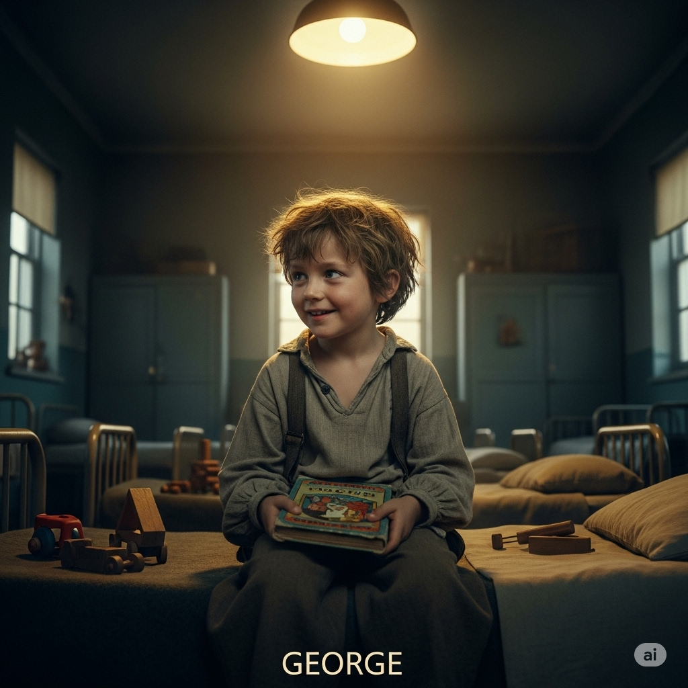

# Essential English Word 4
# Unit 9
## 1. alongside adv
### định nghĩa
bên cạnh, cùng với.

He walks alongside me.

She is working alongside her colleagues.

They have stood alongside us.

He walked alongside the river.

We were sitting alongside each other.

Before, I had not walked alongside him.

You will sit alongside her.

I am going to work alongside them.

You can walk alongside the path.

You should stand alongside your friends.

I would work alongside you.

Walk alongside me.

------------

## 2. appetite n
### định nghĩa
sự thèm ăn; mong muốn mạnh mẽ.

He has a good appetite.

She is losing her appetite.

They have a strong appetite for success.

He lost his appetite when he was sick.

We were talking about our appetite for adventure.

Before, I had not had a big appetite.

You will have a good appetite after exercise.

I am going to eat because I have an appetite.

An appetite can be small or large.

You should eat when you have an appetite.

I would lose my appetite if I was worried.

Eat if you have an appetite.

------------

## 3. assist v
### định nghĩa
giúp đỡ ai đó.

He assists the teacher.

She is assisting the doctor.

They have assisted us.

He assisted me with my homework.

We were assisting the elderly people.

Before, I had not assisted anyone.

You will assist me later.

I am going to assist you.

You can assist others.

You should assist those in need.

I would assist you if I could.

Assist him.

------------

## 4. breeze n
### định nghĩa
làn gió nhẹ.

A gentle breeze is blowing.

She is enjoying the breeze.

The flags have moved in the breeze.

He felt the cool breeze.

We were feeling the breeze on our faces.

Before, there had not been a breeze.

You will feel a nice breeze.

There is going to be a breeze this afternoon.

A breeze can be refreshing.

You should open the window for the breeze.

I would sit outside to feel the breeze.

Feel the breeze.

------------

## 5. defy v
### định nghĩa
không tuân theo, chống lại; thách thức.

He defies the rules.

She is defying authority.

They have defied expectations.

He defied his parents.

We were defying the storm.

Before, I had not defied anyone.

You will defy the order.

I am going to defy the odds.

You can defy gravity (in science).

You should not defy the law.

I would defy anyone who tried to stop me.

Defy the challenge.

------------

## 6. display v
### định nghĩa
trưng bày, thể hiện ra.

They display their art.

She is displaying her skills.

They have displayed the products.

He displayed his trophy.

We were displaying our work.

Before, I had not displayed it publicly.

You will display your talent.

I am going to display the photos.

You can display information.

You should display your achievements.

I would display it proudly.

Display your work.

------------

## 7. efficient adj
### định nghĩa
hiệu quả (làm việc tốt mà không tốn nhiều thời gian hay năng lượng).

He is an efficient worker.

She is using an efficient method.

They have an efficient system.

He found an efficient way to do it.

We were looking for an efficient solution.

Before, the process had not been efficient.

You will become more efficient.

It is going to be an efficient process.

It can be efficient.

You should be efficient with your time.

I would use an efficient tool.

Be efficient.

------------

## 8. feeble adj
### định nghĩa
yếu ớt, không có sức mạnh.

He is old and feeble.

She is making a feeble attempt.

They have a feeble argument.

He gave a feeble smile.

We were listening to his feeble voice.

Before, I had not felt so feeble.

You will feel feeble after being sick.

He is going to be too feeble to walk.

It can be a feeble excuse.

You should help the feeble person.

I would feel feeble if I didn't eat.

He is feeble.

------------

## 9. forgive v
### định nghĩa
tha thứ (không còn giận ai đó vì điều họ đã làm).

He forgives her.

She is forgiving him.

They have forgiven each other.

He forgave her mistake.

We were forgiving them.

Before, I had not forgiven him.

You will forgive me.

I am going to forgive you.

You can forgive someone.

You should forgive others.

I would forgive you if you apologized.

Forgive me.

------------

## 10. lively adj
### định nghĩa
sống động, đầy năng lượng.

She is a lively person.

The party is getting lively.

They have a lively discussion.

He told a lively story.

We were having a lively conversation.

Before, the town had not been so lively.

You will meet lively people.

It is going to be a lively event.

It can be lively.

You should try to be more lively.

I would enjoy a lively debate.

The music is lively.

------------

## 11. majestic adj
### định nghĩa
uy nghiêm, tráng lệ, hùng vĩ.

The mountain is majestic.

She is looking at the majestic view.

They have seen majestic animals.

He saw a majestic eagle.

We were admiring the majestic building.

Before, I had not seen anything so majestic.

You will see a majestic sight.

It is going to be a majestic ceremony.

It can be majestic.

You should visit that majestic place.

I would describe it as majestic.

It is a majestic tree.

------------

## 12. nor conj
### định nghĩa
cũng không (dùng sau "neither" hoặc câu phủ định).

He is not here, nor is she.

She doesn't like tea, nor does he.

They haven't called, nor have they written.

He didn't eat, nor did he drink.

We were not sleeping, nor were we talking.

Before, I had neither seen nor heard it.

You will neither eat nor drink.

I am not going to go, nor is he.

You can neither confirm nor deny it.

You should neither borrow nor lend.

I would neither agree nor disagree.

Neither good nor bad.

------------

## 13. outraged adj
### định nghĩa
rất tức giận và sốc.

He was outraged by the news.

She is feeling outraged.

They have been left outraged.

He was outraged by the injustice.

We were outraged by their behavior.

Before, I had not felt so outraged.

You will be outraged when you hear this.

I am going to be outraged.

You can be outraged.

You should express your feelings if you are outraged.

I would be outraged if that happened.

They are outraged.

------------

## 14. pessimistic adj
### định nghĩa
bi quan (luôn nghĩ điều xấu sẽ xảy ra).

He is a pessimistic person.

She is being pessimistic.

They have a pessimistic view.

He was pessimistic about the future.

We were listening to his pessimistic comments.

Before, I had not been so pessimistic.

You will feel pessimistic if things go wrong.

I am not going to be pessimistic.

You can be pessimistic.

You should try not to be too pessimistic.

I would feel pessimistic in that situation.

Don's be pessimistic.

------------

## 15. rumor n
### định nghĩa
tin đồn (thông tin chưa chắc chắn, lan truyền).

There is a rumor.

She is spreading a rumor.

They have heard the rumor.

He heard a strange rumor.

We were talking about the rumor.

Before, I had not heard that rumor.

You will hear a rumor.

I am going to ignore the rumor.

A rumor can be false.

You should not spread rumors.

I would not believe the rumor.

It's just a rumor.

------------

## 16. slap v
### định nghĩa
tát (đánh bằng bàn tay mở).

He slaps his hand on the table.

She is slapping him lightly.

They have slapped each other.

He slapped the fly.

We were watching him slap the dust off.

Before, I had not slapped anyone.

You will slap it.

I am not going to slap you.

You can slap gently.

You should not slap people.

I would slap a mosquito.

Don't slap him.

------------

## 17. smash v
### định nghĩa
đập vỡ thành nhiều mảnh; đánh mạnh.

He smashes the glass.

She is smashing the plate.

They have smashed the window.

He smashed the vase.

We were afraid they would smash it.

Before, I had not smashed anything.

You will smash it if you drop it.

I am going to smash the old phone.

It can smash easily.

You should be careful not to smash it.

I would smash it if I was angry.

Don't smash it.

------------

## 18. subject n
### định nghĩa
chủ đề (để nói hoặc học); người hoặc vật được nói đến.

What is the subject?

She is studying a difficult subject.

They have many subjects at school.

He changed the subject.

We were talking about the subject.

Before, I had not studied this subject.

You will learn a new subject.

I am going to talk about this subject.

A subject can be interesting.

You should choose a subject you like.

I would like to discuss this subject.

Change the subject.

------------

## 19. wage n
### định nghĩa
tiền lương (trả theo giờ hoặc tuần).

He earns a low wage.

She is asking for a higher wage.

They have increased the minimum wage.

He worked for a good wage.

We were discussing the average wage.

Before, I had not earned a wage.

You will get your wage tomorrow.

I am going to ask for a better wage.

A wage is paid for work.

You should negotiate your wage.

I would work for a fair wage.

What is your wage?

------------

## 20. whereas conj
### định nghĩa
trong khi đó, ngược lại (dùng để so sánh hai điều khác nhau).

He likes tea, whereas she likes coffee.

She is tall, whereas he is short.

They are rich, whereas we are poor.

He is quiet, whereas his brother is loud.

We were working hard, whereas they were relaxing.

Before, I had thought one thing, whereas the reality was different.

You will find it easy, whereas others will find it hard.

I am going to the beach, whereas they are going to the mountains.

Some people prefer cities, whereas others prefer the countryside.

You should consider both options, whereas others only see one.

I would choose the red one, whereas you would choose the blue one.

He is happy, whereas she is sad.

------------

## GROWING TO BE GREAT

When George was just a boy, the **rumor** was that his parents died in a car accident. Many bad things could have happened to George, but he was lucky. He was sent to live **alongside** other children without parents. There were kind people to **assist** George and help him go forward with his life. However, he was a **pessimistic** and mean little boy.

George was often **outraged**. He told mean **rumor**s about the other kids. He **smash**ed furniture and even **slap**ped other boys. He **defy**ied anyone who tried to help him, and soon it was difficult for them to **forgive** him. But George did **display** a love for one thing. He loved to play baseball. **Whereas** he was lazy in school and liked neither the **subject**s **nor** the teachers, he was **lively** and happy when he played baseball.

One of George’s teachers noticed his talent. He began to work with the boy. At first they only talked about baseball. The teacher watched George play. He was a very **efficient** hitter. He almost never missed the ball. The teacher thought that George looked **majestic** when he played. When George hit the ball, it flew through the **breeze** as if it would never come down. In time, they began to talk about other things. They talked about George’s family and his dreams for the future. They developed a very good relationship.

As George got older, he began to grow. His **appetite** was huge. He ate and ate. He got stronger. Soon the other boys and even the teachers looked small and **feeble** next to him. Everyone thought that this heralded the start of a great baseball career.

When George got his first job as a baseball player, he gave most of his **wage**s to the people who had helped him as a boy. He hoped that other children would also find a way to live happy, successful lives.

